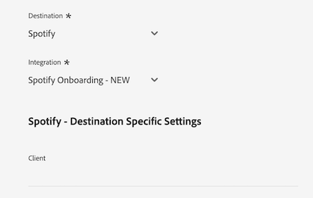

# [!DNL LiveRamp - Distribution] verbinding

De [!DNL LiveRamp - Distribution] Met deze verbinding kunt u het publiek activeren van Experience Platform tot hoogwaardige uitgevers op mobiele media, het web, displays en verbonden tv-media.

>[!IMPORTANT]
>
>Deze doelconnector en documentatiepagina worden gemaakt en onderhouden door LiveRamp. Neem voor alle vragen of updateverzoeken rechtstreeks contact op met LiveRamp [hier](mailto:adobertcdp@liveramp.com).

## Ondersteunde doelen {#supported-destinations}

[!DNL LiveRamp - Distribution] ondersteunt momenteel activering van het publiek voor de volgende platforms:

* [[!DNL 4C Insights]](#insights)
* [[!DNL Acast]](#acast)
* [[!DNL Nexxen]](#nexxen)
* [[!DNL Ampersand.tv]](#ampersand-tv)
* [[!DNL Captify]](#captify)
* [[!DNL Cardlytics]](#cardlytics)
* [[!DNL Disney (Hulu/ESPN/ABC)]](#disney)
* [[!DNL iHeartMedia]](#iheartmedia)
* [[!DNL Index Exchange]](#index-exchange)
* [[!DNL Magnite CTV Platform]](#magnite)
* [[!DNL Magnite DV+ (Rubicon Project)]](#magnite-dv)
* [[!DNL One Fox]](#fox)
* [[!DNL Pandora]](#pandora)
* [[!DNL Reddit]](#reddit)
* [[!DNL Roku]](#roku)
* [[!DNL Spotify]](#spotify)
* [[!DNL Taboola]](#taboola)
* [[!DNL TargetSpot]](#targetspot)
* [[!DNL Teads]](#teads)
* [[!DNL WB Discovery]](#wb-discovery)

## Gebruiksscenario’s {#use-cases}

Om u te helpen beter begrijpen hoe en wanneer u het [!DNL LiveRamp - Distribution] doel, hier is een geval van steekproefgebruik dat de klanten van Adobe Experience Platform kunnen oplossen door deze bestemming te gebruiken.

Het marketingteam van een detailhandelaar in sportkleding gebruikte de [LiveRamp - Onboarding](liveramp-onboarding.md) verbinding om het publiek van Experience Platform naar zijn LiveRamp-account te sturen.

Via de [!DNL LiveRamp - Distribution] zij kunnen nu de activering van het publiek aan boord van het vliegtuig activeren [ondersteunde doelen](#supported-destinations). Vervolgens kunnen ze zich richten op gebruikers op mobiele apparaten, open internet, sociale netwerken en [!DNL CTV] platforms.

## Boordpubliek naar LiveRamp {#onboarding}

Voordat u het publiek activeert via de [!DNL LiveRamp - Distribution] verbinding gebruiken [LiveRamp - Onboarding](liveramp-onboarding.md) verbinding om uw publiek van het Experience Platform naar LiveRamp uit te voeren.

Nadat u uw publiek hebt aangemeld bij LiveRamp, kunt u de activeringsworkflow voortzetten vanuit het dialoogvenster [verbinden met de bestemming](#connect) stap om uw doeldoelplatforms voor gegevensactivering te selecteren en te configureren.

## Verbinden met de bestemming {#connect}

>[!CONTEXTUALHELP]
>id="platform_destinations_liveramp_distribution_identifier_settings"
>title="Id-instellingen"
>abstract="Selecteer de id&#39;s die door uw doel worden ondersteund. Zie de documentatie voor de volledige lijst van gesteunde herkenningstekens voor elke bestemming."

>[!IMPORTANT]
> 
>Om met de bestemming te verbinden, hebt u nodig **[!UICONTROL View Destinations]** en **[!UICONTROL Manage Destinations]** [toegangsbeheermachtigingen](/help/access-control/home.md#permissions). Lees de [toegangsbeheeroverzicht](/help/access-control/ui/overview.md) of neem contact op met de productbeheerder om de vereiste machtigingen te verkrijgen.

Als u verbinding wilt maken met dit doel, voert u de stappen uit die in het dialoogvenster [zelfstudie over doelconfiguratie](../../ui/connect-destination.md). In vormen bestemmingswerkschema, vul de gebieden in die in de twee hieronder secties worden vermeld.

### Verifiëren voor LiveRamp {#authenticate}

Als u zich wilt verifiëren bij de bestemming, vult u de vereiste velden in en selecteert u **[!UICONTROL Connect to destination]**.

* **[!UICONTROL LiveRamp Organization ID]**: De organisatie-id van uw LiveRamp-account (weergegeven als _owner_org_ in uw door LiveRamp geleverde gegevens).
* **[!UICONTROL Password]**: Uw wachtwoord voor uw LiveRamp-account (weergegeven als _geheime_sleutel_ in uw door LiveRamp geleverde gegevens).
* **[!UICONTROL Token URL]**: De URL van uw token LiveRamp.
* **[!UICONTROL Username]**: Uw gebruikersnaam van uw LiveRamp-account (weergegeven als _account_id_ in uw door LiveRamp geleverde gegevens).

### Doeldetails configureren {#destination-details}

Nadat u verbinding hebt gemaakt met uw LiveRamp-account, voert u de vereiste informatie in om verbinding te maken met het doel waarop u het publiek wilt activeren.

* **[!UICONTROL Name]**: Vul de voorkeursnaam in voor uw doelverbinding.

>[!NOTE]
>
>Bij de naam van de bestemming raadt de Adobe aan deze notatie te volgen: `LiveRamp - Downstream Destination Name`. Met dit naamgevingspatroon kunt u snel uw doelen identificeren in het dialoogvenster [Bladeren](../../ui/destinations-workspace.md#browse) tabblad van de werkruimte Doelen.
> 
>Voorbeeld: `LiveRamp - Roku`.

* **[!UICONTROL Description]**: Voer een beschrijving in voor uw doel. Gebruik een beschrijving waarmee u het doel van deze bestemming gemakkelijk kunt identificeren.
* **[!UICONTROL Destination]**: Gebruik het keuzemenu om het doel te selecteren waarop u het publiek wilt activeren. De bestemming u hier selecteert beïnvloedt direct wat u in [doelspecifieke instellingen](#destination-settings) scherm.
* **[!UICONTROL Integration]**: Selecteer de integratieaccount die u voor uw doel wilt gebruiken.
* **[!UICONTROL Identifier]**: Selecteer de id&#39;s die door uw doel worden ondersteund. Momenteel hebben alle bestemmingen hun gesteunde herkenningstekens die in het drop-down menu worden voorgevuld.

## Doelspecifieke instellingen {#destination-settings}

Elk van de bestemmingen [ondersteund](#supported-destinations) door [!DNL LiveRamp - Distribution] vereist dat u specifieke configuratieopties invult.

Zie de secties hieronder voor gedetailleerde begeleiding op hoe te om elke bestemming te vormen.

### [!DNL 4C Insights] {#insights}

>[!CONTEXTUALHELP]
>id="platform_destinations_liveramp_distribution_4cinsights_profile_id"
>title="4C-merkprofiel-id"
>abstract="Voer de numerieke id in die aan uw 4C-merkprofiel is gekoppeld. Als u deze id niet hebt, neemt u contact op met uw 4C-vertegenwoordiger voor clientservices."

Vul de onderstaande velden in om details voor de bestemming te configureren.

* **[!UICONTROL 4C Brand Profile ID]**: Voer de numerieke id in die is gekoppeld aan uw 4C-merkprofiel. Als u deze id niet hebt, neemt u contact op met uw 4C-vertegenwoordiger voor clientservices.

### [!DNL Acast] {#acast}

>[!CONTEXTUALHELP]
>id="platform_destinations_liveramp_distribution_acast_client"
>title="Naam client"
>abstract="Uw naam van de adverteerderaccount, zoals u wilt dat deze aan de doelpartner wordt getoond. Gebruik uw bedrijfsnaam. Gebruik geen spaties of speciale tekens."

Vul de onderstaande velden in om details voor de bestemming te configureren.

* **[!UICONTROL Client name]**: De accountnaam van uw adverteerder, zoals u wilt dat deze aan de doelpartner wordt getoond. Gebruik uw bedrijfsnaam. Gebruik geen spaties of speciale tekens.

### [!DNL Ampersand.tv] {#ampersand-tv}

>[!CONTEXTUALHELP]
>id="platform_destinations_liveramp_distribution_ampersand_company_name"
>title="Uw bedrijfsnaam"
>abstract="Uw bedrijfsnaam, aangezien u het aan de bestemmingspartner zou willen worden getoond. Gebruik geen spaties of speciale tekens."

Vul de onderstaande velden in om details voor de bestemming te configureren.

* **[!UICONTROL Your Company Name]**: Uw bedrijfsnaam, aangezien u het aan de bestemmingspartner zou willen worden getoond. Gebruik geen spaties of speciale tekens.

### [!DNL Captify] {#captify}

>[!CONTEXTUALHELP]
>id="platform_destinations_liveramp_distribution_captify_client"
>title="Naam client"
>abstract="Uw naam van de adverteerderaccount, zoals u wilt dat deze aan de doelpartner wordt getoond. Gebruik uw bedrijfsnaam. Gebruik geen spaties of speciale tekens."

Vul de onderstaande velden in om details voor de bestemming te configureren.

* **[!UICONTROL Client name]**: De accountnaam van uw adverteerder, zoals u wilt dat deze aan de doelpartner wordt getoond. Gebruik uw bedrijfsnaam. Gebruik geen spaties of speciale tekens.

### [!DNL Cardlytics] {#cardlytics}

>[!CONTEXTUALHELP]
>id="platform_destinations_liveramp_distribution_cardlytics_client"
>title="Naam client"
>abstract="Uw naam van de adverteerderaccount, zoals u wilt dat deze aan de doelpartner wordt getoond. Gebruik uw bedrijfsnaam. Gebruik geen spaties of speciale tekens."

Vul de onderstaande velden in om details voor de bestemming te configureren.

* **[!UICONTROL Client name]**: De accountnaam van uw adverteerder, zoals u wilt dat deze aan de doelpartner wordt getoond. Gebruik uw bedrijfsnaam. Gebruik geen spaties of speciale tekens.

### [!DNL Disney (Hulu/ESPN/ABC)] {#disney}

>[!CONTEXTUALHELP]
>id="platform_destinations_liveramp_distribution_agreement"
>title="Terreurovereenkomst voor gegevensbestemming van adverteerders"
>abstract="Type in `I AGREE` om de erkenning en instemming met de gegevensvoorwaarden van Disney-adverteerders te bevestigen."

<!-- >additional-url="<https://www.disneyadvertising.com/ADVERTISER-DATA-DESTINATION-TERMS/>" text="Read the agreement" -->

>[!CONTEXTUALHELP]
>id="platform_destinations_liveramp_distribution_disney_client"
>title="Naam client"
>abstract="Uw naam van de adverteerderaccount, zoals u wilt dat deze aan de doelpartner wordt getoond. Gebruik uw bedrijfsnaam. Gebruik geen spaties of speciale tekens."

>[!CONTEXTUALHELP]
>id="platform_destinations_liveramp_distribution_disney_email"
>title="Uw e-mailadres"
>abstract="Voer een e-mailadres in dat aan een persoon is gekoppeld. Dit e-mailadres fungeert als handtekening op de overeenkomst met de gegevensvoorwaarden van de adverteerder. Dit e-mailadres wordt ook gebruikt om indien nodig contact met u op te nemen."

Vul de onderstaande velden in om details voor de bestemming te configureren.

* **[!UICONTROL Advertiser data destination terms agreement]**: Type in `I AGREE` om de erkenning en instemming met de gegevensvoorwaarden van Disney-adverteerders te bevestigen.
* **[!UICONTROL Client name]**: Ga uw bedrijfsnaam in aangezien u het aan de bestemmingspartner wilt worden getoond.
* **[!UICONTROL Email address]**: Voer een e-mailadres in dat aan een persoon is gekoppeld. Dit e-mailadres fungeert als handtekening op de overeenkomst met de gegevensvoorwaarden van de adverteerder.

### [!DNL iHeartMedia] {#iheartmedia}

>[!CONTEXTUALHELP]
>id="platform_destinations_liveramp_distribution_iheartmedia_client"
>title="Clientnaam"
>abstract="Uw naam van de adverteerderaccount, zoals u wilt dat deze aan de doelpartner wordt getoond. Gebruik uw bedrijfsnaam. Gebruik geen spaties of speciale tekens."

Vul de onderstaande velden in om details voor de bestemming te configureren.

* **[!UICONTROL Client Name]**: De accountnaam van uw adverteerder, zoals u wilt dat deze aan de doelpartner wordt getoond. Gebruik uw bedrijfsnaam. Gebruik geen spaties of speciale tekens.

### [!DNL Index Exchange] {#index-exchange}

>[!CONTEXTUALHELP]
>id="platform_destinations_liveramp_distribution_index_advertiseraccountname"
>title="Accountnaam"
>abstract="De naam van uw Index Exchange-clientaccount. Gebruik geen spaties of speciale tekens."

Vul de onderstaande velden in om details voor de bestemming te configureren.

* **[!UICONTROL Account Name]**: De naam van uw Index Exchange-clientaccount. Gebruik geen spaties of speciale tekens.

### [!DNL Magnite CTV Platform] {#magnite}

>[!CONTEXTUALHELP]
>id="platform_destinations_liveramp_distribution_magnitectv_client"
>title="Client"
>abstract="Uw cliëntnaam, aangezien u het aan de bestemmingspartner zou willen worden getoond. Gebruik uw bedrijfsnaam. Gebruik geen spaties of speciale tekens."

Vul de onderstaande velden in om details voor de bestemming te configureren.

* **[!UICONTROL Client]**: Uw cliëntnaam, aangezien u het aan de bestemmingspartner zou willen worden getoond. Gebruik uw bedrijfsnaam. Gebruik geen spaties of speciale tekens.

### [!DNL Magnite DV+ (Rubicon Project)] {#magnite-dv}

>[!CONTEXTUALHELP]
>id="platform_destinations_liveramp_distribution_magnitedv+_partnerid"
>title="Partner-id"
>abstract="De identiteitskaart van de Partner van het Project Rubicon verbonden aan de uitgever die het segment/de gegevens bezit. Neem contact op met de vertegenwoordiger van uw Rubicon Project-account als u niet zeker weet welke waarde u moet gebruiken."

>[!CONTEXTUALHELP]
>id="platform_destinations_liveramp_distribution_magnitedv+_seatid"
>title="Licentie-id"
>abstract="Magnite DV+ Seat ID verstrekt door uw Magnite accountmanager"

Vul de onderstaande velden in om details voor de bestemming te configureren.

* **[!UICONTROL Partner ID]**: Identiteitskaart van de Partner van het Project Rubicon verbonden aan de uitgever die het segment/de gegevens bezit. Neem contact op met de vertegenwoordiger van uw Rubicon Project-account als u niet zeker weet welke waarde u moet gebruiken.
* **[!UICONTROL Seat ID]**: Magnite DV+ Seat ID geleverd door uw Magnite-accountmanager

### [!DNL Nexxen (formerly known as [!DNL Amobee])] {#nexxen}

>[!CONTEXTUALHELP]
>id="platform_destinations_liveramp_distribution_nexxen_ratetype"
>title="Type snelheid"
>abstract="Het type van tarief vertegenwoordigt de manier het gegevensgebruik zou moeten worden gefactureerd. Alle $ 0,00 kosten moeten forfaitair worden berekend. Bevestig dit met uw Nexxen-vertegenwoordiger als u niet zeker weet welk type frequentie u moet gebruiken."

>[!CONTEXTUALHELP]
>id="platform_destinations_liveramp_distribution_nexxen_marketid"
>title="Marktnummer"
>abstract="Voer de numerieke markt-id in waar het Nexxen-gegevenscontract moet worden gemaakt. Als u de syndicatie &quot;AlwaysOn&quot;over elke markt in het Nexxen platform doet, ga -1 in."

>[!CONTEXTUALHELP]
>id="platform_destinations_liveramp_distribution_nexxen_advertiserid"
>title="Adverteerder-id"
>abstract="Als u gegevens naar één adverteerder op het Nexxen-platform verzendt, voert u de numerieke Adobe Advertiser-id in. Voer -1 in als u de gegevens beschikbaar wilt stellen aan alle adverteerders op een markt of als deze segmenten &quot;AlwaysOn&quot; zijn."

>[!CONTEXTUALHELP]
>id="platform_destinations_liveramp_distribution_nexxen_contactemail"
>title="E-mailadres"
>abstract="Voer het e-mailadres in dat Nexxen moet gebruiken om gegevens in het gegevenscontract te verzenden. Waarschijnlijk is dit uw eigen e-mailadres, maar het kan ook een e-mailalias zijn. Voor meerdere ontvangers scheidt u de komma&#39;s (`email1@domain.com`,`email2@domain.com`, enzovoort.)"

Vul de onderstaande velden in om details voor de bestemming te configureren.

* **[!UICONTROL Rate Type]**: Snelheidstype geeft aan hoe het gegevensgebruik moet worden gefactureerd. Alle $ 0,00 kosten moeten forfaitair worden berekend. Bevestig dit met uw Nexxen-vertegenwoordiger als u niet zeker weet welk type frequentie u moet gebruiken.
* **[!UICONTROL Market ID]**: Voer de numerieke markt-id in waar het Nexxen-gegevenscontract moet worden gemaakt. Als u de syndicatie &quot;AlwaysOn&quot;over elke markt in het Nexxen platform doet, ga -1 in.
* **[!UICONTROL Advertiser ID]**: Als u gegevens naar één adverteerder op het Nexxen-platform verzendt, voert u de numerieke Nexxen Advertiser-id in. Voer -1 in als u de gegevens beschikbaar wilt stellen aan alle adverteerders op een markt of als deze segmenten &quot;AlwaysOn&quot; zijn.
* **[!UICONTROL Contact Email]**: Voer het e-mailadres in dat Nexxen moet gebruiken om gegevens in het gegevenscontract te verzenden. Waarschijnlijk is dit uw eigen e-mailadres, maar het kan ook een e-mailalias zijn. Voor meerdere ontvangers scheidt u de komma&#39;s ( `email1@domain.com`, `email2@domain.com`).

### [!DNL One Fox] {#fox}

>[!CONTEXTUALHELP]
>id="platform_destinations_liveramp_distribution_fox_client"
>title="Client"
>abstract="De naam van uw bedrijf/distributierekening aangezien u het aan de partner zou willen verschijnen. Neem contact op met de vertegenwoordiger van uw partneraccount als u niet zeker weet welke naam u moet gebruiken. Gebruik geen spaties of speciale tekens."

Vul de onderstaande velden in om details voor de bestemming te configureren.

* **[!UICONTROL Client]**: De naam van uw bedrijf/distributierekening aangezien u het aan de partner zou willen verschijnen. Gebruik standaard uw bedrijfsnaam. Neem contact op met de vertegenwoordiger van uw partneraccount als u niet zeker weet welke naam u moet gebruiken. Gebruik geen spaties of speciale tekens.

### [!DNL Pandora] {#pandora}

>[!CONTEXTUALHELP]
>id="platform_destinations_liveramp_distribution_pandora_account_name"
>title="Accountnaam"
>abstract="De naam van uw Pandora-account. Neem contact op met uw vertegenwoordiger van uw Pandora-account als u niet zeker weet wat uw accountnaam is. Gebruik geen spaties of speciale tekens."

Vul de onderstaande velden in om details voor de bestemming te configureren.

* **[!UICONTROL Account name]**: De naam van uw Pandora-account. Neem contact op met uw vertegenwoordiger van uw Pandora-account als u niet zeker weet wat uw accountnaam is. Gebruik geen spaties of speciale tekens.

### [!DNL Reddit] {#reddit}

>[!CONTEXTUALHELP]
>id="platform_destinations_liveramp_distribution_reddit_advertiser_id"
>title="Advertentie-id bewerken"
>abstract="Je advertentie-id voor Reddit. Moet beginnen met &quot;t2_&quot; of &quot;a2_&quot;. Neem contact op met uw vertegenwoordiger van Reddit als u uw adverteerder-id niet kent."

>[!CONTEXTUALHELP]
>id="platform_destinations_liveramp_distribution_reddit_advertiser_name"
>title="Naam van adverteerder wijzigen"
>abstract="De naam van uw reddit-adverteerder. Gebruik geen spaties of speciale tekens."

Vul de onderstaande velden in om details voor de bestemming te configureren.

* **[!UICONTROL Reddit advertiser ID]**: Je advertentie-id voor Reddit. Moet beginnen met &quot;t2_&quot; of &quot;a2_&quot;. Neem contact op met uw vertegenwoordiger van Reddit als u uw adverteerder-id niet kent.
* **[!UICONTROL Reddit advertiser name]**: De naam van uw reddit-adverteerder. Gebruik geen spaties of speciale tekens.

### [!DNL Roku] {#roku}

>[!CONTEXTUALHELP]
>id="platform_destinations_liveramp_distribution_roku_email"
>title="E-mailadres van Roku-account"
>abstract="Voer het e-mailadres in dat aan uw Roku-account is gekoppeld."

>[!CONTEXTUALHELP]
>id="platform_destinations_liveramp_distribution_roku_representative_email"
>title="E-mailadres van vertegenwoordiger van Roku-account"
>abstract="Voer het e-mailadres in van uw vertegenwoordiger van uw Roku-account. Dit adres wordt gebruikt om taxonomie updates te verzenden. Als u meerdere adressen wilt invoeren, scheidt u deze met komma&#39;s."

Vul de onderstaande velden in om details voor de bestemming te configureren.

* **[!UICONTROL Roku account email address]**: Voer het e-mailadres in dat aan uw Roku-account is gekoppeld.
* **[!UICONTROL Roku account representative email address]**: Voer het e-mailadres in van uw vertegenwoordiger van uw Roku-account. Als u meerdere adressen wilt invoeren, scheidt u deze met komma&#39;s.

### [!DNL Spotify] {#spotify}

>[!CONTEXTUALHELP]
>id="platform_destinations_liveramp_distribution_spotify_client"
>title="Naam client"
>abstract="Uw naam van de adverteerderaccount, zoals u wilt dat deze aan de doelpartner wordt getoond. Gebruik uw bedrijfsnaam. Gebruik geen spaties of speciale tekens."

Vul de onderstaande velden in om details voor de bestemming te configureren.

* **[!UICONTROL Client name]**: De accountnaam van uw adverteerder, zoals u wilt dat deze aan de doelpartner wordt getoond. Gebruik uw bedrijfsnaam. Gebruik geen spaties of speciale tekens.

### [!DNL Taboola] {#taboola}

>[!CONTEXTUALHELP]
>id="platform_destinations_liveramp_distribution_taboola_rep_email"
>title="E-mailadres van accountmanager"
>abstract="Het e-mailadres van uw accountmanager van Taboola."

>[!CONTEXTUALHELP]
>id="platform_destinations_liveramp_distribution_taboola_seg_type"
>title="Segmenttype"
>abstract="Het segmenttype. Momenteel worden alleen de eerste-partijsegmenten ondersteund."

Vul de onderstaande velden in om details voor de bestemming te configureren.

* **[!UICONTROL Account manager email address]**: Het e-mailadres van uw accountmanager van Taboola.
* **[!UICONTROL Segment type]**: Het segmenttype. Momenteel worden alleen de eerste-partijsegmenten ondersteund.

### [!DNL TargetSpot] {#targetspot}

>[!CONTEXTUALHELP]
>id="platform_destinations_liveramp_distribution_targetspot_client"
>title="Naam client"
>abstract="Uw naam van de adverteerderaccount, zoals u wilt dat deze aan de doelpartner wordt getoond. Gebruik uw bedrijfsnaam. Gebruik geen spaties of speciale tekens."

Vul de onderstaande velden in om details voor de bestemming te configureren.

* **[!UICONTROL Client name]**: De accountnaam van uw adverteerder, zoals u wilt dat deze aan de doelpartner wordt getoond. Gebruik uw bedrijfsnaam. Gebruik geen spaties of speciale tekens.

### [!DNL Teads] {#teads}

>[!CONTEXTUALHELP]
>id="platform_destinations_liveramp_distribution_teads_teadsid"
>title="Teads-id"
>abstract="Uw Teams-id"

Vul de onderstaande velden in om details voor de bestemming te configureren.

* **[!UICONTROL Teads ID]**: Je team-id

### [!DNL WB Discovery] {#wb-discovery}

>[!CONTEXTUALHELP]
>id="platform_destinations_liveramp_distribution_wb_client"
>title="Naam client"
>abstract="Uw naam van de adverteerderaccount, zoals u wilt dat deze aan de doelpartner wordt getoond. Gebruik uw bedrijfsnaam. Gebruik geen spaties of speciale tekens."

Vul de onderstaande velden in om details voor de bestemming te configureren.

* **[!UICONTROL Client name]**: De accountnaam van uw adverteerder, zoals u wilt dat deze aan de doelpartner wordt getoond. Gebruik uw bedrijfsnaam. Gebruik geen spaties of speciale tekens.

### Waarschuwingen inschakelen {#enable-alerts}

U kunt alarm toelaten om berichten over de status van dataflow aan uw bestemming te ontvangen. Selecteer een waarschuwing in de lijst als u meldingen wilt ontvangen over de status van uw gegevensstroom. Lees voor meer informatie over waarschuwingen de handleiding op [abonneren op bestemmingen die het alarm gebruiken UI](../../ui/alerts.md).

Wanneer u klaar bent met het opgeven van details voor uw doelverbinding, selecteert u **[!UICONTROL Next]**.

## Soorten publiek naar dit doel activeren {#activate}

>[!IMPORTANT]
> 
>Als u gegevens wilt activeren, hebt u de opdracht **[!UICONTROL View Destinations]**, **[!UICONTROL Activate Destinations]**, **[!UICONTROL View Profiles]**, en **[!UICONTROL View Segments]** [toegangsbeheermachtigingen](/help/access-control/home.md#permissions). Lees de [toegangsbeheeroverzicht](/help/access-control/ui/overview.md) of neem contact op met de productbeheerder om de vereiste machtigingen te verkrijgen.

De [!DNL LiveRamp - Distribution] De verbinding activeert publiek dat reeds aan uw rekening LiveRamp door [LiveRamp - Onboarding](liveramp-onboarding.md) verbinding.

Als u uw publiek wilt activeren, moet u de optie **zelfde publiek** dat u [voorheen aan boord](liveramp-onboarding.md) naar LiveRamp.

>[!IMPORTANT]
>
>Het selecteren van publiek dat niet eerder door [LiveRamp - Onboarding](liveramp-onboarding.md) de verbinding leidt niet tot het instappen van het nieuwe publiek .

## Geëxporteerde gegevens/Gegevens valideren bij exporteren {#exported-data}

Als u de activering van uw publiek wilt controleren en controleren, meldt u zich aan bij uw LiveRamp-account en controleert u de activeringsgegevens.

Als u vragen hebt over de activering van het publiek, neemt u contact op met uw accountvertegenwoordiger van LiveRamp.

## Gegevensgebruik en -beheer {#data-usage-governance}

Alles [!DNL Adobe Experience Platform] de bestemmingen zijn volgzaam met het beleid van het gegevensgebruik wanneer het behandelen van uw gegevens. Voor gedetailleerde informatie over hoe [!DNL Adobe Experience Platform] dwingt gegevensbeheer af, lees de [Overzicht van gegevensbeheer](/help/data-governance/home.md).

## Aanvullende bronnen {#additional-resources}

Voor meer details over hoe te om uw te vormen [!DNL LiveRamp - Onboarding] doel, zie [LiveRamp - Documentatie aan boord](liveramp-onboarding.md).
