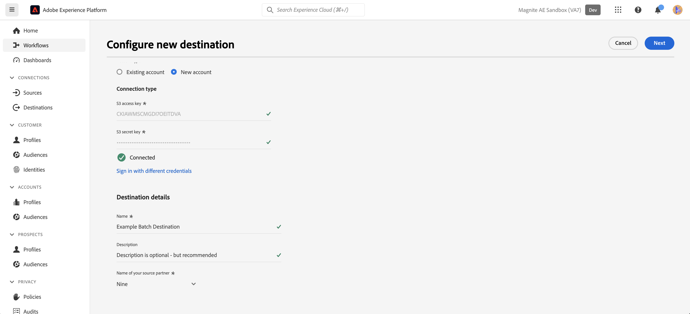

# Magneet: Batch-verbinding {#magnite-streaming-batch}

## Overzicht {#overview}

In dit document wordt de toverstaf beschreven: doel in batch en worden voorbeelden gegeven van het gebruik van voorbeelden om u te helpen begrijpen hoe u het publiek kunt activeren en exporteren.

Het Adobe Real-Time CDP-publiek kan op twee manieren op het Magnite Streaming-platform worden geleverd: het kan één keer per dag worden geleverd of het kan in real-time worden geleverd:

1. Als u slechts één keer per dag een publiek wilt en/of wilt leveren, kunt u de Magnite: Batch-bestemming gebruiken, die het publiek via een dagelijkse levering van S3-batchbestanden naar Magnite Streaming stuurt. Dit publiek van de Partij wordt opgeslagen voor onbepaalde tijd in het platform van Magnite, in tegenstelling tot publiek in real time, die slechts voor een paar dagen worden opgeslagen.

2. Nochtans, als u wilt of moet om publiek vaker leveren, zult u [&#x200B; Magnite in real time &#x200B;](/help/destinations/catalog/advertising/magnite-streaming.md) bestemming moeten gebruiken. Wanneer het gebruiken van de bestemming in real time, zal de Streaming van de Magnite publiek in real time ontvangen, maar de Magnite kan tijdelijk publiek in real time slechts opslaan in hun platform, en zij zullen uit het systeem binnen een paar dagen worden verwijderd. Om deze reden, als u de Magnite in real time bestemming wilt gebruiken, zult u *ook* moeten gebruiken Magnite: de bestemming van de partij - elk publiek dat u aan de bestemming in real time activeert, moet u ook aan de bestemming van de Partij activeren.

Om opnieuw op te nemen: Als u Adobe Real-Time CDP-publiek slechts eenmaal per dag wilt leveren, gebruikt u de Magnite: Alleen batchbestemming en het publiek wordt eenmaal per dag geleverd. Als u het publiek van Adobe Real-Time CDP in real time wilt leveren, zult u *zowel* Magnite gebruiken: De bestemming van de partij, en de bestemming van de Magnite Real-Time. Neem voor meer informatie contact op met Magnite: Streaming.

Lees verder hieronder voor meer informatie over de Magnite: Batch-bestemming, hoe u er verbinding mee kunt maken en hoe u het Adobe Real-Time CDP-publiek activeert.
Voor meer informatie over de bestemming in real time, zie [&#x200B; deze documentatiepagina &#x200B;](magnite-streaming.md) in plaats daarvan.

>[!IMPORTANT]
>
>De doelconnector en documentatiepagina worden gemaakt en onderhouden door het team van [!DNL Magnite] . Voor vragen of verzoeken om updates kunt u rechtstreeks contact opnemen via `adobe-tech@magnite.com` .

## Gebruiksscenario’s {#use-cases}

Om u beter te helpen begrijpen hoe en wanneer u Magnite zou moeten gebruiken: De bestemming van de partij, hier zijn de gevallen van het steekproefgebruik die de klanten van Adobe Experience Platform kunnen oplossen gebruikend deze bestemming.

### Hoofdletters gebruiken #1 {#use-case-1}

U hebt een publiek op de bestemming van de Magnite Real-Time geactiveerd.

Om het even welk publiek dat via de Magnite Real-Time bestemming wordt geactiveerd moet ook de Magnite gebruiken: de bestemming van de partij, aangezien de gegevens van de levering van de Partij worden bedoeld om de gegevens van de levering in real time binnen het platform van de Streaming van de Magnite te vervangen/voort te zetten.

### Hoofdletters gebruiken #2 {#use-case-2}

U wilt een publiek alleen activeren in een batch-/dagcursus voor het Magnite Streaming-platform.

Elk publiek dat via de toeriet wordt geactiveerd: de batchbestemming wordt in een batch-/dagcadence geleverd en is vervolgens beschikbaar voor gebruik op het Magnite Streaming-platform.

## Vereisten {#prerequisites}

Als u de [!DNL Magnite] -doelen in Adobe Experience Platform wilt gebruiken, moet u eerst een Magnite Streaming-account hebben. Als u een [!DNL Magnite Streaming] -account hebt, vraagt u uw [!DNL Magnite] accountmanager om referenties voor toegang tot [!DNL Magnite's] -doelen. Als u geen [!DNL Magnite Streaming] -account hebt, kunt u contact opnemen met adobe-tech@magnite.com

## Ondersteunde identiteiten {#supported-identities}

Magnite: De bestemming van de partij kan *om het even welke* identiteitsbronnen van de Adobe CDP ontvangen. Deze bestemming heeft momenteel drie doelidentiteitsvelden waarnaar u de koppeling wilt maken.

>[!NOTE]
>
>*Om het even welke* identiteitsbronnen kunnen aan om het even welke `magnite_deviceId` doelidentiteiten in kaart brengen.

| Doelidentiteit | Beschrijving | Overwegingen |
|:--------------------------- |:------------------------------------------------------------------------------------------------ |:------------------------------------------------------------------------------------- |
| magnite_deviceId_GAID | GOOGLE ADVERTISING ID | Selecteer deze doelidentiteit wanneer uw bronidentiteit een GAID is |
| magnite_deviceId_IDFA | Apple-id voor adverteerders | Selecteer deze doelidentiteit als uw bronidentiteit een IDFA is |
| magnite_deviceId_CUSTOM | Aangepaste id/door gebruiker gedefinieerde id | Selecteer deze doelidentiteit als uw bronidentiteit geen GAID of IDFA is of als het een aangepaste of door de gebruiker gedefinieerde id is |

{style="table-layout:auto"}

## Ondersteunde doelgroepen {#supported-audiences}

| Oorsprong publiek | Ondersteund | Beschrijving |
|-----------------------------|----------|----------|
| [!DNL Segmentation Service] | ✓ | Het publiek produceerde door de Dienst van de Segmentatie van het Experience Platform [&#128279;](../../../segmentation/home.md). |
| Aangepaste uploads | ✓ | Het publiek [&#x200B; ingevoerde &#x200B;](../../../segmentation/ui/audience-portal.md#import-audience) in Experience Platform van Csv- dossiers. |

{style="table-layout:auto"}

## Type en frequentie exporteren {#export-type-frequency}

| Item | Type | Notities |
|-----------------------------|----------|----------|
| Exporttype | Publiek exporteren | U exporteert alle leden van een publiek met de id&#39;s (naam, telefoonnummer of andere) die worden gebruikt in de Magnite: Batchbestemming. |
| Exportfrequentie | Batch | De bestemmingen van de partij voeren dossiers naar stroomafwaartse platforms in toename van drie, zes, acht, twaalf, of 24 uren uit. Lees meer over partij [&#x200B; op dossier-gebaseerde bestemmingen &#x200B;](/help/destinations/destination-types.md). |

{style="table-layout:auto"}

## Verbinden met de bestemming {#connect}

Zodra uw bestemmingsgebruik is goedgekeurd en de Streaming van de Magnite uw geloofsbrieven heeft gedeeld, te volgen gelieve de onderstaande stappen om voor authentiek te verklaren, gegevens in kaart te brengen en te delen.

### Verifiëren voor bestemming {#authenticate}

Zoek de toverstaf: batchbestemming in de Adobe Experience-catalogus. Klik op de knop Extra opties (\...) en configureer vervolgens de doelverbinding/doelinstantie.

Als u al een bestaand account hebt, kunt u dit vinden door de optie Account te wijzigen in &quot;Existing account&quot;. Anders maakt u hieronder een account:

Als u een nieuwe account wilt maken en deze voor het eerst wilt verifiëren bij de bestemming, vult u de velden &quot;S3-toegangssleutel&quot; en &quot;S3 geheime sleutel&quot; in (die u via uw accountmanager ontvangt) en selecteert u **[!UICONTROL Connect to destination]**

>[!NOTE]
>
>Het beveiligingsbeleid van Magnite Streaming vereist een regelmatige rotatie van S3-sleutels. U zou moeten verwachten om uw rekening in de toekomst met nieuwe S3 toegang en S3 geheime sleutels bij te werken. U hoeft alleen de account zelf bij te werken. Voor bestemmingen die dat account gebruiken, worden automatisch de bijgewerkte sleutels gebruikt. Als u de nieuwe toetsen niet uploadt, worden de gegevens niet naar deze bestemming verzonden.

### Doelgegevens invullen {#destination-details}

Als u details voor de bestemming wilt configureren, vult u de vereiste en optionele velden hieronder in. Een sterretje naast een veld in de gebruikersinterface geeft aan dat het veld verplicht is.

* **[!UICONTROL Name]**: Een naam waarmee u deze doelverbinding/-instantie herkent in het dialoogvenster
de toekomst.
* **[!UICONTROL Description]**: Een beschrijving die u helpt dit te identificeren
doelverbinding/-instantie in de toekomst.
* **[!UICONTROL Your company name]**: De naam van uw klant/bedrijf. Alleen ondersteunde [!DNL Magnite Streaming] clients zijn beschikbaar voor selectie.

>[!NOTE]
>
>De bedrijfsnaam moet een koord zijn dat de naam van het Amazon S3 leveringsemmer aanpast u met Magnite en opstelling in [&#x200B; voor authentiek verklaart aan bestemmings &#x200B;](#authenticate) stap hebt gevormd. De ondersteunde tekens zijn &#39;a-z&#39;, &#39;A-Z&#39;, &#39;0-9&#39;, &#39;-&#39;(streepje) of &#39;_&#39;(onderstrepingsteken).

>[!NOTE]
>
>Als u van plan bent om veelvoudige types van identiteitskaart (GAID, IDFA, enz.) te verzenden gebruikend de bestemming van de Partij, wordt een nieuwe bestemmingsverbinding/instantie vereist voor elk. Neem voor meer informatie contact op met uw vertegenwoordiger van uw Magnite-account.

U kunt vervolgens doorgaan door **[!UICONTROL Next]** te selecteren

Op het volgende scherm, getiteld &quot;Governance Policy and Enforcement Actions (Optional)&quot;, kunt u naar keuze om het even welk relevant beleid van het gegevensbeheer selecteren. De &quot;Uitvoer van Gegevens&quot;wordt over het algemeen geselecteerd voor Magneet: de bestemming van de partij.

Selecteer **[!UICONTROL Create]** wanneer deze optie is geselecteerd of wanneer u dit optionele scherm wilt overslaan

### Waarschuwingen inschakelen {#enable-alerts}

U kunt alarm toelaten om berichten over de status van dataflow aan uw bestemming te ontvangen. Selecteer een waarschuwing in de lijst om u te abonneren op meldingen over de status van uw gegevensstroom. Voor meer informatie over alarm, zie de gids bij [&#x200B; het intekenen aan bestemmingsalarm gebruikend UI &#x200B;](../../ui/alerts.md).

Wanneer u klaar bent met het opgeven van details voor uw doelverbinding, selecteert u **[!UICONTROL Next]** .

### Segmenten naar dit doel activeren {#activate}

>[!IMPORTANT]
> 
>* Om gegevens te activeren, hebt u **[!UICONTROL View Destinations]**, **[!UICONTROL Activate Destinations]**, **[!UICONTROL View Profiles]**, en **[!UICONTROL View Segments]** [&#x200B; toegangsbeheertoestemmingen &#x200B;](/help/access-control/home.md#permissions) nodig. Lees het [&#x200B; overzicht van de toegangscontrole &#x200B;](/help/access-control/ui/overview.md) of contacteer uw productbeheerder om de vereiste toestemmingen te verkrijgen.
>* Om *identiteiten* uit te voeren, hebt u de **[!UICONTROL View Identity Graph]** [&#x200B; toegangsbeheertoestemming &#x200B;](/help/access-control/home.md#permissions) nodig.   {width="100" zoomable="yes"}

Lees [&#x200B; activeer publieksgegevens aan de uitvoerbestemmingen van het partijprofiel &#x200B;](/help/destinations/ui/activate-batch-profile-destinations.md) voor instructies bij het activeren van publiekssegmenten aan deze bestemming.

### Kenmerken en identiteiten toewijzen {#map}

In **[!UICONTROL Source field]**, kunt u om het even welk attribuut of identiteit voor uw apparaten selecteren. In dit voorbeeld hebben we een aangepaste IdentityMap met de naam &#39;DeviceId&#39; geselecteerd

In de lus **[!UICONTROL Target field]** :
 zie [&#x200B; Gesteunde Identiteiten &#x200B;](#supported-identities) voor meer informatie.
In dit voorbeeld hebben we **[!UICONTROL Target field]**: magnite_deviceId_CUSTOM geselecteerd, omdat onze **[!UICONTROL Source field]** is gedefinieerd als een aangepaste IdentityMap: DeviceID.

>[!NOTE]
>
>Als u van plan bent om veelvoudige types van identiteitskaart (GAID, IDFA, enz.) te verzenden/in kaart te brengen gebruikend de bestemming van de Partij, wordt een nieuwe bestemmingsverbinding/instantie vereist voor elk. Neem voor meer informatie contact op met uw vertegenwoordiger van uw Magnite-account.

Op het scherm &quot;Vorm filename en de uitvoerplanning voor elk publiek&quot;, moet u een Datum van het Begin (verplicht), Einddatum (facultatief), en (verplichte) identiteitskaart van de Afbeelding voor elk publiek nu vormen.

>[!IMPORTANT]
>
> Voor deze bestemming is een toewijzingsid of &quot;NONE&quot; vereist.
>
> Een toewijzings-id moet worden opgegeven wanneer een publiek een bestaande segment-id heeft die eerder bekend is bij Magnite Streaming. Anders moet &#39;NONE&#39; worden gebruikt als de toewijzing-id.
>
> Wanneer u de bestandsnaam voor elk publiek configureert, neemt u de toewijzingsid op via het veld Aangepaste tekst dat u wilt toevoegen. Aan de toewijzen-id wordt het volgende toegevoegd: `{previous_filename}\_\[MAPPING_ID\].` Als dit publiek nieuw is voor Magnite Streaming en u geen toewijzings-id opgeeft, wordt &#39;NONE&#39; weergegeven in het veld &#39;Aangepaste tekst&#39;. De nieuwe bestandsnaam in dit geval moet zijn: `{previous_filename}\_\[NONE\]` .

## Geëxporteerde gegevens/Gegevens valideren bij exporteren {#exported-data}

Nadat uw publiek is geüpload, kunt u controleren of uw publiek op de juiste wijze is gemaakt en geüpload.

* De toeriet: De bestemming van de partij levert S3 dossiers aan de Streaming van de Magnite bij een dagelijkse kadentie. Na levering en opname, zullen de soorten publiek/segmenten naar verwachting in het Streamen van de Magnite verschijnen, en kunnen op een overeenkomst worden toegepast. U kunt dit bevestigen door de segment-id of segmentnaam te zoeken die tijdens de activeringsstappen in de Adobe Experience Platform is gedeeld.

>[!NOTE]
>
>Het publiek activeerde/leverde aan Magnite: De bestemming van de partij zal ** het zelfde publiek vervangen dat via de Magnite in real time bestemming werd geactiveerd/geleverd. Als u omhoog een segment gebruikend de segmentnaam kijkt, kunt u niet het segment in real time vinden, tot de partij is opgenomen en door het platform van de Streaming van de Magnite verwerkt.

## Gegevensgebruik en -beheer {#data-usage-governance}

Alle [!DNL Adobe Experience Platform] -doelen zijn compatibel met het beleid voor gegevensgebruik bij het verwerken van uw gegevens. Voor gedetailleerde informatie over hoe [!DNL Adobe Experience Platform] gegevensbeheer afdwingt, lees het [&#x200B; overzicht van het Beleid van Gegevens &#x200B;](/help/data-governance/home.md).

## Aanvullende bronnen {#additional-resources}

Voor extra hulpdocumentatie, bezoek het [&#x200B; Centrum van de Hulp van de Magniet &#x200B;](https://help.magnite.com/help).
