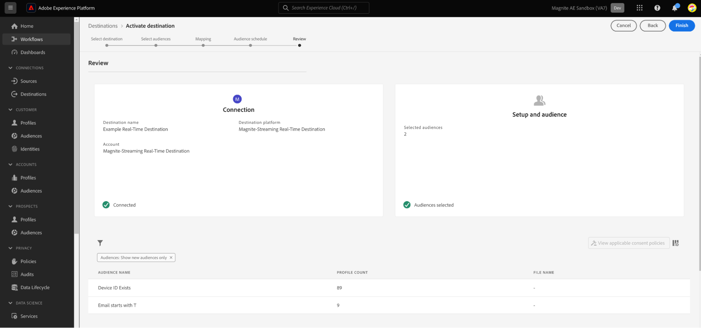

# Magniet: Real-Time doelverbinding

## Overzicht {#overview}

[!DNL Magnite: Real-Time] en [&#x200B; Magnite: De bestemmingen van de partij &#x200B;](/help/destinations/catalog/advertising/magnite-batch.md) in [!DNL Adobe Experience Platform] helpen u toehoorden in kaart brengen en uitvoeren voor het richten en activering op het Magnite Streaming platform.

Het activeren van het publiek voor het [!DNL Magnite Streaming] -platform is een proces in twee stappen waarbij u zowel de Magnite als Real-Time en de Magnite: Batch-doelen moet gebruiken.

Als u uw publiek wilt activeren naar [!DNL Magnite Streaming] , moet u:

* Activeer het publiek op de bestemming [!DNL Magnite: Real-Time], zoals weergegeven op deze pagina.
* Activeer hetzelfde publiek op de toeriet: Batch-bestemming. Het doel van [!DNL Magnite: Batch] is een verplichte component. Als u het publiek niet activeert op de batchbestemming [!DNL Magnite Streaming] , resulteert dit in een mislukte integratie en wordt het publiek niet geactiveerd.

>[!NOTE]
>
>Wanneer u de bestemming Real-Time gebruikt, ontvangt [!DNL Magnite Streaming] een publiek in real-time, maar Magnite kan alleen realtime publiek tijdelijk in zijn platform opslaan en binnen een paar dagen uit het systeem verwijderen. Om deze reden, als u Magnite wilt gebruiken: In real time bestemming, zult u *ook* moeten gebruiken Magnite: de bestemming van de partij - elk publiek dat u aan de bestemming in real time activeert, moet u ook aan de bestemming van de Partij activeren.

>[!IMPORTANT]
>
>De doelconnector en documentatiepagina worden gemaakt en onderhouden door het team van [!DNL Magnite] . Voor vragen of updateverzoeken kunt u rechtstreeks contact opnemen via `adobe-tech@magnite.com` .

## Gebruiksscenario&#39;s {#use-cases}

Om u beter te helpen begrijpen hoe en wanneer u de [!DNL Magnite: Real-Time] bestemming zou moeten gebruiken, is hier een geval van het steekproefgebruik dat de klanten van [!DNL Adobe Experience Platform] door deze bestemming kunnen oplossen.

### Activering en doelversie {#activation-and-targeting}

Dankzij deze integratie met Magnite kunnen klanten hun CDP-publiek doorgeven van [!DNL Adobe Experience Platform] naar Magnite voor het maken van advertenties. Soorten publiek kan in Magnite worden geselecteerd voor positieve doelgerichtheid en voor negatieve doelgerichtheid (onderdrukking).

## Vereisten {#prerequisites}

Als u de [!DNL Magnite] doelen in [!DNL Adobe Experience Platform] wilt gebruiken, moet u eerst een [!DNL Magnite Streaming] account hebben. Als u een [!DNL Magnite Streaming] -account hebt, vraagt u uw [!DNL Magnite] accountmanager om referenties voor toegang tot [!DNL Magnite's] -doelen.
Als u geen [!DNL Magnite Streaming] -account hebt, kunt u contact opnemen met adobe-tech@magnite.com

## Ondersteunde identiteiten {#supported-identities}

Het doel van [!DNL Magnite: Real-Time] ondersteunt de activering van de identiteiten die in de onderstaande tabel worden beschreven. Leer meer over [&#x200B; identiteiten &#x200B;](/help/identity-service/features/namespaces.md).

| Doelidentiteit | Beschrijving | Overwegingen |
|-------------------|--------------------------------------------------------------------------------------------------|--------------------------------------------------------------------------------------|
| device_id | Een unieke id voor een apparaat of identiteit. We accepteren alle apparaat-id&#39;s en de eerste-partijid, ongeacht het type. | Identiteitstypen die door Magnite worden ondersteund, zijn onder andere PPUID-, GAID-, IDFA- en TV-apparaat-id&#39;s. |

{style="table-layout:auto"}

## Ondersteunde doelgroepen {#supported-audiences}

In deze sectie wordt beschreven welk type publiek u naar dit doel kunt exporteren.

| Oorsprong publiek | Ondersteund | Beschrijving |
|-----------------------------|----------|----------|
| [!DNL Segmentation Service] | Ja | Het publiek produceerde door de Dienst van de Segmentatie van Experience Platform [&#x200B; &#x200B;](../../../segmentation/home.md). |
| Alle andere doelgroepen | Ja | Deze categorie omvat alle oorsprong van het publiek buiten het publiek dat via [!DNL Segmentation Service] wordt gegenereerd. Lees over de [&#x200B; diverse publieksoorsprong &#x200B;](/help/segmentation/ui/audience-portal.md#customize). Voorbeelden zijn: <ul><li> de douane uploadt publiek [&#x200B; ingevoerde &#x200B;](../../../segmentation/ui/audience-portal.md#import-audience) in Experience Platform van Csv- dossiers,</li><li> gelijksoortige doelgroepen, </li><li> federaal publiek, </li><li> publiek dat wordt gegenereerd in andere Experience Platform-toepassingen, zoals [!DNL Adobe Journey Optimizer] , </li><li> en meer. </li></ul> |

{style="table-layout:auto"}

Ondersteund publiek per type publieksgegevens:

| Gegevenstype Publiek | Ondersteund | Beschrijving | Gebruiksscenario&#39;s |
|--------------------|-----------|-------------|-----------|
| [&#x200B; het publiek van Mensen &#x200B;](/help/segmentation/types/people-audiences.md) | Ja | Gebaseerd op klantenprofielen, die u toestaan om specifieke groepen mensen voor marketing campagnes te richten. | Frequente kopers, winkeliers |
| [&#x200B; publiek van de Rekening &#x200B;](/help/segmentation/types/account-audiences.md) | Nee | Doelpersonen binnen specifieke organisaties voor marketingstrategieën op basis van account. | B2B-marketing |
| [&#x200B; Het publiek van het Vooruitzicht &#x200B;](/help/segmentation/types/prospect-audiences.md) | Nee | De individuen van het doel die nog geen klanten zijn maar eigenschappen met uw doelpubliek delen. | Waarschuwing met gegevens van derden |
| [&#x200B; de uitvoer van de Dataset &#x200B;](/help/catalog/datasets/overview.md) | Nee | Verzamelingen gestructureerde gegevens die zijn opgeslagen in het [!DNL Adobe Experience Platform] Data Lake. | Rapportage, workflows voor gegevenswetenschap |

{style="table-layout:auto"}

## Type en frequentie exporteren {#export-type-frequency}

Raadpleeg de onderstaande tabel voor informatie over het exporttype en de exportfrequentie van de bestemming.

| Item | Type | Notities |
|------------------|---------------------------------|------------------------------------------------------------------------------------------------------------------------------------------------------------------------------------------------------------------------------------------------------------------------------------------------------------------------------------|
| Exporttype | **[!UICONTROL Segment export]** | U exporteert alle leden van een segment (publiek) met de id&#39;s (naam, telefoonnummer of andere) die in de [!DNL Magnite: Real-Time] -bestemming worden gebruikt. |
| Exportfrequentie | **[!UICONTROL Streaming]** | Streaming doelen zijn &quot;altijd aan&quot; API-verbindingen. Zodra een profiel in Experience Platform wordt bijgewerkt dat op segmentevaluatie wordt gebaseerd, verzendt de schakelaar de update stroomafwaarts naar het bestemmingsplatform. Lees meer over [&#x200B; het stromen bestemmingen &#x200B;](/help/destinations/destination-types.md#streaming-destinations). |

{style="table-layout:auto"}

## Verbinden met de bestemming {#connect}

>[!IMPORTANT]
>
>Om met de bestemming te verbinden, hebt u **[!UICONTROL View destinations]** en **[!UICONTROL Manage destinations]** [&#x200B; toegangsbeheertoestemming &#x200B;](/help/access-control/home.md#permissions) nodig. Lees het [&#x200B; overzicht van de toegangscontrole &#x200B;](/help/access-control/ui/overview.md) of contacteer uw productbeheerder om de vereiste toestemmingen te verkrijgen.

Om met deze bestemming te verbinden, volg de stappen die in het [&#x200B; leerprogramma van de bestemmingsconfiguratie &#x200B;](../../ui/connect-destination.md) worden beschreven. In vormen bestemmingswerkschema, vul de gebieden in die in de twee hieronder secties worden vermeld.

### Verifiëren voor bestemming {#authenticate}

Als u voor verificatie bij het doel wilt zorgen, vult u de vereiste velden in en selecteert u **[!UICONTROL Connect to destination]** .

* **[!UICONTROL Username]**: De gebruikersnaam die door [!DNL Magnite] aan u wordt verstrekt.
* **[!UICONTROL Password]**: Het wachtwoord dat door [!DNL Magnite] aan u wordt verstrekt.

### Doelgegevens invullen {#destination-details}

Als u details voor de bestemming wilt configureren, vult u de vereiste en optionele velden hieronder in. Een sterretje naast een veld in de gebruikersinterface geeft aan dat het veld verplicht is.

* **[!UICONTROL Name]**: Een naam waarmee u dit doel in de toekomst herkent.
* **[!UICONTROL Description]**: Een beschrijving die u zal helpen deze bestemming in de toekomst identificeren.
* **[!UICONTROL Your company name]**: De naam van uw klant/bedrijf. Alleen ondersteunde [!DNL Magnite Streaming] clients zijn beschikbaar voor selectie.

>[!NOTE]
>
>De bedrijfsnaam moet een koord zijn dat de naam van het Amazon S3 leveringsemmer aanpast u met Magnite en opstelling in [&#x200B; voor authentiek verklaart aan bestemmings &#x200B;](#authenticate) stap hebt gevormd. De ondersteunde tekens zijn &#39;a-z&#39;, &#39;A-Z&#39;, &#39;0-9&#39;, &#39;-&#39;(streepje) of &#39;_&#39;(onderstrepingsteken).

Selecteer vervolgens de knop **[!UICONTROL Create]** .

### Waarschuwingen inschakelen {#enable-alerts}

U kunt alarm toelaten om berichten over de status van dataflow aan uw bestemming te ontvangen. Selecteer een waarschuwing in de lijst om u te abonneren op meldingen over de status van uw gegevensstroom. Voor meer informatie over alarm, zie de gids bij [&#x200B; het intekenen aan bestemmingsalarm gebruikend UI &#x200B;](../../ui/alerts.md).

Wanneer u klaar bent met het opgeven van details voor uw doelverbinding, selecteert u **[!UICONTROL Next]** .

## Soorten publiek naar dit doel activeren {#activate}

>[!IMPORTANT]
>
>* Om gegevens te activeren, hebt u **[!UICONTROL View destinations]**, **[!UICONTROL Activate destinations]**, **[!UICONTROL View Profiles]**, en **[!UICONTROL View Segments]** [&#x200B; toegangsbeheertoestemmingen &#x200B;](/help/access-control/home.md#permissions) nodig. Lees het [&#x200B; overzicht van de toegangscontrole &#x200B;](/help/access-control/ui/overview.md) of contacteer uw productbeheerder om de vereiste toestemmingen te verkrijgen.
>* Om *identiteiten* uit te voeren, hebt u de **[!UICONTROL View Identity Graph]** [&#x200B; toegangsbeheertoestemming &#x200B;](/help/access-control/home.md#permissions) nodig.   {width="100" zoomable="yes"}

Lees [&#x200B; actief publiek aan het stromen bestemmingen &#x200B;](/help/destinations/ui/activate-segment-streaming-destinations.md) voor instructies bij het activeren van publiek aan deze bestemming.

Zodra de bestemmingsverbinding is gecreeerd, kunt u aan de stroom van de publiekactivering te werk gaan. De volgende sectie loopt door hoe te om publiek te activeren gebruikend de bestemming in real time.

### Kenmerken en identiteiten toewijzen {#map}

De volgende stap is bronherkenningstekens in kaart te brengen aan het apparaat_id herkenningsteken van de Magnite.

* U kunt zoveel toewijzingen toevoegen als u nodig hebt door **[!UICONTROL Add new mapping]** te selecteren.

Dit voorbeeld dat de bestemming in real time gebruikt toont een rij die een generische apparaatId bronherkenningsteken bevat die aan het het doelgebied van Magnite device_id wordt in kaart gebracht. Wanneer u bij de afbeeldingen bent, selecteert u [!UICONTROL Next] .

Vergeet niet Mapping ID&#39;s in te stellen op alle geactiveerde soorten publiek of NONE in te stellen als er geen toewijzing-id aanwezig is.

 aanwezig is

U moet nu een begindatum (verplicht), een einddatum (optioneel) en een toewijzingsid voor elk publiek configureren.

**Uitwisselingsidentiteitskaart**

* Gebruik het veld **[!UICONTROL Mapping ID]** wanneer een publiek een reeds bestaande segment-id heeft die eerder bekend is bij Magnite.

* Als u een **[!UICONTROL Mapping ID]** aan een publiek wilt toevoegen, selecteert u elke publiekstrij afzonderlijk en voert u gegevens in de rechterkolom in (zie bovenstaande afbeelding). Als u geen toewijzings-id wilt toevoegen, voert u GEEN in het veld Toewijzings-id in.

Selecteer **[!UICONTROL Next]** en voltooi de activeringsstroom.

## Geëxporteerde gegevens/Gegevens valideren bij exporteren {#exported-data}

Nadat uw publiek is geüpload, kunt u met de volgende stappen controleren of uw publiek is gemaakt en correct is geüpload:

<!--

* In 95% of cases, audiences will be delivered to Magnite Streaming in under 10 minutes. The actual receipt and processing of the events within Magnite Streaming depends on the shared data volume.

-->

* Na-ingest, zullen het publiek naar verwachting binnen [!DNL Magnite Streaming] binnen een paar minuten verschijnen en kunnen op een overeenkomst worden toegepast. U kunt dit bevestigen door de segment-id op te zoeken die tijdens de activeringsstappen in de [!DNL Adobe Experience Platform] is gedeeld.

## Activeer het zelfde publiek door de [!DNL Magnite: Batch] bestemming {#activate-magnite-batch}

Soorten publiek dat met [!DNL Magnite Streaming] wordt gedeeld met gebruik van de bestemming Real-Time, moeten ook worden gedeeld met gebruik van de Magnite: Batch-bestemming. Als de segmentnamen correct zijn geconfigureerd in de gebruikersinterface van [!DNL Magnite Streaming] , worden deze bijgewerkt met de segmentnamen die worden gebruikt in de [!DNL Adobe Experience Platform] post-daily update.

Tot slot als een bestemming van de Partij niet voor uw integratie is gevormd, plaats het nu via Magnite: het bestemmingsdocument van de Partij.

## Gegevensgebruik en -beheer {#data-usage-governance}

Alle [!DNL Adobe Experience Platform] -doelen zijn compatibel met het beleid voor gegevensgebruik bij het verwerken van uw gegevens. Voor gedetailleerde informatie over hoe [!DNL Adobe Experience Platform] gegevensbeheer afdwingt, lees het [&#x200B; overzicht van het Beleid van Gegevens &#x200B;](/help/data-governance/home.md).

## Aanvullende bronnen {#additional-resources}

Voor extra hulpdocumentatie, bezoek het [&#x200B; Centrum van de Hulp van de Magniet &#x200B;](https://help.magnite.com/help).
