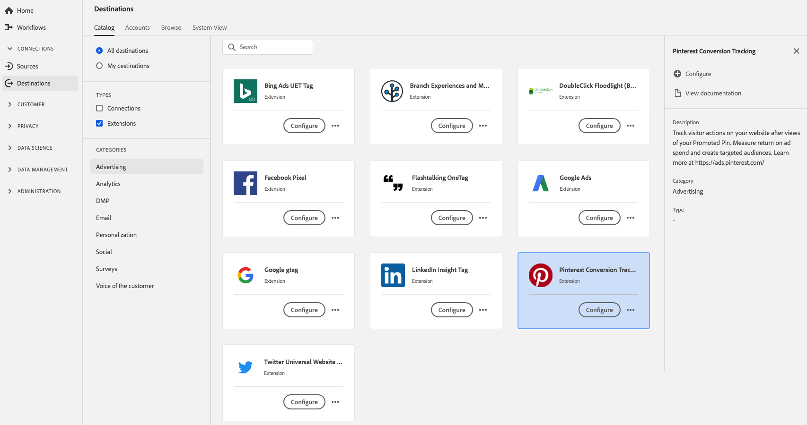

# [!DNL Pinterest Conversion Tracking] extension  {#pinterest-extension}

Handelingen voor bezoekers bijhouden op uw website na weergaven van uw promotiepunt. De opbrengst van de maatregel op advertentie besteedt en creeert gericht publiek. Meer [hier](https://ads.pinterest.com/).

[!DNL Pinterest Conversion Tracking] is een advertentie-uitbreiding in Adobe Experience Platform. Voor meer informatie over de uitbreidingsfunctionaliteit, zie de uitbreidingspagina op [Adobe Uitwisseling](https://exchange.adobe.com/experiencecloud.details.100523.pinterest-conversion-tracking-for-adobe-launch.html).

Dit doel is een Adobe Experience Platform Launch-extensie. Voor meer informatie over hoe de uitbreidingen van de Lancering van het Platform in Platform werken, zie [overzicht van de uitbreidingen van Adobe Experience Platform Launch](../launch-extensions/overview.md).

## Vereisten {#prerequisites}

Deze extensie is beschikbaar in de catalogus [!DNL Destinations] voor alle klanten die Platform hebben aangeschaft.

Als u deze extensie wilt gebruiken, hebt u toegang tot Adobe Experience Platform Launch nodig. Platform starten wordt aangeboden aan Adobe Experience Cloud-klanten als een inbegrepen, waardetoevoegend onderdeel. Neem contact op met de systeembeheerder van uw organisatie om toegang te krijgen tot het starten van Platforms en vraag hen om u de **[!UICONTROL manage_properties]** toestemming te geven zodat u extensies kunt installeren.

## Extensie {#install-extension} installeren

De extensie [!DNL Pinterest Conversion Tracking] installeren:

Ga in [Platform interface](http://platform.adobe.com/), naar **[!UICONTROL Doelen]** > **[!UICONTROL Catalogus]**.

Selecteer de extensie in de catalogus of gebruik de zoekbalk.

Klik op de bestemming om het te benadrukken, dan uitgezocht **[!UICONTROL vorm]** in het juiste spoor. Als de **[!UICONTROL Configure]** controle uit grijs is, mist u **[!UICONTROL manage_properties]** toestemming. Zie [Eerste vereisten](#prerequisites).

Selecteer in het venster **[!UICONTROL Beschikbare Platform starten-eigenschap]** de eigenschap Platform starten waarin u de extensie wilt installeren. U kunt ook een nieuwe eigenschap maken bij het starten van het Platform. Een bezit is een inzameling van regels, gegevenselementen, gevormde uitbreidingen, milieu&#39;s, en bibliotheken. Meer informatie over eigenschappen vindt u in de sectie [Eigenschappen op de pagina](https://experienceleague.adobe.com/docs/launch/using/reference/admin/companies-and-properties.html#properties-page) van de documentatie bij Starten van Platform.

Met de workflow gaat u naar Starten van Platform om de installatie te voltooien.

Voor informatie over de opties van de uitbreidingsconfiguratie en installatiesteun, zie de [Pinterest pagina van de Omzetting van de Omzetting op de Uitwisseling van Adobe](https://exchange.adobe.com/experiencecloud.details.100523.pinterest-conversion-tracking-for-adobe-launch.html).

U kunt de extensie ook rechtstreeks installeren in de [Adobe Experience Platform Launch-interface](https://launch.adobe.com/). Zie [Een nieuwe extensie toevoegen](https://experienceleague.adobe.com/docs/launch/using/reference/manage-resources/extensions/overview.html?lang=en#add-a-new-extension) in de documentatie bij starten van Platform.

## De extensie {#how-to-use} gebruiken

Nadat u de extensie hebt geïnstalleerd, kunt u rechtstreeks regels voor de extensie instellen in Platform starten.

In de Lancering van het Platform, kunt u opstellingsregels voor uw geïnstalleerde uitbreidingen om gebeurtenisgegevens naar de uitbreidingsbestemming slechts in bepaalde situaties te verzenden. Zie [Documentatie van regels](https://experienceleague.adobe.com/docs/launch/using/reference/manage-resources/rules.html) voor meer informatie over instellingsregels voor uw extensies.

## De uitbreiding {#configure-upgrade-delete} vormen, bevorderen en schrappen

U kunt uitbreidingen in de interface van de Lancering van het Platform vormen, bevorderen en schrappen.

>[!TIP]
>
>Als de extensie al op een van uw eigenschappen is geïnstalleerd, wordt **[!UICONTROL Install]** voor de extensie nog steeds weergegeven in de interface van het Platform. Kies de installatieworkflow die wordt beschreven in [Extensie installeren](#install-extension) om de Platform Starten te starten en uw extensie te configureren of te verwijderen.

Om uw uitbreiding te bevorderen, zie [Uitbreiding verbetering](https://experienceleague.adobe.com/docs/launch/using/reference/manage-resources/extensions/extension-upgrade.html) in de documentatie van de Lancering van het Platform.