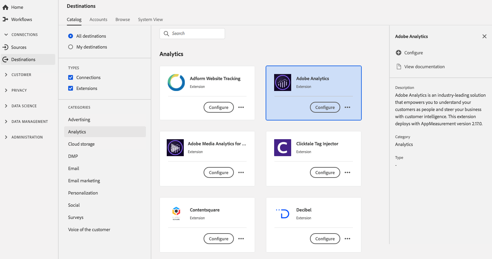

# [!DNL Adobe Analytics] extensie

## Overzicht {#overview}

[!DNL Adobe Analytics] is een toonaangevende oplossing die u in staat stelt uw klanten als mensen te begrijpen en uw bedrijf te sturen met intelligentie van de klant.

[!DNL Adobe Analytics] is een analytische extensie in [!DNL Adobe Experience Platform] . Voor meer informatie over de uitbreidingsfunctionaliteit, zie het [&#x200B; de uitbreidingsoverzicht van Adobe Analytics &#x200B;](/help/tags/extensions/client/analytics/overview.md) in de documentatie van Markeringen.

Dit doel is een tagextensie. Voor meer informatie over hoe de uitbreidingen van markeringen in Experience Platform werken, zie het [&#x200B; overzicht van markeringsuitbreidingen &#x200B;](../launch-extensions/overview.md).

## Vereisten {#prerequisites}

Deze extensie is beschikbaar in de catalogus Doelen voor alle klanten die Experience Platform hebben aangeschaft.

Als u deze extensie wilt gebruiken, hebt u toegang tot tags in Experience Platform nodig. Tags worden aan [!DNL Adobe Experience Cloud] klanten aangeboden als een opgenomen functie voor het toevoegen van waarden. Neem contact op met de systeembeheerder van uw organisatie om toegang te krijgen tot de gebruikersinterface voor gegevensverzameling en vraag hen om u de **[!UICONTROL manage_properties]** -machtiging te verlenen zodat u extensies kunt installeren.

## Extensie installeren {#install-extension}

De extensie [!DNL Adobe Analytics] installeren:

In de [&#x200B; interface van Experience Platform &#x200B;](https://platform.adobe.com/), ga **[!UICONTROL Destinations]** > **[!UICONTROL Catalog]**.

Selecteer de extensie in de catalogus of gebruik de zoekbalk.

Selecteer het doel en selecteer vervolgens **[!UICONTROL Configure]** in de rechterrails. Als het besturingselement **[!UICONTROL Configure]** grijs wordt weergegeven, ontbreekt de machtiging **[!UICONTROL manage_properties]** . Zie [&#x200B; Eerste vereisten &#x200B;](#prerequisites).

Selecteer de eigenschap tag waarin u de extensie wilt installeren. U kunt ook een nieuwe eigenschap maken. Een bezit is een inzameling van regels, gegevenselementen, gevormde uitbreidingen, milieu&#39;s, en bibliotheken. Leer over eigenschappen in de [&#x200B; tagdocumentatie &#x200B;](../../../tags/ui/administration/companies-and-properties.md).

De werkstroom neemt u aan de UI van de Inzameling van Gegevens om de installatie te voltooien.

Voor informatie over de opties van de uitbreidingsconfiguratie, zie de [&#x200B; de uitbreidingspagina van Adobe Analytics &#x200B;](https://experienceleague.adobe.com/docs/platform-learn/implement-in-websites/implement-solutions/analytics.html?lang=nl-NL) de markeringsdocumentatie.

U kunt de uitbreiding direct in [&#x200B; de Inzameling UI van Gegevens &#x200B;](https://experience.adobe.com/#/data-collection/) ook installeren. Zie de gids op [&#x200B; toevoegend een nieuwe uitbreiding &#x200B;](../../../tags/ui/managing-resources/extensions/overview.md#add-a-new-extension) voor meer informatie.

## De extensie gebruiken {#how-to-use}

Nadat u de extensie hebt geïnstalleerd, kunt u regels instellen. In de UI van de Inzameling van Gegevens, kunt u opstellingsregels voor uw geïnstalleerde uitbreidingen om gebeurtenisgegevens naar de uitbreidingsbestemming slechts in bepaalde situaties te verzenden. Voor meer informatie over vestiging regels voor uw uitbreidingen, zie het overzicht op [&#x200B; regels &#x200B;](../../../tags/ui/managing-resources/rules.md) in de markeringsdocumentatie.

## Uitbreiding configureren, bijwerken en verwijderen {#configure-upgrade-delete}

U kunt extensies configureren, upgraden en verwijderen in de gebruikersinterface voor gegevensverzameling.

>[!TIP]
>
>Als de extensie al op een van uw eigenschappen is geïnstalleerd, wordt de interface nog steeds **[!UICONTROL Install]** voor de extensie weergegeven. Kik van het installatiewerkschema zoals die in [&#x200B; wordt beschreven installeer uitbreiding &#x200B;](#install-extension) om uw uitbreiding te vormen of te schrappen.

Om uw uitbreiding te bevorderen, zie de gids op het [&#x200B; proces van de uitbreidingsverbetering &#x200B;](../../../tags/ui/managing-resources/extensions/extension-upgrade.md) in de tagdocumentatie.
