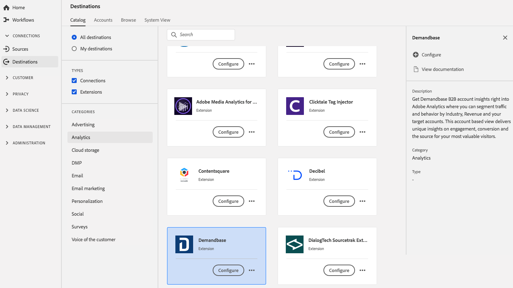

# [!DNL Demandbase] extension {#demandbase-extension}

## Overzicht {#overview}

Get [!DNL Demandbase] B2B-accountinzichten in Adobe Analytics waar u verkeer en gedrag kunt segmenteren via de branche, de inkomstenbron en uw doelaccounts. Deze op account gebaseerde weergave biedt unieke inzichten in betrokkenheid, conversie en de bron voor uw meest waardevolle bezoekers.

[!DNL Demandbase] is een uitbreiding voor analysemogelijkheden in Adobe Experience Platform. Zie de extensiepagina op voor meer informatie over de extensiefunctionaliteit [Adobe Exchange](https://exchange.adobe.com/experiencecloud.details.101605.html).

Dit doel is een tagextensie. Zie voor meer informatie over de manier waarop tagextensies werken in Platform de [overzicht van tagextensies](../launch-extensions/overview.md).

## Vereisten {#prerequisites}

Deze extensie is beschikbaar in de catalogus Doelen voor alle klanten die Platform hebben aangeschaft.

Als u deze extensie wilt gebruiken, hebt u toegang tot tags in Adobe Experience Platform nodig. Tags worden aan Adobe Experience Cloud-klanten aangeboden als een inbegrepen, waardetoevoegend element. Neem contact op met de systeembeheerder van uw organisatie om toegang te krijgen tot tags en vraag deze om u de **[!UICONTROL manage_properties]** toestemming zodat u extensies kunt installeren.

## Extensie installeren {#install-extension}

Als u het dialoogvenster [!DNL Demandbase] extensie:

In de [Interface Platform](https://platform.adobe.com/), ga naar **[!UICONTROL Destinations]** > **[!UICONTROL Catalog]**.

Selecteer de extensie in de catalogus of gebruik de zoekbalk.

Klik op de bestemming om deze te markeren en selecteer vervolgens **[!UICONTROL Configure]** in het rechterspoor. Als de **[!UICONTROL Configure]** de controle is grijs uit, u mist **[!UICONTROL manage_properties]** toestemming. Zie [Vereisten](#prerequisites).

Selecteer de eigenschap waarin u de extensie wilt installeren. U kunt ook een nieuwe eigenschap maken. Een bezit is een inzameling van regels, gegevenselementen, gevormde uitbreidingen, milieu&#39;s, en bibliotheken. Meer informatie over eigenschappen in het dialoogvenster [Sectie Eigenschappen van pagina](../../../tags/ui/administration/companies-and-properties.md#properties-page) van in de tagdocumentatie.

Het werkschema begeleidt u door de stappen om de installatie te voltooien.

Voor informatie over de opties van de uitbreidingsconfiguratie, zie [Demandbase-extensiepagina](https://exchange.adobe.com/experiencecloud.details.101605.html) op Adobe Exchange.

U kunt de extensie ook rechtstreeks installeren in het dialoogvenster [UI voor gegevensverzameling](https://experience.adobe.com/#/data-collection/). Zie de sectie over [toevoegen, nieuwe extensie](../../../tags/ui/managing-resources/extensions/overview.md#add-a-new-extension) in de tagdocumentatie.

## De extensie gebruiken {#how-to-use}

Nadat u de extensie hebt geïnstalleerd, kunt u regels instellen.

U kunt regels instellen voor geïnstalleerde extensies, zodat gebeurtenisgegevens alleen in bepaalde situaties naar de extensiebestemming worden verzonden. Voor meer informatie over het instellen van regels voor uw extensies raadpleegt u de [codedocumentatie](../../../tags/ui/managing-resources/rules.md).

## De extensie configureren, upgraden en verwijderen {#configure-upgrade-delete}

U kunt extensies configureren, upgraden en verwijderen in de gebruikersinterface voor gegevensverzameling.

>[!TIP]
>
>Als de extensie al op een van uw eigenschappen is geïnstalleerd, wordt de interface van het Platform nog weergegeven **[!UICONTROL Install]** voor de extensie. Kies de installatieworkflow zoals beschreven in [Extensie installeren](#install-extension) om uw extensie te configureren of te verwijderen.

Als u uw extensie wilt upgraden, raadpleegt u de handleiding op het tabblad [upgradeproces voor extensie](../../../tags/ui/managing-resources/extensions/extension-upgrade.md) in de tagdocumentatie.
