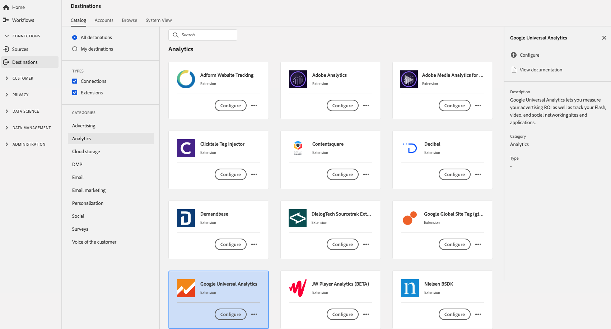

# [!DNL Google Universal Analytics] extension  {#google-universal-analytics-extension}

[!DNL Google Universal Analytics] kunt u uw advertentie-ROI meten, evenals uw Flash, video, en sociale voorzien van een netwerkplaatsen en toepassingen volgen.

[!DNL Google Universal Analytics] is een uitbreiding voor analysemogelijkheden in Adobe Experience Platform. Voor meer informatie over de uitbreidingsfunctionaliteit, zie de uitbreidingspagina op [Adobe Uitwisseling](https://exchange.adobe.com/experiencecloud.details.102829.google-universal-analytics.html).

Dit doel is een Adobe Experience Platform Launch-extensie. Voor meer informatie over hoe de uitbreidingen van de Lancering van het Platform in Platform werken, zie [overzicht van de uitbreidingen van Adobe Experience Platform Launch](../launch-extensions/overview.md).

## Vereisten {#prerequisites}

Deze extensie is beschikbaar in de catalogus [!DNL Destinations] voor alle klanten die Platform hebben aangeschaft.

Als u deze extensie wilt gebruiken, hebt u toegang tot Adobe Experience Platform Launch nodig. Platform Launch wordt aangeboden aan Adobe Experience Cloud-klanten als een ingebouwde functie voor het toevoegen van waarde. Neem contact op met uw organisatiebeheerder voor toegang tot Platform Launch en vraag hen om u de **[!UICONTROL manage_properties]** toestemming te geven, zodat u extensies kunt installeren.

## Extensie {#install-extension} installeren

De extensie [!DNL Google Universal Analytics] installeren:

Ga in de [Platforminterface](http://platform.adobe.com/) naar **[!UICONTROL Doelen]** > **[!UICONTROL Catalogus]**.

Selecteer de extensie in de catalogus of gebruik de zoekbalk.

Klik op de bestemming om deze te markeren en selecteer **[!UICONTROL Configure]** in het rechterdeelvenster. Als het besturingselement **[!UICONTROL Configureren]** grijs wordt weergegeven, ontbreekt u de machtiging **[!UICONTROL manage_properties]**. Zie [Vereisten](#prerequisites).

Selecteer in het venster **[!UICONTROL Beschikbare eigenschap voor starten van platform]** de eigenschap Platform Launch waarin u de extensie wilt installeren. U kunt ook een nieuwe eigenschap maken in Platform Launch. Een eigenschap is een verzameling regels, gegevenselementen, geconfigureerde extensies, omgevingen en bibliotheken. Meer informatie over eigenschappen vindt u in de sectie [Eigenschappen op de pagina](https://experienceleague.adobe.com/docs/launch/using/reference/admin/companies-and-properties.html#properties-page) van de documentatie van Platform Launch.

Met deze workflow gaat u naar Platform Launch om de installatie te voltooien.

Zie de [Google Universal Analytics-extensiepagina](https://exchange.adobe.com/experiencecloud.details.102829.google-universal-analytics.html) op Adobe Exchange voor informatie over de configuratieopties voor extensies.

U kunt de extensie ook rechtstreeks installeren in de [Adobe Experience Platform Launch-interface](https://launch.adobe.com/). Zie [Een nieuwe extensie toevoegen](https://experienceleague.adobe.com/docs/launch/using/reference/manage-resources/extensions/overview.html?lang=en#add-a-new-extension) in de documentatie van Platform Launch.

## De extensie {#how-to-use} gebruiken

Nadat u de extensie hebt geïnstalleerd, kunt u rechtstreeks in Platform Launch regels voor de extensie instellen.

In Platform Launch kunt u regels instellen voor geïnstalleerde extensies, zodat u in bepaalde situaties alleen gebeurtenisgegevens naar de extensiebestemming kunt verzenden. Zie [Documentatie met regels](https://experienceleague.adobe.com/docs/launch/using/reference/manage-resources/rules.html) voor meer informatie over het instellen van regels voor uw extensies.

## Uitbreiding {#configure-upgrade-delete} configureren, bijwerken en verwijderen

U kunt extensies configureren, upgraden en verwijderen in de interface van Platform Launch.

>[!TIP]
>
>Als de extensie al op een van uw eigenschappen is geïnstalleerd, wordt in de interface van het platform **[!UICONTROL Install]** voor de extensie nog steeds weergegeven. Start de installatieworkflow zoals beschreven in [Extensie installeren](#install-extension) om over te gaan naar Platform Launch en uw extensie te configureren of verwijderen.

Zie [Extensie-upgrade](https://experienceleague.adobe.com/docs/launch/using/reference/manage-resources/extensions/extension-upgrade.html) in de documentatie van Platform Launch om uw extensie te upgraden.

