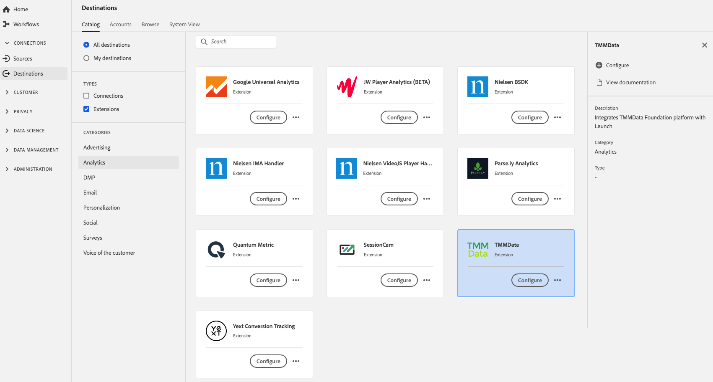

# [!DNL TMMData] extension {#tmmdata-extension}

## Overzicht {#overview}

[!DNL TMMData's] Het stichtingsplatform voor Adobe Marketing Cloud biedt marketingteams de middelen om al hun kritieke gegevensbronnen - inclusief interne/externe en online/offline gegevens - te openen en te combineren voor een betrouwbare, uitgebreide kanaalanalyse, met geautomatiseerde campagneopstelling en rechtstreekse invoer naar Adobe en andere analytische en BI-instrumenten.

[!DNL TMMData] is een uitbreiding voor analysemogelijkheden in Adobe Experience Platform. Voor meer informatie over de uitbreidingsfunctionaliteit, zie de uitbreidingspagina op [Adobe Uitwisseling](hhttps://exchange.adobe.com/experiencecloud.details.100148.tmmdata-foundation-platform.html).

Dit doel is een tagextensie. Zie [tagextensies overzicht](../launch-extensions/overview.md) voor meer informatie over de werking van labelextensies in Platform.

## Vereisten {#prerequisites}

Deze extensie is beschikbaar in de catalogus [!DNL Destinations] voor alle klanten die Platform hebben aangeschaft.

Als u deze extensie wilt gebruiken, hebt u toegang tot tags in Adobe Experience Platform nodig. Tags die aan Adobe Experience Cloud-klanten worden aangeboden als een inbegrepen, waardetoevoegend element. Neem contact op met de systeembeheerder van uw organisatie om toegang tot tags te krijgen en vraag hen om u de **[!UICONTROL manage_properties]** toestemming te geven zodat u extensies kunt installeren. en vraag ze om u de **[!UICONTROL manage_properties]** toestemming te verlenen zodat u uitbreidingen kunt installeren.

## Extensie installeren {#install-extension}

De extensie [!DNL TMMData] installeren:

Ga in [Platform interface](http://platform.adobe.com/) naar **[!UICONTROL Destinations]** > **[!UICONTROL Catalog]**.

Selecteer de extensie in de catalogus of gebruik de zoekbalk.

Klik op de bestemming om deze te markeren en selecteer **[!UICONTROL Configure]** in de rechtertrack. Als het **[!UICONTROL Configure]** besturingselement grijs is, ontbreekt u de **[!UICONTROL manage_properties]** toestemming. Zie [Eerste vereisten](#prerequisites).

Selecteer de eigenschap waarin u de extensie wilt installeren. U kunt ook een nieuwe eigenschap maken. Een bezit is een inzameling van regels, gegevenselementen, gevormde uitbreidingen, milieu&#39;s, en bibliotheken. Meer informatie over eigenschappen vindt u in de sectie [Eigenschappen op de pagina](../../../tags/ui/administration/companies-and-properties.md#properties-page) in de tagdocumentatie.

Het werkschema begeleidt u door de stappen om de installatie te voltooien.

Voor informatie over de opties van de uitbreidingsconfiguratie en installatiesteun, zie de [TMMData pagina op de Uitwisseling van Adobe](https://exchange.adobe.com/experiencecloud.details.100148.tmmdata-foundation-platform.html).

U kunt de extensie ook rechtstreeks installeren in de gebruikersinterface [Gegevensverzameling](https://experience.adobe.com/#/data-collection/). Zie de sectie over [het toevoegen van een nieuwe extensie](../../../tags/ui/managing-resources/extensions/overview.md#add-a-new-extension) in de tagdocumentatie voor meer informatie.

## De extensie gebruiken {#how-to-use}

Nadat u de extensie hebt geïnstalleerd, kunt u regels instellen.

U kunt regels instellen voor geïnstalleerde extensies, zodat gebeurtenisgegevens alleen in bepaalde situaties naar de extensiebestemming worden verzonden. Raadpleeg de documentatie [tags](../../../tags/ui/managing-resources/rules.md) voor meer informatie over instellingsregels voor uw extensies.

## De extensie configureren, upgraden en verwijderen {#configure-upgrade-delete}

U kunt extensies configureren, upgraden en verwijderen in de gebruikersinterface voor gegevensverzameling.

>[!TIP]
>
>Als de extensie al op een van uw eigenschappen is geïnstalleerd, wordt **[!UICONTROL Install]** voor de extensie nog steeds weergegeven in de interface van het Platform. Kies de installatieworkflow zoals beschreven in [Extensie installeren](#install-extension) om de extensie te configureren of te verwijderen.

Als u de extensie wilt bijwerken, raadpleegt u de handleiding bij het [upgradeproces van de extensie](../../../tags/ui/managing-resources/extensions/extension-upgrade.md) in de documentatie bij de codes.
