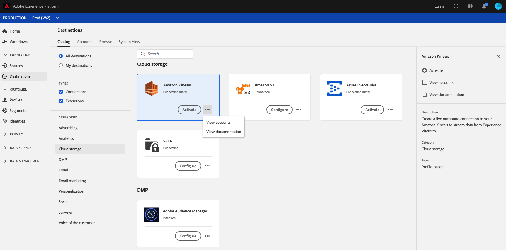

# (bèta) [!DNL Amazon Kinesis] verbinding

## Overzicht {#overview}

>[!IMPORTANT]
>
>De [!DNL Amazon Kinesis] doel in Platform is momenteel in bèta. De documentatie en de functionaliteit kunnen worden gewijzigd.

De [!DNL Kinesis Data Streams] service door [!DNL Amazon Web Services] Hiermee kunt u grote stromen gegevensrecords in real-time verzamelen en verwerken.

U kunt een uitgaande verbinding in real time aan uw creëren [!DNL Amazon Kinesis] opslag om gegevens uit Adobe Experience Platform te streamen.

* Meer informatie over [!DNL Amazon Kinesis], zie de [Amazon-documentatie](https://docs.aws.amazon.com/streams/latest/dev/introduction.html).
* Verbinding maken met [!DNL Amazon Kinesis] programmatically, zie [Zelfstudie voor Streaming doelen-API](../../api/streaming-destinations.md).
* Verbinding maken met [!DNL Amazon Kinesis] in de gebruikersinterface van het Platform raadpleegt u de onderstaande secties.



## Gebruiksscenario’s {#use-cases}

Door streamingdoelen zoals [!DNL Amazon Kinesis]kunt u bovendien gemakkelijk hoogwaardige segmentatiegebeurtenissen en de bijbehorende profielkenmerken in uw eigen systemen importeren.

Met een vooruitzicht downloadde u bijvoorbeeld een witboek dat hen kwalificeert tot een segment met een &quot;hoge neiging om te converteren&quot;. Door het segment in kaart te brengen dat het vooruitzicht binnen aan [!DNL Amazon Kinesis] doel, ontvangt u deze gebeurtenis in [!DNL Amazon Kinesis]. Daar, kunt u een doe-het-zelf benadering gebruiken en bedrijfslogica bovenop de gebeurtenis beschrijven, aangezien u denkt het beste met uw systemen van bedrijfsIT zou werken.

## Exporttype {#export-type}

**Op basis van profiel** - u exporteert alle leden van een segment samen met de gewenste schemavelden (bijvoorbeeld: e-mailadres, telefoonnummer, achternaam), zoals gekozen in het scherm met selectiekenmerken van het dialoogvenster [activeringsworkflow voor publiek](../../ui/activate-streaming-profile-destinations.md#select-attributes).

## Vereist [!DNL Amazon Kinesis] machtigingen {#required-kinesis-permission}

Om gegevens met succes te verbinden en uit te voeren aan uw [!DNL Amazon Kinesis] streams, Experience Platform heeft machtigingen nodig voor de volgende handelingen:

* `kinesis:ListStreams`
* `kinesis:PutRecord`
* `kinesis:PutRecords`

Deze machtigingen worden gerangschikt via de [!DNL Kinesis] -console en worden gecontroleerd door Platform als u de Kinesis-bestemming hebt geconfigureerd in de gebruikersinterface van het Platform.

In het onderstaande voorbeeld worden de minimale toegangsrechten weergegeven die vereist zijn om gegevens naar een [!DNL Kinesis] bestemming.

```json
{
    "Version": "2012-10-17",
    "Statement": [
        {
            "Effect": "Allow",
            "Action": [
                "kinesis:ListStreams",
                "kinesis:PutRecord",
                "kinesis:PutRecords"
            ],
            "Resource": [
                "arn:aws:kinesis:us-east-2:901341027596:stream/*"
            ]
        }
    ]
}
```

| Eigenschap | Beschrijving |
| -------- | ----------- |
| `kinesis:ListStreams` | Een handeling waarmee uw Amazon Kinesis-gegevensstromen worden vermeld. |
| `kinesis:PutRecord` | Een handeling waarmee één gegevensrecord in een Kinesis-gegevensstroom wordt geschreven. |
| `kinesis:PutRecords` | Een handeling die meerdere gegevensrecords in één aanroep naar een Kinesis-gegevensstroom schrijft. |

Voor meer informatie over het beheren van toegang voor [!DNL Kinesis] gegevensstromen, lees het volgende [[!DNL Kinesis] document](https://docs.aws.amazon.com/streams/latest/dev/controlling-access.html).

## Verbinden met de bestemming {#connect}

Als u verbinding wilt maken met dit doel, voert u de stappen uit die worden beschreven in het dialoogvenster [zelfstudie over doelconfiguratie](../../ui/connect-destination.md).

### Verbindingsparameters {#parameters}

while [opzetten](../../ui/connect-destination.md) voor deze bestemming moet u de volgende informatie opgeven:

* **[!DNL Amazon Web Services]toegangssleutel en geheime sleutel**: In [!DNL Amazon Web Services], een `access key - secret access key` paar om Platform toegang tot uw te verlenen [!DNL Amazon Kinesis] account. Meer informatie in het dialoogvenster [Amazon Web Services-documentatie](https://docs.aws.amazon.com/IAM/latest/UserGuide/id_credentials_access-keys.html).
* **regio**: Vermeld welke [!DNL Amazon Web Services] gebied waarnaar gegevens moeten worden gestreamd.
* **Naam**: Geef een naam op voor uw verbinding met [!DNL Amazon Kinesis]
* **Beschrijving**: Geef een beschrijving op voor uw verbinding met [!DNL Amazon Kinesis].
* **stream**: Geef de naam op van een bestaande gegevensstroom in uw [!DNL Amazon Kinesis] account. Platform exporteert gegevens naar deze stream.

<!--

>[!IMPORTANT]
>
>Platform needs `write` permissions on the bucket object where the export files will be delivered.

-->

## Segmenten naar dit doel activeren {#activate}

Zie [De publieksgegevens van de activering aan het stromen profiel de uitvoerbestemmingen](../../ui/activate-streaming-profile-destinations.md) voor instructies bij het activeren van publiekssegmenten aan deze bestemming.

## Exportgedrag profiel {#profile-export-behavior}

Experience Platform optimaliseert het gedrag van de profieluitvoer naar uw bestemming van Amazon Kinesis, om slechts gegevens naar uw bestemming uit te voeren wanneer de relevante updates aan een profiel na segmentkwalificatie of andere significante gebeurtenissen zijn voorgekomen. In de volgende situaties worden profielen naar uw doel geëxporteerd:

* De profielupdate werd teweeggebracht door een verandering in segmentlidmaatschap voor minstens één van de segmenten die aan de bestemming in kaart werden gebracht. Het profiel is bijvoorbeeld gekwalificeerd voor een van de segmenten die aan het doel zijn toegewezen of heeft een van de segmenten afgesloten die aan het doel zijn toegewezen.
* De profielupdate is geactiveerd door een wijziging in de [identiteitsbewijs](/help/xdm/field-groups/profile/identitymap.md). Een profiel dat bijvoorbeeld al was gekwalificeerd voor een van de segmenten die aan de bestemming zijn toegewezen, is toegevoegd aan een nieuwe identiteit in het kenmerk Naamplaatje.
* De profielupdate werd geactiveerd door een wijziging in kenmerken voor ten minste een van de kenmerken die aan de bestemming zijn toegewezen. Een van de kenmerken die in de toewijzingsstap aan het doel is toegewezen, wordt bijvoorbeeld aan een profiel toegevoegd.

In alle hierboven beschreven gevallen worden alleen de profielen waarin relevante updates zijn opgetreden, naar uw bestemming geëxporteerd. Bijvoorbeeld, als een segment dat aan de bestemmingsstroom in kaart wordt gebracht honderd leden heeft, en vijf nieuwe profielen voor het segment kwalificeren, is de uitvoer naar uw bestemming incrementeel en omvat slechts de vijf nieuwe profielen.

Alle toegewezen kenmerken worden geëxporteerd voor een profiel, ongeacht de locatie van de wijzigingen. In het voorbeeld hierboven worden alle toegewezen kenmerken voor deze vijf nieuwe profielen geëxporteerd, zelfs als de kenmerken zelf niet zijn gewijzigd.

## Geëxporteerde gegevens {#exported-data}

Uw geëxporteerde [!DNL Experience Platform] gegevenslagen in [!DNL Amazon Kinesis] in JSON-indeling. De gebeurtenis hieronder bevat bijvoorbeeld het kenmerk E-mailadresprofiel van een publiek dat voor een bepaald segment is gekwalificeerd en een ander segment heeft verlaten. De identiteiten voor dit vooruitzicht zijn ECID en e-mail.

```json
{
  "person": {
    "email": "yourstruly@adobe.com"
  },
  "segmentMembership": {
    "ups": {
      "7841ba61-23c1-4bb3-a495-00d3g5fe1e93": {
        "lastQualificationTime": "2020-05-25T21:24:39Z",
        "status": "exited"
      },
      "59bd2fkd-3c48-4b18-bf56-4f5c5e6967ae": {
        "lastQualificationTime": "2020-05-25T23:37:33Z",
        "status": "existing"
      }
    }
  },
  "identityMap": {
    "ecid": [
      {
        "id": "14575006536349286404619648085736425115"
      },
      {
        "id": "66478888669296734530114754794777368480"
      }
    ],
    "email_lc_sha256": [
      {
        "id": "655332b5fa2aea4498bf7a290cff017cb4"
      },
      {
        "id": "66baf76ef9de8b42df8903f00e0e3dc0b7"
      }
    ]
  }
}
```


>[!MORELIKETHIS]
>
>* [Verbinding maken met Amazon Kinesis en gegevens activeren met de Flow Service API](../../api/streaming-destinations.md)
>* [Azure Event Hubs-bestemming](./azure-event-hubs.md)
>* [Doeltypen en -categorieën](../../destination-types.md)

