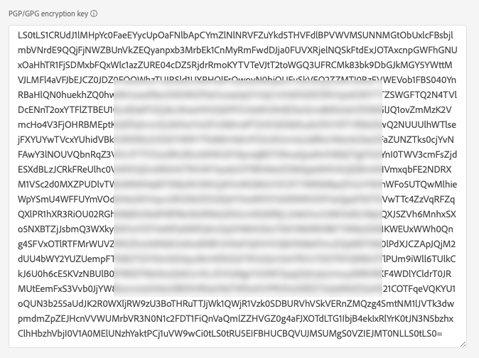

# [!DNL Azure Blob] verbinding

## Overzicht {#overview}

[!DNL Azure Blob] (hierna [!DNL Blob]) is Microsoft-oplossing voor objectopslag voor de cloud. Deze zelfstudie bevat stappen voor het maken van een [!DNL Blob] bestemming die het [!DNL Platform] gebruikersinterface.

## Aan de slag

Deze zelfstudie vereist een goed begrip van de volgende onderdelen van Adobe Experience Platform:

* [[!DNL Experience Data Model (XDM)] Systeem](../../../xdm/home.md): Het gestandaardiseerde kader waardoor het Experience Platform gegevens van de klantenervaring organiseert.
   * [Basisbeginselen van de schemacompositie](../../../xdm/schema/composition.md): Leer over de basisbouwstenen van schema&#39;s XDM, met inbegrip van zeer belangrijke principes en beste praktijken in schemacompositie.
   * [Zelfstudie Schema Editor](../../../xdm/tutorials/create-schema-ui.md): Leer hoe te om douaneschema&#39;s tot stand te brengen gebruikend de Redacteur UI van het Schema.
* [[!DNL Real-time Customer Profile]](../../../profile/home.md): Verstrekt een verenigd, real-time consumentenprofiel dat op bijeengevoegde gegevens van veelvoudige bronnen wordt gebaseerd.

Als u al een geldige [!DNL Blob] doel, kunt u de rest van dit document overslaan en doorgaan naar de zelfstudie op [segmenten activeren op uw doel](../../ui/activate-batch-profile-destinations.md).

## Type en frequentie exporteren {#export-type-frequency}

Raadpleeg de onderstaande tabel voor informatie over het exporttype en de exportfrequentie van de bestemming.

| Item | Type | Notities |
---------|----------|---------|
| Exporttype | **[!UICONTROL Profile-based]** | U exporteert alle leden van een segment samen met de gewenste schemavelden (bijvoorbeeld: e-mailadres, telefoonnummer, achternaam), zoals gekozen in het scherm met de kenmerken van het geselecteerde profiel [doelactiveringsworkflow](../../ui/activate-batch-profile-destinations.md#select-attributes). |
| Uitvoerfrequentie | **[!UICONTROL Batch]** | De bestemmingen van de partij voeren dossiers naar stroomafwaartse platforms in toename van drie, zes, acht, twaalf, of 24 uren uit. Meer informatie over [batchbestandsgebaseerde doelen](/help/destinations/destination-types.md#file-based). |

{style=&quot;table-layout:auto&quot;}

## Ondersteunde bestandsindelingen {#file-formats}

[!DNL Experience Platform] ondersteunt de volgende bestandsindeling waarnaar geëxporteerd moet worden [!DNL Azure Blob]:

* Door komma&#39;s gescheiden waarden (CSV): De ondersteuning voor geëxporteerde gegevensbestanden is momenteel beperkt tot door komma&#39;s gescheiden waarden.

## Verbinden met de bestemming {#connect}

>[!IMPORTANT]
> 
>Om met de bestemming te verbinden, hebt u nodig **[!UICONTROL Manage Destinations]** [toegangsbeheermachtiging](/help/access-control/home.md#permissions). Lees de [toegangsbeheeroverzicht](/help/access-control/ui/overview.md) of neem contact op met de productbeheerder om de vereiste machtigingen te verkrijgen.

Als u verbinding wilt maken met dit doel, voert u de stappen uit die worden beschreven in het dialoogvenster [zelfstudie over doelconfiguratie](../../ui/connect-destination.md). Vul in de workflow voor doelconfiguratie de velden in die in de twee onderstaande secties worden vermeld.

### Verifiëren voor bestemming {#authenticate}

>[!CONTEXTUALHELP]
>id="platform_destinations_connect_blob_rsa"
>title="Openbare RSA-sleutel"
>abstract="U kunt desgewenst een openbare sleutel met RSA-indeling toevoegen om versleuteling toe te voegen aan uw geëxporteerde bestanden. Uw openbare sleutel moet worden geschreven als een [!DNL Base64-encoded] tekenreeks. Bekijk een voorbeeld van een correct opgemaakte sleutel in de documentatiekoppeling hieronder."

Als u zich wilt verifiëren bij de bestemming, vult u de vereiste velden in en selecteert u **[!UICONTROL Connect to destination]**.

* **[!UICONTROL Connection string]**: de verbindingstekenreeks is vereist voor toegang tot gegevens in uw blob-opslag. De [!DNL Blob] patroon verbindingstekenreeks begint met: `DefaultEndpointsProtocol=https;AccountName={ACCOUNT_NAME};AccountKey={ACCOUNT_KEY}`.
   * Voor meer informatie over het configureren van uw [!DNL Blob] verbindingstekenreeks, zie [Een verbindingstekenreeks configureren voor een Azure-opslagaccount](https://docs.microsoft.com/en-us/azure/storage/common/storage-configure-connection-string#configure-a-connection-string-for-an-azure-storage-account) in de documentatie van Microsoft.
* **[!UICONTROL Encryption key]**: U kunt desgewenst een openbare sleutel met RSA-indeling toevoegen om versleuteling toe te voegen aan uw geëxporteerde bestanden. Uw openbare sleutel moet worden geschreven als een [!DNL Base64-encoded] tekenreeks. Bekijk een voorbeeld van een correct geformatteerde, base64-gecodeerde sleutel in de documentatieverbinding hieronder. Het middelste deel wordt verkort om kort te zijn.

### Doelgegevens invullen {#destination-details}

Als u details voor de bestemming wilt configureren, vult u de vereiste en optionele velden hieronder in. Een sterretje naast een veld in de gebruikersinterface geeft aan dat het veld verplicht is.

* **[!UICONTROL Name]**: Voer een naam in die u helpt deze bestemming te identificeren.
* **[!UICONTROL Description]**: Voer een beschrijving van deze bestemming in.
* **[!UICONTROL Folder path]**: Voer het pad in naar de doelmap waarin de geëxporteerde bestanden worden opgeslagen.
* **[!UICONTROL Container]**: Voer de naam in van de [!DNL Azure Blob Storage] container die door deze bestemming moet worden gebruikt.

### Waarschuwingen inschakelen {#enable-alerts}

U kunt alarm toelaten om berichten over de status van dataflow aan uw bestemming te ontvangen. Selecteer een waarschuwing in de lijst om u te abonneren op meldingen over de status van uw gegevensstroom. Voor meer informatie over waarschuwingen raadpleegt u de handleiding over [het abonneren aan bestemmingen alarm gebruikend UI](../../ui/alerts.md).

Wanneer u klaar bent met het opgeven van details voor uw doelverbinding, selecteert u **[!UICONTROL Next]**.

## Segmenten naar dit doel activeren {#activate}

>[!IMPORTANT]
> 
>Als u gegevens wilt activeren, hebt u de opdracht **[!UICONTROL Manage Destinations]**, **[!UICONTROL Activate Destinations]**, **[!UICONTROL View Profiles]**, en **[!UICONTROL View Segments]** [toegangsbeheermachtigingen](/help/access-control/home.md#permissions). Lees de [toegangsbeheeroverzicht](/help/access-control/ui/overview.md) of neem contact op met de productbeheerder om de vereiste machtigingen te verkrijgen.

Zie [Gebruikersgegevens activeren om exportdoelen voor batchprofielen te maken](../../ui/activate-batch-profile-destinations.md) voor instructies bij het activeren van publiekssegmenten aan deze bestemming.

## Geëxporteerde gegevens {#exported-data}

Voor [!DNL Azure Blob Storage] bestemmingen, [!DNL Platform] maakt een `.csv` in de opslaglocatie die u hebt opgegeven. Voor meer informatie over de bestanden raadpleegt u [Gebruikersgegevens activeren om exportdoelen voor batchprofielen te maken](../../ui/activate-batch-profile-destinations.md) in de zelfstudie voor segmentactivering.