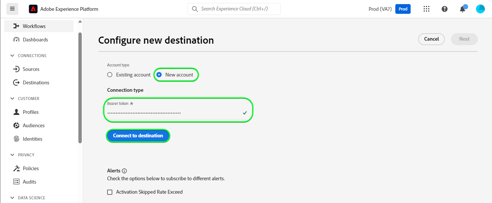
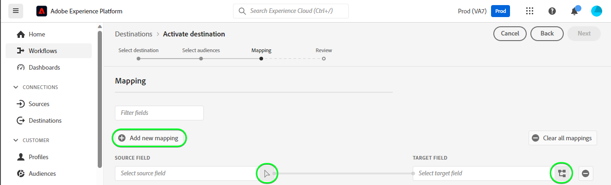
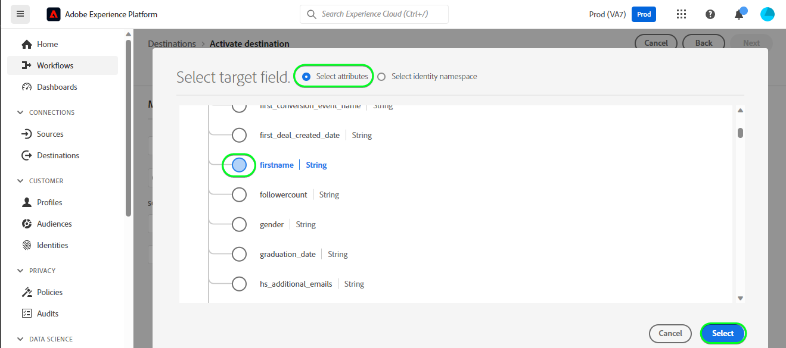

# [!DNL HubSpot] verbinding

[[!DNL HubSpot]](https://www.hubspot.com) is een platform van CRM met alle software, integratie, en middelen u marketing, verkoop, inhoudsbeheer, en de klantendienst moet verbinden. Het staat u toe om uw gegevens, teams, en klanten op één platform van CRM te verbinden.

Dit [!DNL Adobe Experience Platform] [doel](/help/destinations/home.md) gebruikt de [[!DNL HubSpot] Contactpersonen-API](https://developers.hubspot.com/docs/api/crm/contacts), om contacten binnen bij te werken [!DNL HubSpot] van een bestaand publiek van het Experience Platform na activering.

Instructies voor verificatie aan uw [!DNL HubSpot] de instantie is verder onderaan, in de [Verifiëren voor bestemming](#authenticate) sectie.

## Gebruiksscenario’s {#use-cases}

Om u te helpen beter begrijpen hoe en wanneer u het [!DNL HubSpot] doel, hier is een geval van steekproefgebruik dat de klanten van Adobe Experience Platform kunnen oplossen door deze bestemming te gebruiken.

[!DNL HubSpot] de contacten slaan informatie over de individuen op die met uw zaken in wisselwerking staan. Uw team gebruikt de contacten die in bestaan [!DNL HubSpot] om het publiek in de Experience Platform op te bouwen. Na verzending van deze soorten publiek naar [!DNL HubSpot], wordt hun informatie bijgewerkt en wordt elk contact toegewezen een bezit met zijn waarde als publieksnaam die wijst op welk publiek het contact tot behoort.

## Vereisten {#prerequisites}

Raadpleeg de onderstaande secties voor alle voorwaarden die u in Experience Platform moet instellen en [!DNL HubSpot] en voor informatie die u moet verzamelen voordat u met de [!DNL HubSpot] bestemming.

### Voorwaarden voor Experience Platforms {#prerequisites-in-experience-platform}

Voordat u gegevens activeert naar de [!DNL HubSpot] doel, u moet een [schema](/help/xdm/schema/composition.md), [gegevensset](https://experienceleague.adobe.com/docs/platform-learn/tutorials/data-ingestion/create-datasets-and-ingest-data.html), en [publiek](https://experienceleague.adobe.com/docs/platform-learn/tutorials/audiences/create-audiences.html) gemaakt in [!DNL Experience Platform].

Raadpleeg de documentatie bij het Experience Platform voor [Publiek Lidmaatschap Details schema groep](/help/xdm/field-groups/profile/segmentation.md) als u hulp over publieksstatus nodig hebt.

### Vereisten voor de [!DNL HubSpot] doel {#prerequisites-destination}

Houd rekening met de volgende voorwaarden om gegevens van Platform naar uw [!DNL HubSpot] account:

#### U moet een [!DNL HubSpot] account {#prerequisites-account}

Als u gegevens van Platform naar uw wilt exporteren [!DNL Hubspot] account die u nodig hebt [!DNL HubSpot] account. Als u er nog geen hebt, gaat u naar [Opstelling uw rekening HubSpot](https://knowledge.hubspot.com/get-started/set-up-your-account) pagina en volg de richtlijnen om uw account te registreren en te maken.

#### De [!DNL HubSpot] toegangstoken voor persoonlijke app {#gather-credentials}

U hebt uw [!DNL HubSpot] `Access token` de [!DNL HubSpot] doel om API vraag door uw te maken [!DNL HubSpot] persoonlijke app in uw [!DNL HubSpot] account. De `Access token` dient als `Bearer token` wanneer u [authenticeer de bestemming](#authenticate).

Als u geen persoonlijke app hebt, volgt u de documentatie op [Een persoonlijke app maken in [!DNL HubSpot]](https://developers.hubspot.com/docs/api/private-apps).

>[!IMPORTANT]
>
> Aan de persoonlijke app moeten de onderstaande bereiken worden toegewezen:
> `crm.objects.contacts.write`, `crm.objects.contacts.read`
> `crm.schemas.contacts.write`, `crm.schemas.contacts.read`

| Credentials | Beschrijving | Voorbeeld |
| --- | --- | --- |
| `Bearer token` | De `Access token` van uw [!DNL HubSpot] persoonlijke app.  Om uw [!DNL HubSpot] `Access token` volgen [!DNL HubSpot] documentatie aan [API-aanroepen maken met het toegangstoken van uw app](https://developers.hubspot.com/docs/api/private-apps#make-api-calls-with-your-app-s-access-token). | `pat-na1-11223344-abcde-12345-9876-1234a1b23456` |

## Guardrails {#guardrails}

[!DNL HubSpot] persoonlijke apps zijn onderworpen aan [Snelheidslimieten](https://developers.hubspot.com/docs/api/usage-details). Het aantal aanroepen dat uw persoonlijke app kan uitvoeren, is gebaseerd op uw [!DNL HubSpot] -accountabonnement en of u de API-invoegtoepassing hebt aangeschaft. Verwijs ook naar [Overige limieten](https://developers.hubspot.com/docs/api/usage-details#other-limits).

## Ondersteunde identiteiten {#supported-identities}

[!DNL HubSpot] ondersteunt het bijwerken van de identiteiten die in de onderstaande tabel worden beschreven. Meer informatie over [identiteiten](/help/identity-service/features/namespaces.md).

| Doelidentiteit | Voorbeeld | Beschrijving | Overwegingen |
|---|---|---|---|
| `email` | `test@test.com` | E-mailadres van de contactpersoon. | Verplicht |

## Ondersteunde doelgroepen {#supported-audiences}

In deze sectie worden alle soorten publiek beschreven die u naar deze bestemming kunt exporteren.

Deze bestemming steunt de activering van alle publiek dat door het Experience Platform wordt geproduceerd [Segmenteringsservice](../../../segmentation/home.md).

Deze bestemming ondersteunt ook de activering van het publiek dat in de onderstaande tabel wordt beschreven.

| Type publiek | Beschrijving |
|---------|----------|
| Aangepaste uploads | Soorten publiek [geïmporteerd](../../../segmentation/ui/audience-portal.md#import-audience) in Experience Platform van CSV-bestanden. |

{style="table-layout:auto"}

## Type en frequentie exporteren {#export-type-frequency}

Raadpleeg de onderstaande tabel voor informatie over het exporttype en de exportfrequentie van de bestemming.

| Item | Type | Notities |
---------|----------|---------|
| Exporttype | **[!UICONTROL Profile-based]** | <ul><li>U exporteert alle leden van een publiek samen met de gewenste schemavelden *(bijvoorbeeld: e-mailadres, telefoonnummer, achternaam)*, op basis van uw veldtoewijzing.</li><li> Bovendien wordt een nieuwe eigenschap gemaakt in [!DNL HubSpot] Als u de publieksnaam en de waarde ervan gebruikt, wordt de bijbehorende publieksstatus van Platform gebruikt voor elk geselecteerd publiek.</li></ul> |
| Exportfrequentie | **[!UICONTROL Streaming]** | <ul><li>Streaming doelen zijn &quot;altijd aan&quot; API-verbindingen. Zodra een profiel in Experience Platform wordt bijgewerkt dat op publieksevaluatie wordt gebaseerd, verzendt de schakelaar de update stroomafwaarts naar het bestemmingsplatform. Meer informatie over [streaming doelen](/help/destinations/destination-types.md#streaming-destinations).</li></ul> |

{style="table-layout:auto"}

## Verbinden met de bestemming {#connect}

>[!IMPORTANT]
>
>Om met de bestemming te verbinden, hebt u nodig **[!UICONTROL View Destinations]** en **[!UICONTROL Manage Destinations]** [toegangsbeheermachtigingen](/help/access-control/home.md#permissions). Lees de [toegangsbeheeroverzicht](/help/access-control/ui/overview.md) of neem contact op met de productbeheerder om de vereiste machtigingen te verkrijgen.

Als u verbinding wilt maken met dit doel, voert u de stappen uit die in het dialoogvenster [zelfstudie over doelconfiguratie](../../ui/connect-destination.md). In vormen bestemmingswerkschema, vul de gebieden in die in de twee hieronder secties worden vermeld.

Within **[!UICONTROL Destinations]** > **[!UICONTROL Catalog]** zoeken naar [!DNL HubSpot]. U kunt de locatie ook onder de **[!UICONTROL CRM]** categorie.

### Verifiëren voor bestemming {#authenticate}

Vul de vereiste velden hieronder in. Zie de [De [!DNL HubSpot] toegangstoken voor persoonlijke app](#gather-credentials) voor eventuele richtsnoeren.
* **[!UICONTROL Bearer token]**: Het toegangstoken voor uw [!DNL HubSpot] persoonlijke app.

Om voor authentiek te verklaren aan de bestemming, uitgezocht **[!UICONTROL Connect to destination]**.

Als de verstrekte gegevens geldig zijn, geeft de interface een **[!UICONTROL Connected]** status met een groen vinkje. Vervolgens kunt u verdergaan met de volgende stap.

### Doelgegevens invullen {#destination-details}

Als u details voor de bestemming wilt configureren, vult u de vereiste en optionele velden hieronder in. Een sterretje naast een veld in de gebruikersinterface geeft aan dat het veld verplicht is.

* **[!UICONTROL Name]**: Een naam waarmee u dit doel in de toekomst wilt herkennen.
* **[!UICONTROL Description]**: Een beschrijving die u zal helpen deze bestemming in de toekomst identificeren.

### Waarschuwingen inschakelen {#enable-alerts}

U kunt alarm toelaten om berichten over de status van dataflow aan uw bestemming te ontvangen. Selecteer een waarschuwing in de lijst om u te abonneren op meldingen over de status van uw gegevensstroom. Zie de handleiding voor meer informatie over waarschuwingen [abonneren op bestemmingen die het alarm gebruiken UI](../../ui/alerts.md).

Wanneer u klaar bent met het opgeven van details voor uw doelverbinding, selecteert u **[!UICONTROL Next]**.

## Soorten publiek naar dit doel activeren {#activate}

>[!IMPORTANT]
>
>Als u gegevens wilt activeren, hebt u de opdracht **[!UICONTROL View Destinations]**, **[!UICONTROL Activate Destinations]**, **[!UICONTROL View Profiles]**, en **[!UICONTROL View Segments]** [toegangsbeheermachtigingen](/help/access-control/home.md#permissions). Lees de [toegangsbeheeroverzicht](/help/access-control/ui/overview.md) of neem contact op met de productbeheerder om de vereiste machtigingen te verkrijgen.

Lezen [Profielen en doelgroepen activeren voor het streamen van doelgroepen voor het exporteren van bestanden](/help/destinations/ui/activate-segment-streaming-destinations.md) voor instructies voor het activeren van het publiek naar deze bestemming.

### Kenmerken en identiteiten toewijzen {#map}

Als u uw publieksgegevens correct vanuit Adobe Experience Platform naar de [!DNL HubSpot] doel, moet u door de stap van de gebiedstoewijzing gaan. Toewijzing bestaat uit het maken van een koppeling tussen de schemavelden van uw Experience Data Model (XDM) in uw Platform-account en de bijbehorende equivalenten van de doelbestemming.

Uw XDM-velden op de juiste wijze toewijzen aan de [!DNL HubSpot] doelvelden, voert u de volgende stappen uit:

#### Toewijzen aan de `Email` identiteit

De `Email` identiteit is een verplichte toewijzing voor deze bestemming. Voer de onderstaande stappen uit om deze toe te wijzen:
1. In de **[!UICONTROL Mapping]** stap, selecteren **[!UICONTROL Add new mapping]**. U ziet nu een nieuwe toewijzingsrij op het scherm.
   
1. In de **[!UICONTROL Select source field]** venster, kiest u de **[!UICONTROL Select identity namespace]** en selecteer een identiteit.
   
1. In de **[!UICONTROL Select target field]** venster, kiest u de **[!UICONTROL Select attributes]** en selecteert u `email`.
   

| Source-veld | Doelveld | Verplicht |
| --- | --- | --- |
| `IdentityMap: Email` | `Identity: email` | Ja |

Hieronder ziet u een voorbeeld met de identiteitstoewijzing:

#### Toewijzing **optioneel** attributes

Andere kenmerken toevoegen die u wilt bijwerken tussen het XDM-profielschema en uw [!DNL HubSpot] De account herhaalt de onderstaande stappen:
1. In de **[!UICONTROL Mapping]** stap, selecteren **[!UICONTROL Add new mapping]**. U ziet nu een nieuwe toewijzingsrij op het scherm.
   
1. In de **[!UICONTROL Select source field]** venster, kiest u de **[!UICONTROL Select attributes]** en selecteer het XDM-kenmerk.
   
1. In de **[!UICONTROL Select target field]** venster, kiest u **[!UICONTROL Select attributes]** en selecteer een van de kenmerken die automatisch in uw lijst worden opgenomen [!DNL HubSpot] account. Het doel gebruikt de [[!DNL HubSpot] Eigenschappen](https://developers.hubspot.com/docs/api/crm/properties) API om deze informatie op te halen. Beide [!DNL HubSpot] [standaardeigenschappen](https://knowledge.hubspot.com/contacts/hubspots-default-contact-properties) en eventuele aangepaste eigenschappen worden opgehaald voor selectie als doelvelden.
   

Enkele beschikbare toewijzingen tussen uw XDM-profielschema en [!DNL Hubspot] worden hieronder weergegeven:

| Source-veld | Doelveld |
| --- | --- |
| `xdm: person.name.firstName` | `Attribute: firstname` |
| `xdm: person.name.lastName` | `Attribute: lastname` |
| `xdm: workAddress.street1` | `Attribute: address` |
| `xdm: workAddress.city` | `Attribute: city` |
| `xdm: workAddress.country` | `Attribute: country` |

Hieronder ziet u een voorbeeld waarin deze kenmerktoewijzingen worden gebruikt:

Wanneer u klaar bent met het opgeven van de toewijzingen voor uw doelverbinding, selecteert u **[!UICONTROL Next]**.

## Gegevens exporteren valideren {#exported-data}

Volg onderstaande stappen om te controleren of u de bestemming correct hebt ingesteld:

1. Aanmelden bij de [!DNL HubSpot] website, navigeer vervolgens naar de **[!UICONTROL Contacts]** pagina om de status van het publiek te controleren. Deze lijst kan worden gevormd om kolommen voor de douaneeigenschappen te tonen die met de publieksnaam met hun waarde worden gecreeerd de publieksstatus zijn.
   

1. U kunt ook naar beneden boren in een individu **[!UICONTROL Person]** en navigeer naar de eigenschappen die de publieksnaam en de publieksstatus weergeven.
   

## Gegevensgebruik en -beheer {#data-usage-governance}

Alles [!DNL Adobe Experience Platform] de bestemmingen zijn volgzaam met het beleid van het gegevensgebruik wanneer het behandelen van uw gegevens. Voor gedetailleerde informatie over hoe [!DNL Adobe Experience Platform] handhaaft gegevensbeheer, zie [Overzicht van gegevensbeheer](/help/data-governance/home.md).

## Aanvullende bronnen {#additional-resources}

Aanvullende nuttige informatie uit de [!DNL HubSpot] de documentatie is hieronder:
* [Verificatiemethoden op HubSpot](https://developers.hubspot.com/docs/api/intro-to-auth)
* [!DNL HubSpot] API-verwijzingen voor de [Contactpersonen](https://developers.hubspot.com/docs/api/crm/contacts) en [Eigenschappen](https://developers.hubspot.com/docs/api/crm/properties) API&#39;s.

### Changelog

Deze sectie vangt de functionaliteit en de significante documentatieupdates aan deze bestemmingsschakelaar worden aangebracht die.

+++ Wijzigingen weergeven

| Releasedatum | Type bijwerken | Beschrijving |
|---|---|---|
| September 2023 | Eerste release | Oorspronkelijke doelversie en documentatie publiceren. |

{style="table-layout:auto"}

+++
