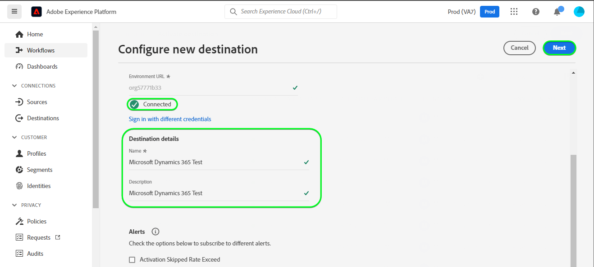
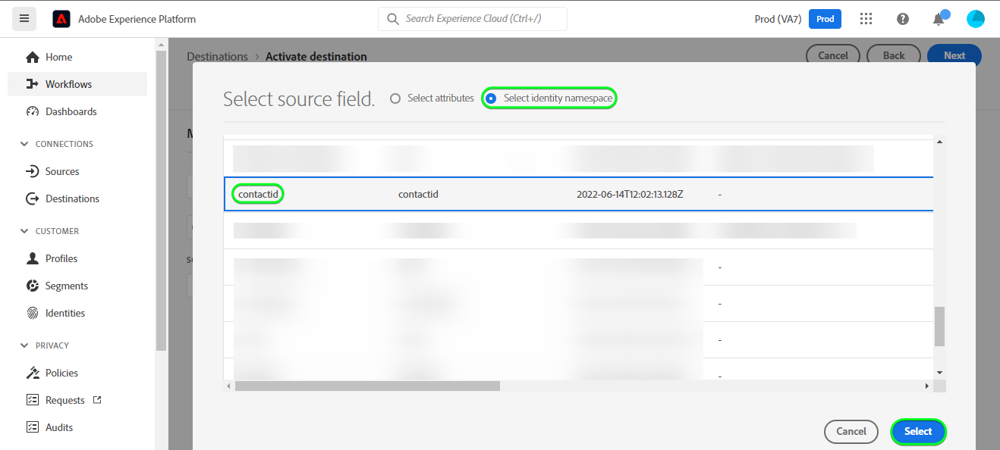
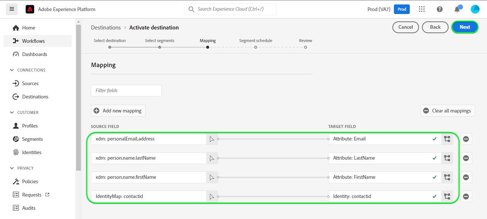

# [!DNL Microsoft Dynamics 365] verbinding

## Overzicht {#overview}

[[!DNL Microsoft Dynamics 365]](https://dynamics.microsoft.com/en-us/) is een bedrijfstoepassingsplatform in de cloud dat zowel Enterprise Resource Planning (ERP) als Customer Relationship Management (CRM) combineert met productiviteitstoepassingen en AI-tools, om end-to-end soepelere en meer gecontroleerde bewerkingen, een beter groeipotentieel en lagere kosten te realiseren.

Dit [!DNL Adobe Experience Platform] [doel](/help/destinations/home.md) gebruikt de [[!DNL Contact Entity Reference API]](https://docs.microsoft.com/en-us/dynamics365/customerengagement/on-premises/developer/entities/contact?view=op-9-1), waarmee u identiteiten binnen een segment kunt bijwerken naar [!DNL Dynamics 365].

[!DNL Dynamics 365] gebruikt OAuth 2 met de Vergunning van de Vergunning als authentificatiemechanisme om met het te communiceren [!DNL Contact Entity Reference API]. Instructies voor verificatie aan uw [!DNL Dynamics 365] de instantie is verder onderaan, in de [Verifiëren voor bestemming](#authenticate) sectie.

## Gebruiksscenario’s {#use-cases}

Als markeerteken kunt u uw gebruikers een persoonlijke ervaring bieden op basis van kenmerken uit hun Adobe Experience Platform-profielen. U kunt segmenten maken van uw offlinegegevens en deze segmenten verzenden naar [!DNL Dynamics 365], om in de feeds van de gebruikers weer te geven zodra de segmenten en profielen in Adobe Experience Platform zijn bijgewerkt.

## Vereisten {#prerequisites}

### Voorwaarden voor Experience Platforms {#prerequisites-in-experience-platform}

Voordat u gegevens activeert naar de [!DNL Dynamics 365] doel, u moet een [schema](/help/xdm/schema/composition.md), [gegevensset](https://experienceleague.adobe.com/docs/platform-learn/tutorials/data-ingestion/create-datasets-and-ingest-data.html?lang=en), en [segmenten](https://experienceleague.adobe.com/docs/platform-learn/tutorials/segments/create-segments.html?lang=en) gemaakt in [!DNL Experience Platform].

Raadpleeg de documentatie bij Adobe voor [Segment Membership Details schema groep](/help/xdm/field-groups/profile/segmentation.md) als u begeleiding op segmentstatussen nodig hebt.

### [!DNL Microsoft Dynamics 365] voorwaarden {#prerequisites-destination}

Houd rekening met de volgende voorwaarden in [!DNL Dynamics 365]om gegevens van Platform naar uw [!DNL Dynamics 365] account:

#### U hebt een [!DNL Microsoft Dynamics 365] account {#prerequisites-account}

Ga naar de [!DNL Dynamics 365] [proefversie](https://dynamics.microsoft.com/en-us/dynamics-365-free-trial/) pagina om te registreren en een account te maken, als u er nog geen hebt.

#### Veld maken binnen [!DNL Dynamics 365] {#prerequisites-custom-field}

Het aangepaste tekstveld maken `Simple` met veldgegevenstype als `Single Line of Text` welk Experience Platform wordt gebruikt om de segmentstatus bij te werken binnen [!DNL Dynamics 365].
Zie de [!DNL Dynamics 365] documentatie aan [een veld maken (kenmerk)](https://docs.microsoft.com/en-us/dynamics365/customerengagement/on-premises/customize/create-edit-fields?view=op-9-1) als u aanvullende instructies nodig hebt.

Een voorbeeldinstelling binnen [!DNL Dynamics 365] wordt hieronder weergegeven:

#### Registreer een toepassing en toepassingsgebruiker binnen Azure Actieve Folder {#prerequisites-app-user}

Inschakelen [!DNL Dynamics 365] om tot middelen toegang te hebben zult u met uw moeten login [!DNL Azure Account] tot [[!DNL Azure Active Directory]](https://docs.microsoft.com/en-us/azure/active-directory/develop/howto-create-service-principal-portal#register-an-application-with-azure-ad-and-create-a-service-principal) en maak het volgende:
* An [!DNL Azure Active Directory] toepassing
* A Service principal
* Een toepassingsgeheim

U moet ook [een toepassingsgebruiker maken](https://docs.microsoft.com/en-us/power-platform/admin/manage-application-users#create-an-application-user) in [!DNL Azure Active Directory] en koppelt u deze aan de nieuwe toepassing.

#### Gather [!DNL Dynamics 365] geloofsbrieven {#gather-credentials}

Noteer de onderstaande items voordat u deze verifieert voor de [!DNL Dynamics 365] CRM-bestemming:

| Credentials | Beschrijving | Voorbeeld |
| --- | --- | --- |
| `Client ID` | De [!DNL Dynamics 365] Client-id voor uw [!DNL Azure Active Directory] toepassing. Zie de [[!DNL Dynamics 365] documentatie](https://docs.microsoft.com/en-us/azure/active-directory/develop/howto-create-service-principal-portal#get-tenant-and-app-id-values-for-signing-in) ter begeleiding. | `ababbaba-abab-baba-acac-acacacacacac` |
| `Client Secret` | De [!DNL Dynamics 365] Clientgeheim voor uw [!DNL Azure Active Directory] toepassing. U gebruikt optie nr. 2 binnen [[!DNL Dynamics 365] documentatie](https://docs.microsoft.com/en-us/azure/active-directory/develop/howto-create-service-principal-portal#authentication-two-options). | `abcde~abcdefghijklmnopqrstuvwxyz12345678` ter begeleiding. |
| `Tenant ID` | De [!DNL Dynamics 365] Tenant ID voor uw [!DNL Azure Active Directory] toepassing. Zie de [[!DNL Dynamics 365] documentatie](https://docs.microsoft.com/en-us/azure/active-directory/develop/howto-create-service-principal-portal#get-tenant-and-app-id-values-for-signing-in) ter begeleiding. | `1234567-aaaa-12ab-ba21-1234567890` |
| `Environment URL` | Zie de [[!DNL Dynamics 365] documentatie](https://docs.microsoft.com/en-us/dynamics365/customerengagement/on-premises/developer/org-service/discover-url-organization-organization-service?view=op-9-1) ter begeleiding. | Als uw [!DNL Dynamics 365] -domein is zoals hieronder aangegeven, hebt u de gemarkeerde waarde nodig.  *`org57771b33`.crm.dynamics.com* |

## Guardrails {#guardrails}

De [Beperkingen en toewijzingen van verzoeken](https://docs.microsoft.com/en-us/power-platform/admin/api-request-limits-allocations) pagina bevat de details van [!DNL Dynamics 365] API-limieten die zijn gekoppeld aan uw [!DNL Dynamics 365] licentie. U moet ervoor zorgen dat uw gegevens en lading binnen deze beperkingen zijn.

## Ondersteunde identiteiten {#supported-identities}

[!DNL Dynamics 365] ondersteunt het bijwerken van de identiteiten die in de onderstaande tabel worden beschreven. Meer informatie over [identiteiten](/help/identity-service/namespaces.md).

| Doelidentiteit | Voorbeeld | Beschrijving | Overwegingen |
|---|---|---|---|
| `contactId` | 7eb682f1-ca75-e511-80d4-00155d2a68d1 | Unieke id voor een contactpersoon. | **Verplicht**. Zie de [[!DNL Dynamics 365] documentatie](https://docs.microsoft.com/en-us/dynamics365/customerengagement/on-premises/developer/entities/contact?view=op-9-1) voor nadere bijzonderheden. |

## Type en frequentie exporteren {#export-type-frequency}

Raadpleeg de onderstaande tabel voor informatie over het exporttype en de exportfrequentie van de bestemming.

| Item | Type | Notities |
---------|----------|---------|
| Exporttype | **[!UICONTROL Profile-based]** | <ul><li>U exporteert alle leden van een segment samen met de gewenste schemavelden *(bijvoorbeeld: e-mailadres, telefoonnummer, achternaam)*, op basis van uw veldtoewijzing.</li><li> Elke segmentstatus in [!DNL Dynamics 365] wordt bijgewerkt met de corresponderende segmentstatus van het Platform, gebaseerd op de **[!UICONTROL Mapping ID]** waarde die tijdens de [segment plannen](#schedule-segment-export-example) stap.</li></ul> |
| Uitvoerfrequentie | **[!UICONTROL Streaming]** | <ul><li>Streaming doelen zijn &quot;altijd aan&quot; API-verbindingen. Zodra een profiel in Experience Platform wordt bijgewerkt dat op segmentevaluatie wordt gebaseerd, verzendt de schakelaar de update stroomafwaarts naar het bestemmingsplatform. Meer informatie over [streaming doelen](/help/destinations/destination-types.md#streaming-destinations).</li></ul> |

{style=&quot;table-layout:auto&quot;}

## Verbinden met de bestemming {#connect}

>[!IMPORTANT]
>
>Om met de bestemming te verbinden, hebt u nodig **[!UICONTROL Manage Destinations]** [toegangsbeheermachtiging](/help/access-control/home.md#permissions). Lees de [toegangsbeheeroverzicht](/help/access-control/ui/overview.md) of neem contact op met de productbeheerder om de vereiste machtigingen te verkrijgen.

Als u verbinding wilt maken met dit doel, voert u de stappen uit die worden beschreven in het dialoogvenster [zelfstudie over doelconfiguratie](../../ui/connect-destination.md). In vormen bestemmingswerkschema, vul de gebieden in die in de twee hieronder secties worden vermeld.

Within **[!UICONTROL Destinations]** > **[!UICONTROL Catalog]** zoeken naar [!DNL Dynamics 365]. U kunt de locatie ook onder de **[!UICONTROL CRM]** categorie.

### Verifiëren voor bestemming {#authenticate}

Om voor authentiek te verklaren aan de bestemming, selecteer **[!UICONTROL Connect to destination]**.

Vul de vereiste velden hieronder in. Zie de [Inloggegevens van Gather Dynamics 365](#gather-credentials) voor eventuele richtsnoeren.
* **[!UICONTROL Client ID]**: De [!DNL Dynamics 365] Client-id voor uw [!DNL Azure Active Directory] toepassing.
* **[!UICONTROL Tenant ID]**: De [!DNL Dynamics 365] Tenant ID voor uw [!DNL Azure Active Directory] toepassing.
* **[!UICONTROL Client Secret]**: De [!DNL Dynamics 365] Clientgeheim voor uw [!DNL Azure Active Directory] toepassing.
* **[!UICONTROL Environment URL]**: Uw [!DNL Dynamics 365] Omgeving-URL.

Als de verstrekte gegevens geldig zijn, geeft de interface een **[!UICONTROL Connected]** status met een groen vinkje. Vervolgens kunt u verdergaan met de volgende stap.

### Doelgegevens invullen {#destination-details}

Als u details voor de bestemming wilt configureren, vult u de vereiste en optionele velden hieronder in. Een sterretje naast een veld in de gebruikersinterface geeft aan dat het veld verplicht is.

* **[!UICONTROL Name]**: Een naam waarmee u deze bestemming in de toekomst zult erkennen.
* **[!UICONTROL Description]**: Een beschrijving die u zal helpen deze bestemming in de toekomst identificeren.

### Waarschuwingen inschakelen {#enable-alerts}

U kunt alarm toelaten om berichten over de status van dataflow aan uw bestemming te ontvangen. Selecteer een waarschuwing in de lijst om u te abonneren op meldingen over de status van uw gegevensstroom. Voor meer informatie over waarschuwingen raadpleegt u de handleiding over [het abonneren aan bestemmingen alarm gebruikend UI](../../ui/alerts.md).

Wanneer u klaar bent met het opgeven van details voor uw doelverbinding, selecteert u **[!UICONTROL Next]**.

## Segmenten naar dit doel activeren {#activate}

>[!IMPORTANT]
>
>Als u gegevens wilt activeren, hebt u de opdracht **[!UICONTROL Manage Destinations]**, **[!UICONTROL Activate Destinations]**, **[!UICONTROL View Profiles]**, en **[!UICONTROL View Segments]** [toegangsbeheermachtigingen](/help/access-control/home.md#permissions). Lees de [toegangsbeheeroverzicht](/help/access-control/ui/overview.md) of neem contact op met de productbeheerder om de vereiste machtigingen te verkrijgen.

Lezen [Profielen en segmenten activeren voor streaming segmentexportdoelen](/help/destinations/ui/activate-segment-streaming-destinations.md) voor instructies bij het activeren van publiekssegmenten aan deze bestemming.

### Afbeeldingsoverwegingen en voorbeeld {#mapping-considerations-example}

Als u uw publieksgegevens correct vanuit Adobe Experience Platform naar de [!DNL Dynamics 365] doel, moet u door de stap van de gebiedstoewijzing gaan. Toewijzing bestaat uit het maken van een koppeling tussen de schemavelden van uw Experience Data Model (XDM) in uw Platform-account en de bijbehorende equivalenten van de doelbestemming. Uw XDM-velden op de juiste wijze toewijzen aan de [!DNL Dynamics 365] doelvelden, voer de volgende stappen uit:

1. In de **[!UICONTROL Mapping]** stap, selecteren **[!UICONTROL Add new mapping]**. Er verschijnt een nieuwe toewijzingsrij op het scherm.
   

1. In de **[!UICONTROL Select source field]** venster, kiest u de **[!UICONTROL Select identity namespace]** categorie en selecteer `contactId`.
   

1. In de **[!UICONTROL Select target field]** Selecteer het type doelveld waaraan u het bronveld wilt toewijzen.
   * **[!UICONTROL Select identity namespace]**: Selecteer deze optie als u het bronveld wilt toewijzen aan een naamruimte in de lijst.
      

   * Voeg de volgende afbeelding toe tussen uw XDM-profielschema en uw [!DNL Dynamics 365] instantie: |XDM-profielschema|[!DNL Dynamics 365] Instantie| Verplicht| |—|—|—| |`contactId`|`contactId`| Ja |

   * **[!UICONTROL Select custom attributes]**: Selecteer deze optie om uw bronveld toe te wijzen aan een aangepast kenmerk dat u in het dialoogvenster **[!UICONTROL Attribute name]** veld. Zie [[!DNL Dynamics 365] documentatie](https://docs.microsoft.com/en-us/dynamics365/customerengagement/on-premises/developer/entities/contact?view=op-9-1#entity-properties) voor een uitgebreide lijst met ondersteunde kenmerken.
      

      >[!IMPORTANT]
      >
      >Als u een datum- of tijdstempelbronveld hebt dat is toegewezen aan een [!DNL Dynamics 365] [datum of tijdstempel](https://docs.microsoft.com/en-us/power-apps/developer/data-platform/webapi/reference/timestampdatemapping?view=dataverse-latest) doelveld, controleer of de toegewezen waarde niet leeg is. Als de opgegeven waarde leeg is, wordt een *`Bad request reported while pushing events to the destination. Please contact the administrator and try again.`* foutbericht en de gegevens worden niet bijgewerkt. Dit is een [!DNL Dynamics 365] beperking.

   * Afhankelijk van de waarden die u wilt bijwerken, voegt u bijvoorbeeld de volgende toewijzing toe tussen uw XDM-profielschema en uw [!DNL Dynamics 365] instantie: |XDM-profielschema|[!DNL Dynamics 365] Instance| |—|—| |`person.name.firstName`|`FirstName`| |`person.name.lastName`|`LastName`| |`personalEmail.address`|`Email`|

   * Hieronder ziet u een voorbeeld waarin deze toewijzingen worden gebruikt:
      

### De segmentuitvoer van het programma en voorbeeld {#schedule-segment-export-example}

In de [[!UICONTROL Schedule segment export]](/help/destinations/ui/activate-segment-streaming-destinations.md#scheduling) stap van de activeringsworkflow, moet u de segmenten van het Platform handmatig toewijzen aan het aangepaste veldkenmerk in [!DNL Dynamics 365].

Om dit te doen, selecteer elk segment, dan ga het overeenkomstige attribuut van het douaneveld van in [!DNL Dynamics 365] in de **[!UICONTROL Mapping ID]** veld.

>[!IMPORTANT]
>
>De waarde die wordt gebruikt voor de **[!UICONTROL Mapping ID]** moet exact overeenkomen met de naam van het aangepaste veldkenmerk dat is gemaakt in [!DNL Dynamics 365]. Zie [[!DNL Dynamics 365] documentatie](https://docs.microsoft.com/en-us/dynamics365/customerengagement/on-premises/customize/create-edit-fields?view=op-9-1) als u hulp bij het vinden van uw attributen van het douanegebied nodig hebt.

Hieronder ziet u een voorbeeld:

## Gegevens exporteren valideren {#exported-data}

Volg onderstaande stappen om te controleren of u de bestemming correct hebt ingesteld:

1. Selecteren **[!UICONTROL Destinations]** > **[!UICONTROL Browse]** om naar de lijst met bestemmingen te navigeren.
   

1. Selecteer het doel en controleer of de status **[!UICONTROL enabled]**.
   

1. Naar de **[!DNL Activation data]** selecteert u vervolgens een segmentnaam.
   

1. Controleer de samenvatting van het segment en zorg ervoor dat de telling van profielen aan de telling beantwoordt die binnen het segment wordt gecreeerd.
   

1. Aanmelden bij de [!DNL Dynamics 365] website, navigeer vervolgens naar de [!DNL Customers] > [!DNL Contacts] en controleer of de profielen van het segment zijn toegevoegd. U kunt zien dat elke segmentstatus in [!DNL Dynamics 365] werd bijgewerkt met de overeenkomstige segmentstatus van Platform, gebaseerd op **[!UICONTROL Mapping ID]** waarde die tijdens de [segment plannen](#schedule-segment-export-example) stap.
   

## Gegevensgebruik en -beheer {#data-usage-governance}

Alles [!DNL Adobe Experience Platform] de bestemmingen zijn volgzaam met het beleid van het gegevensgebruik wanneer het behandelen van uw gegevens. Voor gedetailleerde informatie over hoe [!DNL Adobe Experience Platform] handhaaft gegevensbeheer, zie [Overzicht van gegevensbeheer](/help/data-governance/home.md).

## Fouten en problemen oplossen {#errors-and-troubleshooting}

### Onbekende fouten aangetroffen tijdens het naar bestemming duwen van gebeurtenissen {#unknown-errors}

Wanneer u een gegevensstroom controleert, als u het volgende foutbericht krijgt: `Bad request reported while pushing events to the destination. Please contact the administrator and try again.`

Om deze fout te bevestigen, verifieer dat **[!UICONTROL Mapping ID]** u hebt opgegeven in [!DNL Dynamics 365] voor uw segment van het Platform is geldig en bestaat binnen [!DNL Dynamics 365].

## Aanvullende bronnen {#additional-resources}

Aanvullende nuttige informatie uit de [[!DNL Dynamics 365] documentatie](https://docs.microsoft.com/en-us/dynamics365/) is lager dan:
* [Methode IOrganisationService.Update(Entiteit)](https://docs.microsoft.com/en-us/dotnet/api/microsoft.xrm.sdk.iorganizationservice.update?view=dataverse-sdk-latest)
* [Tabelrijen bijwerken en verwijderen met de web-API](https://docs.microsoft.com/en-us/power-apps/developer/data-platform/webapi/update-delete-entities-using-web-api#basic-update)