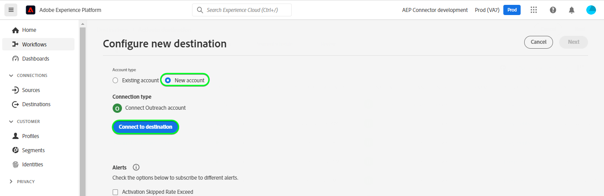

# [!DNL Outreach] verbinding

## Overzicht {#overview}

[[!DNL Outreach]](https://www.outreach.io/) is een Platform van de Uitvoering van de Verkoop met de meeste B2B koper-verkoper interactiegegevens in de wereld en significante investeringen in merkgebonden AI technologieën om verkoopgegevens in intelligentie om te zetten. [!DNL Outreach] helpt organisaties hun verkoopbetrokkenheid te automatiseren en op inkomstenintelligentie te handelen om hun efficiency, voorspelbaarheid, en groei te verbeteren.

Dit [!DNL Adobe Experience Platform] [doel](/help/destinations/home.md) gebruikt de [Resource-API voor Output Update](https://api.outreach.io/api/v2/docs#update-an-existing-resource), waardoor u identiteiten binnen een segment kunt bijwerken die overeenkomen met de vooruitzichten voor [!DNL Outreach].

[!DNL Outreach] gebruikt OAuth 2 met de Vergunning van de Vergunning als authentificatiemechanisme om met het te communiceren [!DNL Outreach] [!DNL Update Resource API]. Instructies voor verificatie aan uw [!DNL Outreach] instantie bevindt zich verderop, binnen [Verifiëren voor bestemming](#authenticate) sectie.

## Gebruiksscenario’s {#use-cases}

Als marketeer kunt u persoonlijke ervaringen aan uw vooruitzichten bieden op basis van kenmerken uit hun Adobe Experience Platform-profielen. U kunt segmenten maken van uw offlinegegevens en deze segmenten verzenden naar [!DNL Outreach], om in de &quot;Outlook&quot;-feeds weer te geven zodra segmenten en profielen in Adobe Experience Platform worden bijgewerkt.

## Vereisten {#prerequisites}

### Voorwaarden voor Experience Platforms {#prerequisites-in-experience-platform}

Voordat u gegevens activeert naar de [!DNL Outreach] doel, u moet een [schema](/help/xdm/schema/composition.md), [gegevensset](https://experienceleague.adobe.com/docs/platform-learn/tutorials/data-ingestion/create-datasets-and-ingest-data.html?lang=en), en [segmenten](https://experienceleague.adobe.com/docs/platform-learn/tutorials/segments/create-segments.html?lang=en) gemaakt in [!DNL Experience Platform].

Raadpleeg de documentatie bij Adobe voor [Segment Membership Details schema groep](/help/xdm/field-groups/profile/segmentation.md) als u begeleiding op segmentstatussen nodig hebt.

### Voorwaarden voor bereiken {#prerequisites-destination}

Houd rekening met de volgende voorwaarden in [!DNL Outreach]om gegevens van Platform naar uw [!DNL Outreach] account:

#### U moet een Outreach-account hebben {#prerequisites-account}

Ga naar de [!DNL Outreach] [aanmelden](https://accounts.outreach.io/users/sign_in) pagina om te registreren en een account te maken, als u er nog geen hebt. Zie ook de [!DNL Outreach] ondersteuning [page](https://support.outreach.io/hc/en-us/articles/207238607-Claim-Your-Outreach-Account) voor meer informatie .

Noteer de onderstaande items voordat u deze verifieert voor de [!DNL Outreach] CRM-bestemming:

| Credentials | Beschrijving |
|---|---|
| Email | Uw [!DNL Outreach] accounemail |
| Wachtwoord | Uw [!DNL Outreach] accountwachtwoord |

#### Aangepaste veldlabels instellen {#prerequisites-custom-fields}

[!DNL Outreach] ondersteunt aangepaste velden voor [vooruitzichten](https://support.outreach.io/hc/en-us/articles/360001557554-Outreach-Prospect-Profile-Overview). Zie [Een aangepast veld toevoegen in bereik](https://support.outreach.io/hc/en-us/articles/219124908-How-To-Add-a-Custom-Field-in-Outreach) voor aanvullende richtsnoeren. Voor een gemakkelijke identificatie wordt aangeraden de labels handmatig bij te werken naar de corresponderende segmentnamen in plaats van de standaardwaarden te handhaven. Bijvoorbeeld zoals hieronder:

[!DNL Outreach] instellingenpagina voor vooruitzichten met aangepaste velden.

[!DNL Outreach] instellingenpagina voor perspectieven waarin aangepaste velden worden weergegeven met *gebruiksvriendelijk* labels die overeenkomen met de segmentnamen. U kunt de segmentstatus op de perspectiefpagina tegen deze etiketten bekijken.

>[!NOTE]
>
> Labelnamen zijn alleen bedoeld voor identificatie. Deze worden niet gebruikt bij het bijwerken van de vooruitzichten.

## Guardrails

De [!DNL Outreach] API heeft een snelheidsgrens van 10.000 verzoeken per uur per gebruiker. Als u deze limiet bereikt, ontvangt u een `429` antwoord met het volgende bericht: `You have exceeded your permitted rate limit of 10,000; please try again at 2017-01-01T00:00:00.`.

Als u dit bericht hebt ontvangen, moet u uw schema van de segmentuitvoer bijwerken om aan de tariefdrempel te voldoen.

Zie de [[!DNL Outreach] documentatie](https://api.outreach.io/api/v2/docs#rate-limiting) voor meer informatie.

## Ondersteunde identiteiten {#supported-identities}

[!DNL Outreach] ondersteunt het bijwerken van de identiteiten die in de onderstaande tabel worden beschreven. Meer informatie over [identiteiten](/help/identity-service/namespaces.md).

| Doelidentiteit | Beschrijving | Overwegingen |
|---|---|---|
| `OutreachId` | <ul><li>[!DNL Outreach] id. Dit is een numerieke waarde die overeenkomt met het perspectiefprofiel.</li><li>De id moet overeenkomen met de id in het dialoogvenster [!DNL Outreach] URL voor het vooruitzicht dat wordt bijgewerkt.</li><li>Zie de [[!DNL Outreach] documentatie](https://api.outreach.io/api/v2/docs#update-an-existing-resource) voor nadere bijzonderheden.</li></ul> | Verplicht |

## Type en frequentie exporteren {#export-type-frequency}

Raadpleeg de onderstaande tabel voor informatie over het exporttype en de exportfrequentie van de bestemming.

| Item | Type | Notities |
---------|----------|---------|
| Exporttype | **[!UICONTROL Profile-based]** | <ul><li> U exporteert alle leden van een segment samen met de gewenste schemavelden *(bijvoorbeeld: e-mailadres, telefoonnummer, achternaam)*, op basis van uw veldtoewijzing.</li><li> Elke segmentstatus in [!DNL Outreach] wordt bijgewerkt met de corresponderende segmentstatus van het Platform, gebaseerd op de [!UICONTROL Mapping ID] waarde die tijdens de [segment plannen](#schedule-segment-export-example) stap.</li></ul> |
| Uitvoerfrequentie | **[!UICONTROL Streaming]** | <ul><li> Streaming doelen zijn &quot;altijd aan&quot; API-verbindingen. Zodra een profiel in Experience Platform wordt bijgewerkt dat op segmentevaluatie wordt gebaseerd, verzendt de schakelaar de update stroomafwaarts naar het bestemmingsplatform. Meer informatie over [streaming doelen](/help/destinations/destination-types.md#streaming-destinations).</li></ul> |

{style=&quot;table-layout:auto&quot;}

## Verbinden met de bestemming {#connect}

>[!IMPORTANT]
> 
> Om met de bestemming te verbinden, hebt u nodig **[!UICONTROL Manage Destinations]** [toegangsbeheermachtiging](/help/access-control/home.md#permissions). Lees de [toegangsbeheeroverzicht](/help/access-control/ui/overview.md) of neem contact op met de productbeheerder om de vereiste machtigingen te verkrijgen.

Als u verbinding wilt maken met dit doel, voert u de stappen uit die worden beschreven in het dialoogvenster [zelfstudie over doelconfiguratie](../../ui/connect-destination.md). In vormen bestemmingswerkschema, vul de gebieden in die in de twee hieronder secties worden vermeld.

Within **[!UICONTROL Destinations]** > **[!UICONTROL Catalog]** zoeken naar [!DNL Outreach]. U kunt het ook vinden onder de categorie CRM.

### Verifiëren voor bestemming {#authenticate}

Om voor authentiek te verklaren aan de bestemming, selecteer **[!UICONTROL Connect to destination]**.

U wordt de [!DNL Outreach] aanmeldingspagina. Geef uw e-mail op.

Geef vervolgens uw wachtwoord op.

* **[!UICONTROL Username]**: Uw [!DNL Outreach] e-mail account.
* **[!UICONTROL Password]**: Uw [!DNL Outreach] accountwachtwoord.

Als de verstrekte gegevens geldig zijn, geeft de interface een **Verbonden** status met een groen vinkje. Vervolgens kunt u verdergaan met de volgende stap.

### Doelgegevens invullen {#destination-details}

Als u details voor de bestemming wilt configureren, vult u de vereiste en optionele velden hieronder in. Een sterretje naast een veld in de gebruikersinterface geeft aan dat het veld verplicht is.

* **[!UICONTROL Name]**: Een naam waarmee u deze bestemming in de toekomst zult erkennen.
* **[!UICONTROL Description]**: Een beschrijving die u zal helpen deze bestemming in de toekomst identificeren.

### Waarschuwingen inschakelen {#enable-alerts}

U kunt alarm toelaten om berichten over de status van dataflow aan uw bestemming te ontvangen. Selecteer een waarschuwing in de lijst om u te abonneren op meldingen over de status van uw gegevensstroom. Voor meer informatie over waarschuwingen raadpleegt u de handleiding over [het abonneren aan bestemmingen alarm gebruikend UI](../../ui/alerts.md).

Wanneer u klaar bent met het opgeven van details voor uw doelverbinding, selecteert u **[!UICONTROL Next]**.

## Segmenten naar dit doel activeren {#activate}

>[!IMPORTANT]
> 
> Als u gegevens wilt activeren, hebt u de opdracht **[!UICONTROL Manage Destinations]**, **[!UICONTROL Activate Destinations]**, **[!UICONTROL View Profiles]**, en **[!UICONTROL View Segments]** [toegangsbeheermachtigingen](/help/access-control/home.md#permissions). Lees de [toegangsbeheeroverzicht](/help/access-control/ui/overview.md) of neem contact op met de productbeheerder om de vereiste machtigingen te verkrijgen.

Lezen [Profielen en segmenten activeren voor streaming segmentexportdoelen](../../ui/activate-segment-streaming-destinations.md) voor instructies bij het activeren van publiekssegmenten aan deze bestemming.

### Afbeeldingsoverwegingen en voorbeeld {#mapping-considerations-example}

Als u uw publieksgegevens correct vanuit Adobe Experience Platform naar de [!DNL Outreach] doel, moet u door de stap van de gebiedstoewijzing gaan. Toewijzing bestaat uit het maken van een koppeling tussen de schemavelden van uw Experience Data Model (XDM) in uw Platform-account en de bijbehorende equivalenten van de doelbestemming. Uw XDM-velden op de juiste wijze toewijzen aan de [!DNL Outreach] doelvelden, voer de volgende stappen uit:

1. In de [!UICONTROL Mapping] stap, klik op **[!UICONTROL Add new mapping]**. Er verschijnt een nieuwe toewijzingsrij op het scherm.
   

1. In de [!UICONTROL Select source field] venster, kiest u de **[!UICONTROL Select identity namespace]** en voeg de gewenste toewijzingen toe.
   

1. In de [!UICONTROL Select target field] Selecteer het type doelveld waaraan u het bronveld wilt toewijzen.
   * **[!UICONTROL Select identity namespace]**: Selecteer deze optie als u het bronveld wilt toewijzen aan een naamruimte in de lijst.
      

   * Voeg de volgende afbeelding toe tussen uw XDM-profielschema en uw [!DNL Outreach] instantie: |XDM-profielschema|[!DNL Outreach] Instantie| Verplicht| |—|—|—| |`Oid`|`OutreachId`| Ja |

   * **[!UICONTROL Select custom attributes]**: Selecteer deze optie om uw bronveld toe te wijzen aan een aangepast kenmerk dat u in het dialoogvenster [!UICONTROL Attribute name] veld. Zie [[!DNL Outreach] prospectiedocumentatie](https://api.outreach.io/api/v2/docs#prospect) voor een uitgebreide lijst met ondersteunde kenmerken.
      

   * Afhankelijk van de waarden die u wilt bijwerken, voegt u bijvoorbeeld de volgende toewijzing toe tussen uw XDM-profielschema en uw [!DNL Outreach] instantie: |XDM-profielschema|[!DNL Outreach] Instance| |—|—| |`person.name.firstName`|`firstName`| |`person.name.lastName`|`lastName`|

   * Hieronder ziet u een voorbeeld waarin deze toewijzingen worden gebruikt:
      

### De segmentuitvoer van het programma en voorbeeld {#schedule-segment-export-example}

* Bij het uitvoeren van de [Segmentexport plannen](../../ui/activate-segment-streaming-destinations.md) stap u moet de segmenten van het Platform aan het attribuut van het douanegebied manueel in kaart brengen [!DNL Outreach].

* Hiervoor selecteert u elk segment en voert u de bijbehorende numerieke waarde in die overeenkomt met de *Aangepast veld `N` Label* veld van [!DNL Outreach] in de **[!UICONTROL Mapping ID]** veld.

   >[!IMPORTANT]
   >
   > * De numerieke waarde *(`N`)* worden gebruikt in de [!UICONTROL Mapping ID] moet overeenkomen met de aangepaste kenmerksleutel met het achtervoegsel numeriek binnen [!DNL Outreach]. Voorbeeld: *Aangepast veld `N` Label*.
   > * U hoeft alleen de numerieke waarde op te geven, niet het hele aangepaste veldlabel.
   > * [!DNL Outreach] ondersteunt maximaal 150 aangepaste labelvelden.
   > * Zie [[!DNL Outreach] prospectiedocumentatie](https://api.outreach.io/api/v2/docs#prospect) voor meer informatie.

   * Bijvoorbeeld:

      | [!DNL Outreach] Veld | Platform toewijzen-id |
      |---|---|
      | Aangepast veld `4` Label | `4` |

      

## Gegevens exporteren valideren {#exported-data}

Volg onderstaande stappen om te controleren of u de bestemming correct hebt ingesteld:

1. Selecteren **[!UICONTROL Destinations]** > **[!UICONTROL Browse]** om naar de lijst met bestemmingen te navigeren.
   

1. Selecteer het doel en controleer of de status **[!UICONTROL enabled]**.
   

1. Naar de **[!DNL Activation data]** selecteert u vervolgens een segmentnaam.
   

1. Controleer de samenvatting van het segment en zorg ervoor dat de telling van profielen aan de telling beantwoordt die binnen het segment wordt gecreeerd.
   

1. Aanmelden bij de [!DNL Outreach] website, navigeer vervolgens naar de [!DNL Apps] > [!DNL Contacts] en controleer of de profielen van het segment zijn toegevoegd. U kunt zien dat elke segmentstatus in [!DNL Outreach] werd bijgewerkt met de overeenkomstige segmentstatus van Platform, gebaseerd op [!UICONTROL Mapping ID] waarde die tijdens de [segment plannen](#schedule-segment-export-example) stap.

## Gegevensgebruik en -beheer {#data-usage-governance}

Alles [!DNL Adobe Experience Platform] de bestemmingen zijn volgzaam met het beleid van het gegevensgebruik wanneer het behandelen van uw gegevens. Voor gedetailleerde informatie over hoe [!DNL Adobe Experience Platform] handhaaft gegevensbeheer, zie [Overzicht van gegevensbeheer](/help/data-governance/home.md).

## Fouten en problemen oplossen {#errors-and-troubleshooting}

Bij het controleren van een gegevensstroomuitvoering wordt mogelijk het volgende foutbericht weergegeven: `Bad request reported while pushing events to the destination. Please contact the administrator and try again.`

Om deze fout te bevestigen, verifieer dat [!UICONTROL Mapping ID] u hebt in Platform voor uw [!DNL Outreach] segment is geldig en bestaat in [!DNL Outreach].

## Aanvullende bronnen {#additional-resources}

De [[!DNL Outreach] documentatie](https://api.outreach.io/api/v2/docs/) bevat informatie over [Foutreacties](https://api.outreach.io/api/v2/docs#error-responses) die u kunt gebruiken om het even welke kwesties te zuiveren.
