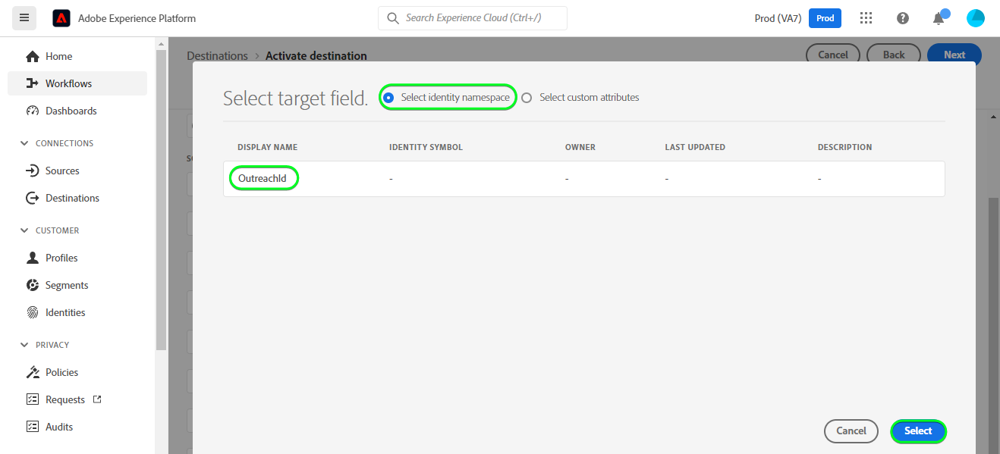

# [!DNL Outreach] verbinding

## Overzicht {#overview}

[[!DNL Outreach] ](https://www.outreach.io/) is een Platform van de Uitvoering van de Verkoop met de meeste B2B koper-verkoper interactiegegevens in de wereld en significante investeringen in merkgebonden AI technologieën om verkoopgegevens in intelligentie te vertalen. [!DNL Outreach] helpt organisaties om hun verkoopbetrokkenheid te automatiseren en om hun efficiëntie, voorspelbaarheid en groei te verbeteren.

Dit [!DNL Adobe Experience Platform] [ bestemmings ](/help/destinations/home.md) hefboomwerkingen [ het Middel API van de Update van de Outreach ](https://api.outreach.io/api/v2/docs#update-an-existing-resource), die u toestaat om identiteiten binnen een publiek bij te werken die aan vooruitzichten in [!DNL Outreach] beantwoorden.

[!DNL Outreach] gebruikt OAuth 2 met de Vergunning als authentificatiemechanisme om met [!DNL Outreach] te communiceren [!DNL Update Resource API]. De instructies om aan uw [!DNL Outreach] instantie voor authentiek te verklaren zijn verder hieronder, binnen [ voor authentiek verklaren aan bestemmings ](#authenticate) sectie.

## Gebruiksscenario’s {#use-cases}

Als marketeer kunt u persoonlijke ervaringen aan uw vooruitzichten bieden op basis van kenmerken uit hun Adobe Experience Platform-profielen. U kunt publiek maken van uw offline gegevens en deze soorten publiek naar [!DNL Outreach] sturen, zodat ze in de feeds van het perspectief worden weergegeven zodra het publiek en de profielen in Adobe Experience Platform worden bijgewerkt.

## Vereisten {#prerequisites}

### Experience Platform-voorwaarden {#prerequisites-in-experience-platform}

Alvorens gegevens aan de [!DNL Outreach] bestemming te activeren, moet u a [ schema ](/help/xdm/schema/composition.md), a [ dataset ](https://experienceleague.adobe.com/docs/platform-learn/tutorials/data-ingestion/create-datasets-and-ingest-data.html) hebben, en [ segmenten ](https://experienceleague.adobe.com/docs/platform-learn/tutorials/segments/create-segments.html) die in [!DNL Experience Platform] worden gecreeerd.

Verwijs naar de documentatie van Adobe voor [ het schemagroep van de Details van het Lidmaatschap van het Publiek ](/help/xdm/field-groups/profile/segmentation.md) als u begeleiding op publieksstatistieken nodig hebt.

### Voorwaarden voor bereiken {#prerequisites-destination}

Als u gegevens wilt exporteren van Experience Platform naar uw [!DNL Outreach] -account, moet u rekening houden met de volgende voorwaarden in [!DNL Outreach] :

#### U moet een Outreach-account hebben {#prerequisites-account}

Ga naar de [!DNL Outreach] [ teken binnen ](https://accounts.outreach.io/users/sign_in) pagina om een rekening te registreren en tot stand te brengen, als u niet reeds hebt. Zie ook de [!DNL Outreach] steun [ pagina ](https://support.outreach.io/hc/en-us/articles/207238607-Claim-Your-Outreach-Account) voor meer details.

Noteer de onderstaande items voordat u verifieert voor de bestemming [!DNL Outreach] CRM:

| Credentials | Beschrijving |
|---|---|
| Email | Uw [!DNL Outreach] -account-e-mail |
| Wachtwoord | Wachtwoord voor uw [!DNL Outreach]-account |

#### Aangepaste veldlabels instellen {#prerequisites-custom-fields}

[!DNL Outreach] steunt douanegebieden voor [ vooruitzichten ](https://support.outreach.io/hc/en-us/articles/360001557554-Outreach-Prospect-Profile-Overview). Verwijs naar [ hoe te om een douanegebied in Uitzicht ](https://support.outreach.io/hc/en-us/articles/219124908-How-To-Add-a-Custom-Field-in-Outreach) voor extra begeleiding toe te voegen. Voor een eenvoudige identificatie is het raadzaam de labels handmatig bij te werken naar de desbetreffende publieksnamen in plaats van de standaardwaarden te behouden. Bijvoorbeeld zoals hieronder:

[!DNL Outreach] instellingenpagina voor vooruitzichten met aangepaste velden.

[!DNL Outreach] montagespagina voor vooruitzichten die douanegebieden met *gebruikersvriendelijke* etiketten tonen die aan de publieksnamen aanpassen. U kunt de publieksstatus op de perspectiefpagina tegen deze etiketten bekijken.

>[!NOTE]
>
> Labelnamen zijn alleen bedoeld voor identificatie. Deze worden niet gebruikt bij het bijwerken van de vooruitzichten.

## Guardrails

De API van [!DNL Outreach] heeft een tariefgrens van 10.000 verzoeken per uur per gebruiker. Als u deze limiet bereikt, ontvangt u een `429` -reactie met het volgende bericht: `You have exceeded your permitted rate limit of 10,000; please try again at 2017-01-01T00:00:00.` .

Als u dit bericht hebt ontvangen, moet u het programma voor het exporteren van het publiek bijwerken om aan de tariefdrempel te voldoen.

Verwijs naar de [[!DNL Outreach]  documentatie ](https://api.outreach.io/api/v2/docs#rate-limiting) voor extra details.

## Ondersteunde identiteiten {#supported-identities}

[!DNL Outreach] ondersteunt het bijwerken van de identiteiten die in de onderstaande tabel worden beschreven. Leer meer over [ identiteiten ](/help/identity-service/features/namespaces.md).

| Doelidentiteit | Beschrijving | Overwegingen |
|---|---|---|
| `OutreachId` | <ul><li>[!DNL Outreach] identifier. Dit is een numerieke waarde die overeenkomt met het perspectiefprofiel.</li><li>De id moet overeenkomen met de id in de URL van [!DNL Outreach] , anders wordt het vooruitzicht niet bijgewerkt.</li><li>Verwijs naar de [[!DNL Outreach]  documentatie ](https://api.outreach.io/api/v2/docs#update-an-existing-resource) voor verdere details.</li></ul> | Verplicht |

## Type en frequentie exporteren {#export-type-frequency}

Raadpleeg de onderstaande tabel voor informatie over het exporttype en de exportfrequentie van de bestemming.

| Item | Type | Notities |
---------|----------|---------|
| Exporttype | **[!UICONTROL Profile-based]** | <ul><li> U exporteert alle leden van een segment samen met de gewenste schemavelden *(bijvoorbeeld: e-mailadres, telefoonnummer, achternaam)* volgens uw veldtoewijzing.</li><li> Elke segmentstatus in [!DNL Outreach] wordt bijgewerkt met de overeenkomstige publieksstatus van Experience Platform, die op de [!UICONTROL Mapping ID] waarde wordt gebaseerd die tijdens de [ publiek wordt verstrekt die ](#schedule-segment-export-example) stap plant.</li></ul> |
| Exportfrequentie | **[!UICONTROL Streaming]** | <ul><li> Streaming doelen zijn &quot;altijd aan&quot; API-verbindingen. Zodra een profiel in Experience Platform wordt bijgewerkt dat op publieksevaluatie wordt gebaseerd, verzendt de schakelaar de update stroomafwaarts naar het bestemmingsplatform. Lees meer over [ het stromen bestemmingen ](/help/destinations/destination-types.md#streaming-destinations).</li></ul> |

{style="table-layout:auto"}

## Verbinden met de bestemming {#connect}

>[!IMPORTANT]
> 
> Om met de bestemming te verbinden, hebt u de **[!UICONTROL Manage Destinations]** [ toegangsbeheertoestemming ](/help/access-control/home.md#permissions) nodig. Lees het [ overzicht van de toegangscontrole ](/help/access-control/ui/overview.md) of contacteer uw productbeheerder om de vereiste toestemmingen te verkrijgen.

Om met deze bestemming te verbinden, volg de stappen die in het [ leerprogramma van de bestemmingsconfiguratie ](../../ui/connect-destination.md) worden beschreven. In vormen bestemmingswerkschema, vul de gebieden in die in de twee hieronder secties worden vermeld.

Kies in **[!UICONTROL Destinations]** > **[!UICONTROL Catalog]** Zoeken naar [!DNL Outreach] . U kunt het ook vinden onder de categorie CRM.

### Verifiëren voor bestemming {#authenticate}

Selecteer **[!UICONTROL Connect to destination]** als u wilt verifiëren bij het doel.

{het schermschot van 0} Experience Platform UI die tonen hoe te om aan Uitzicht voor authentiek te verklaren.

De aanmeldingspagina van [!DNL Outreach] wordt weergegeven. Geef uw e-mail op.

Geef vervolgens uw wachtwoord op.

* **[!UICONTROL Username]**: Uw [!DNL Outreach] -account-e-mail.
* **[!UICONTROL Password]**: Het wachtwoord van uw [!DNL Outreach] -account.

Als de verstrekte details geldig zijn, toont UI a **Verbonden** status met een groen vinkje. Vervolgens kunt u verdergaan met de volgende stap.

### Doelgegevens invullen {#destination-details}

Als u details voor de bestemming wilt configureren, vult u de vereiste en optionele velden hieronder in. Een sterretje naast een veld in de gebruikersinterface geeft aan dat het veld verplicht is.
{het schermschot van 0} Experience Platform UI die tonen hoe te om details voor de bestemming van het Bereik in te vullen.

* **[!UICONTROL Name]**: Een naam waarmee u dit doel in de toekomst herkent.
* **[!UICONTROL Description]**: Een beschrijving die u zal helpen deze bestemming in de toekomst identificeren.

### Waarschuwingen inschakelen {#enable-alerts}

U kunt alarm toelaten om berichten over de status van dataflow aan uw bestemming te ontvangen. Selecteer een waarschuwing in de lijst om u te abonneren op meldingen over de status van uw gegevensstroom. Voor meer informatie over alarm, zie de gids bij [ het intekenen aan bestemmingsalarm gebruikend UI ](../../ui/alerts.md).

Wanneer u klaar bent met het opgeven van details voor uw doelverbinding, selecteert u **[!UICONTROL Next]** .

## Soorten publiek naar dit doel activeren {#activate}

>[!IMPORTANT]
> 
>* Om gegevens te activeren, hebt u **[!UICONTROL View Destinations]**, **[!UICONTROL Activate Destinations]**, **[!UICONTROL View Profiles]**, en **[!UICONTROL View Segments]** [ toegangsbeheertoestemmingen ](/help/access-control/home.md#permissions) nodig. Lees het [ overzicht van de toegangscontrole ](/help/access-control/ui/overview.md) of contacteer uw productbeheerder om de vereiste toestemmingen te verkrijgen.
>* Om *identiteiten* uit te voeren, hebt u de **[!UICONTROL View Identity Graph]** [ toegangsbeheertoestemming ](/help/access-control/home.md#permissions) nodig.   {width="100" zoomable="yes"}

Lees [ activeer profielen en publiek aan het stromen publiek uitvoerbestemmingen ](../../ui/activate-segment-streaming-destinations.md) voor instructies bij het activeren van publiek aan deze bestemming.

### Afbeeldingsoverwegingen en voorbeeld {#mapping-considerations-example}

Als u uw publieksgegevens correct vanuit Adobe Experience Platform naar de [!DNL Outreach] -bestemming wilt verzenden, moet u de stap voor veldtoewijzing doorlopen. Toewijzing bestaat uit het maken van een koppeling tussen de schemavelden van uw Experience Data Model (XDM) in uw Experience Platform-account en de overeenkomstige equivalenten van de doelbestemming. Voer de volgende stappen uit om uw XDM-velden correct toe te wijzen aan de [!DNL Outreach] -doelvelden:

1. Klik in de stap [!UICONTROL Mapping] op **[!UICONTROL Add new mapping]** . Er verschijnt een nieuwe toewijzingsrij op het scherm.
   {het schermschot van 0} Experience Platform UI die hoe te om nieuwe afbeelding toe te voegen  toont

1. Kies in het venster [!UICONTROL Select source field] de categorie **[!UICONTROL Select identity namespace]** en voeg de gewenste toewijzingen toe.
   {het schermschot van 0} Experience Platform UI die de afbeelding van Source  toont

1. Selecteer in het [!UICONTROL Select target field] -venster het type doelveld waaraan u het bronveld wilt toewijzen.
   * **[!UICONTROL Select identity namespace]**: selecteer deze optie om het bronveld toe te wijzen aan een naamruimte in de lijst.

     

   * Voeg de volgende toewijzing toe tussen uw XDM-profielschema en uw [!DNL Outreach] -instantie:

     | XDM-profielschema | [!DNL Outreach] Instantie | Verplicht |
     |---|---|---|
     | `Oid` | `OutreachId` | Ja |

   * **[!UICONTROL Select custom attributes]**: selecteer deze optie om het bronveld toe te wijzen aan een aangepast kenmerk dat u in het veld [!UICONTROL Attribute name] definieert. Verwijs naar [[!DNL Outreach]  perspectiefdocumentatie ](https://api.outreach.io/api/v2/docs#prospect) voor een uitvoerige lijst van gesteunde attributen.

     

   * Afhankelijk van de waarden die u wilt bijwerken, voegt u bijvoorbeeld de volgende toewijzing toe tussen uw XDM-profielschema en uw [!DNL Outreach] -instantie:

     | XDM-profielschema | [!DNL Outreach] Instantie |
     |---|---|
     | `person.name.firstName` | `firstName` |
     | `person.name.lastName` | `lastName` |

   * Hieronder ziet u een voorbeeld waarin deze toewijzingen worden gebruikt:

     

### Het publiek van het programma uitvoeren en voorbeeld {#schedule-segment-export-example}

* Wanneer het uitvoeren van de [ stap van de de publieksuitvoer van het Programma ](../../ui/activate-segment-streaming-destinations.md) u moet het publiek van Experience Platform aan het attribuut van het douanegebied in kaart brengen [!DNL Outreach].

* Om dit te doen, selecteer elk segment, dan ga de overeenkomstige numerieke waarde in die aan het `N` Etiket *gebied van het Gebied van de Douane* &lbrace;van [!DNL Outreach] op het **[!UICONTROL Mapping ID]** gebied beantwoordt.

  >[!IMPORTANT]
  >
  > * De numerieke waarde *(`N`)* die binnen [!UICONTROL Mapping ID] wordt gebruikt zou de sleutel van het douanekenmerk met achtervoegsel met de numerieke waarde binnen [!DNL Outreach] moeten aanpassen. Voorbeeld: `N` Etiket *van het Gebied van de Douane 0&rbrace;.*
  > * U hoeft alleen de numerieke waarde op te geven, niet het hele aangepaste veldlabel.
  > * [!DNL Outreach] ondersteunt maximaal 150 aangepaste labelvelden.
  > * Verwijs naar [[!DNL Outreach]  perspectiefdocumentatie ](https://api.outreach.io/api/v2/docs#prospect) voor details.

   * Bijvoorbeeld:

     | [!DNL Outreach] Veld | Toewijzing-id voor Experience Platform |
     |---|---|
     | Aangepast veld `4` label | `4` |

     {het schermschot van 0} Experience Platform UI die een voorbeeldToewijzing Identiteitskaart tijdens de uitvoer van het het publiek van het Programma tonen.

## Gegevens exporteren valideren {#exported-data}

Volg onderstaande stappen om te controleren of u de bestemming correct hebt ingesteld:

1. Selecteer **[!UICONTROL Destinations]** > **[!UICONTROL Browse]** om naar de lijst met doelen te navigeren.
   {het schermschot van 0} Experience Platform UI die Browse Doelen toont.

1. Selecteer het doel en bevestig dat de status **[!UICONTROL enabled]** is.
   

1. Ga naar het tabblad **[!DNL Activation data]** en selecteer vervolgens een publieksnaam.
   {het schermschot van 0} Experience Platform UI die de gegevens van de Activering van Doelen toont.

1. Controleer het publieksoverzicht en zorg ervoor dat de telling van profielen aan de telling beantwoordt die binnen het segment wordt gecreeerd.
   

1. Meld u aan bij de [!DNL Outreach] -website, navigeer naar de pagina [!DNL Apps] > [!DNL Contacts] en controleer of de profielen van het publiek zijn toegevoegd. U kunt zien dat elke publieksstatus in [!DNL Outreach] met de overeenkomstige publieksstatus van Experience Platform werd bijgewerkt, die op de [!UICONTROL Mapping ID] waarde wordt gebaseerd die tijdens de [ publiek wordt verstrekt die ](#schedule-segment-export-example) stap plant.

## Gegevensgebruik en -beheer {#data-usage-governance}

Alle [!DNL Adobe Experience Platform] -doelen zijn compatibel met het beleid voor gegevensgebruik bij het verwerken van uw gegevens. Voor gedetailleerde informatie over hoe [!DNL Adobe Experience Platform] gegevensbeheer afdwingt, zie het [ overzicht van het Beleid van Gegevens ](/help/data-governance/home.md).

## Fouten en problemen oplossen {#errors-and-troubleshooting}

Wanneer u een gegevensstroomuitvoering controleert, wordt mogelijk het volgende foutbericht weergegeven: `Bad request reported while pushing events to the destination. Please contact the administrator and try again.`

{het schermschot van 0} Experience Platform UI die de Onjuiste verzoekFout toont.

Om deze fout te corrigeren, controleert u of de [!UICONTROL Mapping ID] die u in Experience Platform voor uw [!DNL Outreach] -publiek hebt opgegeven, geldig is en voorkomt in [!DNL Outreach] .

## Aanvullende bronnen {#additional-resources}

De [[!DNL Outreach]  documentatie ](https://api.outreach.io/api/v2/docs/) heeft details op [ Reacties van de Fout ](https://api.outreach.io/api/v2/docs#error-responses) die u kunt gebruiken om het even welke kwesties te zuiveren.
