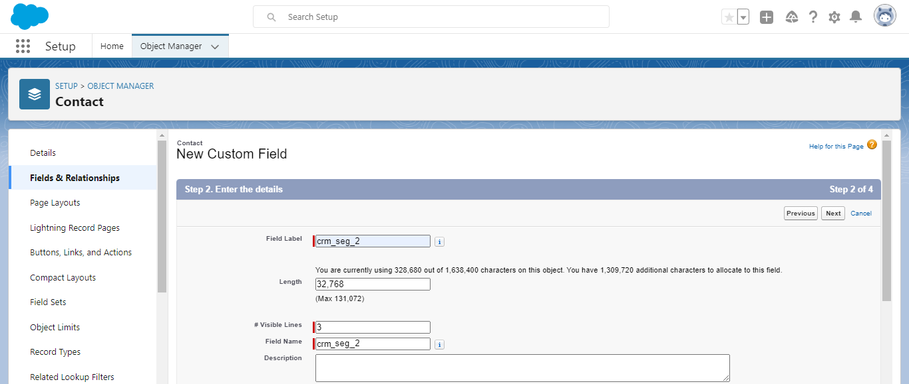

# [!DNL Salesforce CRM] verbinding

## Overzicht {#overview}

[[!DNL Salesforce CRM]](https://www.salesforce.com/crm/) is een populair CRM-platform (Customer Relationship Management) en biedt ondersteuning voor het volgende:

* [Leads](https://developer.salesforce.com/docs/atlas.en-us.object_reference.meta/object_reference/sforce_api_objects_lead.htm) - Een voorbeeld is de naam van een persoon of bedrijf die (of niet) geïnteresseerd kan zijn in de producten of diensten die u verkoopt.
* [Contactpersonen](https://developer.salesforce.com/docs/atlas.en-us.object_reference.meta/object_reference/sforce_api_objects_contact.htm) - Een contactpersoon is een persoon met wie een van uw vertegenwoordigers een relatie tot stand heeft gebracht en gekwalificeerd is als potentiële klant.

Dit [!DNL Adobe Experience Platform] [doel](/help/destinations/home.md) gebruikt de [[!DNL Salesforce composite API]](https://developer.salesforce.com/docs/atlas.en-us.api_rest.meta/api_rest/resources_composite_sobjects_collections_update.htm), die beide hierboven beschreven typen profielen ondersteunt.

Wanneer [activeren, segmenten](#activate), kunt u tussen leads of contactpersonen selecteren en kenmerken en doelgegevens bijwerken in [!DNL Salesforce CRM].

[!DNL Salesforce CRM] gebruikt OAuth 2 met de Verlening van het Wachtwoord als authentificatiemechanisme om met Salesforce REST API te communiceren. Instructies voor verificatie aan uw [!DNL Salesforce CRM] de instantie is verder onderaan, in de [Verifiëren voor bestemming](#authenticate) sectie.

## Gebruiksscenario’s {#use-cases}

Als markeerteken kunt u uw gebruikers een persoonlijke ervaring bieden op basis van kenmerken uit hun Adobe Experience Platform-profielen. U kunt een publiek maken van uw offline gegevens en dit publiek naar Salesforce CRM sturen, zodat het in de feeds van de gebruiker wordt weergegeven zodra het publiek en de profielen in Adobe Experience Platform worden bijgewerkt.

## Vereisten {#prerequisites}

### Vereisten in Experience Platform {#prerequisites-in-experience-platform}

Alvorens gegevens aan de bestemming van Salesforce CRM te activeren, moet u een [schema](/help/xdm/schema/composition.md), [gegevensset](https://experienceleague.adobe.com/docs/platform-learn/tutorials/data-ingestion/create-datasets-and-ingest-data.html?lang=en), en [segmenten](https://experienceleague.adobe.com/docs/platform-learn/tutorials/segments/create-segments.html?lang=en) gemaakt in [!DNL Experience Platform].

### Vereisten in [!DNL Salesforce CRM] {#prerequisites-destination}

Houd rekening met de volgende voorwaarden in [!DNL Salesforce CRM]om gegevens van Platform naar uw Salesforce-account te exporteren:

#### U hebt een [!DNL Salesforce] account {#prerequisites-account}

Ga naar de [!DNL Salesforce] [proefversie](https://www.salesforce.com/in/form/signup/freetrial-sales/) pagina om te registreren en een [!DNL Salesforce] account, als u er nog geen hebt.

#### Een verbonden app configureren binnen [!DNL Salesforce] {#prerequisites-connected-app}

Eerst moet u een [[!DNL Salesforce] verbonden app](https://help.salesforce.com/s/articleView?id=sf.connected_app_create.htm&amp;language=en_US&amp;r=https%3A%2F%2Fhelp.salesforce.com%2F&amp;type=5) binnen uw [!DNL Salesforce] account, als u er nog geen hebt. [!DNL Salesforce CRM] gebruikt de verbonden toepassing om verbinding te maken met [!DNL Salesforce].

Volgende, inschakelen [!DNL OAuth Settings for API Integration] voor de [!DNL Salesforce connected app]. Zie de [[!DNL Salesforce]](https://help.salesforce.com/s/articleView?id=connected_app_create_api_integration.htm&amp;type=5&amp;language=en_US) documentatie voor richtsnoeren.

Zorg er ook voor dat de [bereik](https://help.salesforce.com/s/articleView?id=connected_app_create_api_integration.htm&amp;type=5&amp;language=en_US) hieronder vermelde [!DNL Salesforce connected app].

* ``chatter_api``
* ``lightning``
* ``visualforce``
* ``content``
* ``openid``
* ``full``
* ``api``
* ``web``
* ``refresh_token``
* ``offline_access``

Tot slot moet u ervoor zorgen dat de `password` subsidie is ingeschakeld binnen uw [!DNL Salesforce] account. Zie de [!DNL Salesforce] [OAuth 2.0 de gebruikersnaam-Wachtwoord Stroom voor Speciale Scenarios](https://help.salesforce.com/s/articleView?id=sf.remoteaccess_oauth_username_password_flow.htm&amp;type=5) documentatie als u hulp nodig hebt.

>[!IMPORTANT]
>
>Als uw [!DNL Salesforce] de accountbeheerder heeft toegang tot vertrouwde op IP waaiers beperkt, moet u hen contacteren om te krijgen [IP&#39;s van Experience Platform](/help/destinations/catalog/streaming/ip-address-allow-list.md) gevoegd op lijst van gewenste personen. Zie de [!DNL Salesforce] [Toegang tot vertrouwde IP-bereiken beperken voor een verbonden app](https://help.salesforce.com/s/articleView?id=sf.connected_app_edit_ip_ranges.htm&amp;type=5) documentatie als u extra begeleiding nodig hebt.

#### Aangepaste velden maken binnen [!DNL Salesforce] {#prerequisites-custom-field}

Wanneer het publiek wordt geactiveerd naar de [!DNL Salesforce CRM] doel, moet u een waarde in invoeren **[!UICONTROL Mapping ID]** veld voor elk geactiveerd publiek, in de **[Publiek schema](#schedule-segment-export-example)** stap.

[!DNL Salesforce CRM] vereist deze waarde om het publiek dat vanuit het Experience Platform binnenkomt, correct te lezen en te interpreteren en zijn publieksstatus binnen bij te werken [!DNL Salesforce]. Raadpleeg de documentatie bij het Experience Platform voor [Publiek Lidmaatschap Details schema groep](/help/xdm/field-groups/profile/segmentation.md) als u hulp over publieksstatus nodig hebt.

Voor elk publiek dat u activeert van Platform tot [!DNL Salesforce CRM]moet u een aangepast veld van het type maken `Text Area (Long)` binnen [!DNL Salesforce]. U kunt de veldtekenlengte van een willekeurige grootte tussen 256 en 131.072 tekens definiëren volgens uw zakelijke vereisten. Zie de [!DNL Salesforce] [Aangepaste veldtypen](https://help.salesforce.com/s/articleView?id=sf.custom_field_types.htm&amp;type=5) Documentatiepagina voor aanvullende informatie over aangepaste veldtypen. Zie ook de [!DNL Salesforce] documentatie aan [aangepaste velden maken](https://help.salesforce.com/s/articleView?id=mc_cab_create_an_attribute.htm&amp;type=5&amp;language=en_US) als u hulp nodig hebt bij het maken van velden.

>[!IMPORTANT]
>
>Plaats geen spatietekens in de veldnaam. Gebruik in plaats daarvan het onderstrepingsteken `(_)` als scheidingsteken.
>Within [!DNL Salesforce] u moet aangepaste velden maken met een **[!UICONTROL Field Name]** die exact overeenkomt met de waarde die is opgegeven binnen **[!UICONTROL Mapping ID]** voor elk geactiveerd Platform. In de onderstaande schermafbeelding ziet u bijvoorbeeld een aangepast veld met de naam `crm_2_seg`. Wanneer u een publiek activeert naar deze bestemming, voegt u `crm_2_seg` als **[!UICONTROL Mapping ID]** om het publiek te vullen van Experience Platform tot dit aangepaste veld.

Een voorbeeld van het maken van aangepaste velden in [!DNL Salesforce], *Stap 1 - selecteer het gegevenstype*, wordt hieronder weergegeven:

Een voorbeeld van het maken van aangepaste velden in [!DNL Salesforce], *Stap 2 - ga de details voor het douanegebied in*, wordt hieronder weergegeven:

>[!TIP]
>
>* Een onderscheid maken tussen aangepaste velden die worden gebruikt voor Platforms en andere aangepaste velden binnen [!DNL Salesforce] u kunt een herkenbaar voor- of achtervoegsel opnemen wanneer u het aangepaste veld maakt. In plaats van `test_segment`, gebruik `Adobe_test_segment` of `test_segment_Adobe`
>* Als u al andere aangepaste velden hebt gemaakt in [!DNL Salesforce], kunt u de zelfde naam gebruiken zoals het segment van het Platform, om het publiek binnen gemakkelijk te identificeren [!DNL Salesforce].

>[!NOTE]
>
>* Objecten in Salesforce zijn beperkt tot 25 externe velden. Zie [Kenmerken van aangepast veld](https://help.salesforce.com/s/articleView?id=sf.custom_field_attributes.htm&amp;type=5).
>* Deze beperking houdt in dat u op elk gewenst moment maximaal 25 Experience Platforms publieksleden actief kunt hebben.
>* Als u deze limiet binnen Salesforce hebt bereikt, moet u de aangepaste kenmerken uit Salesforce verwijderen die zijn gebruikt om de publieksstatus op te slaan tegen een ouder publiek in het Experience Platform voordat u een nieuwe account maakt **[!UICONTROL Mapping ID]** kan worden gebruikt.

#### Gather [!DNL Salesforce CRM] geloofsbrieven {#gather-credentials}

Noteer de onderstaande items voordat u deze verifieert voor de [!DNL Salesforce CRM] bestemming:

| Credentials | Beschrijving | Voorbeeld |
| --- | --- | --- |
| `Username` | Uw [!DNL Salesforce] gebruikersnaam account. | |
| `Password` | Uw [!DNL Salesforce] accountwachtwoord. | |
| `Security Token` | Uw [!DNL Salesforce] beveiligingstoken dat u later toevoegt aan het einde van uw [!DNL Salesforce] Wachtwoord om een samengevoegde tekenreeks te maken die als de **[!UICONTROL Password]** wanneer [authenticeren aan de bestemming](#authenticate).  Zie de [!DNL Salesforce] documentatie aan [beveiligingstoken opnieuw instellen](https://help.salesforce.com/s/articleView?id=sf.user_security_token.htm&amp;type=5) om te leren hoe u het kunt regenereren via de [!DNL Salesforce] interface als u niet het Symbolische van de Veiligheid hebt. |  |
| `Custom Domain` | Uw [!DNL Salesforce] domeinvoorvoegsel.   Zie de [[!DNL Salesforce] documentatie](https://help.salesforce.com/s/articleView?id=sf.domain_name_setting_login_policy.htm&amp;type=5) om te leren hoe u deze waarde kunt verkrijgen via de [!DNL Salesforce] interface. | Als uw [!DNL Salesforce] domain is  *`d5i000000isb4eak-dev-ed`.my.salesforce.com*,  u hebt `d5i000000isb4eak-dev-ed` als de waarde. |
| `Client ID` | Uw Salesforce `Consumer Key`.   Zie de [[!DNL Salesforce] documentatie](https://help.salesforce.com/s/articleView?id=sf.connected_app_rotate_consumer_details.htm&amp;type=5) om te leren hoe u deze waarde kunt verkrijgen via de [!DNL Salesforce] interface. | |
| `Client Secret` | Uw Salesforce `Consumer Secret`.   Zie de [[!DNL Salesforce] documentatie](https://help.salesforce.com/s/articleView?id=sf.connected_app_rotate_consumer_details.htm&amp;type=5) om te leren hoe u deze waarde kunt verkrijgen via de [!DNL Salesforce] interface. | |

### Guardrails {#guardrails}

[!DNL Salesforce] saldeert transactieladingen door verzoek, tarief en onderbrekingsgrenzen op te leggen. Zie de [Limieten en toewijzingen voor API-aanvragen](https://developer.salesforce.com/docs/atlas.en-us.salesforce_app_limits_cheatsheet.meta/salesforce_app_limits_cheatsheet/salesforce_app_limits_platform_api.htm) voor meer informatie.

Als uw [!DNL Salesforce] de accountbeheerder heeft IP-beperkingen afgedwongen, u moet deze toevoegen [IP-adressen Experience Platform](/help/destinations/catalog/streaming/ip-address-allow-list.md) aan uw [!DNL Salesforce] de vertrouwde op IP van rekeningen waaiers. Zie de [!DNL Salesforce] [Toegang tot vertrouwde IP-bereiken beperken voor een verbonden app](https://help.salesforce.com/s/articleView?id=sf.connected_app_edit_ip_ranges.htm&amp;type=5) documentatie als u extra begeleiding nodig hebt.

>[!IMPORTANT]
>
>Wanneer [activeren, segmenten](#activate) u moet kiezen tussen *Contact* of *Lood* typen. U moet ervoor zorgen dat uw publiek de juiste gegevenstoewijzing heeft op basis van het geselecteerde type.

## Ondersteunde identiteiten {#supported-identities}

[!DNL Salesforce CRM] ondersteunt het bijwerken van de identiteiten die in de onderstaande tabel worden beschreven. Meer informatie over [identiteiten](/help/identity-service/namespaces.md).

| Doelidentiteit | Beschrijving | Overwegingen |
|---|---|---|
| `SalesforceId` | De [!DNL Salesforce CRM] id voor de contact- of loodidentiteiten die u uitvoert of door uw segment bijwerkt. | Verplicht |

## Type en frequentie exporteren {#export-type-frequency}

Raadpleeg de onderstaande tabel voor informatie over het exporttype en de exportfrequentie van de bestemming.

| Item | Type | Notities |
---------|----------|---------|
| Exporttype | **[!UICONTROL Profile-based]** | <ul><li>U exporteert alle leden van een segment samen met de gewenste schemavelden *(bijvoorbeeld: e-mailadres, telefoonnummer, achternaam)*, op basis van uw veldtoewijzing.</li><li> Elke publieksstatus in [!DNL Salesforce CRM] wordt bijgewerkt met de corresponderende publieksstatus van het Platform, gebaseerd op de **[!UICONTROL Mapping ID]** waarde die tijdens de [publieksplanning](#schedule-segment-export-example) stap.</li></ul> |
| Uitvoerfrequentie | **[!UICONTROL Streaming]** | <ul><li>Streaming doelen zijn &quot;altijd aan&quot; API-verbindingen. Zodra een profiel in Experience Platform wordt bijgewerkt dat op publieksevaluatie wordt gebaseerd, verzendt de schakelaar de update stroomafwaarts naar het bestemmingsplatform. Meer informatie over [streaming doelen](/help/destinations/destination-types.md#streaming-destinations).</li></ul> |

{style="table-layout:auto"}

## Verbinden met de bestemming {#connect}

>[!IMPORTANT]
>
>Om met de bestemming te verbinden, hebt u nodig **[!UICONTROL Manage Destinations]** [toegangsbeheermachtiging](/help/access-control/home.md#permissions). Lees de [toegangsbeheeroverzicht](/help/access-control/ui/overview.md) of neem contact op met de productbeheerder om de vereiste machtigingen te verkrijgen.

Als u verbinding wilt maken met dit doel, voert u de stappen uit die worden beschreven in het dialoogvenster [zelfstudie over doelconfiguratie](../../ui/connect-destination.md). In vormen bestemmingswerkschema, vul de gebieden in die in de twee hieronder secties worden vermeld.

Within **[!UICONTROL Destinations]** > **[!UICONTROL Catalog]** zoeken naar [!DNL Salesforce CRM]. U kunt de locatie ook onder de **[!UICONTROL CRM]** categorie.

### Verifiëren voor bestemming {#authenticate}

Als u zich wilt verifiëren bij de bestemming, vult u de vereiste velden hieronder in en selecteert u **[!UICONTROL Connect to destination]**. Zie de [Gather [!DNL Salesforce CRM] geloofsbrieven](#gather-credentials) voor eventuele richtsnoeren.
| Credentials | Beschrijving | | — | — | | **[!UICONTROL Username]** | Uw [!DNL Salesforce] gebruikersnaam account. | | **[!UICONTROL Password]** | Een samengevoegde tekenreeks die bestaat uit uw [!DNL Salesforce] accountwachtwoord toegevoegd aan uw [!DNL Salesforce] Beveiligingstoken. De samengevoegde waarde bestaat uit: `{PASSWORD}{TOKEN}`.  Let op: gebruik geen accolades of spaties. Als u bijvoorbeeld [!DNL Salesforce] Wachtwoord is `MyPa$$w0rd123` en [!DNL Salesforce] Beveiligingstoken is `TOKEN12345....0000`, de samengevoegde waarde die u in het dialoogvenster **[!UICONTROL Password]** field is `MyPa$$w0rd123TOKEN12345....0000`. | | **[!UICONTROL Custom Domain]** | Uw [!DNL Salesforce] domeinvoorvoegsel.  Als uw domein bijvoorbeeld *`d5i000000isb4eak-dev-ed`.my.salesforce.com*, moet u `d5i000000isb4eak-dev-ed` als de waarde. | | **[!UICONTROL Client ID]** | Uw [!DNL Salesforce] verbonden app `Consumer Key`. | | **[!UICONTROL Client Secret]** | Uw [!DNL Salesforce] verbonden app `Consumer Secret`. |

Als de verstrekte gegevens geldig zijn, geeft de interface een **[!UICONTROL Connected]** Als u een groene markering hebt, kunt u verdergaan met de volgende stap.

### Doelgegevens invullen {#destination-details}

Als u details voor de bestemming wilt configureren, vult u de vereiste en optionele velden hieronder in. Een sterretje naast een veld in de gebruikersinterface geeft aan dat het veld verplicht is.
* **[!UICONTROL Name]**: Een naam waarmee u deze bestemming in de toekomst zult erkennen.
* **[!UICONTROL Description]**: Een beschrijving die u zal helpen deze bestemming in de toekomst identificeren.
* **[!UICONTROL Salesforce ID Type]**:
   * Selecteren **[!UICONTROL Contact]** als de identiteiten die u wilt exporteren of bijwerken van type zijn *Contact*.
   * Selecteren **[!UICONTROL Lead]** als de identiteiten die u wilt exporteren of bijwerken van type zijn *Lood*.

### Waarschuwingen inschakelen {#enable-alerts}

U kunt alarm toelaten om berichten over de status van dataflow aan uw bestemming te ontvangen. Selecteer een waarschuwing in de lijst om u te abonneren op meldingen over de status van uw gegevensstroom. Voor meer informatie over waarschuwingen raadpleegt u de handleiding over [het abonneren aan bestemmingen alarm gebruikend UI](../../ui/alerts.md).

Wanneer u klaar bent met het opgeven van details voor uw doelverbinding, selecteert u **[!UICONTROL Next]**.

## Soorten publiek naar dit doel activeren {#activate}

>[!IMPORTANT]
>
>Als u gegevens wilt activeren, hebt u de opdracht **[!UICONTROL Manage Destinations]**, **[!UICONTROL Activate Destinations]**, **[!UICONTROL View Profiles]**, en **[!UICONTROL View Segments]** [toegangsbeheermachtigingen](/help/access-control/home.md#permissions). Lees de [toegangsbeheeroverzicht](/help/access-control/ui/overview.md) of neem contact op met de productbeheerder om de vereiste machtigingen te verkrijgen.

Lezen [Profielen en doelgroepen activeren voor het streamen van doelgroepen voor exporteren](/help/destinations/ui/activate-segment-streaming-destinations.md) voor instructies voor het activeren van het publiek naar deze bestemming.

### Afbeeldingsoverwegingen en voorbeeld {#mapping-considerations-example}

Als u uw publieksgegevens correct vanuit Adobe Experience Platform naar de [!DNL Salesforce CRM] doel, moet u door de stap van de gebiedstoewijzing gaan. Toewijzing bestaat uit het maken van een koppeling tussen de schemavelden van uw Experience Data Model (XDM) in uw Platform-account en de bijbehorende equivalenten van de doelbestemming.

Kenmerken die zijn opgegeven in het dialoogvenster **[!UICONTROL Target field]** zou precies moeten worden genoemd zoals die in de lijst van attributenafbeeldingen wordt beschreven aangezien deze attributen de verzoeklichaam zullen vormen.

Kenmerken die zijn opgegeven in het dialoogvenster **[!UICONTROL Source field]** zich niet aan een dergelijke beperking houden. U kunt deze toewijzen op basis van uw behoefte, maar zorg ervoor dat de indeling van de invoergegevens geldig is volgens de [[!DNL Salesforce] documentatie](https://help.salesforce.com/s/articleView?id=sf.custom_field_attributes.htm&amp;type=5). Als de invoergegevens niet geldig zijn, roept de update [!DNL Salesforce] mislukt en uw contactpersonen/leads worden niet bijgewerkt.

Uw XDM-velden op de juiste wijze toewijzen aan de [!DNL (API) Salesforce CRM] doelvelden, voer de volgende stappen uit:

1. In de **[!UICONTROL Mapping]** stap, selecteren **[!UICONTROL Add new mapping]**, ziet u een nieuwe toewijzingsrij op het scherm.
   
1. In de **[!UICONTROL Select source field]** venster, kiest u de **[!UICONTROL Select attributes]** en selecteer het XDM-kenmerk of kies de **[!UICONTROL Select identity namespace]** en selecteer een identiteit.
1. In de **[!UICONTROL Select target field]** venster, kiest u de **[!UICONTROL Select identity namespace]** en selecteer een identiteit of kies **[!UICONTROL Select custom attributes]** categorie en selecteer een kenmerk of definieer een met de **[!UICONTROL Attribute name]** naar behoefte. Zie de [[!DNL Salesforce CRM] documentatie](https://help.salesforce.com/s/articleView?id=sf.custom_field_attributes.htm&amp;type=5) voor richtsnoeren over ondersteunde kenmerken.
   * Herhaal deze stappen om de volgende toewijzingen tussen uw XDM-profielschema en [!DNL (API) Salesforce CRM]:

   **Werken met contactpersonen**

   * Als u met werkt *Contactpersonen* binnen uw segment, verwijs naar de Verwijzing van Objecten in Salesforce voor [Contact](https://developer.salesforce.com/docs/atlas.en-us.object_reference.meta/object_reference/sforce_api_objects_contact.htm) om toewijzingen te definiëren voor de velden die moeten worden bijgewerkt.
   * U kunt verplichte velden identificeren door te zoeken naar het woord *Vereist*, die wordt genoemd in de veldbeschrijvingen in de bovenstaande koppeling.
   * Afhankelijk van de velden die u wilt exporteren of bijwerken, voegt u toewijzingen toe tussen uw XDM-profielschema en [!DNL (API) Salesforce CRM]: |Bronveld|Doelveld| Notities | | — | — | — | |`IdentityMap: crmID`|`Identity: SalesforceId`|`Mandatory`| |`xdm: person.name.lastName`|`Attribute: LastName`| `Mandatory`. Achternaam van de contactpersoon mag maximaal 80 tekens bevatten. |\
     |`xdm: person.name.firstName`|`Attribute: FirstName`| De voornaam van de contactpersoon mag maximaal 40 tekens bevatten. | |`xdm: personalEmail.address`|`Attribute: Email`| Het e-mailadres van de contactpersoon. |

   * Hieronder ziet u een voorbeeld waarin deze toewijzingen worden gebruikt:
     

   **Werken met leads**

   * Als u met werkt *Leads* binnen uw segment, verwijs naar de Verwijzing van Objecten in Salesforce voor [Lood](https://developer.salesforce.com/docs/atlas.en-us.object_reference.meta/object_reference/sforce_api_objects_lead.htm) om toewijzingen te definiëren voor de velden die moeten worden bijgewerkt.
   * U kunt verplichte velden identificeren door te zoeken naar het woord *Vereist*, die wordt genoemd in de veldbeschrijvingen in de bovenstaande koppeling.
   * Afhankelijk van de velden die u wilt exporteren of bijwerken, voegt u toewijzingen toe tussen uw XDM-profielschema en [!DNL (API) Salesforce CRM]: |Bronveld|Doelveld| Notities | | — | — | — | |`IdentityMap: crmID`|`Identity: SalesforceId`|`Mandatory`| |`xdm: person.name.lastName`|`Attribute: LastName`| `Mandatory`. Achternaam van de lead mag maximaal 80 tekens bevatten. |\
     |`xdm: b2b.companyName`|`Attribute: Company`| `Mandatory`. Het bedrijf van de leider. | |`xdm: personalEmail.address`|`Attribute: Email`| Het e-mailadres van de lead. |

   * Hieronder ziet u een voorbeeld waarin deze toewijzingen worden gebruikt:
     

Wanneer u klaar bent met het opgeven van de toewijzingen voor uw doelverbinding, selecteert u **[!UICONTROL Next]**.

### Het publiek van het programma uitvoeren en voorbeeld {#schedule-segment-export-example}

Bij het uitvoeren van de [Het exporteren van publiek plannen](/help/destinations/ui/activate-segment-streaming-destinations.md#scheduling) stap u moet publiek dat van Platform aan hun overeenkomstige douanegebied wordt geactiveerd manueel in kaart brengen [!DNL Salesforce].

Om dit te doen, selecteer elk segment, dan ga de naam van het douanegebied van in [!DNL Salesforce] in de [!DNL Salesforce CRM] **[!UICONTROL Mapping ID]** veld. Zie de [Aangepaste velden maken binnen [!DNL Salesforce]](#prerequisites-custom-field) voor richtlijnen en tips en trucs voor het maken van aangepaste velden in [!DNL Salesforce].

Als uw [!DNL Salesforce] aangepast veld is `crm_2_seg`geeft u deze waarde op in het dialoogvenster [!DNL Salesforce CRM] **[!UICONTROL Mapping ID]** om het publiek te vullen van Experience Platform tot dit aangepaste veld.

Een voorbeeld van een aangepast veld van [!DNL Salesforce] wordt hieronder weergegeven:
![[!DNL Salesforce] UI-schermafbeelding met aangepast veld.](../../assets/catalog/crm/salesforce/salesforce-custom-field.png)

Een voorbeeld dat de plaats van wijst [!DNL Salesforce CRM] **[!UICONTROL Mapping ID]** wordt hieronder weergegeven:

Zoals hierboven getoond [!DNL Salesforce] **[!UICONTROL Field Name]** komt exact overeen met de waarde die is opgegeven binnen [!DNL Salesforce CRM] **[!UICONTROL Mapping ID]**.

Afhankelijk van uw gebruiksscenario kunnen alle geactiveerde doelgroepen aan hetzelfde worden toegewezen [!DNL Salesforce] aangepast veld of naar ander **[!UICONTROL Field Name]** in [!DNL Salesforce CRM]. Een typisch voorbeeld op basis van de hierboven getoonde afbeelding zou kunnen zijn.
| [!DNL Salesforce CRM] segmentnaam | [!DNL Salesforce] **[!UICONTROL Field Name]** | [!DNL Salesforce CRM] **[!UICONTROL Mapping ID]** | | — | — | — | | crm_1_seg | `crm_1_seg` | `crm_1_seg` | | crm_2_seg | `crm_2_seg` | `crm_2_seg` |

Herhaal deze sectie voor elk geactiveerd segment van het Platform.

## Gegevens exporteren valideren {#exported-data}

Volg onderstaande stappen om te controleren of u de bestemming correct hebt ingesteld:

1. Selecteren **[!UICONTROL Destinations]** > **[!UICONTROL Browse]** om naar de lijst met bestemmingen te navigeren.
   

1. Selecteer het doel en controleer of de status **[!UICONTROL enabled]**.
   

1. Naar de **[!UICONTROL Activation data]** en selecteert u vervolgens een publieksnaam.
   

1. Controleer het publieksoverzicht en zorg ervoor dat de telling van profielen aan de telling beantwoordt die binnen het segment wordt gecreeerd.
   

1. Tot slot meldt u zich aan bij de Salesforce-website en controleert u of de profielen van het publiek zijn toegevoegd of bijgewerkt.

   **Werken met contactpersonen**

   * Als u *Contactpersonen* binnen uw segment van het Platform, navigeer aan **[!DNL Apps]** > **[!DNL Contacts]** pagina.
     

   * Selecteer een *Contact* en controleer of de velden zijn bijgewerkt. U kunt zien dat elke publieksstatus in [!DNL Salesforce CRM] is bijgewerkt met de corresponderende publieksstatus van het Platform, gebaseerd op de **[!UICONTROL Mapping ID]** waarde die tijdens de [publieksplanning](#schedule-segment-export-example).
     

   **Werken met leads**

   * Als u *Leads* binnen uw segment van het Platform, dan navigeer aan **[!DNL Apps]** > **[!DNL Leads]** pagina.
     

   * Selecteer een *Lood* en controleer of de velden zijn bijgewerkt. U kunt zien dat elke publieksstatus in [!DNL Salesforce CRM] is bijgewerkt met de corresponderende publieksstatus van het Platform, gebaseerd op de **[!UICONTROL Mapping ID]** waarde die tijdens de [publieksplanning](#schedule-segment-export-example).
     

## Gegevensgebruik en -beheer {#data-usage-governance}

Alles [!DNL Adobe Experience Platform] de bestemmingen zijn volgzaam met het beleid van het gegevensgebruik wanneer het behandelen van uw gegevens. Voor gedetailleerde informatie over hoe [!DNL Adobe Experience Platform] handhaaft gegevensbeheer, zie [Overzicht van gegevensbeheer](/help/data-governance/home.md).

## Fouten en problemen oplossen {#errors-and-troubleshooting}

### Onbekende fouten aangetroffen tijdens het naar de bestemming duwen van gebeurtenissen {#unknown-errors}

* Bij het controleren van een gegevensstroomuitvoering kan het volgende foutbericht optreden: `Unknown errors encountered while pushing events to the destination. Please contact the administrator and try again.`
  

   * Om deze fout te bevestigen, verifieer dat **[!UICONTROL Mapping ID]** die u in de activeringsworkflow aan de [!DNL Salesforce CRM] doel komt exact overeen met de waarde van het aangepaste veldtype dat u hebt gemaakt in [!DNL Salesforce]. Zie de [Aangepaste velden maken binnen [!DNL Salesforce]](#prerequisites-custom-field) voor richtsnoeren.

* Wanneer u een segment activeert, wordt mogelijk een foutbericht weergegeven: `The client's IP address is unauthorized for this account. Allowlist the client's IP address...`
   * Neem contact op met uw [!DNL Salesforce] accountbeheerder om toe te voegen [IP-adressen Experience Platform](/help/destinations/catalog/streaming/ip-address-allow-list.md) aan uw [!DNL Salesforce] de vertrouwde op IP van rekeningen waaiers. Zie de [!DNL Salesforce] [Toegang tot vertrouwde IP-bereiken beperken voor een verbonden app](https://help.salesforce.com/s/articleView?id=sf.connected_app_edit_ip_ranges.htm&amp;type=5) documentatie als u extra begeleiding nodig hebt.

## Aanvullende bronnen {#additional-resources}

Aanvullende nuttige informatie uit de [Salesforce Developer Portal](https://developer.salesforce.com/) is lager dan:
* [Snel starten](https://developer.salesforce.com/docs/atlas.en-us.api_rest.meta/api_rest/quickstart.htm)
* [Een record maken](https://developer.salesforce.com/docs/atlas.en-us.api_rest.meta/api_rest/dome_sobject_create.htm)
* [Aangepaste aanbevelingen publiek](https://developer.salesforce.com/docs/atlas.en-us.236.0.chatterapi.meta/chatterapi/connect_resources_recommendation_audiences_list.htm)
* [Samengestelde bronnen gebruiken](https://developer.salesforce.com/docs/atlas.en-us.api_rest.meta/api_rest/using_composite_resources.htm?q=composite)
* Deze bestemming gebruikt de [Meerdere records bijwerken](https://developer.salesforce.com/docs/atlas.en-us.api_rest.meta/api_rest/resources_composite_sobjects_collections_update.htm) API in plaats van de [Eén record bijwerken](https://developer.salesforce.com/docs/atlas.en-us.api_rest.meta/api_rest/dome_composite_upsert_example.htm?q=contacts) API-aanroep.