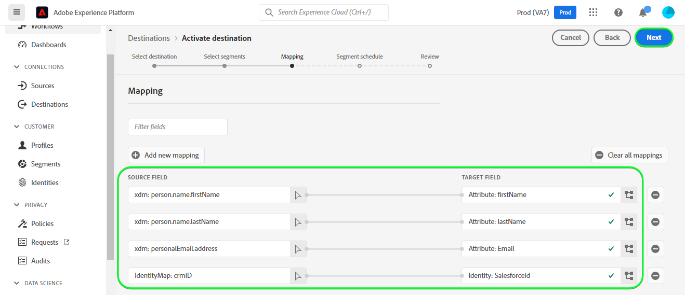

# [!DNL Salesforce CRM] verbinding

## Overzicht {#overview}

[[!DNL Salesforce CRM]](https://www.salesforce.com/crm/) is een populair CRM-platform (Customer Relationship Management) en biedt ondersteuning voor het volgende:

* [Leads](https://developer.salesforce.com/docs/atlas.en-us.object_reference.meta/object_reference/sforce_api_objects_lead.htm) - Een voorbeeld is de naam van een persoon of bedrijf die (of niet) geïnteresseerd kan zijn in de producten of diensten die u verkoopt.
* [Contactpersonen](https://developer.salesforce.com/docs/atlas.en-us.object_reference.meta/object_reference/sforce_api_objects_contact.htm) - Een contactpersoon is een persoon met wie een van uw vertegenwoordigers een relatie tot stand heeft gebracht en gekwalificeerd is als potentiële klant.

Dit [!DNL Adobe Experience Platform] [doel](/help/destinations/home.md) gebruikt de [[!DNL Salesforce composite API]](https://developer.salesforce.com/docs/atlas.en-us.api_rest.meta/api_rest/resources_composite_sobjects_collections_update.htm), die beide hierboven beschreven typen profielen ondersteunt.

Wanneer [activeren, segmenten](#activate), kunt u tussen of lood of contacten selecteren en attributen en segmentgegevens bijwerken in [!DNL Salesforce CRM].

[!DNL Salesforce CRM] gebruikt OAuth 2 met de Verlening van het Wachtwoord als authentificatiemechanisme om met Salesforce REST API te communiceren. Instructies voor verificatie aan uw [!DNL Salesforce CRM] de instantie is verder onderaan, in de [Verifiëren voor bestemming](#authenticate) sectie.

## Gebruiksscenario’s {#use-cases}

Als markeerteken kunt u uw gebruikers een persoonlijke ervaring bieden op basis van kenmerken uit hun Adobe Experience Platform-profielen. U kunt segmenten van uw off-line gegevens bouwen en deze segmenten naar Salesforce CRM verzenden, om in de feeds van de gebruikers te tonen zodra de segmenten en de profielen in Adobe Experience Platform worden bijgewerkt.

## Vereisten {#prerequisites}

### Vereisten in Experience Platform {#prerequisites-in-experience-platform}

Alvorens gegevens aan de bestemming van Salesforce CRM te activeren, moet u een [schema](/help/xdm/schema/composition.md), [gegevensset](https://experienceleague.adobe.com/docs/platform-learn/tutorials/data-ingestion/create-datasets-and-ingest-data.html?lang=en), en [segmenten](https://experienceleague.adobe.com/docs/platform-learn/tutorials/segments/create-segments.html?lang=en) gemaakt in [!DNL Experience Platform].

### Vereisten in [!DNL Salesforce CRM] {#prerequisites-destination}

Houd rekening met de volgende voorwaarden in [!DNL Salesforce CRM]om gegevens van Platform naar uw Salesforce-account te exporteren:

#### U moet een Salesforce-account hebben {#prerequisites-account}

Ga naar de Salesforce [proefversie](https://www.salesforce.com/in/form/signup/freetrial-sales/) pagina om een Salesforce-account te registreren en te maken, als u er nog geen hebt.

#### Een verbonden app configureren {#prerequisites-connected-app}

Vervolgens moet u een [verbonden app](https://help.salesforce.com/s/articleView?id=sf.connected_app_create.htm&amp;language=en_US&amp;r=https%3A%2F%2Fhelp.salesforce.com%2F&amp;type=5) binnen je Salesforce-account als je er nog geen hebt.

Controleer in de verbonden app of [OAuth-instellingen](https://help.salesforce.com/s/articleView?id=connected_app_create_api_integration.htm&amp;type=5&amp;language=en_US) is ingeschakeld.

Zorg er ook voor dat de [bereik](https://help.salesforce.com/s/articleView?id=connected_app_create_api_integration.htm&amp;type=5&amp;language=en_US) hieronder vermeld worden geselecteerd.

* ``chatter_api``
* ``lightning``
* ``visualforce``
* ``content``
* ``openid``
* ``full``
* ``api``
* ``web``
* ``refresh_token``
* ``offline_access``

#### Aangepast veld maken in Salesforce {#prerequisites-custom-field}

Het aangepaste tekstveld maken `Text Area Long`, welk Experience Platform zal gebruiken om de segmentstatus binnen bij te werken [!DNL Salesforce CRM].
Raadpleeg de documentatie bij Salesforce op [aangepaste velden maken](https://help.salesforce.com/s/articleView?id=sf.adding_fields.htm&amp;type=5) als u aanvullende instructies nodig hebt.

>[!IMPORTANT]
>
>Zorg ervoor dat de veldnaam geen spatietekens bevat. Gebruik in plaats daarvan het onderstrepingsteken `(_)` als scheidingsteken.

>[!NOTE]
>
>* Objecten in Salesforce zijn beperkt tot 25 externe velden. Zie [Kenmerken van aangepast veld](https://help.salesforce.com/s/articleView?id=sf.custom_field_attributes.htm&amp;type=5).
>* Deze beperking impliceert dat u een maximum van 25 Experience Platform segmentlidmaatschap kunt hebben actief op elk ogenblik.
>* Als u deze grens binnen Salesforce hebt bereikt, moet u de douaneattributen uit Salesforce verwijderen die werden gebruikt om de segmentstatus tegen oudere segmenten binnen Experience Platform vóór een nieuw op te slaan **[!UICONTROL Mapping ID]** kan worden gebruikt.

Raadpleeg de documentatie bij Adobe Experience Platform voor [Segment Membership Details schema groep](/help/xdm/field-groups/profile/segmentation.md) als u begeleiding op segmentstatussen nodig hebt.

#### Referenties van Salesforce verzamelen {#gather-credentials}

Noteer de onderstaande items voordat u deze verifieert voor de [!DNL Salesforce CRM] bestemming:

| Credentials | Beschrijving | Voorbeeld |
| --- | --- | --- |
| <ul><li>Salesforce-domeinvoorvoegsel</li></ul> | Zie [Salesforce-domeinvoorvoegsel](https://help.salesforce.com/s/articleView?id=sf.domain_name_setting_login_policy.htm&amp;type=5) voor aanvullende richtsnoeren. | <ul><li>Als uw domein is zoals hieronder, hebt u de benadrukte waarde nodig.  <i>`d5i000000isb4eak-dev-ed`.my.salesforce.com</i></li></ul> |
| <ul><li>Consumentencode</li><li>Consumentengeheim</li></ul> | Zie de [Salesforce-documentatie](https://help.salesforce.com/s/articleView?id=sf.connected_app_rotate_consumer_details.htm&amp;type=5) als u aanvullende instructies nodig hebt. | <ul><li>r23kxxxxxx0z05xxxxxx</code></li><li>ipxxxxxxxxT4xxxxxxxx</code></li></ul> |

### Guardrails {#guardrails}

Salesforce verdeelt transactieladingen door verzoek, tarief en onderbrekingsgrenzen op te leggen. Zie de [Limieten en toewijzingen voor API-aanvragen](https://developer.salesforce.com/docs/atlas.en-us.salesforce_app_limits_cheatsheet.meta/salesforce_app_limits_cheatsheet/salesforce_app_limits_platform_api.htm) voor meer informatie.

>[!IMPORTANT]
>
>Wanneer [activeren, segmenten](#activate) u moet kiezen tussen *Contact* of *Lood* typen. U moet ervoor zorgen dat de segmenten de juiste gegevenstoewijzing hebben op basis van het geselecteerde type.

## Ondersteunde identiteiten {#supported-identities}

[!DNL Salesforce CRM] ondersteunt het bijwerken van de identiteiten die in de onderstaande tabel worden beschreven. Meer informatie over [identiteiten](/help/identity-service/namespaces.md).

| Doelidentiteit | Beschrijving | Overwegingen |
|---|---|---|
| `SalesforceId` | De [!DNL Salesforce CRM] id voor de contact- of loodidentiteiten die u uitvoert of door uw segment bijwerkt. | Verplicht |

## Type en frequentie exporteren {#export-type-frequency}

Raadpleeg de onderstaande tabel voor informatie over het exporttype en de exportfrequentie van de bestemming.

| Item | Type | Notities |
---------|----------|---------|
| Exporttype | **[!UICONTROL Profile-based]** | <ul><li>U exporteert alle leden van een segment samen met de gewenste schemavelden *(bijvoorbeeld: e-mailadres, telefoonnummer, achternaam)*, op basis van uw veldtoewijzing.</li><li> Elke segmentstatus in [!DNL Salesforce CRM] wordt bijgewerkt met de corresponderende segmentstatus van het Platform, gebaseerd op de **[!UICONTROL Mapping ID]** waarde die tijdens de [segment plannen](#schedule-segment-export-example) stap.</li></ul> |
| Uitvoerfrequentie | **[!UICONTROL Streaming]** | <ul><li>Streaming doelen zijn &quot;altijd aan&quot; API-verbindingen. Zodra een profiel in Experience Platform wordt bijgewerkt dat op segmentevaluatie wordt gebaseerd, verzendt de schakelaar de update stroomafwaarts naar het bestemmingsplatform. Meer informatie over [streaming doelen](/help/destinations/destination-types.md#streaming-destinations).</li></ul> |

{style=&quot;table-layout:auto&quot;}

## Verbinden met de bestemming {#connect}

>[!IMPORTANT]
>
>Om met de bestemming te verbinden, hebt u nodig **[!UICONTROL Manage Destinations]** [toegangsbeheermachtiging](/help/access-control/home.md#permissions). Lees de [toegangsbeheeroverzicht](/help/access-control/ui/overview.md) of neem contact op met de productbeheerder om de vereiste machtigingen te verkrijgen.

Als u verbinding wilt maken met dit doel, voert u de stappen uit die worden beschreven in het dialoogvenster [zelfstudie over doelconfiguratie](../../ui/connect-destination.md). In vormen bestemmingswerkschema, vul de gebieden in die in de twee hieronder secties worden vermeld.

Within **[!UICONTROL Destinations]** > **[!UICONTROL Catalog]** zoeken naar [!DNL Salesforce CRM]. U kunt de locatie ook onder de **[!UICONTROL CRM]** categorie.

### Verifiëren voor bestemming {#authenticate}

Als u zich wilt verifiëren bij de bestemming, vult u de vereiste velden in en selecteert u **[!UICONTROL Connect to destination]**.

* **[!UICONTROL Password]**: Wachtwoord voor uw Salesforce-account.
* **[!UICONTROL Custom Domain]**: Uw Salesforce-domein.
* **[!UICONTROL Client ID]**: Uw Salesforce-verbonden app Consumer Key.
* **[!UICONTROL Client Secret]**: Uw Salesforce-verbonden app Consumentengeheim.
* **[!UICONTROL Username]**: Gebruikersnaam voor uw Salesforce-account.

Als de verstrekte gegevens geldig zijn, geeft de interface een **[!UICONTROL Connected]** Als u een groene markering hebt, kunt u verdergaan met de volgende stap.

### Doelgegevens invullen {#destination-details}

Als u details voor de bestemming wilt configureren, vult u de vereiste en optionele velden hieronder in. Een sterretje naast een veld in de gebruikersinterface geeft aan dat het veld verplicht is.

* **[!UICONTROL Name]**: Een naam waarmee u deze bestemming in de toekomst zult erkennen.
* **[!UICONTROL Description]**: Een beschrijving die u zal helpen deze bestemming in de toekomst identificeren.
* **[!UICONTROL Salesforce ID Type]**: Selecteren **[!UICONTROL Contact]** als de identiteiten die u wilt exporteren of bijwerken van type zijn *Contact*. Selecteren **[!UICONTROL Lead]** als de identiteiten die u wilt exporteren of bijwerken van type zijn *Lood*.

### Waarschuwingen inschakelen {#enable-alerts}

U kunt alarm toelaten om berichten over de status van dataflow aan uw bestemming te ontvangen. Selecteer een waarschuwing in de lijst om u te abonneren op meldingen over de status van uw gegevensstroom. Voor meer informatie over waarschuwingen raadpleegt u de handleiding over [het abonneren aan bestemmingen alarm gebruikend UI](../../ui/alerts.md).

Wanneer u klaar bent met het opgeven van details voor uw doelverbinding, selecteert u **[!UICONTROL Next]**.

## Segmenten naar dit doel activeren {#activate}

>[!IMPORTANT]
>
>Als u gegevens wilt activeren, hebt u de opdracht **[!UICONTROL Manage Destinations]**, **[!UICONTROL Activate Destinations]**, **[!UICONTROL View Profiles]**, en **[!UICONTROL View Segments]** [toegangsbeheermachtigingen](/help/access-control/home.md#permissions). Lees de [toegangsbeheeroverzicht](/help/access-control/ui/overview.md) of neem contact op met de productbeheerder om de vereiste machtigingen te verkrijgen.

Lezen [Profielen en segmenten activeren voor streaming segmentexportdoelen](/help/destinations/ui/activate-segment-streaming-destinations.md) voor instructies bij het activeren van publiekssegmenten aan deze bestemming.

### Afbeeldingsoverwegingen en voorbeeld {#mapping-considerations-example}

Als u uw publieksgegevens correct vanuit Adobe Experience Platform naar de [!DNL Salesforce CRM] doel, moet u door de stap van de gebiedstoewijzing gaan. Toewijzing bestaat uit het maken van een koppeling tussen de schemavelden van uw Experience Data Model (XDM) in uw Platform-account en de bijbehorende equivalenten van de doelbestemming. Uw XDM-velden op de juiste wijze toewijzen aan de [!DNL Salesforce CRM] doelvelden, voer de volgende stappen uit:

1. In de **[!UICONTROL Mapping]** stap, selecteren **[!UICONTROL Add new mapping]**, ziet u een nieuwe toewijzingsrij op het scherm.
   

1. In de **[!UICONTROL Select source field]** venster, kiest u de **[!UICONTROL Select identity namespace]** of **[!UICONTROL Select Attributes]** categorie en selecteer `crmID`.
   

1. In de **[!UICONTROL Select target field]** venster, kiest u de **[!UICONTROL Select identity namespace]** categorie en selecteer `SalesforceId`.
   

   * Voeg de volgende afbeelding toe tussen uw XDM-profielschema en uw [!DNL Salesforce CRM] instantie:
   | XDM-profielschema | [!DNL Salesforce CRM] Instantie | Verplicht |
   |---|---|---|
   | `crmID` | `SalesforceId` | Ja |

   * **[!UICONTROL Select custom attributes]**: Selecteer deze optie om uw bronveld toe te wijzen aan een aangepast kenmerk dat u in het dialoogvenster **[!UICONTROL Attribute name]** veld. Zie de [[!DNL Salesforce CRM] documentatie](https://help.salesforce.com/s/articleView?id=sf.custom_field_attributes.htm&amp;type=5) voor richtsnoeren over ondersteunde kenmerken.
      

   * Als u met werkt *Contactpersonen* binnen uw segment, verwijs naar de Verwijzing van Objecten in Salesforce voor [Contact](https://developer.salesforce.com/docs/atlas.en-us.object_reference.meta/object_reference/sforce_api_objects_contact.htm) om toewijzingen te definiëren voor de velden die moeten worden bijgewerkt.
   * U kunt verplichte velden identificeren door te zoeken naar het woord *Vereist*, die wordt genoemd in de veldbeschrijvingen in de bovenstaande koppeling.
   * Afhankelijk van de velden die u wilt exporteren of bijwerken, voegt u toewijzingen toe tussen uw XDM-profielschema en uw [!DNL Salesforce CRM] instantie:

   | XDM-profielschema | [!DNL Salesforce CRM] Instantie | Notities |
   | --- | --- | --- |
   | `person.name.lastName` | `LastName` | `Required`. Achternaam van de contactpersoon mag maximaal 80 tekens bevatten. |
   | `person.name.firstName` | `FirstName` | De voornaam van de contactpersoon mag maximaal 40 tekens bevatten. |
   | `personalEmail.address` | `Email` | Het e-mailadres van de contactpersoon. |

   * Hieronder ziet u een voorbeeld waarin deze toewijzingen worden gebruikt:
      

   * Als u met werkt *Leads* binnen uw segment, verwijs naar de Verwijzing van Objecten in Salesforce voor [Lood](https://developer.salesforce.com/docs/atlas.en-us.object_reference.meta/object_reference/sforce_api_objects_lead.htm) om toewijzingen te definiëren voor de velden die moeten worden bijgewerkt.
   * U kunt verplichte velden identificeren door te zoeken naar het woord *Vereist*, die wordt genoemd in de veldbeschrijvingen in de bovenstaande koppeling.
   * Afhankelijk van de velden die u wilt exporteren of bijwerken, voegt u toewijzingen toe tussen uw XDM-profielschema en uw [!DNL Salesforce CRM] instantie:

   | XDM-profielschema | [!DNL Salesforce CRM] Instantie | Notities |
   | --- | --- | --- |
   | `person.name.lastName` | `LastName` | `Required`. Achternaam van de contactpersoon mag maximaal 80 tekens bevatten. |
   | `b2b.companyName` | `Company` | `Required`. Het bedrijf van de leider. |
   | `personalEmail.address` | `Email` | Het e-mailadres van de contactpersoon. |

   * Hieronder ziet u een voorbeeld waarin deze toewijzingen worden gebruikt:
      

### De segmentuitvoer van het programma en voorbeeld {#schedule-segment-export-example}

Bij het uitvoeren van de [Segmentexport plannen](/help/destinations/ui/activate-segment-streaming-destinations.md#scheduling) stap u moet de segmenten van het Platform aan het attribuut van het douanegebied in Salesforce manueel in kaart brengen.

Om dit te doen, selecteer elk segment, dan ga de overeenkomstige attributen van het douaneveld van Salesforce in **[!UICONTROL Mapping ID]** veld.

>[!IMPORTANT]
>
>* De waarde die wordt gebruikt voor de **[!UICONTROL Mapping ID]** moet exact overeenkomen met de naam van het aangepaste veldkenmerk dat in Salesforce is gemaakt.
>* Zorg ervoor dat de naam van het aangepaste veldkenmerk dat u in Salesforce hebt gemaakt, geen teken voor witruimte gebruikt.

Hieronder ziet u een voorbeeld:

## Gegevens exporteren valideren {#exported-data}

Volg onderstaande stappen om te controleren of u de bestemming correct hebt ingesteld:

1. Selecteren **[!UICONTROL Destinations]** > **[!UICONTROL Browse]** om naar de lijst met bestemmingen te navigeren.
   

1. Selecteer het doel en controleer of de status **[!UICONTROL enabled]**.
   

1. Naar de **[!UICONTROL Activation data]** selecteert u vervolgens een segmentnaam.
   

1. Controleer de samenvatting van het segment en zorg ervoor dat de telling van profielen aan de telling beantwoordt die binnen het segment wordt gecreeerd.
   

1. Meld u ten slotte aan bij de Salesforce-website en bevestig of de profielen uit het segment zijn toegevoegd of bijgewerkt.
   * Als u *Contactpersonen* binnen uw segment van het Platform, navigeer aan **[!DNL Apps]** > **[!DNL Contacts]** pagina.
      

   * Selecteer een *Contact* en controleer of de velden zijn bijgewerkt. U kunt zien dat elke segmentstatus in [!DNL Salesforce CRM] werd bijgewerkt met de overeenkomstige segmentstatus van Platform, gebaseerd op **[!UICONTROL Mapping ID]** waarde die tijdens de [segment plannen](#schedule-segment-export-example).
      

   * Als u *Leads* binnen uw segment van het Platform, dan navigeer aan **[!DNL Apps]** > **[!DNL Leads]** pagina.
      

   * Selecteer een *Lood* en controleer of de velden zijn bijgewerkt. U kunt zien dat elke segmentstatus in [!DNL Salesforce CRM] werd bijgewerkt met de overeenkomstige segmentstatus van Platform, gebaseerd op **[!UICONTROL Mapping ID]** waarde die tijdens de [segment plannen](#schedule-segment-export-example).
      

## Gegevensgebruik en -beheer {#data-usage-governance}

Alles [!DNL Adobe Experience Platform] de bestemmingen zijn volgzaam met het beleid van het gegevensgebruik wanneer het behandelen van uw gegevens. Voor gedetailleerde informatie over hoe [!DNL Adobe Experience Platform] handhaaft gegevensbeheer, zie [Overzicht van gegevensbeheer](/help/data-governance/home.md).

## Fouten en problemen oplossen {#errors-and-troubleshooting}

### Onbekende fouten aangetroffen tijdens het naar de bestemming duwen van gebeurtenissen {#unknown-errors}

Wanneer u een gegevensstroom controleert, als u het volgende foutbericht krijgt: `Unknown errors encountered while pushing events to the destination. Please contact the administrator and try again.`

Om deze fout te bevestigen, verifieer dat **[!UICONTROL Mapping ID]** u hebt opgegeven in [!DNL Salesforce CRM] voor uw segment van het Platform is geldig en bestaat binnen [!DNL Salesforce CRM].

## Aanvullende bronnen {#additional-resources}

Aanvullende nuttige informatie uit de [Salesforce Developer Portal](https://developer.salesforce.com/) is lager dan:
* [Snel starten](https://developer.salesforce.com/docs/atlas.en-us.api_rest.meta/api_rest/quickstart.htm)
* [Een record maken](https://developer.salesforce.com/docs/atlas.en-us.api_rest.meta/api_rest/dome_sobject_create.htm)
* [Aangepaste aanbevelingen publiek](https://developer.salesforce.com/docs/atlas.en-us.236.0.chatterapi.meta/chatterapi/connect_resources_recommendation_audiences_list.htm)
* [Samengestelde bronnen gebruiken](https://developer.salesforce.com/docs/atlas.en-us.api_rest.meta/api_rest/using_composite_resources.htm?q=composite)
* Deze bestemming gebruikt de [Meerdere records bijwerken](https://developer.salesforce.com/docs/atlas.en-us.api_rest.meta/api_rest/resources_composite_sobjects_collections_update.htm) API in plaats van de [Eén record bijwerken](https://developer.salesforce.com/docs/atlas.en-us.api_rest.meta/api_rest/dome_composite_upsert_example.htm?q=contacts) API-aanroep.