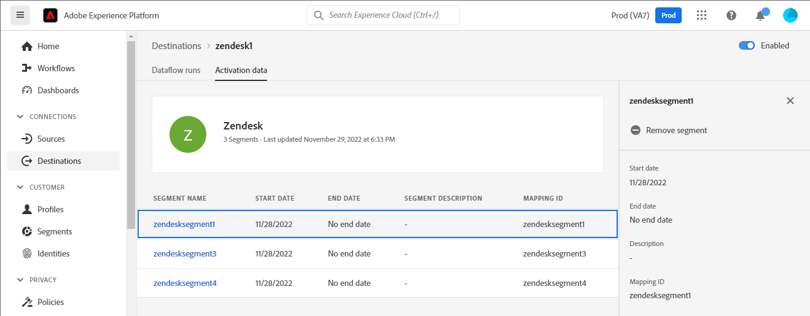

# [!DNL Zendesk] verbinding

[[!DNL Zendesk]](https://www.zendesk.com) is een oplossing van de klantendienst en verkoophulpmiddel.

Dit [!DNL Adobe Experience Platform] [doel](/help/destinations/home.md) gebruikt de [[!DNL Zendesk] Contactpersonen-API](https://developer.zendesk.com/api-reference/sales-crm/resources/contacts/), naar **identiteiten maken en bijwerken** binnen een publiek als contacten binnen [!DNL Zendesk].

[!DNL Zendesk] gebruikt dragertokens als authentificatiemechanisme om met het [!DNL Zendesk] Contactpersonen-API. Instructies voor verificatie aan uw [!DNL Zendesk] de instantie is verder onderaan, in de [Verifiëren voor bestemming](#authenticate) sectie.

## Gebruiksscenario’s {#use-cases}

De klantendienst van een multichannel B2C platform wil een naadloze gepersonaliseerde ervaring voor zijn klanten verzekeren. De afdeling kan een publiek maken op basis van hun eigen offline gegevens om nieuwe gebruikersprofielen te maken of bestaande profielgegevens bij te werken op basis van verschillende interacties (bijvoorbeeld aankopen, retourneren, enz.) en stuur deze soorten publiek van Adobe Experience Platform naar [!DNL Zendesk]. Als u de bijgewerkte informatie in [!DNL Zendesk] zorgt ervoor dat de agent van de klantendienst de recente informatie van de klant onmiddellijk beschikbaar heeft, toelatend snellere reacties en resolutie.

## Vereisten {#prerequisites}

### Voorwaarden voor Experience Platforms {#prerequisites-in-experience-platform}

Voordat u gegevens activeert naar de [!DNL Zendesk] doel, u moet een [schema](/help/xdm/schema/composition.md), [gegevensset](https://experienceleague.adobe.com/docs/platform-learn/tutorials/data-ingestion/create-datasets-and-ingest-data.html?lang=en), en [segmenten](https://experienceleague.adobe.com/docs/platform-learn/tutorials/segments/create-segments.html?lang=en) gemaakt in [!DNL Experience Platform].

Raadpleeg de documentatie bij het Experience Platform voor [Publiek Lidmaatschap Details schema groep](/help/xdm/field-groups/profile/segmentation.md) als u hulp over publieksstatus nodig hebt.

### [!DNL Zendesk] voorwaarden {#prerequisites-destination}

Als u gegevens van Platform naar uw wilt exporteren [!DNL Zendesk] account die u nodig hebt [!DNL Zendesk] account.

#### Gather [!DNL Zendesk] geloofsbrieven {#gather-credentials}

Noteer de onderstaande items voordat u deze verifieert voor de [!DNL Zendesk] bestemming:

| Credentials | Beschrijving | Voorbeeld |
| --- | --- | --- |
| `Bearer token` | Het toegangstoken u in uw hebt geproduceerd [!DNL Zendesk] account.   Volg de documentatie om [een [!DNL Zendesk] toegangstoken](https://developer.zendesk.com/documentation/sales-crm/first-call/#1-generate-an-access-token) als u er geen hebt. | `a0b1c2d3e4...v20w21x22y23z` |

## Guardrails {#guardrails}

De [Prijs- en snelheidslimieten](https://developer.zendesk.com/api-reference/sales-crm/rate-limits/#pricing) pagina bevat de details van [!DNL Zendesk] API-limieten die aan uw account zijn gekoppeld. U moet ervoor zorgen dat uw gegevens en lading binnen deze beperkingen zijn.

## Ondersteunde identiteiten {#supported-identities}

[!DNL Zendesk] ondersteunt het bijwerken van de identiteiten die in de onderstaande tabel worden beschreven. Meer informatie over [identiteiten](/help/identity-service/namespaces.md).

| Doelidentiteit | Voorbeeld | Beschrijving | Verplicht |
|---|---|---|---|
| `email` | `test@test.com` | E-mailadres van de contactpersoon. | Ja |

## Type en frequentie exporteren {#export-type-frequency}

Raadpleeg de onderstaande tabel voor informatie over het exporttype en de exportfrequentie van de bestemming.

| Item | Type | Notities |
---------|----------|---------|
| Exporttype | **[!UICONTROL Profile-based]** | <ul><li>U exporteert alle leden van een segment samen met de gewenste schemavelden *(bijvoorbeeld: e-mailadres, telefoonnummer, achternaam)*, op basis van uw veldtoewijzing.</li><li> Elke segmentstatus in [!DNL Zendesk] wordt bijgewerkt met de corresponderende publieksstatus van Platform, gebaseerd op de **[!UICONTROL Mapping ID]** waarde die tijdens de [publieksplanning](#schedule-segment-export-example) stap.</li></ul> |
| Exportfrequentie | **[!UICONTROL Streaming]** | <ul><li>Streaming doelen zijn &quot;altijd aan&quot; API-verbindingen. Zodra een profiel in Experience Platform wordt bijgewerkt dat op publieksevaluatie wordt gebaseerd, verzendt de schakelaar de update stroomafwaarts naar het bestemmingsplatform. Meer informatie over [streaming doelen](/help/destinations/destination-types.md#streaming-destinations).</li></ul> |

{style="table-layout:auto"}

## Verbinden met de bestemming {#connect}

>[!IMPORTANT]
>
>Om met de bestemming te verbinden, hebt u nodig **[!UICONTROL Manage Destinations]** [toegangsbeheermachtiging](/help/access-control/home.md#permissions). Lees de [toegangsbeheeroverzicht](/help/access-control/ui/overview.md) of neem contact op met de productbeheerder om de vereiste machtigingen te verkrijgen.

Als u verbinding wilt maken met dit doel, voert u de stappen uit die in het dialoogvenster [zelfstudie over doelconfiguratie](../../ui/connect-destination.md). In vormen bestemmingswerkschema, vul de gebieden in die in de twee hieronder secties worden vermeld.

Within **[!UICONTROL Destinations]** > **[!UICONTROL Catalog]** zoeken naar [!DNL Zendesk]. U kunt de locatie ook onder de **[!UICONTROL CRM]** categorie.

### Verifiëren voor bestemming {#authenticate}

Vul de vereiste velden hieronder in. Zie de [Gather [!DNL Zendesk] geloofsbrieven](#gather-credentials) voor eventuele richtsnoeren.
* **[!UICONTROL Bearer Token]**: Het toegangstoken dat u in uw [!DNL Zendesk] account.

Om voor authentiek te verklaren aan de bestemming, uitgezocht **[!UICONTROL Connect to destination]**.

Als de verstrekte gegevens geldig zijn, geeft de interface een **[!UICONTROL Connected]** status met een groen vinkje. Vervolgens kunt u verdergaan met de volgende stap.

### Doelgegevens invullen {#destination-details}

Als u details voor de bestemming wilt configureren, vult u de vereiste en optionele velden hieronder in. Een sterretje naast een veld in de gebruikersinterface geeft aan dat het veld verplicht is.

* **[!UICONTROL Name]**: Een naam waarmee u dit doel in de toekomst wilt herkennen.
* **[!UICONTROL Description]**: Een beschrijving die u zal helpen deze bestemming in de toekomst identificeren.

### Waarschuwingen inschakelen {#enable-alerts}

U kunt alarm toelaten om berichten over de status van dataflow aan uw bestemming te ontvangen. Selecteer een waarschuwing in de lijst om u te abonneren op meldingen over de status van uw gegevensstroom. Zie de handleiding voor meer informatie over waarschuwingen [abonneren op bestemmingen die het alarm gebruiken UI](../../ui/alerts.md).

Wanneer u klaar bent met het opgeven van details voor uw doelverbinding, selecteert u **[!UICONTROL Next]**.

## Soorten publiek naar dit doel activeren {#activate}

>[!IMPORTANT]
> 
>* Als u gegevens wilt activeren, hebt u de opdracht **[!UICONTROL Manage Destinations]**, **[!UICONTROL Activate Destinations]**, **[!UICONTROL View Profiles]**, en **[!UICONTROL View Segments]** [toegangsbeheermachtigingen](/help/access-control/home.md#permissions). Lees de [toegangsbeheeroverzicht](/help/access-control/ui/overview.md) of neem contact op met de productbeheerder om de vereiste machtigingen te verkrijgen.
>* Om te exporteren *identiteiten*, hebt u de **[!UICONTROL View Identity Graph]** [toegangsbeheermachtiging](/help/access-control/home.md#permissions).   {width="100" zoomable="yes"}

Lezen [Profielen en doelgroepen activeren voor het streamen van doelgroepen voor het exporteren van bestanden](/help/destinations/ui/activate-segment-streaming-destinations.md) voor instructies voor het activeren van het publiek naar deze bestemming.

### Afbeeldingsoverwegingen en voorbeeld {#mapping-considerations-example}

Als u uw publieksgegevens correct vanuit Adobe Experience Platform naar de [!DNL Zendesk] doel, moet u door de stap van de gebiedstoewijzing gaan. Toewijzing bestaat uit het maken van een koppeling tussen de schemavelden van uw Experience Data Model (XDM) in uw Platform-account en de bijbehorende equivalenten van de doelbestemming.

Kenmerken die zijn opgegeven in het dialoogvenster **[!UICONTROL Target field]** zou precies moeten worden genoemd zoals die in de lijst van attributenafbeeldingen wordt beschreven aangezien deze attributen de verzoeklichaam zullen vormen.

Kenmerken die zijn opgegeven in het dialoogvenster **[!UICONTROL Source field]** zich niet aan een dergelijke beperking houden. U kunt deze toewijzen op basis van uw behoefte, maar als de gegevensindeling niet correct is wanneer u naar [!DNL Zendesk] resulteert in een fout.

Uw XDM-velden op de juiste wijze toewijzen aan de [!DNL Zendesk] doelvelden, voer de volgende stappen uit:

1. In de **[!UICONTROL Mapping]** stap, selecteren **[!UICONTROL Add new mapping]**. Er verschijnt een nieuwe toewijzingsrij op het scherm.
1. In de **[!UICONTROL Select source field]** venster, kiest u de **[!UICONTROL Select attributes]** en selecteer het XDM-kenmerk of kies de **[!UICONTROL Select identity namespace]** en selecteer een identiteit.
1. In de **[!UICONTROL Select target field]** venster, kiest u de **[!UICONTROL Select identity namespace]** en selecteer een doelidentiteit of kies de categorie **[!UICONTROL Select attributes]** en selecteer een van de ondersteunde schemakenmerken.
   * Herhaal deze stappen om de volgende verplichte toewijzingen toe te voegen, kunt u ook andere kenmerken toevoegen die u tussen uw XDM-profielschema en uw [!DNL Zendesk] -instantie: |Bronveld|Doelveld| Verplicht| |—|—|—| |`xdm: person.name.lastName`|`xdm: last_name`| Ja | |`IdentityMap: Email`|`Identity: email`| Ja | |`xdm: person.name.firstName`|`xdm: first_name`| |

   * Hieronder ziet u een voorbeeld waarin deze toewijzingen worden gebruikt:
     

>[!IMPORTANT]
>
>De `Attribute: last_name` en `Identity: email` doeltoewijzingen zijn verplicht voor deze bestemming. Als deze toewijzingen ontbreken, worden andere toewijzingen genegeerd en niet verzonden naar [!DNL Zendesk].

Wanneer u klaar bent met het opgeven van de toewijzingen voor uw doelverbinding, selecteert u **[!UICONTROL Next]**.

### Het publiek van het programma uitvoeren en voorbeeld {#schedule-segment-export-example}

In de [[!UICONTROL Schedule audience export]](/help/destinations/ui/activate-segment-streaming-destinations.md#scheduling) Als u een stap wilt zetten in de activeringsworkflow, moet u het publiek van het platform handmatig toewijzen aan het aangepaste veldkenmerk in [!DNL Zendesk].

Om dit te doen, selecteer elk segment, dan ga het overeenkomstige attribuut van het douaneveld van in [!DNL Zendesk] in de **[!UICONTROL Mapping ID]** veld.

Hieronder ziet u een voorbeeld:

## Gegevens exporteren valideren {#exported-data}

Volg onderstaande stappen om te controleren of u de bestemming correct hebt ingesteld:

1. Selecteren **[!UICONTROL Destinations]** > **[!UICONTROL Browse]** en navigeer naar de lijst met bestemmingen.
1. Selecteer vervolgens de bestemming en schakel over naar de **[!UICONTROL Activation data]** en selecteert u vervolgens de naam van een publiek.
   

1. Controleer het publieksoverzicht en zorg ervoor dat de telling van profielen aan de telling binnen het segment beantwoordt.
   

1. Aanmelden bij de [!DNL Zendesk] website, navigeer vervolgens naar de **[!UICONTROL Contacts]** pagina om te controleren of de profielen van het publiek zijn toegevoegd. Deze lijst kan worden gevormd om kolommen voor de extra gebieden te tonen die met het publiek worden gecreeerd**[!UICONTROL Mapping ID]** en de status van het publiek.
   

1. U kunt ook naar beneden boren in een individu **[!UICONTROL Person]** pagina en controleer de **[!UICONTROL Additional fields]** de publieksnaam en de publieksstatus.
   

## Gegevensgebruik en -beheer {#data-usage-governance}

Alles [!DNL Adobe Experience Platform] de bestemmingen zijn volgzaam met het beleid van het gegevensgebruik wanneer het behandelen van uw gegevens. Voor gedetailleerde informatie over hoe [!DNL Adobe Experience Platform] handhaaft gegevensbeheer, zie [Overzicht van gegevensbeheer](/help/data-governance/home.md).

## Aanvullende bronnen {#additional-resources}

Aanvullende nuttige informatie uit de [!DNL Zendesk] de documentatie is hieronder:
* [Je eerste telefoontje maken](https://developer.zendesk.com/documentation/sales-crm/first-call/)
* [Aangepaste velden](https://developer.zendesk.com/api-reference/sales-crm/requests/#custom-fields)

### Changelog

Deze sectie vangt de functionaliteit en de significante documentatieupdates aan deze bestemmingsschakelaar worden aangebracht die.

+++ Wijzigingen weergeven

| Releasedatum | Type bijwerken | Beschrijving |
|---|---|---|
| April 2023 | Documentatie bijwerken | <ul><li>We hebben de [gebruikgevallen](#use-cases) een duidelijker voorbeeld van wanneer de klanten van het gebruiken van deze bestemming zouden profiteren.</li> <li>We hebben de [toewijzing](#mapping-considerations-example) om de juiste vereiste toewijzingen te weerspiegelen. De `Attribute: last_name` en `Identity: email` doeltoewijzingen zijn verplicht voor deze bestemming. Als deze toewijzingen ontbreken, worden andere toewijzingen genegeerd en niet verzonden naar [!DNL Zendesk].</li> <li>We hebben de [toewijzing](#mapping-considerations-example) met duidelijke voorbeelden van zowel verplichte als optionele toewijzingen.</li></ul> |
| Maart 2023 | Eerste release | Oorspronkelijke doelversie en documentatie publiceren. |

{style="table-layout:auto"}

+++
