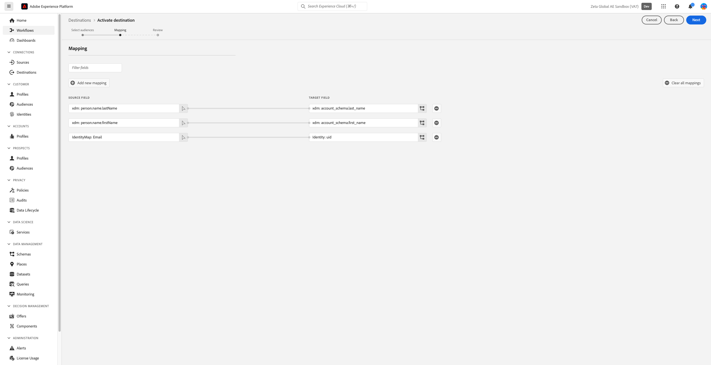

# Zeta Marketing Platform {#zeta-marketing-platform}

## Overzicht {#overview}

Het Zeta Marketing Platform (ZMP) is een cloudgebaseerd systeem dat u helpt klanten op efficiëntere wijze aan te schaffen, uit te breiden en te behouden, aangedreven door intelligentie (bedrijfseigen gegevens en AI). Voor meer details, verwijs naar [&#x200B; Globale Zeta &#x200B;](https://zetaglobal.com/).

Met de Zeta Marketing Platform-aansluiting in Adobe Experience Platform kunt u uw publiek naadloos synchroniseren van Experience Platform naar het ZMP.

>[!IMPORTANT]
>
>De bestemmingsschakelaar en documentatiepagina worden gecreeerd en door het *Globale* team van Zeta gehandhaafd. Voor om het even welke onderzoeken of updateverzoeken, gelieve het team bij [&#x200B; Contact te contacteren ons &#x200B;](https://zetaglobal.com/about/contact-us/).

## Gebruiksscenario’s {#use-cases}

### publiekssegmenten samenstellen {#use-case-build-audiences}

Een markeerder wil unieke publieksprofielen bouwen, hun meest waardevolle segmenten identificeren, en hen over om het even welke digitale kanalen gebruiken die het Platform van de Marketing Zeta steunt. Ze willen een echte 360-weergave van een consumentenprofiel maken, een zinvol publiek opbouwen en activeren. Meer details over welke kanalen de steunen van het Platform van de Marketing van Zeta [&#x200B; hier &#x200B;](https://zetaglobal.com/platform/integrations/) kunnen worden gevonden.

### Doelgebruikers met advertenties {#use-case-target-users}

Een adverteerder richt zich op gebruikers binnen een specifiek publiek via de Zeta Demand Side Platform (DSP), aangezien deze gebruikers met hun merken communiceren. Voor meer informatie over Zeta DSP, klik [&#x200B; hier &#x200B;](https://knowledgebase.zetaglobal.com/pug/).

## Vereisten {#prerequisites}

### Voorwaarden voor het Zeta-marketingplatform

* Voordat u een nieuwe verbinding instelt met de bestemming van het Zeta-marketingplatform, moet u een lege lijst met klanten maken in uw account van het Zeta-marketingplatform. U moet één van deze klantenlijsten als aangewezen doel kiezen om het publiek van Adobe Experience Platform te ontvangen dat u van plan bent te verzenden. U kunt een lege klantenlijst in ZMP tot stand brengen door de instructies [&#x200B; hier &#x200B;](https://knowledgebase.zetaglobal.com/kb/creating-audiences#CreatingAudiences-CreatingaCustomerList) te volgen.
* Hoewel de Adobe Experience Platform de activering van meerdere soorten publiek naar een bepaalde ZMP-doelinstantie toestaat, is het verplicht dat elke ZMP-doelinstantie slechts één Experience Platform-publiek ontvangt. Als u meerdere soorten publiek van de Experience Platform wilt afhandelen, maakt u aanvullende ZMP-doelinstanties voor elk publiek en selecteert u een andere lijst met klanten in het vervolgkeuzemenu. Deze benadering zorgt ervoor dat het doelZMP publiek niet wordt beschreven. Zie [&#x200B; in bestemmingsdetails &#x200B;](#destination-details) voor meer details invullen.
* Gebruik de volgende geloofsbrieven om de bestemming te vormen:
   * Gebruikersnaam: **api**
   * Wachtwoord: uw ZMP REST API-sleutel. U kunt uw REST API Sleutel vinden door aan uw rekening van ZMP het programma te openen en aan **te navigeren Montages** > **Integraties** > **Sleutels &amp; Apps** sectie. Zie de [&#x200B; documentatie van ZMP &#x200B;](https://knowledgebase.zetaglobal.com/kb/integrations) voor meer details.

## Ondersteunde identiteiten {#supported-identities}

[!DNL Zeta Marketing Platform] ondersteunt de activering van aangepaste gebruikers-id&#39;s die in de onderstaande tabel worden beschreven. Voor meer details, zie [&#x200B; identiteiten &#x200B;](/help/identity-service/features/namespaces.md).

>[!IMPORTANT]
> Voor het doel van het Zeta-marketingplatform moet u een naamruimte van de bronidentiteit toewijzen aan de ZMP `uid` -doelidentiteit. Hierdoor kan het Zeta-marketingplatform elk profiel op unieke wijze onderscheiden.

| Doelidentiteit | Beschrijving | Overwegingen | Notities |
|---------|----------|----------|----------|
| uid | Unieke id die ZMP gebruikt om klantprofielen te onderscheiden | Verplicht | Kies de standaardnaamruimte voor identiteiten van `Email` als u unieke profielen wilt identificeren aan de hand van hun e-mailadressen. U kunt ook de aangepaste naamruimte toewijzen aan `uid` als de profielen van klanten geen e-mail hebben. |
| email_md5_id | E-mail MD5 die elk klantprofiel vertegenwoordigt | Optioneel | Kies deze doelidentiteit als u klantprofielen op unieke wijze wilt identificeren aan de hand van MD5-waarden per e-mail. Het is van essentieel belang dat e-mailadressen in de Experience Platform al in de MD5-indeling staan, aangezien de Experience Platform normale tekst niet omzet in MD5. In dit scenario stelt u `uid` (verplicht) in op dezelfde MD5-waarden voor e-mail of een andere geschikte naamruimte voor de identiteit. |

{style="table-layout:auto"}

## Ondersteunde doelgroepen {#supported-audiences}

In deze sectie wordt beschreven welk type publiek u naar dit doel kunt exporteren.

| Oorsprong publiek | Ondersteund | Beschrijving |
|---------|----------|----------|
| [!DNL Segmentation Service] | ✓ | Het publiek produceerde door de Dienst van de Segmentatie van Experience Platform [&#x200B; &#x200B;](../../../segmentation/home.md). |
| Aangepaste uploads | X | Het publiek [&#x200B; ingevoerde &#x200B;](../../../segmentation/ui/audience-portal.md#import-audience) in Experience Platform van Csv- dossiers. |

{style="table-layout:auto"}

>[!NOTE]
> Aangezien de individuele leden worden toegevoegd of uit het publiek van Experience Platform verwijderd, zullen de updates naar ZMP worden verzonden om ervoor te zorgen dat de lijst van de bestemmingsklant dienovereenkomstig wordt gesynchroniseerd.

## Type en frequentie exporteren {#export-type-frequency}

Raadpleeg de onderstaande tabel voor informatie over het exporttype en de exportfrequentie van de bestemming.

| Item | Type | Notities |
|---------|----------|---------|
| Exportfrequentie | **[!UICONTROL Streaming]** | Streaming doelen zijn &quot;altijd aan&quot; API-verbindingen. Zodra een profiel in Experience Platform wordt bijgewerkt dat op segmentevaluatie wordt gebaseerd, verzendt de schakelaar de update stroomafwaarts naar het bestemmingsplatform. Lees meer over [&#x200B; het stromen bestemmingen &#x200B;](/help/destinations/destination-types.md#streaming-destinations). |

{style="table-layout:auto"}

## Verbinden met de bestemming {#connect}

>[!IMPORTANT]
> 
>Om met de bestemming te verbinden, hebt u de **[!UICONTROL Manage Destinations]** [&#x200B; toegangsbeheertoestemming &#x200B;](/help/access-control/home.md#permissions) nodig. Lees het [&#x200B; overzicht van de toegangscontrole &#x200B;](/help/access-control/ui/overview.md) of contacteer uw productbeheerder om de vereiste toestemmingen te verkrijgen.

Om met deze bestemming te verbinden, volg de stappen die in het [&#x200B; leerprogramma van de bestemmingsconfiguratie &#x200B;](../../ui/connect-destination.md) worden beschreven. In vormen bestemmingswerkschema, vul de gebieden in die in de twee hieronder secties worden vermeld.

### Verifiëren voor bestemming {#authenticate}

Als u voor verificatie bij het doel wilt zorgen, vult u de vereiste velden in en selecteert u **[!UICONTROL Connect to destination]** .

* **[!UICONTROL Username]**: `api`
* **[!UICONTROL Password]**: Uw ZMP REST API-sleutel. U kunt uw REST API Sleutel vinden door aan uw rekening van ZMP het programma te openen en aan **te navigeren Montages** > **Integraties** > **Sleutels &amp; Apps** sectie. Zie de [&#x200B; documentatie van ZMP &#x200B;](https://knowledgebase.zetaglobal.com/kb/integrations) voor meer details.

### Doelgegevens invullen {#destination-details}

Als u details voor de bestemming wilt configureren, vult u de vereiste en optionele velden hieronder in. Een sterretje naast een veld in de gebruikersinterface geeft aan dat het veld verplicht is.

* **[!UICONTROL Name]**: Een naam waarmee u dit doel in de toekomst herkent.
* **[!UICONTROL Description]**: Een beschrijving die u zal helpen deze bestemming in de toekomst identificeren.
* **[!UICONTROL ZMP Account Site Id]**: Uw Identiteitskaart van de Plaats van ZMP **&#x200B;**&#x200B;waar u uw publiek naar wilt verzenden. U kunt uw identiteitskaart van de Plaats bekijken door aan **Montages** te navigeren > **Integraties** > **Sleutels &amp; Apps** sectie. Meer informatie kan [&#x200B; hier &#x200B;](https://knowledgebase.zetaglobal.com/kb/integrations) worden gevonden.
* **[!UICONTROL ZMP Segment]**: Het segment met de lijst met klanten in uw ZMP Site Id-account dat u wilt bijwerken met het Experience Platform-publiek.

### Waarschuwingen inschakelen {#enable-alerts}

U kunt alarm toelaten om berichten over de status van dataflow aan uw bestemming te ontvangen. Selecteer een waarschuwing in de lijst om u te abonneren op meldingen over de status van uw gegevensstroom. Voor meer informatie over alarm, zie de gids bij [&#x200B; het intekenen aan bestemmingsalarm gebruikend UI &#x200B;](../../ui/alerts.md).

Wanneer u klaar bent met het opgeven van details voor uw doelverbinding, selecteert u **[!UICONTROL Next]** .

## Segmenten naar dit doel activeren {#activate}

>[!IMPORTANT]
> 
>* Om gegevens te activeren, hebt u **[!UICONTROL Manage Destinations]**, **[!UICONTROL Activate Destinations]**, **[!UICONTROL View Profiles]**, en **[!UICONTROL View Segments]** [&#x200B; toegangsbeheertoestemmingen &#x200B;](/help/access-control/home.md#permissions) nodig. Lees het [&#x200B; overzicht van de toegangscontrole &#x200B;](/help/access-control/ui/overview.md) of contacteer uw productbeheerder om de vereiste toestemmingen te verkrijgen.
>* Om *identiteiten* uit te voeren, hebt u de **[!UICONTROL View Identity Graph]** [&#x200B; toegangsbeheertoestemming &#x200B;](/help/access-control/home.md#permissions) nodig.   {width="100" zoomable="yes"}

Lees [&#x200B; activeer profielen en segmenten aan het stromen segment de uitvoerbestemmingen &#x200B;](/help/destinations/ui/activate-segment-streaming-destinations.md) voor instructies bij het activeren van publiekssegmenten aan deze bestemming.

### Kenmerken en identiteiten toewijzen {#map}

Hieronder ziet u een voorbeeld van correcte identiteitstoewijzing bij het exporteren van profielen naar [!DNL Zeta Marketing Platform] .

Bronvelden selecteren:

* Selecteer een naamruimte voor de bronidentiteit (aangepast of standaard, zoals `Email` ) die een profiel in Adobe Experience Platform en [!DNL Zeta Marketing Platform] op unieke wijze identificeert.
* Selecteer de XDM-bronprofielkenmerken die u wilt exporteren naar en bijwerken in de [!DNL Zeta Marketing Platform] .

Doelvelden selecteren:

* (Verplicht) Selecteer `uid` als de doelidentiteit waaraan u een naamruimte voor de bronidentiteit toewijst.
* (Optioneel) Selecteer `email_md5_id` als de doelidentiteit waaraan u de naamruimte voor de bronidentiteit hebt toegewezen die de md5-waarden voor e-mail vertegenwoordigt. Het is van essentieel belang dat e-mailadressen in de Experience Platform al in de MD5-indeling staan, omdat de Experience Platform normale tekst niet naar MD5 converteert
* Selecteer zo nodig aanvullende doeltoewijzingen.

## Geëxporteerde gegevens/Gegevens valideren bij exporteren {#exported-data}

Een geslaagde activering van het publiek van Experience Platform naar het Zeta Marketing Platform werkt de lijst met doelklanten in het ZMP bij. De telling en de steekproefprofielen in de lijst van de doelklant zullen gelijk zijn aan het aantal identiteiten die met succes werden geactiveerd.

Elk publiekslid dat van Experience Platform werd geactiveerd zal ook onder **Soorten publiek** > **Mensen** in ZMP zichtbaar zijn. U zult ook het **segment van de Lijst van de Klant** kunnen bekijken een profiel tot in de Enige mening van de Klant behoort zoals hieronder getoond.

## Gegevensgebruik en -beheer {#data-usage-governance}

Alle [!DNL Adobe Experience Platform] -doelen zijn compatibel met het beleid voor gegevensgebruik bij het verwerken van uw gegevens. Voor gedetailleerde informatie over hoe [!DNL Adobe Experience Platform] gegevensbeheer afdwingt, lees het [&#x200B; overzicht van het Beleid van Gegevens &#x200B;](/help/data-governance/home.md).

## Aanvullende bronnen {#additional-resources}

* [&#x200B; de Kennisbank van Zeta &#x200B;](https://knowledgebase.zetaglobal.com/kb/)
