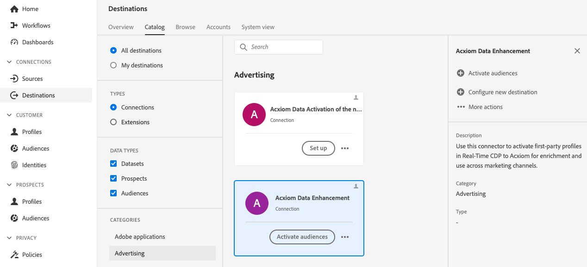

# [!DNL Acxiom Data Enhancement] doelverbinding

>[!NOTE]
>
>Het doel van [!DNL Acxiom Data Enhancement] is in bèta.  Deze bestemmings schakelaar en documentatiepagina worden gecreeerd en door het team van Acxiom gehandhaafd. Voor vragen of verzoeken om updates kunt u rechtstreeks contact opnemen met de afdeling acxiom-adobe-help@acxiom.com.

## Overzicht {#overview}

Gebruik de [!DNL Acxiom Data Enhancement] -connector om aanvullende beschrijvende gegevens aan uw klantprofielen te leveren, voor gebruik in analytische toepassingen, segmentatie en doeltoepassingen. Met honderden beschikbare elementen, staat dit u toe om gegevens te segmenteren en te modelleren, resulterend in nauwkeuriger het richten en voorspellende modellering.

Deze zelfstudie bevat stappen voor het maken van een [!DNL Acxiom Data Enhancement] doelverbinding en gegevensstroom via de Adobe Experience Platform-gebruikersinterface. Deze connector wordt gebruikt om gegevens te leveren aan de Acxiom-verbeteringsservice met Amazon S3 als droppunt.

## Gebruiksscenario’s {#use-cases}

Om u beter te helpen begrijpen hoe en wanneer u de [!DNL Acxiom Data Enhancement] bestemming zou moeten gebruiken, zijn hier voorbeelden van gebruiksgevallen die de klanten van Adobe Experience Platform door deze bestemming kunnen oplossen.

### Klantgegevens verbeteren {#enhance-customer-data}

Deze connector moet worden gebruikt door marketingprofessionals die de doeltreffendheid van hun outreach-strategieën willen verbeteren door geselecteerde beschrijvende elementen toe te voegen aan hun klantprofielen en deze te gebruiken om beter doelgerichte campagnes te voeren.

Als een markeerteken wilt u bijvoorbeeld uw inzicht in bestaande doelgroepen verdiepen door hun profielen te verrijken met aanvullende gegevens. Zo verbetert u de segmentatie en doelgerichte strategieën, wat leidt tot een grotere personalisatie en conversie van de campagne.

Het gebruiksgeval wordt uitgevoerd door een combinatie van zowel bestemmings als bronschakelaars.

U zou beginnen door uw bestaande klantenverslagen voor verrijking te exporteren gebruikend deze bestemmingsschakelaar. De service van Acxiom zoekt naar het bestand, haalt het op, verrijkt het met de gegevens van Acxiom en genereert een bestand.

De klant zou dan de overeenkomstige [&#128279;](/help/sources/connectors/data-partners/acxiom-data-ingestion.md) bronkaart van de Opname van Gegevens van 0&rbrace; Acxiom gebruiken &lbrace;om de gehydrateerde klantenprofielen terug in Adobe Real-Time CDP in te nemen.

## Vereisten {#prerequisites}

>[!IMPORTANT]
>
>* Om met de bestemming te verbinden, hebt u **[!UICONTROL View Destinations]** en **[!UICONTROL Manage Destinations]** nodig, **[!UICONTROL Activate Destinations]**, **[!UICONTROL View Profiles]**, en **[!UICONTROL View Segments]** [&#x200B; toegangsbeheertoestemmingen &#x200B;](/help/access-control/home.md#permissions). Lees het [&#x200B; overzicht van de toegangscontrole &#x200B;](/help/access-control/ui/overview.md) of contacteer uw productbeheerder om de vereiste toestemmingen te verkrijgen.
>* Om *identiteiten* uit te voeren, hebt u de **[!UICONTROL View Identity Graph]** [&#x200B; toegangsbeheertoestemming &#x200B;](/help/access-control/home.md#permissions) nodig.   {width="100" zoomable="yes"}

## Ondersteunde doelgroepen {#supported-audiences}

In deze sectie wordt beschreven welk type publiek u naar dit doel kunt exporteren.

| Oorsprong publiek | Ondersteund | Beschrijving |
|-----------------------------|-----------|---------------------------------------------------------------------------------------------------------------------|
| [!DNL Segmentation Service] | ✓ | Het publiek produceerde door de Dienst van de Segmentatie van het Experience Platform [&#128279;](../../../segmentation/home.md). |
| Aangepaste uploads | x | Het publiek [&#x200B; ingevoerde &#x200B;](../../../segmentation/ui/audience-portal.md#import-audience) in Experience Platform van Csv- dossiers. |

{style="table-layout:auto"}

## Type en frequentie exporteren {#export-type-frequency}

Raadpleeg de onderstaande tabel voor informatie over het exporttype en de exportfrequentie van de bestemming.

| Item | Type | Notities |
|------------------|--------------------------------|------------------------------------------------------------------------------------------------------------------------------------------------------------------------------------------------------------------------------------------------------------------------------------------------------------------------|
| Exporttype | **[!UICONTROL Profile-based]** | U exporteert alle leden van een segment, samen met de gewenste schemavelden (bijvoorbeeld: e-mailadres, telefoonnummer, achternaam), zoals gekozen in het scherm van de uitgezochte profielkenmerken van het [&#x200B; werkschema van de bestemmingsactivering &#x200B;](/help/destinations/ui/activate-batch-profile-destinations.md#select-attributes). |
| Exportfrequentie | **[!UICONTROL Batch]** | De bestemmingen van de partij voeren dossiers naar stroomafwaartse platforms in toename van drie, zes, acht, twaalf, of 24 uren uit. Lees meer over [&#x200B; partij op dossier-gebaseerde bestemmingen &#x200B;](/help/destinations/destination-types.md#file-based). |

{style="table-layout:auto"}

## Verbinden met de bestemming {#connect}

>[!IMPORTANT]
>
>Om met de bestemming te verbinden, hebt u **[!UICONTROL View Destinations]** en **[!UICONTROL Manage and Activate Dataset Destinations]** [&#x200B; toegangsbeheertoestemmingen &#x200B;](/help/access-control/home.md#permissions) nodig. Lees het [&#x200B; overzicht van de toegangscontrole &#x200B;](/help/access-control/ui/overview.md) of contacteer uw productbeheerder om de vereiste toestemmingen te verkrijgen.

Om met deze bestemming te verbinden, volg de stappen die in het [&#x200B; leerprogramma van de bestemmingsconfiguratie &#x200B;](../../ui/connect-destination.md) worden beschreven. Vul in de workflow voor doelconfiguratie de velden in die in de twee onderstaande secties worden vermeld.

### Verifiëren voor bestemming {#authenticate}

Als u voor verificatie bij het doel wilt zorgen, vult u de vereiste velden in en selecteert u **[!UICONTROL Connect to destination]** .

Om tot uw emmer op Experience Platform toegang te hebben, moet u geldige waarden voor de volgende geloofsbrieven verstrekken:

| Credentials | Beschrijving |
|---------------|----------------------------------------------------------------------------------------------------------|
| S3 Toegangstoets | De toegangs belangrijkste identiteitskaart voor uw emmer. U kunt deze waarde ophalen van het team van [!DNL Acxiom] . |
| S3 Geheime toets | De geheime sleutel-id voor uw emmer. U kunt deze waarde ophalen van het team van [!DNL Acxiom] . |
| Naam van emmertje | Dit is uw emmertje waar de dossiers zullen worden gedeeld. U kunt deze waarde ophalen van het team van [!DNL Acxiom] . |

### Nieuw account

Een nieuwe door Acxiom beheerde S3-locatie definiëren:

### Bestaande account

Accounts die al zijn gedefinieerd met het doel [!DNL Acxiom Data Enhancement] , worden weergegeven in een pop-uplijst. Als u deze optie selecteert, kunt u details van de account bekijken in de rechtertrack. Bekijk het voorbeeld in de UI wanneer u naar **[!UICONTROL Destinations]** > **[!UICONTROL Accounts]** navigeert.

### Doelgegevens invullen {#destination-details}

Als u details voor de bestemming wilt configureren, vult u de vereiste en optionele velden hieronder in. Een sterretje naast een veld in de gebruikersinterface geeft aan dat het veld verplicht is.

* **Naam (Vereist)** - de naam de bestemming onder zal worden bewaard
* **Beschrijving** - Korte verklaring van het doel van de bestemming
* **Naam van het Emmertje (Vereist)** - Naam van de Amazon S3 emmer opstelling op S3
* **Weg van de Omslag (Vereist)** - als subdirectories in een emmertje worden gebruikt moet een weg worden bepaald, of &quot;/&quot;om de wortelweg van verwijzingen te voorzien.
* **Type van Dossier** - selecteer het formaat Experience Platform voor de uitgevoerde dossiers zou moeten gebruiken. Het enige bestandstype dat Acxiom verwerkt, is CSV

>[!IMPORTANT]
>
>Wanneer het selecteren van de optie CSV, *Scheidingsteken*, *het Karakter van het Citaat*, *Escape Karakter*, *Lege Waarde*, *Null Waarde*, *het formaat van de Compressie*, en *omvat duidelijke dossier* opties zullen worden voorgesteld, verklaart het volgende document meer in deze montages. detail [&#x200B; vormt de het formatteren opties &#x200B;](../../ui/batch-destinations-file-formatting-options.md).

### Waarschuwingen inschakelen {#enable-alerts}

U kunt alarm toelaten om berichten over de status van dataflow aan uw bestemming te ontvangen. Selecteer een waarschuwing in de lijst om u te abonneren op meldingen over de status van uw gegevensstroom. Voor meer informatie over alarm, zie de gids bij [&#x200B; het intekenen aan bestemmingsalarm gebruikend UI &#x200B;](../../ui/alerts.md).

Wanneer u klaar bent met het opgeven van details voor uw doelverbinding, selecteert u **[!UICONTROL Next]** .

## Soorten publiek naar dit doel activeren {#activate}

>[!IMPORTANT]
>
>* Om gegevens te activeren, hebt u **[!UICONTROL View Destinations]**, **[!UICONTROL Activate Destinations]**, **[!UICONTROL View Profiles]**, en **[!UICONTROL View Segments]** [&#x200B; toegangsbeheertoestemmingen &#x200B;](/help/access-control/home.md#permissions) nodig. Lees het [&#x200B; overzicht van de toegangscontrole &#x200B;](/help/access-control/ui/overview.md) of contacteer uw productbeheerder om de vereiste toestemmingen te verkrijgen.
>* Om *identiteiten* uit te voeren, hebt u de **[!UICONTROL View Identity Graph]** [&#x200B; toegangsbeheertoestemming &#x200B;](/help/access-control/home.md#permissions) nodig.   {width="100" zoomable="yes"}

Lees [&#x200B; activeer publieksgegevens aan de uitvoerbestemmingen van het partijprofiel &#x200B;](/help/destinations/ui/activate-batch-profile-destinations.md) voor instructies bij het activeren van publiek aan deze bestemming.

### Toewijzingssuggesties

Voor een correcte verwerking van bestanden aan de Acxiom-zijde zijn naam- en adreselementen vereist. Hoewel niet alle elementen vereist zijn, zal het zo veel mogelijk helpen om tot een succesvolle overeenkomst te komen.

Toewijzingssuggesties vindt u in de onderstaande tabel met de kenmerken aan uw doelzijde die worden gebruikt door de verwerking van Acxiom waaraan klanten profielkenmerken kunnen toewijzen. Behandel deze elementen als suggesties aangezien niet alle elementen worden vereist en de bronwaarden zullen afhangen van de behoeften van de rekening.

| Doelveld | Source-beschrijving |
|--------------|-------------------------------------------------------------|
| name | De `person.name.fullName` -waarde in Experience Platform. |
| firstName | De `person.name.firstName` -waarde in Experience Platform. |
| lastName | De `person.name.lastName` -waarde in Experience Platform. |
| address1 | De `mailingAddress.street1` -waarde in Experience Platform. |
| address2 | De `mailingAddress.street2` -waarde in Experience Platform. |
| stad | De `mailingAddress.city` -waarde in Experience Platform. |
| state | De `mailingAddress.state` -waarde in Experience Platform. |
| zip | De `mailingAddress.postalCode` -waarde in Experience Platform. |

>[!NOTE]
>
>Als u extra velden toewijst die niet hierboven in de gegevensstroom worden vermeld, worden deze opgenomen in de gegevensexport, maar worden deze genegeerd door de verwerking van Acxiom.

## Gegevens exporteren valideren {#exported-data}

Om te controleren of gegevens zijn geëxporteerd, controleert u het emmertje van [!DNL Amazon S3 Storage] en controleert u of de geëxporteerde bestanden de verwachte profielpopulaties bevatten.

## Volgende stappen

Door deze zelfstudie te volgen, hebt u een gegevensstroom gemaakt om profielgegevens van Experience Platform naar uw [!DNL Acxiom] beheerde S3-locatie te exporteren. Vervolgens moet u contact opnemen met uw vertegenwoordiger van Acxiom met de naam van de account, de bestandsnamen en het emmerpad, zodat de verwerking kan worden ingesteld.

## Gegevensgebruik en -beheer {#data-usage-governance}

Alle [!DNL Adobe Experience Platform] -doelen zijn compatibel met het beleid voor gegevensgebruik bij het verwerken van uw gegevens. Voor gedetailleerde informatie over hoe [!DNL Adobe Experience Platform] gegevensbeheer afdwingt, lees het [&#x200B; overzicht van het Beleid van Gegevens &#x200B;](/help/data-governance/home.md).

## Aanvullende bronnen {#additional-resources}

*Acxiom Infobase:* https://www.acxiom.com/wp-content/uploads/2022/02/fs-acxiom-infobase_AC-0268-22.pdf
