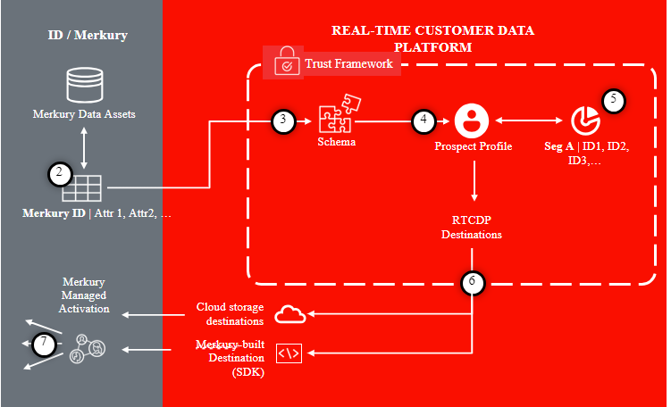

# Merkury Enterprise Identity Destination

>[!NOTE]
>
>De doelconnector en documentatiepagina worden gemaakt en onderhouden door het team van [!DNL Merkury] . Neem voor alle vragen of verzoeken om updates contact op met uw [!DNL Merkury] -accountvertegenwoordiger.

## Overzicht

Gebruik de bestemming [!DNL Merkury Enterprise Identity] om nauwkeurigere, uitgebreidere en inzichtelijkere consumentenprofielen te maken. Met verbeterde profielgegevens kunnen marketers betere inzichten, segmenten en modellen genereren, wat resulteert in een nauwkeurigere gerichtheid en voorspellende modellering.

Voer de stappen in deze documentatiepagina uit om een [!DNL Merkury Identity] doelverbinding te maken en een publiek voor identificatie en verrijking te activeren via de Adobe Experience Platform-gebruikersinterface.

>[!NOTE]
>
>Als u het publiek wilt activeren naar mediadoelen met uw [!DNL Merkury Connect] -account, gebruikt u in plaats daarvan het doel van [!DNL Merkury Connections] .

## Gebruiksscenario’s

De [!DNL Merkury Enterprise Identity] -bestemming biedt de mogelijkheid om consumentengepompel veilig over te brengen voor de volgende [!DNL Merkury] -mogelijkheden:

* **Kwaliteit van Gegevens**: Verbeter de kwaliteit van de het profielgegevens van de consument met gegevenshygiëne en normalisatie. [!DNL Merkury] bevat Amerikaanse posthygiëne en verplaatsingsidentificatie ter ondersteuning van de meest geavanceerde gevallen van direct mailmarketing.
* **Resolutie van de Identiteit**: Bouw een nauwkeurige en uitvoerige enige mening van de klant, die door [!DNL Merkury] Individuele en Huishoudelijke IDs wordt geïnformeerd. Merkury-id&#39;s bieden een diepe profielkoppeling, aangedreven door de uitgebreide identiteitsgrafiek van 268+ miljoen mensen in de VS van [!DNL Merkury] voor volwassenen.
* **Verrijking**: De betere Inzichten en verpersoonlijking van de aandrijving met [!DNL Merkury Data]. [!DNL Merkury Data] bevat meer dan 10.000 beschikbare gegevenskenmerken, variërend van demografische kenmerken, levensstijl, financiën, levensgebeurtenissen en aankoopgegevens van de [!DNL Merkury Data Suite] .

>[!NOTE]
>
>Deze gebruiksgevallen worden uitgevoerd door een combinatie van zowel bestemmings als bronschakelaars. De klant zou beginnen door hun bestaande klantenverslagen voor verrijking uit te voeren gebruikend deze bestemmingsschakelaar. De service van [!DNL Merkury] zoekt naar het bestand, haalt het op, verrijkt het met de gegevens van [!DNL Merkury] en genereert een bestand. De klant zou dan de overeenkomstige [!DNL Merkury] Source-connectorbronkaart gebruiken om de gehydrateerde klantprofielen weer in Adobe Real-Time CDP op te nemen.

## Vereisten

>[!IMPORTANT]
>
>* Om met de bestemming te verbinden, hebt u de **Doelen van de Mening** nodig en **leidt Doelen**, **Doelen**, **Profielen van de Mening**, en **Segmenten van de Mening** [ [toegangsbeheertoestemmingen] ](https://experienceleague.adobe.com/nl/docs/experience-platform/access-control/home#permissions). Lees [ [toegangsbeheeroverzicht] ](https://experienceleague.adobe.com/nl/docs/experience-platform/access-control/ui/overview) of contacteer uw productbeheerder om de vereiste toestemmingen te verkrijgen.
>* Om *identiteiten* uit te voeren, hebt u de **Grafiek van de Identiteit van de Mening** [ [toegangsbeheertoestemming] ](https://experienceleague.adobe.com/nl/docs/experience-platform/access-control/home#permissions) nodig.\

## Ondersteunde identiteiten {#supported-identities}

| Doelidentiteit | Beschrijving | Overwegingen |
|---|---|---|
| GAID | GOOGLE ADVERTISING ID | Selecteer de GAID doelidentiteit wanneer uw bronidentiteit een GAID-naamruimte is. |
| IDFA | Apple-id voor adverteerders | Selecteer de IDFA doelidentiteit wanneer uw bronidentiteit een IDFA namespace is. |
| ECID | Experience Cloud-id | Een naamruimte die ECID vertegenwoordigt. Deze naamruimte kan ook worden aangeduid met de volgende aliassen: &quot;Adobe Marketing Cloud ID&quot;, &quot;Adobe Experience Cloud ID&quot;, &quot;Adobe Experience Platform ID&quot;. Zie het volgende document op [ ECID ](/help/identity-service/features/ecid.md) voor meer informatie. |
| phone_sha256 | Telefoonnummers die zijn hashed met het SHA256-algoritme | Adobe Experience Platform biedt ondersteuning voor zowel platte tekst- als SHA256-telefoonnummers. Wanneer het bronveld hashingkenmerken bevat, schakelt u de optie **[!UICONTROL Apply transformation]** in om de gegevens automatisch te laten hashen bij activering door [!DNL Experience Platform] . |
| email_lc_sha256 | E-mailadressen die met het algoritme SHA256 worden gehasht | Adobe Experience Platform biedt ondersteuning voor zowel platte tekst- als SHA256-e-mailadressen met hashing. Wanneer het bronveld hashingkenmerken bevat, schakelt u de optie **[!UICONTROL Apply transformation]** in om de gegevens automatisch te laten hashen bij activering door [!DNL Experience Platform] . |
| extern_id | Aangepaste gebruikers-id&#39;s | Selecteer deze doelidentiteit wanneer uw bronidentiteit een aangepaste naamruimte is. |

{style="table-layout:auto"}

## Ondersteunde doelgroepen

In deze sectie wordt beschreven welk type publiek u naar dit doel kunt exporteren.

| **Doelgroep** | **Gesteund** | **Beschrijving** | **oorsprong** |
|---|---|---|---|
| Segmentatieservice | ✓ | Soorten publiek dat door Experience Platform [ [de Dienst van de Segmentatie] ](https://experienceleague.adobe.com/nl/docs/experience-platform/segmentation/home) wordt geproduceerd. |
| Aangepaste uploads | x | Soorten publiek [ [ingevoerd] ](https://experienceleague.adobe.com/nl/docs/experience-platform/segmentation/ui/overview#import-audience) in Experience Platform van Csv- dossiers. |

{style="table-layout:auto"}

## Type en frequentie exporteren

Raadpleeg de onderstaande tabel voor informatie over het exporttype en de exportfrequentie van de bestemming.

| **Doelgroep** | **Gesteund** | **Oorsprong van de Beschrijving** |
|---|---|---|      
| Segmentatieservice | ✓ | Soorten publiek dat door Experience Platform [ [de Dienst van de Segmentatie] ](https://experienceleague.adobe.com/nl/docs/experience-platform/segmentation/home) wordt geproduceerd. |
| Aangepaste uploads | X | Soorten publiek [ [ingevoerd] ](https://experienceleague.adobe.com/nl/docs/experience-platform/segmentation/ui/overview#import-audience) in Experience Platform van Csv- dossiers. |

{style="table-layout:auto"}

## Verbinden met de bestemming

>[!IMPORTANT]
>
>Om met de bestemming te verbinden, hebt u de **Doelen van de Mening** nodig en **leidt en activeert de Doelen van de Dataset** [ [toegangsbeheertoestemmingen] ](https://experienceleague.adobe.com/nl/docs/experience-platform/access-control/home#permissions). Lees [ [toegangsbeheeroverzicht] ](https://experienceleague.adobe.com/nl/docs/experience-platform/access-control/ui/overview) of contacteer uw productbeheerder om de vereiste toestemmingen te verkrijgen.

Om met deze bestemming te verbinden, volg de stappen die in [ worden beschreven [de zelfstudie van de bestemmingsconfiguratie] ](https://experienceleague.adobe.com/nl/docs/experience-platform/destinations/ui/connect-destination). Vul in de workflow voor doelconfiguratie de velden in die in de twee onderstaande secties worden vermeld.

### Verifiëren voor bestemming

Om aan de bestemming voor authentiek te verklaren, vul de vereiste gebieden in en selecteer **verbinden met bestemming**.

Als u toegang wilt tot uw emmertje op Experience Platform, moet u geldige waarden opgeven voor de volgende referenties:

| **Referentie** | **Beschrijving** |
|---|---|
| Toegangstoets | De toegangs belangrijkste identiteitskaart voor uw emmer. U kunt deze waarde ophalen van het Merkury-team. |
| Geheime sleutel | De geheime sleutel-id voor uw emmer. U kunt deze waarde ophalen van het Merkury-team. |
| Naam van emmertje | Dit is uw emmertje waar de dossiers zullen worden gedeeld. U kunt deze waarde ophalen van het Merkury-team. |

{style="table-layout:auto"}

### Doelgegevens invullen

Als u details voor de bestemming wilt configureren, vult u de vereiste en optionele velden hieronder in. Een sterretje naast een veld in de gebruikersinterface geeft aan dat het veld verplicht is.

* **Naam (Vereist)** - de naam de bestemming onder zal worden bewaard
* **Beschrijving** - Korte verklaring van het doel van de bestemming
* **Naam van het Emmertje (Vereist)** - Naam van de Amazon S3 emmer opstelling op S3
* **Weg van de Omslag (Vereist)** - als subdirectories in een emmertje worden gebruikt moet een weg worden bepaald, of &quot;/&quot;om de wortelweg van verwijzingen te voorzien.
* **Type van Dossier** - selecteer het formaat Experience Platform voor de uitgevoerde dossiers zou moeten gebruiken. Raadpleeg uw Merkury-team voor het verwachte bestandstype voor uw account.

>[!NOTE]
>
>Als u de optie CSV, Scheidingsteken, Citaat, Escape-teken, Lege waarde, Null-waarde, Compressie-indeling en Inclusief manifestbestandsopties selecteert, neemt u contact op met uw Merkury-team voor de juiste instellingen voor uw account.

### Bestaande account

Accounts die al zijn gedefinieerd met de Merkury Enterprise Identity-bestemming, worden weergegeven in een pop-up lijst. Als u deze optie selecteert, kunt u details van de account bekijken in de rechtertrack. Bekijk het voorbeeld van UI, wanneer u aan **Doelen** navigeert > **Rekeningen**;

### Waarschuwingen inschakelen

U kunt alarm toelaten om berichten over de status van dataflow aan uw bestemming te ontvangen. Selecteer een waarschuwing in de lijst om u te abonneren op meldingen over de status van uw gegevensstroom. Voor meer informatie over alarm, zie de gids bij [ het intekenen aan bestemmingsalarm gebruikend UI ](https://experienceleague.adobe.com/nl/docs/experience-platform/destinations/ui/alerts).

Wanneer u klaar bent met het verstrekken van details voor uw bestemmingsverbinding, selecteer **daarna**.

## Soorten publiek naar dit doel activeren

>[!IMPORTANT]
>
>* Om gegevens te activeren, hebt u de **Doelen van de Mening** nodig, **activeert Doelen**, **Profielen van de Mening**, en **de toegangsbeheertoestemmingen van de Segmenten van de Mening**. Lees het toegangsbeheeroverzicht of contacteer uw productbeheerder om de vereiste toestemmingen te verkrijgen.
>* Om identiteiten uit te voeren, hebt u de **toestemming van de de toegangscontrole van de Grafiek van de Identiteit van de Mening** nodig.

Lees [ activeer publieksgegevens aan de uitvoerbestemmingen van het partijprofiel ](https://experienceleague.adobe.com/nl/docs/experience-platform/destinations/ui/activate/activate-batch-profile-destinations) voor instructies bij het activeren van publiek aan deze bestemming.

## Toewijzingssuggesties

Voor een correcte verwerking van bestanden aan de zijde van [!DNL Merkury] zijn naam- en adreselementen vereist. Hoewel niet alle elementen vereist zijn, zal het zo veel mogelijk helpen om tot een succesvolle overeenkomst te komen.

Toewijzingssuggesties worden gegeven in de onderstaande tabel met de kenmerken aan uw doelzijde die worden gebruikt door [!DNL Merkury] -verwerking waaraan klanten profielkenmerken kunnen toewijzen. Behandel deze elementen als suggesties aangezien niet alle elementen worden vereist, en de bronwaarden zullen van de behoeften van de rekening afhangen.

| Doelveld | Source-beschrijving |
|---|---|
| id | Identiteitsveld dat moet worden gebruikt om [!DNL Merkury] -gegevens via de [!DNL Merkury Enterprise Identity] Source-connector toe te wijzen aan Experience Platform |
| Input_First_Name | De `person.name.firstName` -waarde in Experience Platform. |
| Input_Last_Name | De `person.name.lastName` -waarde in Experience Platform. |
| Input_Address_Line_1 | De `mailingAddress.street` -waarde in Experience Platform. |
| Input_City | De `mailingAddress.city` -waarde in Experience Platform. |
| Input_State_Province_Code | De `mailingAddress.state` -waarde in Experience Platform. Wordt gebruikt als de status in de vorm van een code van twee tekens staat. |
| Input_State_Province_Name | De `mailingAddress.state` -waarde in Experience Platform. Gebruiken als de staat de volledige staatsnaam is |
| Input_Postal_Code | De `mailingAddress.postalCode` -waarde in Experience Platform. |
| Input_Email_Address | De waarde die u wilt toewijzen als het e-mailadres voor profielen. |
| Invoer_Telefoon | De waarde u als aantal van de profielentelefoon wilt in kaart brengen. |

{style="table-layout:auto"}

## Gegevens exporteren valideren

Om te controleren of gegevens zijn geëxporteerd, controleert u het Amazon S3 Storage bucket en controleert u of de geëxporteerde bestanden de verwachte profielpopulaties bevatten.

## Gegevensgebruik en -beheer

Alle Adobe Experience Platform-doelen zijn bij het verwerken van uw gegevens compatibel met het beleid voor gegevensgebruik. Voor gedetailleerde informatie over hoe Adobe Experience Platform gegevensbeheer afdwingt, lees het [ overzicht van het Beleid van Gegevens ](https://experienceleague.adobe.com/nl/docs/experience-platform/data-governance/home).

## Volgende stappen

Aan de hand van deze zelfstudie hebt u een gegevensstroom gemaakt om profielgegevens van Experience Platform naar uw [!DNL Merkury] beheerde S3-locatie te exporteren. Vervolgens moet u contact opnemen met uw [!DNL Merkury] -vertegenwoordiger met de naam van de account, de bestandsnamen en het emmerpad, zodat de verwerking kan worden ingesteld.
