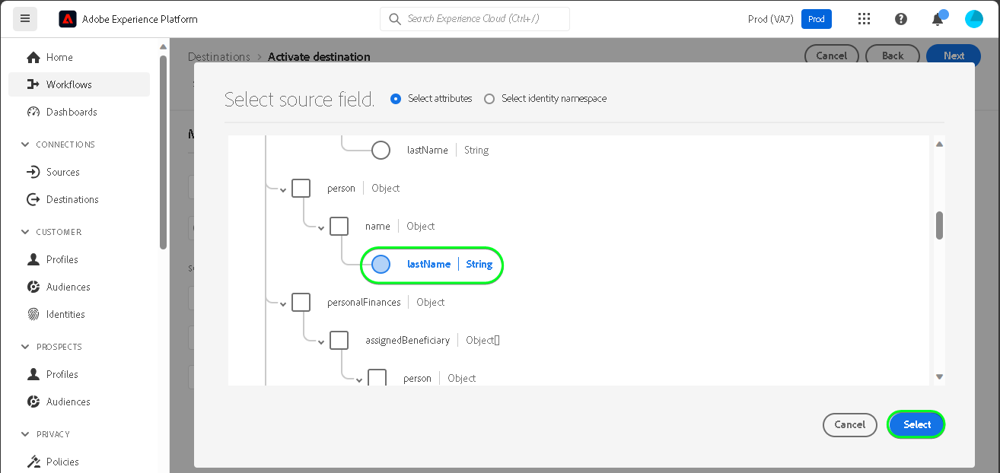

# [!DNL SAP Commerce] verbinding

[!DNL SAP Commerce], voorheen bekend als [[!DNL Hybris]](https://www.sap.com/india/products/acquired-brands/what-is-hybris.html), is een op de cloud gebaseerde e-commerceoplossing voor B2B- en B2C-ondernemingen en is beschikbaar als onderdeel van het SAP Customer Experience-portfolio. [[!DNL SAP] Abonnementsfacturering](https://www.sap.com/products/financial-management/subscription-billing.html) is een product dat onder de portfolio valt en maakt een volledig levenscyclusbeheer met een abonnement mogelijk met vereenvoudigde verkoop- en betalingservaringen via gestandaardiseerde integratie.

Dit [!DNL Adobe Experience Platform] [doel](/help/destinations/home.md) gebruikt de [[!DNL SAP Subscription Billing] klantbeheer-API](https://api.sap.com/api/BusinessPartner_APIs/path/PUT_customers-customerNumber), om uw klantgegevens bij te werken binnen [!DNL SAP Commerce] van een bestaand publiek van het Experience Platform na activering.

Instructies voor verificatie aan uw [!DNL SAP Commerce] de instantie is verder onderaan, in de [Verifiëren voor bestemming](#authenticate) sectie.

## Gebruiksscenario’s {#use-cases}

Om u te helpen beter begrijpen hoe en wanneer u het [!DNL SAP Commerce] doel, hier is een geval van steekproefgebruik dat de klanten van Adobe Experience Platform kunnen oplossen door deze bestemming te gebruiken.

[!DNL SAP Commerce] klanten slaan informatie op over individuen of organisatorische entiteiten die met uw zaken in wisselwerking staan. Uw team gebruikt de klanten die in [!DNL SAP Commerce] om het publiek in de Experience Platform op te bouwen. Na verzending van deze soorten publiek naar [!DNL SAP Commerce], wordt hun informatie bijgewerkt en wordt elke klant toegewezen een bezit met zijn waarde als publieksnaam die wijst op welk publiek de klant tot behoort.

## Vereisten {#prerequisites}

Raadpleeg de onderstaande secties voor alle voorwaarden die u in het Experience Platform moet instellen en [!DNL SAP Commerce] en voor informatie die u moet verzamelen voordat u met de [!DNL SAP Commerce] bestemming.

### Voorwaarden voor Experience Platforms {#prerequisites-in-experience-platform}

Voordat u gegevens activeert naar de [!DNL SAP Commerce] doel, u moet een [schema](/help/xdm/schema/composition.md), [gegevensset](https://experienceleague.adobe.com/docs/platform-learn/tutorials/data-ingestion/create-datasets-and-ingest-data.html), en [publiek](https://experienceleague.adobe.com/docs/platform-learn/tutorials/audiences/create-audiences.html) gemaakt in [!DNL Experience Platform].

Raadpleeg de documentatie bij het Experience Platform voor [Publiek Lidmaatschap Details schema groep](/help/xdm/field-groups/profile/segmentation.md) als u hulp over publieksstatus nodig hebt.

### Vereisten voor de [!DNL SAP Commerce] doel {#prerequisites-destination}

Houd rekening met de volgende voorwaarden om gegevens van Platform naar uw [!DNL SAP Commerce] account:

#### U moet een [!DNL SAP Subscription Billing] account {#prerequisites-account}

Als u gegevens van Platform naar uw wilt exporteren [!DNL SAP Commerce] account, hebt u een [!DNL SAP Subscription Billing] account. Als u geen geldige factureringsrekening hebt, contacteer uw [!DNL SAP] accountmanager. Zie de [[!DNL SAP] Platformconfiguratie](https://help.sap.com/doc/5fd179965d5145fbbe7f2a7aa1272338/latest/en-US/PlatformConfiguration.pdf) voor meer informatie.

#### Een servicesleutel genereren {#prerequisites-service-key}

* De [!DNL SAP Commerce] de de dienstsleutel staat u toe om tot [!DNL SAP Subscription Billing] API via Experience Platform. Zie de [!DNL SAP Commerce] [Creeer de Sleutel van de Dienst met identiteitskaart van de Cliënt en Geheime cliënt](https://help.sap.com/docs/CLOUD_TO_CASH_OD/1216e7b79c984675b0a6f0005e351c74/87c11a0f5dc3494eaf3baa355925c030.html#create-a-service-key-with-client-id-and-client-secret) om een de dienstsleutel te creëren. [!DNL SAP Commerce] vereist het volgende:
   * Client-id
   * Clientgeheim
   * URL. Het URL-patroon is als volgt: `https://subscriptionbilling.authentication.eu10.hana.ondemand.com`. Deze waarde wordt later gebruikt om waarden te verkrijgen voor `Region` en `Endpoint`.

+++Select om een voorbeeld van de de dienstsleutel te zien

```json
{ 
    "url": "https://eu10.revenue.cloud.sap/api",
    "uaa": {
        "clientid": "XXX",
        "clientsecret": "XXX",
        "url": "https://subscriptionbilling.authentication.eu10.hana.ondemand.com",
        "identityzone": "subscriptionbilling",
        "identityzoneid": "XXX",
        "tenantid": "XXX",
        "tenantmode": "dedicated",
        "sburl": "https://internal-xsuaa.authentication.eu10.hana.ondemand.com",
        "apiurl": "https://api.authentication.eu10.hana.ondemand.com",
        "verificationkey": "XXX",
        "xsappname": "XXX",
        "subaccountid": "XXX",
        "uaadomain": "authentication.eu10.hana.ondemand.com",
        "zoneid": "XXX",
        "credential-type": "binding-secret"
    },
    "vendor": "SAP"
}
```

+++

#### Aangepaste verwijzingen maken in [!DNL SAP Subscription Billing] {#prerequisites-custom-reference}

De publieksstatus van het Experience Platform bijwerken in [!DNL SAP Subscription Billing]hebt u een aangepast verwijzingsveld nodig voor elk publiek dat is geselecteerd in Platform.

Meld u aan bij uw [!DNL SAP Subscription Billing] en navigeer naar de **[Hoofdgegevens en -configuratie]** > **[Aangepaste verwijzingen]** pagina. Selecteer vervolgens **[!UICONTROL Create]** om een nieuwe referentie toe te voegen voor elk publiek dat is geselecteerd in Platform. U zult deze verwijzingsgebiedsnamen in volgende vereisen [Het publiek van het programma uitvoeren en voorbeeld](#schedule-segment-export-example) stap.

Een voorbeeld van hoe u een aangepaste **[!UICONTROL Reference Type]** binnen [!DNL SAP Subscription Billing] wordt hieronder weergegeven:


Zie voor aanvullende informatie de [!DNL SAP Subscription Billing] [aangepaste verwijzingen](https://help.sap.com/docs/CLOUD_TO_CASH_OD/80d121f216af43648e79664efe5595f7/85696a63c8d8453a934e86c9413a25cf.html?version=2023-11-27) documentatie.

### Vereiste referenties verzamelen {#gather-credentials}

Verbinding maken [!DNL SAP Commerce] als u een Experience Platform wilt maken, moet u waarden opgeven voor de volgende verbindingseigenschappen:

| Credentials | Beschrijving |
| --- | --- |
| Client-id | De waarde van `clientId` uit de servicesleutel. |
| Clientgeheim | De waarde van `clientSecret` uit de servicesleutel. |
| Endpoint | De waarde van `url` van de de dienstsleutel, is het gelijkaardig aan `https://subscriptionbilling.authentication.eu10.hana.ondemand.com`. |
| Regio | De locatie van uw datacenter. De regio is aanwezig in de `url` en heeft een waarde vergelijkbaar met `eu10` of `us10`. Als de `url` is `https://eu10.revenue.cloud.sap/api` u hebt `eu10`. |

## Guardrails {#guardrails}

API-aanvragen aan de [!DNL SAP Cloud Management service] zijn onderworpen aan [Snelheidslimieten](https://help.sap.com/docs/btp/sap-business-technology-platform/account-administration-rate-limiting). Wanneer de tarieflimiet wordt overschreden, wordt een `HTTP 429 Too Many Requests` antwoordstatuscode.

## Ondersteunde identiteiten {#supported-identities}

[!DNL SAP Commerce] ondersteunt het bijwerken van de identiteiten die in de onderstaande tabel worden beschreven. Meer informatie over [identiteiten](/help/identity-service/features/namespaces.md).

| Doelidentiteit | Beschrijving | Overwegingen |
| --- | --- | --- |
| `customerNumberSAP` | Een klant-id van de individuele of zakelijke klant die al in uw [!DNL SAP Commerce] account. | Verplicht |

## Ondersteunde doelgroepen {#supported-audiences}

In deze sectie worden alle soorten publiek beschreven die u naar deze bestemming kunt exporteren.

Deze bestemming steunt de activering van alle publiek dat door het Experience Platform wordt geproduceerd [Segmenteringsservice](../../../segmentation/home.md).

Deze bestemming ondersteunt ook de activering van het publiek dat in de onderstaande tabel wordt beschreven.

| Type publiek | Ondersteund | Beschrijving |
| ------------- | --------- | ----------- |
| [!DNL Segmentation Service] | ✓ | Door het Experience Platform gegenereerde soorten publiek [Segmenteringsservice](../../../segmentation/home.md). |
| Aangepaste uploads | ✓ | Soorten publiek [geïmporteerd](../../../segmentation/ui/audience-portal.md#import-audience) in Experience Platform van CSV-bestanden. |

{style="table-layout:auto"}

## Type en frequentie exporteren {#export-type-frequency}

Raadpleeg de onderstaande tabel voor informatie over het exporttype en de exportfrequentie van de bestemming.

| Item | Type | Notities |
---------|----------|---------|
| Exporttype | **[!UICONTROL Profile-based]** | <ul><li>U exporteert alle leden van een publiek samen met de gewenste schemavelden *(bijvoorbeeld: e-mailadres, telefoonnummer, achternaam)*, op basis van uw veldtoewijzing.</li><li> Voor elk geselecteerd publiek in Platform, het overeenkomstige [!DNL SAP Commerce] extra attributen worden bijgewerkt met zijn publieksstatus van Platform.</li></ul> |
| Exportfrequentie | **[!UICONTROL Streaming]** | <ul><li>Streaming doelen zijn &quot;altijd aan&quot; API-verbindingen. Wanneer een profiel in Experience Platform wordt bijgewerkt dat op publieksevaluatie wordt gebaseerd, verzendt de schakelaar de update stroomafwaarts naar het bestemmingsplatform. Meer informatie over [streaming doelen](/help/destinations/destination-types.md#streaming-destinations).</li></ul> |

{style="table-layout:auto"}

## Verbinden met de bestemming {#connect}

>[!IMPORTANT]
>
>Om met de bestemming te verbinden, hebt u nodig **[!UICONTROL Manage Destinations]** [toegangsbeheermachtiging](/help/access-control/home.md#permissions). Lees de [toegangsbeheeroverzicht](/help/access-control/ui/overview.md) of neem contact op met de productbeheerder om de vereiste machtigingen te verkrijgen.

Als u verbinding wilt maken met dit doel, voert u de stappen uit die in het dialoogvenster [zelfstudie over doelconfiguratie](../../ui/connect-destination.md). In vormen bestemmingswerkschema, vul de gebieden in die in de twee hieronder secties worden vermeld.

Within **[!UICONTROL Destinations]** > **[!UICONTROL Catalog]**, zoeken naar [!DNL SAP Commerce]. U kunt de locatie ook onder de **[!UICONTROL eCommerce]** categorie.

### Verifiëren voor bestemming {#authenticate}

Vul de vereiste velden hieronder in. Zie de [Een servicesleutel genereren](#prerequisites-service-key) voor eventuele richtsnoeren.

| Veld | Beschrijving |
| --- | --- |
| **[!UICONTROL Client ID]** | De waarde van `clientId` uit de servicesleutel. |
| **[!UICONTROL Client secret]** | De waarde van `clientSecret` uit de servicesleutel. |
| **[!UICONTROL Endpoint]** | De waarde van `url` van de de dienstsleutel, is het gelijkaardig aan `https://subscriptionbilling.authentication.eu10.hana.ondemand.com`. |
| **[!UICONTROL Region]** | De locatie van uw datacenter. De regio is aanwezig in de `url` en heeft een waarde vergelijkbaar met `eu10` of `us10`. Als de `url` is `https://eu10.revenue.cloud.sap/api` u hebt `eu10`. |

Om voor authentiek te verklaren aan de bestemming, uitgezocht **[!UICONTROL Connect to destination]**.


Als de verstrekte gegevens geldig zijn, geeft de interface een **[!UICONTROL Connected]** status met een groen vinkje. Vervolgens kunt u verdergaan met de volgende stap.

### Doelgegevens invullen {#destination-details}

Als u details voor de bestemming wilt configureren, vult u de vereiste en optionele velden hieronder in. Een sterretje naast een veld in de gebruikersinterface geeft aan dat het veld verplicht is.


* **[!UICONTROL Name]**: Een naam waarmee u dit doel in de toekomst wilt herkennen.
* **[!UICONTROL Description]**: Een beschrijving die u zal helpen deze bestemming in de toekomst identificeren.
* **[!UICONTROL Type of Customer]**: Selecteer een van ***Individueel*** of ***Bedrijf*** afhankelijk van de entiteiten in uw publiek. De [!DNL SAP Subscription Billing] [schema](https://api.sap.com/api/BusinessPartner_APIs/schema) Hiermee schakelt u de verplichte velden in, afhankelijk van deze selectie die is toegewezen aan de `customerType` kenmerk. Als de selectie ***Bedrijf***, dan de verplichte toewijzingen zoals `firstName` en `lastName` vereist voor een individuele klant zal worden genegeerd en `company` verplicht wordt en omgekeerd.

### Waarschuwingen inschakelen {#enable-alerts}

U kunt alarm toelaten om berichten over de status van dataflow aan uw bestemming te ontvangen. Selecteer een waarschuwing in de lijst om u te abonneren op meldingen over de status van uw gegevensstroom. Zie de handleiding voor meer informatie over waarschuwingen [abonneren op bestemmingen die het alarm gebruiken UI](../../ui/alerts.md).

Wanneer u klaar bent met het opgeven van details voor uw doelverbinding, selecteert u **[!UICONTROL Next]**.

## Soorten publiek naar dit doel activeren {#activate}

>[!IMPORTANT]
> 
>* Als u gegevens wilt activeren, hebt u de opdracht **[!UICONTROL View Destinations]**, **[!UICONTROL Activate Destinations]**, **[!UICONTROL View Profiles]**, en **[!UICONTROL View Segments]** [toegangsbeheermachtigingen](/help/access-control/home.md#permissions). Lees de [toegangsbeheeroverzicht](/help/access-control/ui/overview.md) of neem contact op met de productbeheerder om de vereiste machtigingen te verkrijgen.
>* Om te exporteren *identiteiten*, hebt u de **[!UICONTROL View Identity Graph]** [toegangsbeheermachtiging](/help/access-control/home.md#permissions). <br> {width="100" zoomable="yes"}

Lezen [Profielen en doelgroepen activeren voor het streamen van doelgroepen voor het exporteren van bestanden](/help/destinations/ui/activate-segment-streaming-destinations.md) voor instructies voor het activeren van het publiek naar deze bestemming.

### Kenmerken en identiteiten toewijzen {#map}

Als u uw publieksgegevens correct vanuit Adobe Experience Platform naar de [!DNL SAP Commerce] doel, moet u door de stap van de gebiedstoewijzing gaan. Toewijzing bestaat uit het maken van een koppeling tussen de schemavelden van uw Experience Data Model (XDM) in uw Platform-account en de bijbehorende equivalenten van de doelbestemming. Uw XDM-velden op de juiste wijze toewijzen aan de [!DNL SAP Commerce] doelvelden, voert u de volgende stappen uit:

#### Wijs de `customerNumberSAP` identiteit

De `customerNumberSAP` identiteit is een verplichte toewijzing voor deze bestemming. Voer de onderstaande stappen uit om deze toe te wijzen:
1. In de **[!UICONTROL Mapping]** stap, selecteren **[!UICONTROL Add new mapping]**. U ziet nu een nieuwe toewijzingsrij op het scherm.
   
1. In de **[!UICONTROL Select source field]** venster, kiest u de **[!UICONTROL Select identity namespace]** en selecteert u `customerNumberSAP`.
   
1. In de **[!UICONTROL Select target field]** venster, kiest u de **[!UICONTROL Select identity namespace]** en selecteert u de `customerNumber` identiteit.
   

| Source-veld | Doelveld | Verplicht |
| --- | --- | --- |
| `IdentityMap: customerNumberSAP` | `Identity: customerNumber` | Ja |

Hieronder ziet u een voorbeeld met de identiteitstoewijzing:


#### Toewijzingskenmerken

Andere kenmerken toevoegen die u wilt bijwerken tussen het XDM-profielschema en uw [!DNL SAP Subscription Billing] -account, herhaal de onderstaande stappen:
1. In de **[!UICONTROL Mapping]** stap, selecteren **[!UICONTROL Add new mapping]**. U ziet nu een nieuwe toewijzingsrij op het scherm.
   
1. In de **[!UICONTROL Select source field]** venster, kiest u de **[!UICONTROL Select attributes]** en selecteer het XDM-kenmerk.
   
1. In de **[!UICONTROL Select target field]** venster, kiest u **[!UICONTROL Select custom attributes]** categorie en typ de naam van de [!DNL SAP Subscription Billing] kenmerk uit de lijst met klanten [schema](https://api.sap.com/api/BusinessPartner_APIs/schema) kenmerken.
   

>[!IMPORTANT]
>
> Doelveldnamen zijn hoofdlettergevoelig en moeten overeenkomen met [!DNL SAP Subscription Billing] kenmerknamen. De enige uitzondering hiervoor is `country` waar u moet gebruiken `countryCode` in plaats daarvan. [!DNL SAP Subscription Billing] ondersteunt alpha-2 (ISO 3166) landcodes. De waarde is hoofdlettergevoelig en moet tussen 0 en 3 tekens lang zijn. Zorg er dus voor dat u exact de gedefinieerde waarden opgeeft, anders treden er fouten op: `The country code {} does not exist` of `size must be between 0 and 3`.

#### Kaart `mandatory` kenmerken voor het geselecteerde klanttype

De verplichte kenmerktoewijzingen zijn afhankelijk van de **[!UICONTROL Type of Customer]** die u had geselecteerd. Selecteer een van de volgende opties om de verplichte kenmerken toe te wijzen:

>[!BEGINTABS]

>[!TAB Individuele klant]

| Source-veld | Doelveld | Verplicht |
| --- | --- | --- |
| `xdm: person.lastName` | `Attribute: lastName` | Ja |
| `xdm: workAddress.countryCode` | `Attribute: countryCode` | Ja |

>[!TAB Zakelijke klant]

| Source-veld | Doelveld | Verplicht |
| --- | --- | --- |
| `xdm: b2b.companyName` | `Attribute: company` | Ja |
| `xdm: workAddress.countryCode` | `Attribute: countryCode` | Ja |

>[!ENDTABS]

#### Extra kenmerken toewijzen

Vervolgens kunt u aanvullende toewijzingen toevoegen tussen uw XDM-profielschema en het [!DNL SAP Subscription Billing] [schema](https://api.sap.com/api/BusinessPartner_APIs/schema) kenmerken voor een klant, zoals hieronder wordt getoond:

>[!BEGINTABS]

>[!TAB Individuele klant]

| Source-veld | Doelveld | Verplicht |
| --- | --- | --- |
| `xdm: person.name.firstName` | `Attribute: firstName` | Nee |
| `xdm: workAddress.street1` | `Attribute: street` | Nee |
| `xdm: workAddress.city` | `Attribute: city` | Nee |

Een voorbeeld met zowel verplichte als optionele kenmerktoewijzingen waarbij de klant een individu is, wordt hieronder weergegeven:


>[!TAB Zakelijke klant]

| Source-veld | Doelveld | Verplicht |
| --- | --- | --- |
| `xdm: workAddress.street1` | `Attribute: street` | Nee |
| `xdm: workAddress.city` | `Attribute: city` | Nee |

Een voorbeeld met zowel verplichte als optionele kenmerktoewijzingen waarbij de klant een onderneming is, wordt hieronder weergegeven:


>[!ENDTABS]

Wanneer u klaar bent met het opgeven van de toewijzingen voor uw doelverbinding, selecteert u **[!UICONTROL Next]**.

### Het publiek van het programma uitvoeren en voorbeeld {#schedule-segment-export-example}

Bij het uitvoeren van de [Het exporteren van publiek plannen](/help/destinations/ui/activate-segment-streaming-destinations.md#scheduling) stap, moet u het publiek van het Platform aan de [attributes](#prerequisites-attribute) in [!DNL SAP Subscription Billing].

Een voorbeeld van de stap van de het publieksuitvoer van het Programma, met de plaats van [!DNL SAP Commerce] **[!UICONTROL Mapping ID]** gemarkeerd, wordt hieronder weergegeven:


Om dit te doen, selecteer elk segment, dan ga naam van de douaneverwijzing van in [!DNL SAP Subscription Billing] in de [!DNL SAP Commerce] **[!UICONTROL Mapping ID]** veld doelaansluiting. Raadpleeg voor hulp bij het maken van aangepaste verwijzingen de [Aangepaste verwijzingen maken in [!DNL SAP Subscription Billing]](#prerequisites-custom-reference) sectie.

>[!IMPORTANT]
>
> Gebruik het aangepaste referentielabel niet als waarde.
>

Stel dat het publiek van het geselecteerde Experience Platform `sap_audience1` en u wilt dat de status wordt bijgewerkt in het dialoogvenster [!DNL SAP Subscription Billing] aangepaste verwijzing `SAP_1`geeft u deze waarde op in het dialoogvenster [!DNL SAP_Commerce] **[!UICONTROL Mapping ID]** veld.

Een voorbeeld **[!UICONTROL Reference Type]** van [!DNL SAP Subscription Billing] wordt hieronder weergegeven:


Een voorbeeld van de stap van de het publieksuitvoer van het Programma, met een geselecteerd publiek en zijn overeenkomstige [!DNL SAP Commerce] **[!UICONTROL Mapping ID]** gemarkeerd, wordt hieronder weergegeven:


Zoals u ziet in het dialoogvenster **[!UICONTROL Mapping ID]** veld moet exact overeenkomen met [!DNL SAP Subscription Billing] **[!UICONTROL Reference Type]** waarde.

Herhaal deze sectie voor elk geactiveerd publiek van het Platform.

Op basis van de bovenstaande afbeelding waarin u twee soorten publiek hebt geselecteerd, wordt de afbeelding als volgt toegewezen: | [!DNL SAP Commerce] doelnaam | [!DNL SAP Subscription Billing] **[!UICONTROL Reference Type]** | [!DNL SAP Commerce] **[!UICONTROL Mapping ID]** value | | — | — | — | | sap_publiek1 | `SAP_1` | `SAP_1` | | SAP-publiek2 | `SAP_2` | `SAP_2` |

## Gegevens exporteren valideren {#exported-data}

Volg onderstaande stappen om te controleren of u de bestemming correct hebt ingesteld:

Aanmelden bij de [!DNL SAP Subscription Billing] account, navigeer naar de **[!UICONTROL Contacts]** pagina om de status van het publiek te controleren. De lijst kan worden gevormd om kolommen voor de douaneverwijzingen te tonen en de overeenkomstige publieksstatus te tonen.


## Gegevensgebruik en -beheer {#data-usage-governance}

Alles [!DNL Adobe Experience Platform] de bestemmingen zijn volgzaam met het beleid van het gegevensgebruik wanneer het behandelen van uw gegevens. Voor gedetailleerde informatie over hoe [!DNL Adobe Experience Platform] handhaaft gegevensbeheer, zie [Overzicht van gegevensbeheer](/help/data-governance/home.md).

## Fouten en problemen oplossen {#errors-and-troubleshooting}

Zie de [[!DNL SAP Subscription Billing] Fouttypen](https://help.sap.com/docs/CLOUD_TO_CASH_OD/987aec876092428f88162e438acf80d6/1a6a0dd6129c48e8b235190a1b5409fa.html) documentatiepagina voor een lijst van mogelijke fouttypen en hun responscodes.

## Aanvullende bronnen {#additional-resources}

Aanvullende nuttige informatie uit de [!DNL SAP] de documentatie is hieronder:
* [Facturering voor SAP-abonnementen aan boord](https://help.sap.com/docs/CLOUD_TO_CASH_OD/1216e7b79c984675b0a6f0005e351c74/e4b8badf7d124026991e4ab6b57d2a33.html)

### Changelog

Deze sectie vangt de functionaliteit en de significante documentatieupdates aan deze bestemmingsschakelaar worden aangebracht die.

+++ Wijzigingen weergeven

| Releasedatum | Type bijwerken | Beschrijving |
|---|---|---|
| Januari 2024 | Eerste release | Oorspronkelijke doelversie en documentatie publiceren. |

{style="table-layout:auto"}

+++
