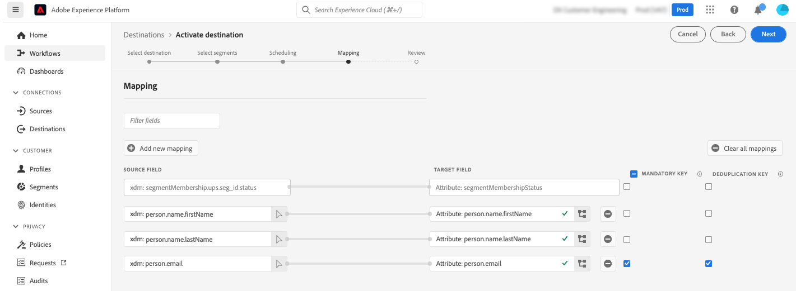

# Adobe Campaign Managed Cloud Services-verbinding {#adobe-campaign-managed-services}

>[!IMPORTANT]
>
>Deze integratie werkt met [Adobe Campaign versie 8.4 of hoger](https://experienceleague.adobe.com/docs/campaign/campaign-v8/new/release-notes.html?lang=en#release-8-4-1).

## Overzicht {#overview}

Adobe Campaign Managed Cloud Services biedt een platform voor het ontwerpen van de ervaringen van klanten over meerdere kanalen en een omgeving voor visuele campagneorchestratie, real-time interactiebeheer en uitvoering via meerdere kanalen. [Aan de slag met campagne](https://experienceleague.adobe.com/docs/campaign/campaign-v8/start/get-started.html)

Campagne gebruiken om:
* De personalisatie en de betrokkenheid van de aandrijving door één enkele toegankelijk mening van de klant;
* E-mail, mobiel, online en offline kanalen integreren in de reis van de klant,
* Automatiseer de levering van betekenisvolle en geschikte berichten en aanbiedingen.

>[!IMPORTANT]
>
>Houd rekening met de volgende instructies wanneer u de Adobe Campaign Managed Cloud Services-verbinding gebruikt:
>
>* U kunt maximaal 50 segmenten [geactiveerd](#activate) voor de bestemming,
>* Voor elk segment kunt u maximaal 20 velden toevoegen aan [map](#map) naar Adobe Campaign,
>* Gegevensbewaring in Azure Blob Storage Data Landing Zone (DLZ): 7 dag,
>* De activeringsfrequentie bedraagt minimaal 3 uur.

## Gebruiksscenario’s {#use-cases}

Om u beter te helpen begrijpen hoe en wanneer u de bestemming van de Dienst van de Beheer van Adobe Campaign zou moeten gebruiken, is hier een geval van het steekproefgebruik dat de klanten van Adobe Experience Platform door deze bestemming kunnen oplossen.

Adobe Experience Platform maakt een klantprofiel dat informatie bevat zoals de identiteitsgrafiek, gedragsgegevens van analyses, het samenvoegen van offline- en onlinegegevens, enzovoort. Dankzij deze integratie kunt u de segmentatiemogelijkheden die al in Adobe Campaign bestaan, uitbreiden met die door Adobe Experience Platform aangedreven doelgroepen. U kunt die gegevens dus activeren in Campaign.

Een sportattierbedrijf wil bijvoorbeeld de door Adobe Experience Platform aangedreven slimme segmenten benutten en deze activeren door Adobe Campaign te gebruiken om naar de klantenbasis te reiken via de verschillende kanalen die door Adobe Campaign worden ondersteund.

Zodra de berichten zijn verzonden, willen ze het klantprofiel in het Adobe Experience-platform verbeteren met ervaringsgegevens van Adobe Campaign, zoals verzenden, openen en klikken.

Het resultaat is kanaalcampagnes die consistenter zijn in het gehele ecosysteem van de cloud van Adobe Experience en een uitgebreid klantprofiel dat zich snel aanpast en leert.

[Meer informatie over Adobe Campaign-integratie met Adobe Experience Platform](https://experienceleague.adobe.com/docs/campaign/campaign-v8/connect/ac-aep.html)

## Vereisten {#prerequisites}

Als u wilt dat Campagne gegevens van Adobe Experience Platform kan ophalen, moet u een campagne-API-project maken en de klantenservice vragen om de bijbehorende client-id aan een lijst van gewenste personen toe te voegen.

>[!NOTE]
>
>Algemene informatie over het maken van een API-project vindt u in [deze documentatie](https://experienceleague.adobe.com/docs/platform-learn/getting-started-for-data-architects-and-data-engineers/set-up-developer-console-and-postman.html)

1. Aanmelden bij [Adobe Developer Console](https://console.adobe.io/) en maak een nieuw project.

1. Selecteren **[!UICONTROL Add API]** en kiest u **[!UICONTROL Adobe Campaign]**.

   

1. Een sleutelpaar genereren.

1. Selecteer `<Instance Name> - admin` productprofiel en selecteer **[!UICONTROL Save configured API]**.

1. Uw API-project is gemaakt. Noteer de **[!UICONTROL Client ID]** weergegeven in uw project. Neem contact op met de klantenservice van Adobe en vraag hen om uw client-id aan een lijst van gewenste personen toe te voegen.

   

## Ondersteunde identiteiten {#supported-identities}

*Adobe Campaign Managed Cloud Services* ondersteunt de activering van identiteiten die in de onderstaande tabel worden beschreven. Meer informatie over [identiteiten](/help/identity-service/namespaces.md).

| Doelidentiteit | Beschrijving | Overwegingen |
|---|---|---|
| external_id | Aangepaste gebruikers-id&#39;s | Selecteer deze doelidentiteit wanneer uw bronidentiteit een aangepaste naamruimte is. Wij adviseren gebruikend deze identiteit en het in kaart brengen aan identiteitskaart in uw instantie van de Campagne die klant (loyalty_ID, account_ID, customer_ID...) vertegenwoordigt |
| ECID | Experience Cloud-id | Een naamruimte die ECID vertegenwoordigt. Naar deze naamruimte kan ook worden verwezen door de volgende aliassen: &quot;Adobe Marketing Cloud ID&quot;, &quot;Adobe Experience Cloud ID&quot;, &quot;Adobe Experience Platform ID&quot;. Zie het volgende document op [ECID](/help/identity-service/ecid.md) voor meer informatie . |
| email_lc_sha256 | E-mailadressen die met het algoritme SHA256 worden gehasht | Adobe Experience Platform biedt ondersteuning voor zowel platte tekst- als SHA256-e-mailadressen met hashing. Wanneer het bronveld hashkenmerken bevat, controleert u de **[!UICONTROL Apply transformation]** optie, om [!DNL Platform] de gegevens bij activering automatisch hashen. |
| phone_sha256 | Telefoonnummers die zijn hashed met het SHA256-algoritme | Adobe Experience Platform biedt ondersteuning voor zowel platte tekst- als SHA256-telefoonnummers. Wanneer het bronveld hashkenmerken bevat, controleert u de **[!UICONTROL Apply transformation]** optie, om [!DNL Platform] de gegevens bij activering automatisch hashen. |
| GAID | Google-advertentie-id | Selecteer de GAID doelidentiteit wanneer uw bronidentiteit een GAID-naamruimte is. |
| IDFA | Apple-id voor adverteerders | Selecteer de IDFA doelidentiteit wanneer uw bronidentiteit een IDFA namespace is. |

{style=&quot;table-layout:auto&quot;}

## Type en frequentie exporteren {#export-type-frequency}

Raadpleeg de onderstaande tabel voor informatie over het exporttype en de exportfrequentie van de bestemming.

| Item | Type | Notities |
---------|----------|---------|
| Exporttype | **[!UICONTROL Profile-based]** | U exporteert alle leden van een segment samen met de gewenste schemavelden (bijvoorbeeld: e-mailadres, telefoonnummer, achternaam), zoals gekozen in het scherm met de kenmerken van het geselecteerde profiel [doelactiveringsworkflow](/help/destinations/ui/activate-batch-profile-destinations.md#select-attributes). |
| Uitvoerfrequentie | **[!UICONTROL Batch]** | De bestemmingen van de partij voeren dossiers naar stroomafwaartse platforms in toename van drie, zes, acht, twaalf, of 24 uren uit. Meer informatie over [batchbestandsgebaseerde doelen](/help/destinations/destination-types.md#file-based). |

{style=&quot;table-layout:auto&quot;}

## Verbinden met de bestemming {#connect}

>[!IMPORTANT]
> 
>Om met de bestemming te verbinden, hebt u nodig **[!UICONTROL Manage Destinations]** [toegangsbeheermachtiging](/help/access-control/home.md#permissions). Lees de [toegangsbeheeroverzicht](/help/access-control/ui/overview.md) of neem contact op met de productbeheerder om de vereiste machtigingen te verkrijgen.

Als u verbinding wilt maken met dit doel, voert u de stappen uit die worden beschreven in het dialoogvenster [zelfstudie over doelconfiguratie](../../ui/connect-destination.md). In vormen bestemmingswerkschema, vul de gebieden in die in de twee hieronder secties worden vermeld.

### Doelgegevens invullen {#destination-details}

Als u details voor de bestemming wilt configureren, vult u de vereiste en optionele velden hieronder in. Een sterretje naast een veld in de gebruikersinterface geeft aan dat het veld verplicht is.

* **[!UICONTROL Name]**: Een naam waarmee u deze bestemming in de toekomst zult erkennen.
* **[!UICONTROL Description]**: Een beschrijving die u zal helpen deze bestemming in de toekomst identificeren.
* **[!UICONTROL Select instance]**: Uw **[!DNL Campaign]** marketingexemplaar.
* **[!UICONTROL Target mapping]**: Selecteer de doeltoewijzing waarin u **[!DNL Adobe Campaign]** om leveringen te verzenden. [Meer informatie](https://experienceleague.adobe.com/docs/campaign/campaign-v8/profiles-and-audiences/add-profiles/target-mappings.html).

### Waarschuwingen inschakelen {#enable-alerts}

U kunt alarm toelaten om berichten over de status van dataflow aan uw bestemming te ontvangen. Selecteer een waarschuwing in de lijst om u te abonneren op meldingen over de status van uw gegevensstroom. Raadpleeg voor meer informatie over waarschuwingen de handleiding over [het abonneren aan bestemmingen alarm gebruikend UI](../../ui/alerts.md).

Wanneer u klaar bent met het opgeven van details voor uw doelverbinding, selecteert u **[!UICONTROL Next]**.

### Beleid en handhavingsmaatregelen voor bestuur {#governance}

Selecteer de marketingacties die van toepassing zijn op de gegevens die u naar de bestemming wilt exporteren. Voor Adobe Campaign raden we u aan de **[!UICONTROL Email Targeting]** marketingactie.

Zie voor meer informatie over marketingacties de [overzicht van beleidsregels voor gegevensgebruik](/help/data-governance/policies/overview.md) pagina.

## Segmenten naar dit doel activeren {#activate}

>[!IMPORTANT]
> 
>Als u gegevens wilt activeren, hebt u de opdracht **[!UICONTROL Manage Destinations]**, **[!UICONTROL Activate Destinations]**, **[!UICONTROL View Profiles]**, en **[!UICONTROL View Segments]** [toegangsbeheermachtigingen](/help/access-control/home.md#permissions). Lees de [toegangsbeheeroverzicht](/help/access-control/ui/overview.md) of neem contact op met de productbeheerder om de vereiste machtigingen te verkrijgen.

Lezen [Gebruikersgegevens activeren om exportdoelen voor batchprofielen te maken](https://experienceleague.adobe.com/docs/experience-platform/destinations/ui/activate/activate-batch-profile-destinations.html) voor instructies over het activeren van publieksgegevens aan deze bestemming.

### Kenmerken en identiteiten toewijzen {#map}

Selecteer XDM-velden om met de profielen te exporteren en deze toe te wijzen aan de corresponderende Adobe Campaign-velden.[Meer informatie over het selecteren van identiteiten en kenmerken voor marketingdoelen voor e-mail](overview.md)

1. Bronvelden selecteren:

   * Selecteer een **id** (Bijvoorbeeld: (het e-mailveld) als bronidentiteit die een profiel in Adobe Experience Platform en Adobe Campaign uniek identificeert.

   * Alle andere selecteren **Kenmerken van XDM-bronprofiel** die naar Adobe Campaign moeten worden geëxporteerd.
   >[!NOTE]
   >
   >Het &quot;segmentMembershipStatus&quot;gebied is een vereiste afbeelding om segmentMembership status te weerspiegelen. Dit veld wordt standaard toegevoegd en kan niet worden gewijzigd of verwijderd.

1. Wijs elk gebied met zijn doelgebied in Adobe Campaign toe. Beschikbare doelvelden worden bepaald door de geselecteerde doeltoewijzing wanneer [het doel maken](#destination-details).

1. Verplichte kenmerken en deduplicatietoetsen identificeren. Waarden in kenmerken die zijn gemarkeerd als &quot;Verplicht&quot; of &quot;Deduplication key&quot;, mogen niet null zijn.

   * [Verplichte kenmerken](../../ui/activate-batch-profile-destinations.md#mandatory-attributes) zorgt ervoor dat alle profielrecords de geselecteerde kenmerken bevatten. Bijvoorbeeld: alle geëxporteerde profielen bevatten een e-mailadres. De aanbeveling moet zowel het identiteitsveld als het als deduplicatietoets gebruikte veld verplicht stellen.
   * [Een deduplicatiesleutel](../../ui/activate-batch-profile-destinations.md#mandatory-attributes) is een primaire sleutel die de identiteit bepaalt waarmee gebruikers hun profielen willen worden gededupliceerd.

      >[!IMPORTANT]
      >
      >Zorg ervoor dat de naam van het deduplicatietoetskenmerk overeenkomt met de kolomnaam van de geselecteerde doeltoewijzing.
   

1. Zodra de afbeelding is uitgevoerd, kunt u de bestemmingsconfiguratie herzien en voltooien beginnen gegevens te verzenden naar **[!DNL Campaign]**.
   [Leer hoe te om bestemmingsconfiguratie te herzien en te voltooien](/help/destinations/destination-types.md#review).

## Geëxporteerde gegevens/Gegevens valideren bij exporteren {#exported-data}

Nadat een doel is geactiveerd, kunt u de bijbehorende taak openen en de gegevens exporteren in Campagne.

### Exporttaken voor gegevens controleren {#jobs}

Ga naar de **[!UICONTROL Administration]** > **[!UICONTROL Audit]** > **[!UICONTROL Audience load jobs]** om alle exporttaken te controleren die vanuit Adobe Experience Platform zijn geactiveerd.

### Geëxporteerde gegevens openen {#data}

Ga naar de **[!UICONTROL Profile and target]** > **[!UICONTROL List]** > **[!UICONTROL AEP audiences]** menu voor toegang tot publiek dat is gemaakt nadat een doel is geactiveerd.

## Gegevensgebruik en -beheer {#data-usage-governance}

Alles [!DNL Adobe Experience Platform] de bestemmingen zijn volgzaam met het beleid van het gegevensgebruik wanneer het behandelen van uw gegevens. Voor gedetailleerde informatie over hoe [!DNL Adobe Experience Platform] dwingt gegevensbeheer af, lees de [Overzicht van gegevensbeheer](/help/data-governance/home.md).
