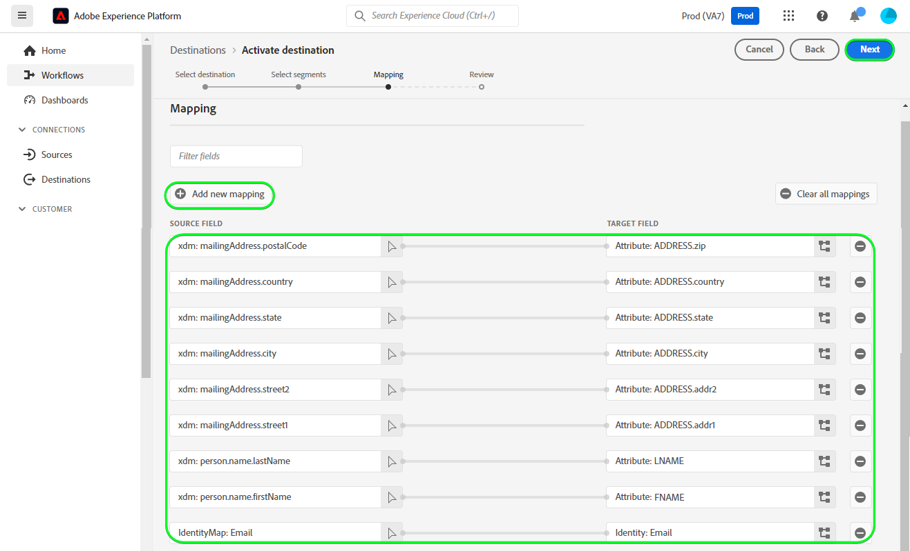
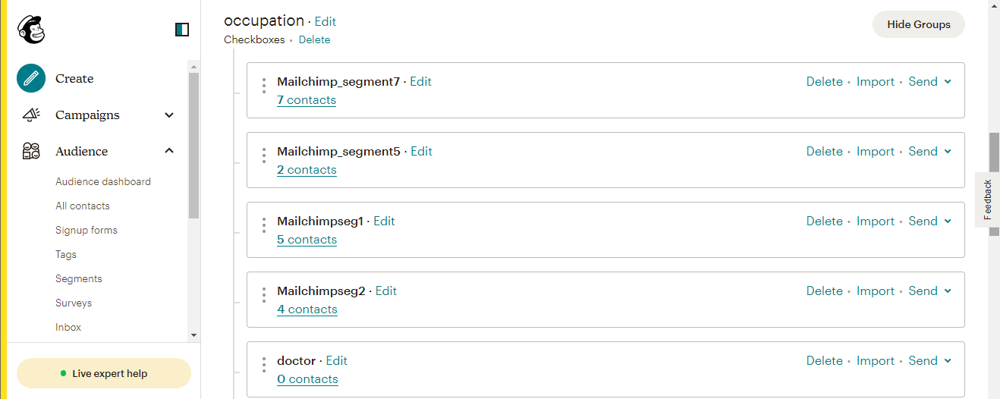

# [!DNL Mailchimp Interest Categories] verbinding

[[!DNL Mailchimp]](https://mailchimp.com) is een populair platform voor marketingautomatisering en e-mailmarketingservice dat door bedrijven wordt gebruikt om contacten te beheren en te onderhouden *(klanten, klanten of andere belanghebbenden)* het gebruiken van mailing lijsten en e-mailmarketing campagnes. Gebruik deze schakelaar om uw contacten te sorteren die op hun belangen en voorkeur worden gebaseerd.

[!DNL Mailchimp Interest Categories] gebruik [publiek](https://mailchimp.com/help/getting-started-audience/), [groepen](https://mailchimp.com/help/getting-started-with-groups/), en rentecategorieën *(ook bekend als groepsnamen of groepstitels)*. Elk [!DNL Mailchimp] groep is een lijst van belangencategorieën. Contactpersonen zijn gekoppeld aan een belangencategorie wanneer zij zich abonneren op een of meer belangencategorieën via een aanmeldingsformulier op uw website. Binnen een publiek, kunt u de contacten in groepen ook organiseren en hen associëren met rentecategorieën, en deze kunnen dan worden gebruikt om segmenten tot stand te brengen. U kunt dit publiek gebruiken om gerichte campagnee-mails naar de geabonneerde contacten uit te zenden.

<!--
Compared to [!DNL Mailchimp Tags] which you would use for internal classification, [!DNL Mailchimp Interest Categories] is meant to manage subscriptions to topics of interest that your contacts might be interested in. *Note, Experience Platform also has a connection for [!DNL Mailchimp Tags], you can check it out on the [[!DNL Mailchimp Tags]](/help/destinations/catalog/email-marketing/mailchimp-tags.md) page.*
-->

Dit [!DNL Adobe Experience Platform] [doel](/help/destinations/home.md) gebruikt de [[!DNL Mailchimp batch subscribe or unsubscribe API]](https://mailchimp.com/developer/marketing/api/lists/batch-subscribe-or-unsubscribe/) API om te maken [belangencategorieën](https://mailchimp.com/developer/marketing/api/interest-categories/) en voegt vervolgens contacten van elk geselecteerd publiek van het Platform toe aan een overeenkomstige belangencategorie. U kunt **nieuwe contactpersonen toevoegen** of **de informatie over bestaande [!DNL Mailchimp] contactpersonen** vervolgens **ze toevoegen aan of verwijderen uit de gewenste groepen** binnen een bestaande [!DNL Mailchimp] het publiek na het activeren van de deelnemers in een nieuw segment. [!DNL Mailchimp Interest Groups] gebruikt de geselecteerde publieksnamen van Platform als rentecategorieën binnen [!DNL Mailchimp].

## Gebruiksscenario’s {#use-cases}

Om u te helpen beter begrijpen hoe en wanneer u het [!DNL Mailchimp Interest Categories] doel, hier is een geval van steekproefgebruik dat de klanten van Adobe Experience Platform kunnen oplossen door deze bestemming te gebruiken.

### E-mails verzenden naar contactpersonen voor marketingcampagnes {#use-case-send-emails}

De verkoopafdeling van een website over sportartikelen wil een marketingcampagne per e-mail uitzenden naar een lijst met contactpersonen die zichzelf hebben geïdentificeerd als geïnteresseerd in voetbal. De lijsten van contacten worden gescheiden als partijen in de gegevensuitvoer die van het ontwikkelingsteam van de website wordt ontvangen en moeten daarom worden gevolgd. Het team identificeert een bestaand [!DNL Mailchimp] publiek en begint het publiek van het Experience Platform te bouwen waarin de contacten van elke lijst worden toegevoegd. Na verzending van deze soorten publiek naar [!DNL Mailchimp Interest Categories], als er geen contactpersonen aanwezig zijn in de geselecteerde [!DNL Mailchimp] publiek wordt zij toegevoegd aan een groep met de publieksnaam die de contact tot behoort. Als om het even welke contacten reeds in [!DNL Mailchimp] publiek of groep, dan wordt hun informatie bijgewerkt. Zodra de gegevens zijn verzonden naar [!DNL Mailchimp Interest Categories], kan het verkoopteam de marketingcampagne e-mail naar de belangengroep van de voetbal binnen de [!DNL Mailchimp] publiek.

## Vereisten {#prerequisites}

Raadpleeg de onderstaande secties voor alle voorwaarden die u in Experience Platform moet instellen en [!DNL Mailchimp] en voor informatie die u moet verzamelen voordat u met de [!DNL Mailchimp Interest Categories] bestemming.

### Vereisten in Experience Platform {#prerequisites-in-experience-platform}

Voordat u gegevens activeert naar de [!DNL Mailchimp Interest Categories] doel, u moet een [schema](/help/xdm/schema/composition.md), [gegevensset](https://experienceleague.adobe.com/docs/platform-learn/tutorials/data-ingestion/create-datasets-and-ingest-data.html), en [segmenten](https://experienceleague.adobe.com/docs/platform-learn/tutorials/segments/create-segments.html) gemaakt in [!DNL Experience Platform].

### Vereisten voor de [!DNL Mailchimp Interest Categories] doel {#prerequisites-destination}

Houd rekening met de volgende voorwaarden om gegevens van Platform naar uw [!DNL Mailchimp] account:

#### U moet een [!DNL Mailchimp] account {#prerequisites-account}

Voordat u een [!DNL Mailchimp Interest Categories] doel, moet u eerst ervoor zorgen dat u een [!DNL Mailchimp] account. Als u er nog geen hebt, gaat u naar [[!DNL Mailchimp] aanmeldpagina](https://login.mailchimp.com/signup/) om uw account te registreren en te maken.

#### Gather [!DNL Mailchimp] API-sleutel {#gather-credentials}

U hebt uw [!DNL Mailchimp] **API-sleutel** om de [!DNL Mailchimp Interest Categories] bestemming tegen uw [!DNL Mailchimp] account. De **API-sleutel** dient als **Wachtwoord** wanneer u [authenticeer de bestemming](#authenticate).

Als u geen **API-sleutel**, meld u aan bij uw account en raadpleeg de [[!DNL Mailchimp] Uw API-sleutel genereren](https://mailchimp.com/developer/marketing/guides/quick-start/#generate-your-api-key) documentatie om een document te maken.

Een voorbeeld van een API-sleutel is `0123456789abcdef0123456789abcde-us14`.

>[!IMPORTANT]
>
>Als u de **API-sleutel**, noteer het omdat u het na generatie niet meer kunt openen.

#### Identificeren [!DNL Mailchimp] datacenter {#identify-data-center}

Vervolgens moet u uw [!DNL Mailchimp] datacenter. Meld u hiertoe aan bij uw [!DNL Mailchimp] en navigeer naar de **Sectie API-sleutels** van uw account.

De waarde is het eerste deel van de URL die u in uw browser ziet. Als de URL *https://`us14`.mailchimp.com/account/api/*, dan is het datacenter `us14`.

Het is ook toegevoegd aan uw API-sleutel in het formulier *key-dc*; als uw API-sleutel `0123456789abcdef0123456789abcde-us14`, dan is het datacenter `us14`.

De waarde van het datacenter noteren *(`us14` in dit voorbeeld)* hebt u deze waarde nodig wanneer u [bestemmingsdetails invullen](#destination-details).

Raadpleeg voor meer informatie de bijsluiter. [[!DNL Mailchimp] Grondbeginselen van documentatie](https://mailchimp.com/developer/marketing/docs/fundamentals/#api-structure).

### Guardrails {#guardrails}

Elk van uw [!DNL Mailchimp] het publiek kan tot 60 groepnamen (of rentecategorieën) in één enkele groep of over verscheidene groepen binnen het zelfde publiek bevatten. Zie [!DNL Mailchimp] [groepen](https://mailchimp.com/help/getting-started-with-groups/) voor alle vereiste verduidelijkingen. Wanneer u deze limiet bereikt, krijgt u een `400 BAD_REQUEST Cannot have more than 60 interests per list (Across all categories)` bericht als een foutreactie van de [!DNL Mailchimp] API.

Raadpleeg bovendien de [!DNL Mailchimp] [tarieflimieten](https://mailchimp.com/developer/marketing/docs/fundamentals/#api-limits) voor nadere informatie over de door de [!DNL Mailchimp] API.

## Ondersteunde identiteiten {#supported-identities}

[!DNL Mailchimp] ondersteunt de activering van identiteiten die in de onderstaande tabel worden beschreven. Meer informatie over [identiteiten](/help/identity-service/features/namespaces.md).

| Doelidentiteit | Beschrijving | Overwegingen |
|---|---|---|
| Email | E-mailadres contactpersoon | Verplicht |

{style="table-layout:auto"}

## Type en frequentie exporteren {#export-type-frequency}

Raadpleeg de onderstaande tabel voor informatie over het exporttype en de exportfrequentie van de bestemming.

| Item | Type | Notities |
---------|----------|---------|
| Exporttype | **[!UICONTROL Profile-based]** | <ul><li>U exporteert alle leden van een segment samen met de gewenste schemavelden *(bijvoorbeeld: e-mailadres, telefoonnummer, achternaam)*, op basis van uw veldtoewijzing.</li><li> Voor elk geselecteerd publiek in Platform, het overeenkomstige [!DNL Mailchimp Interest Categories] de segmentstatus wordt bijgewerkt met de publieksstatus van Platform.</li></ul> |
| Exportfrequentie | **[!UICONTROL Streaming]** | Streaming doelen zijn &quot;altijd aan&quot; API-verbindingen. Wanneer een profiel in Experience Platform wordt bijgewerkt dat op publieksevaluatie wordt gebaseerd, verzendt de schakelaar de update stroomafwaarts naar het bestemmingsplatform. Meer informatie over [streaming doelen](/help/destinations/destination-types.md#streaming-destinations). |

{style="table-layout:auto"}

## Verbinden met de bestemming {#connect}

>[!IMPORTANT]
>
>Om met de bestemming te verbinden, hebt u nodig **[!UICONTROL View Destinations]** en **[!UICONTROL Manage Destinations]** [toegangsbeheermachtigingen](/help/access-control/home.md#permissions). Lees de [toegangsbeheeroverzicht](/help/access-control/ui/overview.md) of neem contact op met de productbeheerder om de vereiste machtigingen te verkrijgen.

Als u verbinding wilt maken met dit doel, voert u de stappen uit die in het dialoogvenster [zelfstudie over doelconfiguratie](../../ui/connect-destination.md). In vormen bestemmingswerkschema, vul de gebieden in die in de twee hieronder secties worden vermeld.

Within **[!UICONTROL Destinations]** > **[!UICONTROL Catalog]**, zoeken naar [!DNL Mailchimp Interest Categories]. U kunt de locatie ook onder het dialoogvenster **[!UICONTROL Email marketing]** categorie.

### Verifiëren voor bestemming {#authenticate}

Als u zich wilt verifiëren bij de bestemming, vult u de vereiste velden hieronder in en selecteert u **[!UICONTROL Connect to destination]**.

| Veld | Beschrijving |
| --- | --- |
| **[!UICONTROL Username]** | Uw [!DNL Mailchimp Interest Categories] gebruikersnaam. |
| **[!UICONTROL Password]** | Uw [!DNL Mailchimp] **API-sleutel**, die u in het [Gather [!DNL Mailchimp] geloofsbrieven](#gather-credentials) sectie.  Uw API-sleutel bestaat uit `{KEY}-{DC}`, waarbij de `{KEY}` gedeelte verwijst naar de waarde die in de [[!DNL Mailchimp] API-sleutel](#gather-credentials) en de `{DC}` portie verwijst naar de [[!DNL Mailchimp] datacenter](#identify-data-center).  U kunt de `{KEY}` of het hele formulier.  Als uw API-sleutel bijvoorbeeld  *`0123456789abcdef0123456789abcde-us14`*,  u kunt *`0123456789abcdef0123456789abcde`*of *`0123456789abcdef0123456789abcde-us14`*als de waarde. |

{style="table-layout:auto"}

Als de verstrekte gegevens geldig zijn, geeft de interface een **[!UICONTROL Connected]** status met een groen vinkje. Vervolgens kunt u verdergaan met de volgende stap.

### Doelgegevens invullen {#destination-details}

Als u details voor de bestemming wilt configureren, vult u de vereiste en optionele velden hieronder in. Een sterretje naast een veld in de gebruikersinterface geeft aan dat het veld verplicht is.

| Veld | Beschrijving |
| --- | --- |
| **[!UICONTROL Name]** | Een naam waarmee u deze bestemming in de toekomst zult erkennen. |
| **[!UICONTROL Description]** | Een beschrijving die u zal helpen deze bestemming in de toekomst identificeren. |
| **[!UICONTROL Data center]** | Uw [!DNL Mailchimp] account `data center`. Zie de [Identificeren [!DNL Mailchimp] datacenter](#identify-data-center) voor eventuele richtsnoeren. |
| **[!UICONTROL Audience Name (Please select Data center first)]** | Nadat u uw **[!UICONTROL Data center]**, wordt deze vervolgkeuzelijst automatisch gevuld met de publieksnamen van uw [!DNL Mailchimp] account. Selecteer het publiek dat u wilt bijwerken met gegevens van Platform. |
| **[!UICONTROL Interest Category (Please select Data center and Audience Name first)]** | Nadat u uw **[!UICONTROL Audience Name]**, wordt deze vervolgkeuzelijst automatisch gevuld met de namen van de belangengroepcategorieën van uw [!DNL Mailchimp] account. Selecteer de categorienaam die u wilt bijwerken met gegevens van Platform. |

{style="table-layout:auto"}

>[!TIP]
>
> Als u de API-sleutel hebt opgegeven in het dialoogvenster **[!UICONTROL Password]** van de **[!UICONTROL Data center]** waarde is onjuist, de gebruikersinterface bevat een [!DNL Mailchimp] API-foutreactie: *`No options are available. Please verify the values selected for the following dependent fields: dataCenter`* zoals hieronder weergegeven. In dit geval kunt u geen waarde selecteren in het menu **[!UICONTROL Audience Name (Please select Data center first)]** veld. Geef de juiste waarden op om deze fout te corrigeren.

### Waarschuwingen inschakelen {#enable-alerts}

U kunt alarm toelaten om berichten over de status van dataflow aan uw bestemming te ontvangen. Selecteer een waarschuwing in de lijst om u te abonneren op meldingen over de status van uw gegevensstroom. Zie de handleiding voor meer informatie over waarschuwingen [abonneren op bestemmingen die het alarm gebruiken UI](../../ui/alerts.md).

Wanneer u klaar bent met het opgeven van details voor uw doelverbinding, selecteert u **[!UICONTROL Next]**.

## Soorten publiek naar dit doel activeren {#activate}

>[!IMPORTANT]
> 
>* Als u gegevens wilt activeren, hebt u de opdracht **[!UICONTROL View Destinations]**, **[!UICONTROL Activate Destinations]**, **[!UICONTROL View Profiles]**, en **[!UICONTROL View Segments]** [toegangsbeheermachtigingen](/help/access-control/home.md#permissions). Lees de [toegangsbeheeroverzicht](/help/access-control/ui/overview.md) of neem contact op met de productbeheerder om de vereiste machtigingen te verkrijgen.
>* Om te exporteren *identiteiten*, hebt u de **[!UICONTROL View Identity Graph]** [toegangsbeheermachtiging](/help/access-control/home.md#permissions).   {width="100" zoomable="yes"}

Lezen [Profielen en doelgroepen activeren voor het streamen van doelgroepen voor het exporteren van bestanden](/help/destinations/ui/activate-segment-streaming-destinations.md) voor instructies voor het activeren van het publiek naar deze bestemming.

### Afbeeldingsoverwegingen en voorbeeld {#mapping-considerations-example}

Als u uw publieksgegevens correct vanuit Adobe Experience Platform naar de [!DNL Mailchimp Interest Categories] doel, moet u door de stap van de gebiedstoewijzing gaan. Toewijzing bestaat uit het maken van een koppeling tussen de schemavelden van uw Experience Data Model (XDM) in uw Platform-account en de bijbehorende equivalenten van de doelbestemming.

Uw XDM-velden op de juiste wijze toewijzen aan de [!DNL Mailchimp Interest Categories] doelvelden, voert u de volgende stappen uit:

1. In de **[!UICONTROL Mapping]** stap, selecteren **[!UICONTROL Add new mapping]**. U ziet nu een nieuwe toewijzingsrij op het scherm.
1. In de **[!UICONTROL Select source field]** venster, kiest u de **[!UICONTROL Select attributes]** en selecteer het XDM-kenmerk of kies de **[!UICONTROL Select identity namespace]** en selecteer een identiteit.
1. In de **[!UICONTROL Select target field]** venster, kiest u de **[!UICONTROL Select identity namespace]** en selecteer een identiteit of kies **[!UICONTROL Select attributes]** categorie en selecteer een kenmerk in de lijst met kenmerken die zijn ingevuld in het menu [!DNL Mailchimp] API. *Alle aangepaste kenmerken die u aan de geselecteerde [!DNL Mailchimp] Het publiek is ook beschikbaar voor selectie als doelvelden.*

   De toewijzingen beschikbaar tussen uw XDM-profielschema en [!DNL Mailchimp Interest Categories] zijn als volgt: | Bronveld | Doelveld | Notities | | — | — | — | |`IdentityMap: Email`|`Identity: email`| Verplicht: Ja | |`xdm: person.name.firstName`|`Attribute: FNAME`| | |`xdm: person.name.lastName`|`Attribute: LNAME`| | |`xdm: person.birthDayAndMonth`|`Attribute: BIRTHDAY`| |

   Daarnaast `ADDRESS` is een speciaal doelveld dat bekend staat als a `merge field` binnen uw [!DNL Mailchimp] publiek. De [[!DNL Mailchimp] documentatie](https://mailchimp.com/developer/marketing/docs/merge-fields/) Hiermee definieert u de vereiste toetsen als `addr1`, `city`, `state`, en `zip`en de optionele toetsen `addr2` en `country`. De waarden voor deze velden moeten tekenreeksen zijn. Indien een van de `ADDRESS` veldtoewijzingen aanwezig zijn, de bestemming gaat de `ADDRESS` aan [!DNL Mailchimp] API voor bijwerken. Alle `ADDRESS` velden die niet zijn toegewezen, hebben standaard de waarde `NULL` behalve het land dat in gebreke blijft `US`.

   De toewijzingen die beschikbaar zijn voor de `ADDRESS` het veld is als volgt :

   | Bronveld | Doelveld |
   | --- | --- |
   | `xdm: workAddress.street1` | `Attribute: ADDRESS.addr1` |
   | `xdm: workAddress.street2` | `Attribute: ADDRESS.addr2` |
   | `xdm: workAddress.city` | `Attribute: ADDRESS.city` |
   | `xdm: workAddress.state` | `Attribute: ADDRESS.state` |
   | `xdm: workAddress.postalCode` | `Attribute: ADDRESS.zip` |
   | `xdm: workAddress.country` | `Attribute: ADDRESS.country` |

   U wilt bijvoorbeeld de waarde bijwerken voor `country` met het bestaande adresgebied van de contactpersoon `addr1`, `city`, `state`, en `zip` waarden als `132, My Street, Kingston`, `New York`, `New York` en `12401`. Als u het dialoogvenster `country` u moet de bestaande waarden doorgeven met de wijzigingen *(indien van toepassing)* en de nieuwe waarde voor het land. De waarden in uw gegevensset moeten dus `132, My Street, Kingston`, `New York`, `New York`, `12401`, en `US`. Om te herhalen, als u slechts overgaat `country` en biedt geen waarden voor `addr1`, `city`, `state`, en `zip` zij worden overschreven door `NULL`.

   Hieronder ziet u een voorbeeld met de voltooide toewijzingen:
   

Wanneer u klaar bent met het opgeven van de toewijzingen voor uw doelverbinding, selecteert u **[!UICONTROL Next]**.

## Gegevens exporteren valideren {#exported-data}

Volg onderstaande stappen om te controleren of u de bestemming correct hebt ingesteld:

* Aanmelden bij uw [[!DNL Mailchimp]](https://login.mailchimp.com/) account. Navigeer vervolgens naar de **[!DNL Audience]** pagina. Vouw vervolgens de **[!DNL Manage Contacts]** en selecteert u **[!DNL Groups]**.

* Selecteer de groep en controleer of het geselecteerde publiek is gemaakt als categorieën met de publieksnaam van Platform, die kunnen worden gevolgd door een automatisch gegenereerd achtervoegsel.
   * Dit doel gebruikt de namen van de geselecteerde segmenten om de rentecategorie tot stand te brengen door [[!DNL Mailchimp] Interessencategorie-API toevoegen](https://mailchimp.com/developer/marketing/api/interest-categories/add-interest-category/). Als u een nieuwe bestemming maakt en hetzelfde publiek weer activeert, [!DNL Mailchimp] Hiermee voegt u een achtervoegsel toe om onderscheid te maken tussen de bestaande en de nieuwe segmenten.
* Contacten waarvan de e-mails niet in de groep bestonden, worden toegevoegd aan de nieuwe categorie.
* Voor contacten die reeds binnen de groep bestaan, worden de gegevens van het attributengebied bijgewerkt, en het contact toegevoegd aan de pas gecreëerde categorie.

## Gegevensgebruik en -beheer {#data-usage-governance}

Alles [!DNL Adobe Experience Platform] de bestemmingen zijn volgzaam met het beleid van het gegevensgebruik wanneer het behandelen van uw gegevens. Voor gedetailleerde informatie over hoe [!DNL Adobe Experience Platform] handhaaft gegevensbeheer, zie [Overzicht van gegevensbeheer](/help/data-governance/home.md).

## Fouten en problemen oplossen {#errors-and-troubleshooting}

### Fout aangetroffen als [!DNL Mailchimp] API-sleutel of gegevenscentrumwaarden zijn onjuist {#incorrect-credentials-error}

Als u de API-sleutel hebt opgegeven in het dialoogvenster **[!UICONTROL Password]** van de **[!UICONTROL Data center]** waarde is onjuist, de gebruikersinterface bevat een [!DNL Mailchimp] API-foutreactie: *`No options are available. Please verify the values selected for the following dependent fields: dataCenter`* zoals hieronder weergegeven. In dit geval kunt u geen waarde selecteren in het menu **[!UICONTROL Audience Name (Please select Data center first)]** veld.

Als u deze fout wilt verhelpen en wilt doorgaan naar de volgende stap, moet u de juiste waarden opgeven. Zie de [Identificeren [!DNL Mailchimp] datacenter](#identify-data-center) en
[Gather [!DNL Mailchimp] API-sleutel](#gather-credentials) secties als u hulp nodig hebt.

### Fout aangetroffen als [!DNL Mailchimp] limiet voor groepsnaam is overschreden {#group-name-limits-error}

Wanneer u het doel maakt, ontvangt u mogelijk de volgende foutberichten: *`Cannot have more than 60 interests per list (Across all categories)`* of *`400 BAD_REQUEST`*. Dit gebeurt wanneer u de 60 groepnamen (of interessecategorieën) in één enkele groep of over verscheidene groepen binnen de zelfde publieksgrens overschrijdt, zoals die in wordt beschreven [guardrails](#guardrails) sectie. Als u deze fout wilt corrigeren, moet u ervoor zorgen dat de limiet voor de groepsnaam niet wordt overschreden in [!DNL Mailchimp].

### [!DNL Mailchimp] Status- en foutcodes

Zie de [[!DNL Mailchimp] foutpagina](https://mailchimp.com/developer/marketing/docs/errors/) voor een uitgebreide lijst van status- en foutcodes met uitleg.

## Aanvullende bronnen {#additional-resources}

Aanvullende nuttige informatie uit de [!DNL Mailchimp] de documentatie is hieronder:
* [Aan de slag met [!DNL Mailchimp]](https://mailchimp.com/help/getting-started-with-mailchimp/)
* [Aan de slag met Soorten publiek](https://mailchimp.com/help/getting-started-audience/)
* [Een publiek maken](https://mailchimp.com/help/create-audience/)
* [Aan de slag met groepen](https://mailchimp.com/help/getting-started-with-groups/)
* [Een nieuwe doelgroep maken](https://mailchimp.com/help/create-new-audience-group/)
* [Renterubrieken](https://mailchimp.com/developer/marketing/api/interest-categories/)
* [Marketing-API](https://mailchimp.com/developer/marketing/api/)
