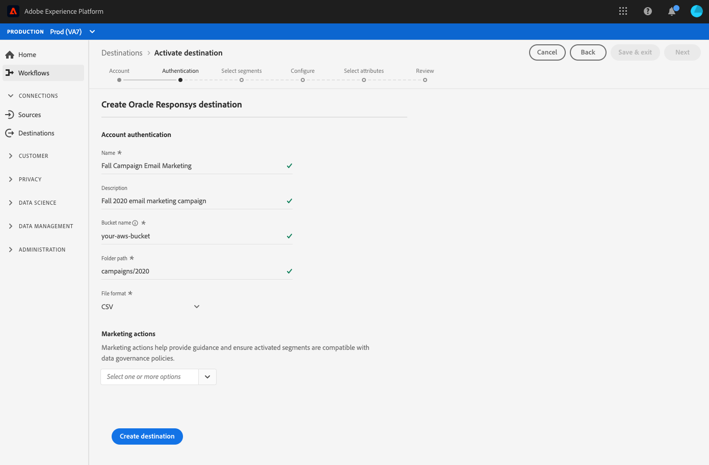

# [!DNL Oracle Responsys]

## Overzicht

[Responsys](https://www.oracle.com/marketingcloud/products/cross-channel-orchestration/) is een marketingtool voor e-mailberichten van bedrijven voor marketingcampagnes over meerdere kanalen die worden aangeboden door interacties via e-mail, mobiele apparaten, displays en sociale media [!DNL Oracle] aan te passen.

Als u segmentgegevens wilt verzenden naar [!DNL Oracle Responsys], moet u eerst [verbinding maken met het doel](#connect-destination) in Real-time Customer Data Platform en vervolgens een gegevensimport  instellen vanaf uw opslaglocatie naar [!DNL Oracle Responsys].

## Exporttype {#export-type}

**Op profiel gebaseerd** - u exporteert alle leden van een segment samen met de gewenste schemavelden (bijvoorbeeld: e-mailadres, telefoonnummer, achternaam), zoals u hebt gekozen in het scherm met kenmerken selecteren van de workflow voor [doelactivering](../../ui/activate-destinations.md#select-attributes).

## Connect-doel {#connect-destination}

Selecteer in **[!UICONTROL Verbindingen]** > **[!UICONTROL Doelen]** de optie [!DNL Oracle Responsys]en selecteer vervolgens de **[!UICONTROL Connect-bestemming]**.

Als u in de stap **[!UICONTROL Verificatie]** eerder een verbinding met uw bestemming voor cloudopslag had ingesteld, selecteert u **[!UICONTROL Bestaande account]** en selecteert u een van uw bestaande verbindingen. U kunt ook **[!UICONTROL Nieuwe account]** selecteren om een nieuwe verbinding in te stellen. Vul de verificatiereferenties van uw account in en selecteer **[!UICONTROL Verbinding maken met doel]**. Voor [!DNL Oracle Responsys], kunt u tussen **[!UICONTROL SFTP met Wachtwoord]** en **[!UICONTROL SFTP met SSH Sleutel]** selecteren. Vul de informatie hieronder in, afhankelijk van uw verbindingstype, en selecteer **[!UICONTROL Verbinden met bestemming]**.

Voor **[!UICONTROL SFTP met de verbindingen van het Wachtwoord]** , moet u Domein, Haven, Gebruikersnaam, en Wachtwoord verstrekken.

Voor **[!UICONTROL SFTP met SSH Zeer belangrijke]** verbindingen, moet u Domein, Haven, Gebruikersnaam, en Sleutel van SSH verstrekken.

In de stap van de **[!UICONTROL Opstelling]** , vul de relevante informatie voor uw bestemming zoals hieronder getoond in:
- **[!UICONTROL Naam]**: Kies een relevante naam voor de bestemming.
- **[!UICONTROL Omschrijving]**: Voer een beschrijving in voor uw bestemming.
- **[!UICONTROL Pad naar]** map: Geef het pad op in de opslaglocatie waar CDP in realtime uw exportgegevens als CSV- of tabgescheiden bestanden indient.
- **[!UICONTROL Bestandsindeling]**: **CSV** of **TAB_DELIMITED**. Selecteer de bestandsindeling die u naar de opslaglocatie wilt exporteren.

Klik op Doel **** maken nadat u de bovenstaande velden hebt ingevuld. Uw bestemming is nu verbonden en u kunt segmenten [aan de bestemming](../../ui/activate-destinations.md) activeren.

## Segmenten activeren {#activate-segments}

Zie Profielen en segmenten [activeren naar een doel](../../ui/activate-destinations.md) voor informatie over de workflow voor segmentactivering.

## Doelkenmerken {#destination-attributes}

Wanneer het [activeren van segmenten](../../ui/activate-destinations.md) aan de [!DNL Oracle Responsys] bestemming, adviseren wij dat u een uniek herkenningsteken van uw [verenigingsschema](../../../profile/home.md#profile-fragments-and-union-schemas)selecteert. Selecteer de unieke id en andere XDM-velden die u naar het doel wilt exporteren. Zie [Selecteren welke schemavelden u als doelkenmerken wilt gebruiken in uw geëxporteerde bestanden](./overview.md#destination-attributes) in E-mailmarketingdoelen voor meer informatie.

## Geëxporteerde gegevens {#exported-data}

Voor [!DNL Oracle Responsys] bestemmingen, leidt in real time CDP tot een lusje-afgebakend `.txt` of `.csv` dossier in de opslagplaats die u verstrekte. Voor meer informatie over de dossiers, zie de bestemmingen van de Marketing van de [E-mail en de opslagbestemmingen](../../ui/activate-destinations.md#esp-and-cloud-storage) van de Wolk in de zelfstudie van de segmentactivering.

## Gegevensimport instellen in [!DNL Oracle Responsys] {#import-data-into-responsys}

Nadat u CDP in realtime hebt verbonden met uw [!DNL Amazon S3] of SFTP-opslag, moet u de gegevensimport instellen vanaf uw opslaglocatie naar [!DNL Oracle Responsys]. Leren hoe te om dit te verwezenlijken, zie het [Importeren van contacten of rekeningen](https://docs.oracle.com/cloud/latest/marketingcs_gs/OMCEA/Connect_WizardUpload.htm) in [!DNL Oracle Responsys Help Center].