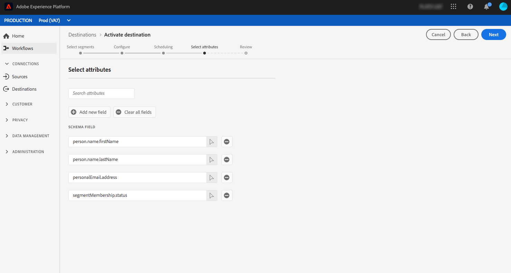

# Overzicht van e-mailmarketingdoelen {#email-marketing-destinations}

Met e-mailserviceproviders (ESP&#39;s) kunt u uw marketingactiviteiten voor e-mail beheren, zoals het verzenden van promotionele e-mailcampagnes. Adobe Experience Platform integreert met ESPs door u toe te staan om segmenten aan e-mail marketing bestemmingen te activeren.

Om segmenten naar e-mail marketing bestemmingen voor uw campagnes te verzenden, moet het Platform eerst met de bestemming verbinden.

Het verbinden met e-mail marketing bestemmingen is een proces in drie stappen. Elk van de stappen wordt hieronder verder beschreven op deze pagina.

In de verbindingsbestemmingsstroom, die in de sectie hieronder wordt beschreven, verbind met of Amazon S3 of SFTP. Platform exporteert uw segmenten als `.csv`- of `.txt`-bestanden en levert deze naar de gewenste locatie. Plan de gegevensimport in uw e-mailmarketingplatform vanaf de opslaglocatie die in het Platform is ingeschakeld. Het proces om gegevens in te voeren varieert voor elke partner. Zie de afzonderlijke bestemmingsartikelen voor meer informatie.

## Doel {#connect-destination} configureren

Selecteer in **[!UICONTROL Verbindingen]** > **[!UICONTROL Doelen]** de e-mailmarketingbestemming waarmee u verbinding wilt maken en selecteer **[!UICONTROL Configureren]**.

Als u in de stap **[!UICONTROL Verificatie]** eerder een verbinding met uw e-mailmarketingbestemming had ingesteld, selecteert u **[!UICONTROL Bestaande account]** en selecteert u de bestaande verbinding. U kunt ook **[!UICONTROL Nieuwe account]** selecteren om een nieuwe verbinding met uw marketingbestemming voor e-mail in te stellen. In **[!UICONTROL het type van Verbinding]** selecteerde, kunt u tussen Amazon S3, SFTP met Wachtwoord, of SFTP met de Sleutel van SSH selecteren. Vul de informatie hieronder in, afhankelijk van uw verbindingstype, en selecteer dan **[!UICONTROL Connect]**.

- Voor **S3 verbindingen**, moet u uw Sleutelidentiteitskaart van de Toegang van Amazon en Geheime Sleutel van de Toegang verstrekken.
- Voor **SFTP met Wachtwoord** verbindingen, moet u Domein, Haven, Gebruikersnaam, en Wachtwoord voor uw server SFTP verstrekken.
- Voor **SFTP met SSH Key** verbindingen, moet u Domein, Haven, Gebruikersnaam, en Sleutel SSH voor uw server van SFTP verstrekken.

U kunt desgewenst een openbare sleutel met RSA-indeling toevoegen om versleuteling toe te voegen aan uw geëxporteerde bestanden onder de sectie **[!UICONTROL Key]**. Merk op dat deze openbare sleutel **must** als Base64 wordt geschreven gecodeerd koord.

Voer in de stap **[!UICONTROL Setup]** een naam en beschrijving in voor uw nieuwe bestemming en voor de bestandsindeling voor de geëxporteerde bestanden.

Als u in de vorige stap Amazon S3 als opslagoptie hebt geselecteerd, voegt u de naam van het emmertje en het mappad in de opslaglocatie van de cloud in waar de bestanden worden geleverd. Voeg voor de opslagoptie SFTP het mappad in waar de bestanden worden geleverd.

Ook in deze stap kunt u elk geval voor marketinggebruik selecteren dat op deze bestemming moet worden toegepast. Gebruiksgevallen voor marketingdoeleinden geven de intentie aan waarvoor gegevens naar de bestemming worden geëxporteerd. U kunt kiezen uit door de Adobe gedefinieerde gebruiksgevallen voor marketingdoeleinden of u kunt uw eigen gebruiksscenario voor marketingdoeleinden maken. Zie [Overzicht van beleidsregels voor gegevensgebruik](../../../data-governance/policies/overview.md) voor meer informatie over gevallen van marketinggebruik.

## Selecteer welke segmentleden u wilt opnemen in uw doelexport {#select-segments}

Selecteer op de pagina **[!UICONTROL Segmenten selecteren]** welke segmenten naar de bestemming moeten worden verzonden. Meer informatie over de velden in de onderstaande secties vindt u.

## Bestandsnamen configureren

Voor informatie over het segmentprogramma en dossier - noem het uitgeven opties, verwijs naar [vorm](../../ui/activate-destinations.md#configure) stap in de activerende bestemmingszelfstudie.

## Kenmerken selecteren - Selecteer welke schemavelden u als doelkenmerken wilt gebruiken in uw geëxporteerde bestanden {#destination-attributes}

In deze stap selecteert u welke velden u wilt exporteren naar marketingdoelen per e-mail en geeft u aan welke velden verplicht zijn.

Raadpleeg voor meer informatie over deze stap de stap [Kenmerken selecteren](../../ui/activate-destinations.md#select-attributes) in de zelfstudie voor het activeren van doelen.

### Identiteit {#identity}

Wij adviseren dat u een uniek herkenningsteken van uw [samenvoegingsschema](../../../profile/home.md#profile-fragments-and-union-schemas) selecteert. Dit is het veld waarvan de identiteit van uw gebruikers wordt weggefilterd. Meestal is dit veld het e-mailadres, maar het kan ook een id voor een loyaliteitsprogramma of een telefoonnummer zijn. Zie de tabel hieronder voor de meest gebruikelijke unieke id&#39;s en hun XDM-veld in het schema.

| Unieke id | XDM-veld in Unified Schema |
----------------- | ---------------------------
| E-mailadres | `personalEmail.address` |
| Telefoon | `mobilePhone.number` |
| ID Loyalty-programma | `Customer-defined XDM field` |

### Andere doelkenmerken

Kies in de keuzelijst Schema welke andere velden u naar de e-mailbestemming wilt exporteren. Enkele aanbevolen opties zijn:

| Schema | XDM-veld |
------ | ---------
| Voornaam | `person.name.firstName` |
| Achternaam | `person.name.lastName` |
| Telefoon | `mobilePhone.number` |
| Plaats adres | `homeAddress.city` |
| Adresstatus | `homeAddress.stateProvince` |
| Postcode adres | `homeAddress.postalCode` |
| Geboortedatum | `person.birthDayAndMonth` |
| Segmentlidmaatschap | `segmentMembership.status` |

## Gegevens van de opslaglocatie naar de bestemming importeren

Zie de afzonderlijke artikelen van de e-mailmarketing bestemming om te leren hoe te om gegevens van uw opslagplaats in bestemmingen in te voeren:

- [Adobe Campaign](./adobe-campaign.md#import-data-into-campaign)
- [Oracle Eloqua](./oracle-eloqua.md#import-data-into-eloqua)
- [Oracle Responsys](./oracle-responsys.md#import-data-into-responsys)
- [Salesforce-Marketing Cloud](./salesforce-marketing-cloud.md#import-data-into-salesforce)

## Segmenten activeren voor e-mailmarketingdoelen

Voor instructies op hoe te om segmenten aan e-mail marketing bestemmingen te activeren, zie [Gegevens aan Doelen activeren](../../ui/activate-destinations.md).

## Aanvullende bronnen

- [Gegevens naar doelen activeren](../../ui/activate-destinations.md)
- [E-mailmarketingdoelen maken en gegevens activeren met de Flow Service API](../../api/email-marketing.md)