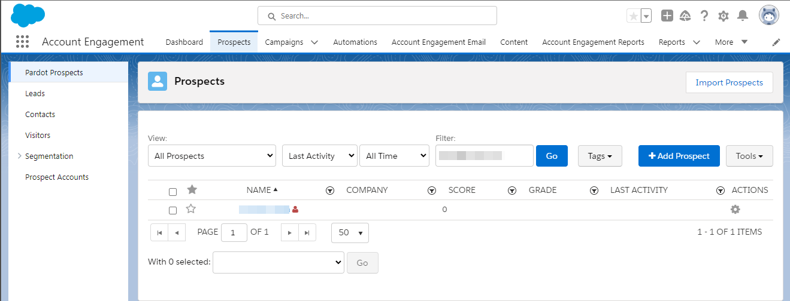

# [!DNL Salesforce Marketing Cloud Account Engagement] verbinding

Gebruik de [[!DNL Salesforce Marketing Cloud Account Engagement] ](https://www.salesforce.com/products/marketing-cloud/marketing-automation/) *(vroeger gekend als [!DNL Pardot])* bestemming aan vangst, spoor, score en graad lood. U kunt ook loodsporen voor alle stadia van de pijpleiding voor gericht marktpubliek en klantengroepen door e-maildruppelcampagnes en loodbeheer met het bevorderen, het scoren en campagnesegmentatie ontwerpen.

Vergeleken met [!DNL Salesforce Marketing Cloud Engagement] die meer gericht op **B2C** marketing is, [!DNL Marketing Cloud Account Engagement] is ideaal voor **B2B** gebruiksgevallen die veelvoudige afdelingen en besluitvormers impliceren die langere verkoop en besluitvormingscycli vereisen. Bovendien houdt u ook nauwere nabijheid en integratie met uw CRM aan om aangewezen verkoop en marketing besluiten te nemen. *Nota, heeft Experience Platform ook verbindingen voor [!DNL Salesforce Marketing Cloud Engagement], kunt u hen op de [[!DNL Salesforce Marketing Cloud]](/help/destinations/catalog/email-marketing/salesforce-marketing-cloud.md) en [[!DNL (API) Salesforce Marketing Cloud]](/help/destinations/catalog/email-marketing/salesforce-marketing-cloud-exact-target.md) pagina&#39;s controleren.*

Dit [!DNL Adobe Experience Platform] [ doel ](/help/destinations/home.md) hefboomwerkingen het [[!DNL Salesforce Account Engagement API > Prospect Upsert by Email] ](https://developer.salesforce.com/docs/marketing/pardot/guide/prospect-v5.html#prospect-upsert-by-email) eindpunt, aan **toevoegen of uw lood** bijwerken na het activeren van hen binnen een nieuw [!DNL Marketing Cloud Account Engagement] segment.

[!DNL Marketing Cloud Account Engagement] gebruikt OAuth 2 met het protocol van de Code van de Vergunning om aan [!DNL Account Engagement] API voor authentiek te verklaren. De instructies om aan uw [!DNL Marketing Cloud Account Engagement] instantie voor authentiek te verklaren zijn verder hieronder, in [ voor authentiek verklaren aan bestemmings ](#authenticate) sectie.

## Gebruiksscenario’s {#use-cases}

Om u beter te helpen begrijpen hoe en wanneer u de [!DNL Marketing Cloud Account Engagement] bestemming zou moeten gebruiken, is hier een geval van het steekproefgebruik dat de klanten van Adobe Experience Platform kunnen oplossen door deze bestemming te gebruiken.

### E-mails verzenden naar contactpersonen voor marketingcampagnes {#use-case-send-emails}

De marketingafdeling van een onlineplatform wil een e-mailcampagne uitzenden naar een nieuwsberichten van B2B-leads. Het marketingteam van het platform kan nieuwe leads toevoegen of bestaande lead-informatie bijwerken via Adobe Experience Platform, een publiek opbouwen op basis van hun eigen offline-gegevens en deze soorten publiek verzenden naar [!DNL Marketing Cloud Account Engagement] , dat vervolgens kan worden gebruikt om de marketingcampagne-e-mail te verzenden.

## Vereisten {#prerequisites}

Raadpleeg de onderstaande secties voor alle voorwaarden die u in Experience Platform en [!DNL Salesforce] moet instellen en voor informatie die u moet verzamelen voordat u met het [!DNL Marketing Cloud Account Engagement] -doel kunt werken.

### Vereisten in Experience Platform {#prerequisites-in-experience-platform}

Alvorens gegevens aan de [!DNL Marketing Cloud Account Engagement] bestemming te activeren, moet u a [ schema ](/help/xdm/schema/composition.md), a [ dataset ](https://experienceleague.adobe.com/docs/platform-learn/tutorials/data-ingestion/create-datasets-and-ingest-data.html?lang=nl-NL) hebben, en [ segmenten ](https://experienceleague.adobe.com/docs/platform-learn/tutorials/segments/create-segments.html?lang=nl-NL) die in [!DNL Experience Platform] worden gecreeerd.

### Vereisten in [!DNL Marketing Cloud Account Engagement] {#prerequisites-destination}

Houd rekening met de volgende voorwaarden om gegevens van Experience Platform naar uw [!DNL Marketing Cloud Account Engagement] -account te exporteren:

#### U moet een [!DNL Marketing Cloud Account Engagement] -account hebben {#prerequisites-account}

Een [!DNL Marketing Cloud Account Engagement] rekening met een abonnement op het [ product van de Betrokkenheid van de Rekening van Marketing Cloud ](https://www.salesforce.com/products/marketing-cloud/marketing-automation/) is verplicht te werk te gaan.

Uw [!DNL Salesforce] -account moet de [!DNL Salesforce] `Account Engagement Administrator role` hebben. Dit wordt vereist om [ gebieden van het douanevooruitzicht ](https://help.salesforce.com/s/articleView?id=sf.pardot_fields_create_custom_field.htm&amp;type=5) tot stand te brengen.

Tot slot zou uw rekening ook tot [[!DNL Account Engagement Lightning App] ](https://help.salesforce.com/s/articleView?id=sf.pardot_lightning_enable.htm&amp;type=5) moeten kunnen toegang hebben.

Bereik uit aan [[!DNL Salesforce]  Steun ](https://www.salesforce.com/company/contact-us/?d=cta-glob-footer-10) of uw [!DNL Salesforce] rekeningsbeheerder als u geen rekening hebt, of de rekening mist het [!DNL Marketing Cloud Account Engagement] abonnement of [!DNL Account Engagement Administrator role].

#### [!DNL Marketing Cloud Account Engagement] gebruikersgegevens verzamelen {#gather-credentials}

Noteer de onderstaande items voordat u de verificatie uitvoert naar de bestemming [!DNL Marketing Cloud Account Engagement] .

| Credentials | Beschrijving |
| --- | --- |
| `Username` | Uw [!DNL Marketing Cloud Account Engagement] gebruikersnaam van de account. |
| `Password` | Wachtwoord voor uw [!DNL Marketing Cloud Account Engagement] account. |
| `Account Engagement Business Unit ID` | Als u de bedrijfs-eenheid-id van de Account Engagement wilt vinden, gebruikt u Setup in [!DNL Salesforce] . Van Opstelling, ga *de Opstelling van de BedrijfsEenheid* in het Snelle vakje van de Vondst in. De bedrijfs-eenheid-id van uw accountservice begint met `0Uv` en is 18 tekens lang. Als u geen toegang kunt krijgen tot de gegevens van de Business Unit Setup, vraagt u uw [!DNL Salesforce] accountbeheerder om de `Account Engagement Business Unit ID` . Als u om het even welke extra begeleiding vereist verwijs naar de [[!DNL Salesforce]  pagina van de Richtsnoer van de Authentificatie ](https://developer.salesforce.com/docs/marketing/pardot/guide/authentication). |

{style="table-layout:auto"}

### Guardrails {#guardrails}

Verwijs naar [!DNL Marketing Cloud Account Engagement] [ tariefgrenzen ](https://developer.salesforce.com/docs/marketing/pardot/guide/overview.html#rate-limits) die de grenzen door uw plan worden opgelegd en ook op de uitvoeringen van Experience Platform van toepassing zouden zijn.

>[!IMPORTANT]
>
>Als uw [!DNL Salesforce] accountbeheerder toegang tot vertrouwde op IP waaiers heeft beperkt, moet u hen contacteren om [ Experience Platform IP ](/help/destinations/catalog/streaming/ip-address-allow-list.md) gevoegd op lijst van gewenste personen te krijgen. Verwijs naar [!DNL Salesforce] [ Beperk Toegang tot Vertrouwde IP Waaier voor een Verbonden App ](https://help.salesforce.com/s/articleView?id=sf.connected_app_edit_ip_ranges.htm&amp;type=5) documentatie als u extra begeleiding nodig hebt.

## Ondersteunde identiteiten {#supported-identities}

[!DNL Marketing Cloud Account Engagement] ondersteunt de activering van identiteiten die in de onderstaande tabel worden beschreven. Leer meer over [ identiteiten ](/help/identity-service/features/namespaces.md).

| Doelidentiteit | Beschrijving | Overwegingen |
|---|---|---|
| Email | E-mailadres vooruitzichten | Verplicht |

{style="table-layout:auto"}

## Type en frequentie exporteren {#export-type-frequency}

Raadpleeg de onderstaande tabel voor informatie over het exporttype en de exportfrequentie van de bestemming.

| Item | Type | Notities |
---------|----------|---------|
| Exporttype | **[!UICONTROL Profile-based]** | <ul><li>U exporteert alle leden van een segment samen met de gewenste schemavelden *(bijvoorbeeld: e-mailadres, telefoonnummer, achternaam)* volgens uw veldtoewijzing.</li><li> Voor elk geselecteerd publiek in Experience Platform wordt de bijbehorende segmentstatus van [!DNL Salesforce Marketing Cloud Account Engagement] bijgewerkt met de publieksstatus van Experience Platform.</li></ul> |
| Exportfrequentie | **[!UICONTROL Streaming]** | Streaming doelen zijn &quot;altijd aan&quot; API-verbindingen. Zodra een profiel in Experience Platform wordt bijgewerkt dat op publieksevaluatie wordt gebaseerd, verzendt de schakelaar de update stroomafwaarts naar het bestemmingsplatform. Lees meer over [ het stromen bestemmingen ](/help/destinations/destination-types.md#streaming-destinations). |

{style="table-layout:auto"}

## Verbinden met de bestemming {#connect}

>[!IMPORTANT]
>
>Om met de bestemming te verbinden, hebt u **[!UICONTROL View Destinations]** en **[!UICONTROL Manage Destinations]** [ toegangsbeheertoestemmingen ](/help/access-control/home.md#permissions) nodig. Lees het [ overzicht van de toegangscontrole ](/help/access-control/ui/overview.md) of contacteer uw productbeheerder om de vereiste toestemmingen te verkrijgen.

Om met deze bestemming te verbinden, volg de stappen die in het [ leerprogramma van de bestemmingsconfiguratie ](../../ui/connect-destination.md) worden beschreven. In vormen bestemmingswerkschema, vul de gebieden in die in de twee hieronder secties worden vermeld.

Zoek in **[!UICONTROL Destinations]** > **[!UICONTROL Catalog]** naar [!DNL Salesforce Marketing Cloud Account Engagement] . U kunt de locatie ook in de categorie **[!UICONTROL Email marketing]** vinden.

### Verifiëren voor bestemming {#authenticate}

Selecteer **[!UICONTROL Connect to destination]** als u wilt verifiëren bij het doel. U gaat naar de aanmeldingspagina van [!DNL Salesforce] . Voer uw [!DNL Marketing Cloud Account Engagement] -accountgegevens in en selecteer [!DNL Log In] .

{het schermschot van 0} Experience Platform UI die tonen hoe te om aan de Betrokkenheid van de Rekening van Marketing Cloud voor authentiek te verklaren.

Daarna, selecteer [!UICONTROL Allow] in het verdere venster om toestemmingen aan **Adobe Experience Platform** app te geven om tot uw [!DNL Salesforce Marketing Cloud Account Engagement] rekening toegang te hebben. *u zult dit slechts eenmaal* moeten doen.

Als de verstrekte details geldig zijn, toont UI een bericht: *u met succes verbonden met de rekening van de Betrokkenheid van de Rekening van Salesforce Marketing Cloud* bericht en a **[!UICONTROL Connected]** status met een groen vinkje, kunt u aan de volgende stap dan te werk gaan.

### Doelgegevens invullen {#destination-details}

Als u details voor de bestemming wilt configureren, vult u de vereiste en optionele velden hieronder in. Een sterretje naast een veld in de gebruikersinterface geeft aan dat het veld verplicht is. Verwijs naar de [ Gather  [!DNL Marketing Cloud Account Engagement]  geloofsbrieven ](#gather-credentials) sectie voor om het even welke begeleiding.

{het schermschot van 0} Experience Platform UI die de bestemmingsdetails toont.

| Veld | Beschrijving |
| --- | --- |
| **[!UICONTROL Name]** | Een naam waarmee u deze bestemming in de toekomst zult erkennen. |
| **[!UICONTROL Description]** | Een beschrijving die u zal helpen deze bestemming in de toekomst identificeren. |
| **[!UICONTROL Account Engagement Business Unit ID]** | Uw [!DNL Salesforce] `Account Engagement Business Unit ID` . |

{style="table-layout:auto"}

### Waarschuwingen inschakelen {#enable-alerts}

U kunt alarm toelaten om berichten over de status van dataflow aan uw bestemming te ontvangen. Selecteer een waarschuwing in de lijst om u te abonneren op meldingen over de status van uw gegevensstroom. Voor meer informatie over alarm, zie de gids bij [ het intekenen aan bestemmingsalarm gebruikend UI ](../../ui/alerts.md).

Wanneer u klaar bent met het opgeven van details voor uw doelverbinding, selecteert u **[!UICONTROL Next]** .

## Soorten publiek naar dit doel activeren {#activate}

>[!IMPORTANT]
> 
>* Om gegevens te activeren, hebt u **[!UICONTROL View Destinations]**, **[!UICONTROL Activate Destinations]**, **[!UICONTROL View Profiles]**, en **[!UICONTROL View Segments]** [ toegangsbeheertoestemmingen ](/help/access-control/home.md#permissions) nodig. Lees het [ overzicht van de toegangscontrole ](/help/access-control/ui/overview.md) of contacteer uw productbeheerder om de vereiste toestemmingen te verkrijgen.
>* Om *identiteiten* uit te voeren, hebt u de **[!UICONTROL View Identity Graph]** [ toegangsbeheertoestemming ](/help/access-control/home.md#permissions) nodig.   {width="100" zoomable="yes"}

Lees [ activeer profielen en publiek aan het stromen publiek uitvoerbestemmingen ](/help/destinations/ui/activate-segment-streaming-destinations.md) voor instructies bij het activeren van publiek aan deze bestemming.

### Afbeeldingsoverwegingen en voorbeeld {#mapping-considerations-example}

Als u uw publieksgegevens correct vanuit Adobe Experience Platform naar de [!DNL Marketing Cloud Account Engagement] -bestemming wilt verzenden, moet u de stap voor veldtoewijzing doorlopen. Toewijzing bestaat uit het maken van een koppeling tussen de schemavelden van uw Experience Data Model (XDM) in uw Experience Platform-account en de overeenkomstige equivalenten van de doelbestemming.

Voer de onderstaande stappen uit om uw XDM-velden correct toe te wijzen aan de [!DNL Marketing Cloud Account Engagement] -doelvelden.

1. Selecteer **[!UICONTROL Add new mapping]** in de stap **[!UICONTROL Mapping]** . Er verschijnt een nieuwe toewijzingsrij op het scherm.
1. Kies in het venster **[!UICONTROL Select source field]** de categorie **[!UICONTROL Select attributes]** en selecteer het XDM-kenmerk of kies de categorie **[!UICONTROL Select identity namespace]** en selecteer een identiteit.
1. Kies in het **[!UICONTROL Select target field]** -venster de **[!UICONTROL Select identity namespace]** en selecteer een identiteit of kies **[!UICONTROL Select custom attributes]** -categorie en geef een waarde op in de lijst met [[!DNL Prospect API fields] ](https://developer.salesforce.com/docs/marketing/pardot/guide/prospect-v5.html#fields) in het beschikbare schema.

   * Herhaal deze stappen om toewijzingen toe te voegen tussen uw XDM-profielschema en [!DNL Marketing Cloud Account Engagement] :

     | Source-veld | Doelveld | Verplicht |
     | --- | --- | --- |
     | `IdentityMap: Email` | `Identity: email` | Ja |
     | `xdm: MailingAddress.city` | `xdm: city` | |
     | `xdm: person.name.firstName` | `Attribute: firstName` | |

   * Hieronder ziet u een voorbeeld met de bovenstaande toewijzingen:

     

Wanneer u klaar bent met het opgeven van de toewijzingen voor uw doelverbinding, selecteert u **[!UICONTROL Next]** .

## Gegevens exporteren valideren {#exported-data}

Volg onderstaande stappen om te controleren of u de bestemming correct hebt ingesteld:

1. Navigeer naar een geselecteerd publiek. Selecteer het tabblad **[!DNL Activation data]**. In de kolom **[!UICONTROL Mapping ID]** wordt de naam weergegeven van het aangepaste veld dat op de pagina [!DNL Marketing Cloud Account Engagement Prospects] wordt gegenereerd.
   

1. Meld u aan bij de [[!DNL Salesforce] ](https://login.salesforce.com/) -website. Navigeer vervolgens naar de pagina **[!DNL Account Engagement]** > **[!DNL Prospects]** > **[!DNL Pardot Prospects]** en controleer of de perspectieven van het publiek zijn toegevoegd of bijgewerkt. U kunt ook toegang krijgen tot [[!DNL Salesforce Pardot] ](https://pi.pardot.com/) en tot de pagina **[!DNL Prospects]** .
   {het schermschot van 0} Salesforce UI die de pagina van Vooruitzichten toont.

1. Om te controleren of de vooruitzichten zijn bijgewerkt, selecteer een vooruitzicht en verifieer of is het gebied van het douanevooruitzicht bijgewerkt met de het publieksstatus van Experience Platform.
   {het schermschot van 0} Salesforce UI die de geselecteerde pagina van het Vooruitzicht toont, wordt het gebied van het douanevooruitzicht bijgewerkt met de publieksstatus.

## Gegevensgebruik en -beheer {#data-usage-governance}

Alle [!DNL Adobe Experience Platform] -doelen zijn compatibel met het beleid voor gegevensgebruik bij het verwerken van uw gegevens. Voor gedetailleerde informatie over hoe [!DNL Adobe Experience Platform] gegevensbeheer afdwingt, zie het [ overzicht van het Beleid van Gegevens ](/help/data-governance/home.md).

## Aanvullende bronnen {#additional-resources}

* [!DNL Marketing Cloud Account Engagement] [ API documentatie ](https://developer.salesforce.com/docs/marketing/pardot/guide/overview.html).
