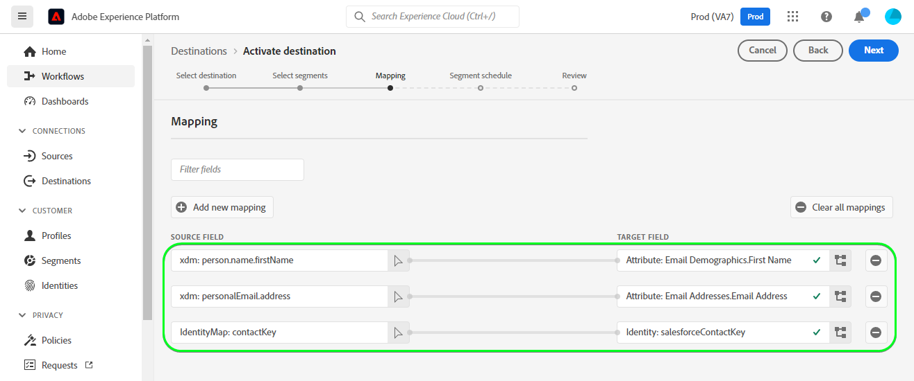
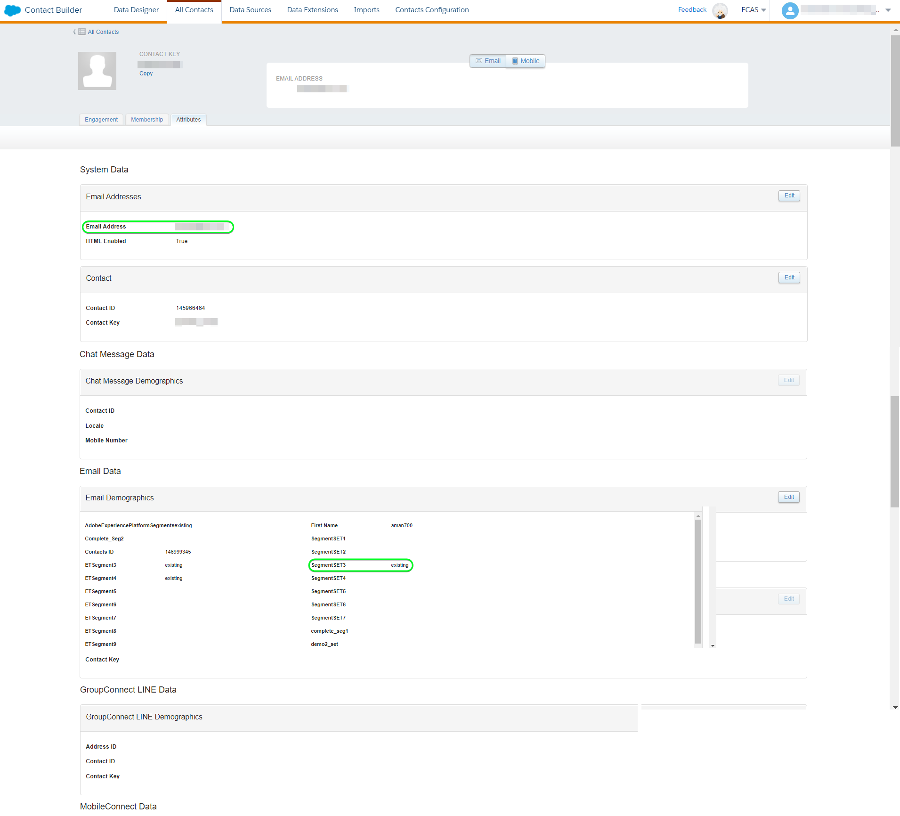

# [!DNL (API) Salesforce Marketing Cloud] verbinding

## Overzicht {#overview}

[[!DNL Salesforce Marketing Cloud]](https://www.salesforce.com/products/marketing-cloud/overview/) (voorheen bekend als [!DNL ExactTarget]) is een digitale marketingsuite waarmee u reizen kunt maken en aanpassen voor bezoekers en klanten om hun ervaring aan te passen.

>[!IMPORTANT]
>
>Let op het verschil tussen deze verbinding en de andere [[!DNL Salesforce Marketing Cloud] verbinding](/help/destinations/catalog/email-marketing/salesforce-marketing-cloud.md) bestaat in de sectie E-mailmarketingcatalogus. Met de andere verbinding met de Salesforce-Marketing Cloud kunt u bestanden exporteren naar een opgegeven opslaglocatie, terwijl dit een op API gebaseerde streamingverbinding is.

Dit [!DNL Adobe Experience Platform] [doel](/help/destinations/home.md) gebruikt de [!DNL Salesforce Marketing Cloud] [update contacten](https://developer.salesforce.com/docs/marketing/marketing-cloud/guide/updateContacts.html) API, die u toestaat om contacten toe te voegen/contactgegevens voor uw bedrijfsbehoeften bij te werken na het activeren van hen binnen een nieuwe [!DNL Salesforce Marketing Cloud] segment.

[!DNL Salesforce Marketing Cloud] gebruikt OAuth 2 met de Referenties van de Cliënt als authentificatiemechanisme om met te communiceren [!DNL Salesforce Marketing Cloud] API. Instructies voor verificatie aan uw [!DNL Salesforce Marketing Cloud] de instantie is verder onderaan, in de [Verifiëren voor bestemming](#authenticate) sectie.

## Gebruiksscenario’s {#use-cases}

Om u te helpen beter begrijpen hoe en wanneer u het [!DNL Salesforce Marketing Cloud] doel, hier is een geval van steekproefgebruik dat de klanten van Adobe Experience Platform kunnen oplossen door deze bestemming te gebruiken.

### E-mails verzenden naar contactpersonen voor marketingcampagnes {#use-case-send-emails}

De verkoopafdeling van een platform van de huishuur wil een marketing e-mail aan een gericht klantenpubliek uitzenden. Het marketing team van het platform kan nieuwe contacten toevoegen/bestaande contacten bijwerken *(en hun e-mailadres)* door Adobe Experience Platform, bouwt segmenten van hun eigen off-line gegevens, en verzendt deze segmenten naar [!DNL Salesforce Marketing Cloud], die vervolgens kan worden gebruikt om de marketingcampagne per e-mail te verzenden.

## Vereisten {#prerequisites}

### Vereisten in Experience Platform {#prerequisites-in-experience-platform}

Voordat u gegevens activeert naar de [!DNL Salesforce Marketing Cloud] doel, u moet een [schema](/help/xdm/schema/composition.md), [gegevensset](https://experienceleague.adobe.com/docs/platform-learn/tutorials/data-ingestion/create-datasets-and-ingest-data.html?lang=en), en [segmenten](https://experienceleague.adobe.com/docs/platform-learn/tutorials/segments/create-segments.html?lang=en) gemaakt in [!DNL Experience Platform].

### Vereisten in [!DNL Salesforce Marketing Cloud] {#prerequisites-destination}

Houd rekening met de volgende voorwaarden om gegevens van Platform naar uw [!DNL Salesforce Marketing Cloud] account:

#### U hebt een [!DNL Salesforce Marketing Cloud] account {#prerequisites-account}

Bereik uit naar uw [!DNL Salesforce Account Executive] om zich te abonneren op de [!DNL Salesforce Marketing Cloud Account Engagement] product als u dit nog niet hebt.

#### Aangepast veld maken in [!DNL Salesforce Marketing Cloud] {#prerequisites-custom-field}

U moet een aangepast kenmerk van het type maken `Text Area Long`, welk Experience Platform zal gebruiken om de segmentstatus binnen bij te werken [!DNL Salesforce Marketing Cloud]. In het werkschema om segmenten aan de bestemming te activeren, in **[Segmentatieschema](#schedule-segment-export-example)** stap, gebruikt u het aangepaste kenmerk als **[!UICONTROL Mapping ID]** voor elk segment dat u activeert.

Zie de [!DNL Salesforce Marketing Cloud] documentatie aan [aangepaste velden maken](https://help.salesforce.com/s/articleView?id=mc_cab_create_an_attribute.htm&amp;type=5&amp;language=en_US) als u aanvullende instructies nodig hebt.

>[!IMPORTANT]
>
> Zorg ervoor dat u het aangepaste kenmerk maakt onder het dialoogvenster `Email Demographics` kenmerkset binnen uw [!DNL Salesforce Marketing Cloud] account.

Raadpleeg de documentatie bij Adobe Experience Platform voor [Segment Membership Details schema groep](/help/xdm/field-groups/profile/segmentation.md) als u begeleiding op segmentstatussen nodig hebt.

#### Referenties van Salesforce verzamelen {#gather-credentials}

Noteer de onderstaande items voordat u deze verifieert voor de [!DNL Salesforce Marketing Cloud] bestemming.

| Credentials | Beschrijving | Voorbeeld |
| --- | --- | --- |
| <ul><li>[!DNL Salesforce Marketing Cloud] prefix</li></ul> | Zie [[!DNL Salesforce Marketing Cloud domain prefix]](https://developer.salesforce.com/docs/marketing/marketing-cloud/guide/your-subdomain-tenant-specific-endpoints.html) voor aanvullende richtsnoeren. | <ul><li>Als uw domein is zoals hieronder, hebt u de benadrukte waarde nodig.  <i>`mcq4jrssqdlyc4lph19nnqgzzs84`.login.exacttarget.com</i></li></ul> |
| <ul><li>Client-id</li><li>Clientgeheim</li></ul> | Zie de [!DNL Salesforce Marketing Cloud] [documentatie](https://developer.salesforce.com/docs/marketing/marketing-cloud/guide/access-token-s2s.html) als u aanvullende instructies nodig hebt. | <ul><li>r23kxxxxxx0z05xxxxxx</li><li>ipxxxxxxxxT4xxxxxxxx</li></ul> |

{style=&quot;table-layout:auto&quot;}

## Grenswaarden in [!DNL Salesforce Marketing Cloud] {#limits}

* Salesforce stelt bepaalde [tarieflimieten](https://developer.salesforce.com/docs/marketing/marketing-cloud/guide/rate-limiting.html).
   * Zie de [!DNL Salesforce Marketing Cloud] [documentatie](https://developer.salesforce.com/docs/marketing/marketing-cloud/guide/rate-limiting-errors.html) om eventuele limieten aan te pakken die u tijdens de uitvoering kunt tegenkomen en fouten te reduceren.
   * Zie de [[!DNL Salesforce Marketing Cloud] Prijs voor betrokkenheid](https://www.salesforce.com/editions-pricing/marketing-cloud/email/) pagina naar *Download de vergelijkingstabel van de Volledige Uitgave* als een pdf waarin de limieten worden uiteengezet die in uw plan worden opgelegd.
   * De [API-overzicht](https://developer.salesforce.com/docs/marketing/marketing-cloud/guide/apis-overview.html) pagina details extra limieten.
   * Vernieuwen [hier](https://salesforce.stackexchange.com/questions/205898/marketing-cloud-api-limits) voor een pagina waarop deze gegevens worden gesorteerd.
* Het aantal *aangepaste velden toegestaan per object* varieert afhankelijk van uw Salesforce Edition.
   * Zie de [!DNL Salesforce] [documentatie](https://help.salesforce.com/s/articleView?id=sf.custom_field_allocations.htm&amp;type=5) voor aanvullende richtsnoeren.
   * Als u de limiet hebt bereikt voor *aangepaste velden toegestaan per object* binnen [!DNL Salesforce Marketing Cloud] u zult moeten
      * Oudere aangepaste velden verwijderen voordat u nieuwe aangepaste velden toevoegt in [!DNL Salesforce Marketing Cloud].
      * Doelen in Platform die deze oudere aangepaste veldnamen gebruiken als de opgegeven waarde bijwerken of verwijderen **[!UICONTROL Mapping ID]** tijdens de [segment plannen](#schedule-segment-export-example) stap.

## Ondersteunde identiteiten {#supported-identities}

[!DNL Salesforce Marketing Cloud] ondersteunt de activering van identiteiten die in de onderstaande tabel worden beschreven. Meer informatie over [identiteiten](/help/identity-service/namespaces.md).

| Doelidentiteit | Beschrijving | Overwegingen |
|---|---|---|
| contactKey | [!DNL Salesforce Marketing Cloud] Contactsleutel. Zie de [!DNL Salesforce Marketing Cloud] [documentatie](https://help.salesforce.com/s/articleView?id=sf.mc_cab_contact_builder_best_practices.htm&amp;type=5) als u aanvullende instructies nodig hebt. | Verplicht |

## Type en frequentie exporteren {#export-type-frequency}

Raadpleeg de onderstaande tabel voor informatie over het exporttype en de exportfrequentie van de bestemming.

| Item | Type | Notities |
---------|----------|---------|
| Exporttype | **[!UICONTROL Profile-based]** | <ul><li>U exporteert alle leden van een segment samen met de gewenste schemavelden *(bijvoorbeeld: e-mailadres, telefoonnummer, achternaam)*, op basis van uw veldtoewijzing.</li><li> Elke segmentstatus in [!DNL Salesforce Marketing Cloud] wordt bijgewerkt met de corresponderende segmentstatus van het Platform, gebaseerd op de **[!UICONTROL Mapping ID]** waarde die tijdens de [segment plannen](#schedule-segment-export-example) stap.</li></ul> |
| Uitvoerfrequentie | **[!UICONTROL Streaming]** | Streaming doelen zijn &quot;altijd aan&quot; API-verbindingen. Zodra een profiel in Experience Platform wordt bijgewerkt dat op segmentevaluatie wordt gebaseerd, verzendt de schakelaar de update stroomafwaarts naar het bestemmingsplatform. Meer informatie over [streaming doelen](/help/destinations/destination-types.md#streaming-destinations). |

{style=&quot;table-layout:auto&quot;}

## Verbinden met de bestemming {#connect}

>[!IMPORTANT]
>
>Om met de bestemming te verbinden, hebt u nodig **[!UICONTROL Manage Destinations]** [toegangsbeheermachtiging](/help/access-control/home.md#permissions). Lees de [toegangsbeheeroverzicht](/help/access-control/ui/overview.md) of neem contact op met de productbeheerder om de vereiste machtigingen te verkrijgen.

Als u verbinding wilt maken met dit doel, voert u de stappen uit die worden beschreven in het dialoogvenster [zelfstudie over doelconfiguratie](../../ui/connect-destination.md). In vormen bestemmingswerkschema, vul de gebieden in die in de twee hieronder secties worden vermeld.

Within **[!UICONTROL Destinations]** > **[!UICONTROL Catalog]**, zoeken naar [!DNL (API) Salesforce Marketing Cloud]. U kunt de locatie ook onder de **[!UICONTROL Email marketing]** categorie.

### Verifiëren voor bestemming {#authenticate}

Als u zich wilt verifiëren bij de bestemming, vult u de vereiste velden in en selecteert u **[!UICONTROL Connect to destination]**.

* **[!UICONTROL Subdomain]**: Uw [!DNL Salesforce Marketing Cloud] domeinvoorvoegsel. Als uw domein bijvoorbeeld *`mcq4jrssqdlyc4lph19nnqgzzs84`.login.exacttarget.com* hebt u de gemarkeerde waarde nodig.
* **[!UICONTROL Client ID]**: Uw [!DNL Salesforce Marketing Cloud] Client-id.
* **[!UICONTROL Client Secret]**: Uw [!DNL Salesforce Marketing Cloud] Clientgeheim.

Als de verstrekte gegevens geldig zijn, geeft de interface een **[!UICONTROL Connected]** Als u een groene markering hebt, kunt u verdergaan met de volgende stap.

### Doelgegevens invullen {#destination-details}

Als u details voor de bestemming wilt configureren, vult u de vereiste en optionele velden hieronder in. Een sterretje naast een veld in de gebruikersinterface geeft aan dat het veld verplicht is.

* **[!UICONTROL Name]**: Een naam waarmee u deze bestemming in de toekomst zult erkennen.
* **[!UICONTROL Description]**: Een beschrijving die u zal helpen deze bestemming in de toekomst identificeren.

### Waarschuwingen inschakelen {#enable-alerts}

U kunt alarm toelaten om berichten over de status van dataflow aan uw bestemming te ontvangen. Selecteer een waarschuwing in de lijst om u te abonneren op meldingen over de status van uw gegevensstroom. Voor meer informatie over waarschuwingen raadpleegt u de handleiding over [het abonneren aan bestemmingen alarm gebruikend UI](../../ui/alerts.md).

Wanneer u klaar bent met het opgeven van details voor uw doelverbinding, selecteert u **[!UICONTROL Next]**.

## Segmenten naar dit doel activeren {#activate}

>[!IMPORTANT]
>
>Als u gegevens wilt activeren, hebt u de opdracht **[!UICONTROL Manage Destinations]**, **[!UICONTROL Activate Destinations]**, **[!UICONTROL View Profiles]**, en **[!UICONTROL View Segments]** [toegangsbeheermachtigingen](/help/access-control/home.md#permissions). Lees de [toegangsbeheeroverzicht](/help/access-control/ui/overview.md) of neem contact op met de productbeheerder om de vereiste machtigingen te verkrijgen.

Lezen [Profielen en segmenten activeren voor streaming segmentexportdoelen](/help/destinations/ui/activate-segment-streaming-destinations.md) voor instructies bij het activeren van publiekssegmenten aan deze bestemming.

### Afbeeldingsoverwegingen en voorbeeld {#mapping-considerations-example}

Als u uw publieksgegevens correct vanuit Adobe Experience Platform naar de [!DNL Salesforce Marketing Cloud] doel, moet u door de stap van de gebiedstoewijzing gaan. Toewijzing bestaat uit het maken van een koppeling tussen de schemavelden van uw Experience Data Model (XDM) in uw Platform-account en de bijbehorende equivalenten van de doelbestemming. Uw XDM-velden op de juiste wijze toewijzen aan de [!DNL Salesforce Marketing Cloud] de bestemmingsgebieden, volg de hieronder stappen.

>[!IMPORTANT]
>
>Hoewel de namen van uw kenmerken overeenkomen [!DNL Salesforce Marketing Cloud] account, de toewijzingen voor beide `contactKey` en `personalEmail.address` zijn verplicht.

1. In de **[!UICONTROL Mapping]** stap, selecteren **[!UICONTROL Add new mapping]**. Er verschijnt een nieuwe toewijzingsrij op het scherm.
   

1. In de **[!UICONTROL Select source field]** venster, kiest u de **[!UICONTROL Select attributes]** categorie en selecteer `contactKey`.
   

1. In de **[!UICONTROL Select target field]** Selecteer het type doelveld waaraan u het bronveld wilt toewijzen.
   * **[!UICONTROL Select identity namespace]**: Selecteer deze optie als u het bronveld wilt toewijzen aan een naamruimte in de lijst.
      

   * Voeg de volgende afbeelding toe tussen uw XDM-profielschema en uw [!DNL Salesforce Marketing Cloud] instantie: |XDM-profielschema|[!DNL Salesforce Marketing Cloud] Instantie| Verplicht| |—|—|—| |`contactKey`|`salesforceContactKey`| Ja |

   * **[!UICONTROL Select custom attributes]**: Selecteer deze optie om uw bronveld toe te wijzen aan een aangepast kenmerk dat u in het dialoogvenster **[!UICONTROL Attribute name]** veld. Zie [!DNL Salesforce Marketing Cloud] [documentatie](https://developer.salesforce.com/docs/marketing/marketing-cloud/guide/updateContacts.html) voor een lijst met ondersteunde kenmerken. Merk ook op dat de bestemming gebruikt [REST-API voor kenmerkgedefinieerde definities in Salesforce-zoekopdracht](https://developer.salesforce.com/docs/marketing/marketing-cloud/guide/retrieveAttributeSetDefinitions.html) om de kenmerken op te halen die in Salesforce zijn gedefinieerd voor uw contactpersonen en die specifiek zijn voor uw account.
      

   * Afhankelijk van de waarden die u wilt bijwerken, voegt u bijvoorbeeld de volgende toewijzing toe tussen uw XDM-profielschema en uw [!DNL Salesforce Marketing Cloud] instantie: |XDM-profielschema|[!DNL Salesforce Marketing Cloud] Instance| |—|—| |`person.name.firstName`|`Email Demographics.First Name`| |`personalEmail.address`|`Email Addresses.Email Address`|

   * Hieronder ziet u een voorbeeld waarin deze toewijzingen worden gebruikt:
      

### De segmentuitvoer van het programma en voorbeeld {#schedule-segment-export-example}

Bij het uitvoeren van de [Segmentexport plannen](/help/destinations/ui/activate-segment-streaming-destinations.md#scheduling) stap, moet u de segmenten van het Platform aan de [aangepast kenmerk](#prerequisites-custom-field) in Salesforce.

Om dit te doen, selecteer elk segment, dan ga het overeenkomstige douanekenmerk van Salesforce in **[!UICONTROL Mapping ID]** veld.

>[!IMPORTANT]
>
>De waarde die voor de toewijzingsid wordt gebruikt, moet exact overeenkomen met de naam van het aangepaste kenmerk dat in Salesforce is gemaakt onder de kenmerkset &quot;Demografie e-mail&quot;.

Hieronder ziet u een voorbeeld:

## Gegevens exporteren valideren {#exported-data}

Volg onderstaande stappen om te controleren of u de bestemming correct hebt ingesteld:

1. Selecteren **[!UICONTROL Destinations]** > **[!UICONTROL Browse]** om naar de lijst met bestemmingen te navigeren.
   

1. Selecteer het doel en controleer of de status **[!UICONTROL enabled]**.
   

1. Naar de **[!DNL Activation data]** selecteert u vervolgens een segmentnaam.
   

1. Controleer de samenvatting van het segment en zorg ervoor dat de telling van profielen aan de telling beantwoordt die binnen het segment wordt gecreeerd.
   

1. Aanmelden bij de [[!DNL Salesforce Marketing Cloud]](https://mc.exacttarget.com/) website. Navigeer vervolgens naar de **[!DNL Audience Builder]** > **[!DNL Contact Builder]** > **[!DNL All contacts]** > **[!DNL Email]** en controleer of de profielen van het segment zijn toegevoegd.
   

1. Als u wilt controleren of profielen zijn bijgewerkt, navigeert u naar de **[!UICONTROL Email]** en controleert u of de kenmerkwaarden voor het profiel van het segment zijn bijgewerkt. Indien succesvol, kunt u zien dat elk segmentstatus in [!DNL Salesforce Marketing Cloud] werd bijgewerkt met de overeenkomstige segmentstatus van Platform, gebaseerd op **[!UICONTROL Mapping ID]** de waarde die in de [segment plannen](#schedule-segment-export-example) stap.
   

## Gegevensgebruik en -beheer {#data-usage-governance}

Alles [!DNL Adobe Experience Platform] de bestemmingen zijn volgzaam met het beleid van het gegevensgebruik wanneer het behandelen van uw gegevens. Voor gedetailleerde informatie over hoe [!DNL Adobe Experience Platform] handhaaft gegevensbeheer, zie [Overzicht van gegevensbeheer](/help/data-governance/home.md).

## Fouten en problemen oplossen {#errors-and-troubleshooting}

### Onbekende fouten aangetroffen tijdens het verplaatsen van gebeurtenissen naar de Salesforce-Marketing Cloud {#unknown-errors}

Bij het controleren van een gegevensstroomuitvoering kan het volgende foutbericht optreden: `Unknown errors encountered while pushing events to the destination. Please contact the administrator and try again.`

Om deze fout te bevestigen, verifieer dat **[!UICONTROL Mapping ID]** die u hebt opgegeven in [!DNL Salesforce Marketing Cloud] voor uw segment van het Platform is geldig en bestaat binnen [!DNL Salesforce Marketing Cloud].

## Aanvullende bronnen {#additional-resources}

* [[!DNL Salesforce Marketing Cloud] API&#39;s](https://developer.salesforce.com/docs/marketing/marketing-cloud/guide/apis-overview.html)
