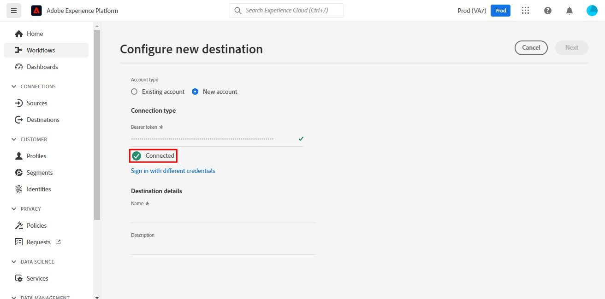
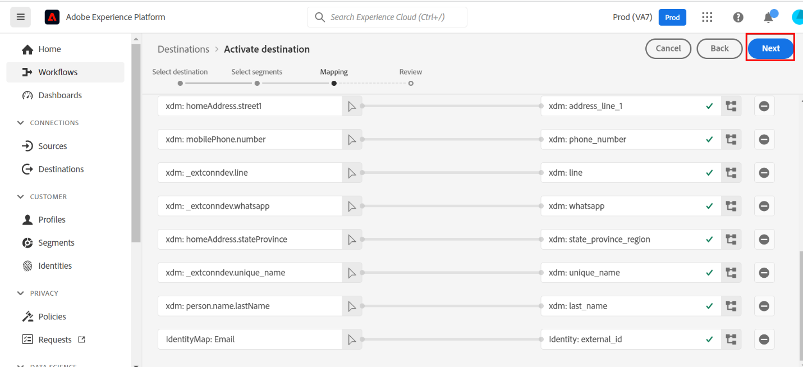

# [!DNL SendGrid] verbinding

## Overzicht {#overview}

[SendGrid](https://www.sendgrid.com) is een populair platform voor klantcommunicatie voor transactie en marketing e-mails.

Dit [!DNL Adobe Experience Platform] [doel](/help/destinations/home.md) gebruikt de [[!DNL SendGrid Marketing Contacts API]](https://api.sendgrid.com/v3/marketing/contacts), zodat u uw e-mailprofielen van de eerste partij kunt exporteren en deze binnen een nieuw SendGrid-segment kunt activeren voor uw bedrijfsbehoeften.

SendGrid gebruikt API dragertokens als authentificatiemechanisme om met SendGrid API te communiceren.

## Vereisten {#prerequisites}

De volgende punten worden vereist alvorens u begint de bestemming te vormen.

1. U moet een SendGrid-account hebben.
   * Naar SendGrid [inschrijving](https://signup.sendgrid.com/) pagina om een SendGrid-account te registreren en te maken, als u er nog geen hebt.
1. Nadat u zich hebt aangemeld bij de portal SendGrid, moet u ook een API-token genereren.
1. Ga naar de SendGrid-website en open de **[!DNL Settings]** > **[!DNL API Keys]** pagina. U kunt ook verwijzen naar de [SendGrid-documentatie](https://app.sendgrid.com/settings/api_keys) om de juiste sectie te openen in de SendGrid-app.
1. Tot slot selecteert u **[!DNL Create API Key]** knop.
   * Zie de [SendGrid-documentatie](https://docs.sendgrid.com/ui/account-and-settings/api-keys#creating-an-api-key), als u hulp nodig hebt over welke handelingen moeten worden uitgevoerd.
   * Als u de API-sleutel via programmacode wilt genereren, raadpleegt u de [SendGrid-documentatie](https://docs.sendgrid.com/api-reference/api-keys/create-api-keys).

Voordat u gegevens naar de SendGrid-bestemming kunt activeren, moet u een [schema](https://experienceleague.adobe.com/docs/experience-platform/xdm/schema/composition.html), [gegevensset](https://experienceleague.adobe.com/docs/platform-learn/tutorials/data-ingestion/create-datasets-and-ingest-data.html?lang=en), en [segmenten](https://experienceleague.adobe.com/docs/platform-learn/tutorials/segments/create-segments.html?lang=en) gemaakt in [!DNL Experience Platform]. Verwijs ook naar [limieten](#limits) verderop op op deze pagina.

>[!IMPORTANT]
>
>* Voor de SendGrid-API die wordt gebruikt voor het maken van de mailinglijst vanuit e-mailprofielen, moeten binnen elk profiel unieke e-mailadressen worden opgegeven. Dit ongeacht of het wordt gebruikt als waarde voor *email* of *alternatieve e-mail*. Omdat de SendGrid-verbinding toewijzingen ondersteunt voor e-mailwaarden en alternatieve e-mailwaarden, moet u ervoor zorgen dat alle gebruikte e-mailadressen uniek zijn in elk profiel van het *Gegevensset*. Als de e-mailprofielen naar SendGrid worden verzonden, resulteert dit in een fout en is dat e-mailprofiel niet aanwezig in de gegevensexport.
>
>* Er is momenteel geen functionaliteit beschikbaar om profielen uit SendGrid te verwijderen wanneer ze uit segmenten in het Experience Platform worden verwijderd.

## Ondersteunde identiteiten {#supported-identities}

SendGrid ondersteunt de activering van identiteiten die in de onderstaande tabel worden beschreven. Meer informatie over [identiteiten](/help/identity-service/namespaces.md).

| Doelidentiteit | Beschrijving | Overwegingen |
|---|---|---|
| email | E-mailadres | Merk op dat zowel onbewerkte tekst als SHA256 gehashte e-mailadressen worden ondersteund door [!DNL Adobe Experience Platform]. Als het bronveld van het Experience-platform hashkenmerken bevat, controleert u de **[!UICONTROL Apply transformation]** optie, om [!DNL Platform] de gegevens bij activering automatisch hashen.   Let op: **SendGrid** Hashed-e-mailadressen worden niet ondersteund, dus alleen onbewerkte tekstgegevens zonder transformatie worden naar de bestemming verzonden. |

{style=&quot;table-layout:auto&quot;}

## Type en frequentie exporteren {#export-type-frequency}

Raadpleeg de onderstaande tabel voor informatie over het exporttype en de exportfrequentie van de bestemming.

| Item | Type | Notities |
---------|----------|---------|
| Exporttype | **[!UICONTROL Profile-based]** | U exporteert alle leden van een segment samen met de gewenste schemavelden (bijvoorbeeld: e-mailadres, telefoonnummer, achternaam), zoals gekozen in het scherm met de kenmerken van het geselecteerde profiel [doelactiveringsworkflow](/help/destinations/ui/activate-batch-profile-destinations.md#select-attributes). |
| Uitvoerfrequentie | **[!UICONTROL Streaming]** | Streaming doelen zijn &quot;altijd aan&quot; API-verbindingen. Zodra een profiel in Experience Platform wordt bijgewerkt dat op segmentevaluatie wordt gebaseerd, verzendt de schakelaar de update stroomafwaarts naar het bestemmingsplatform. Meer informatie over [streaming doelen](/help/destinations/destination-types.md#streaming-destinations). |

{style=&quot;table-layout:auto&quot;}

## Gebruiksscenario’s {#use-cases}

Om u beter te helpen begrijpen hoe en wanneer u de bestemming SendGrid zou moeten gebruiken, zijn hier voorbeelden van gebruiksgevallen die [!DNL Experience Platform] klanten kunnen oplossen door deze bestemming te gebruiken.

### Een marketinglijst maken voor meerdere marketingactiviteiten

Marketing teams die SendGrid gebruiken, kunnen een mailinglijst maken in SendGrid en deze vullen met e-mailadressen. De mailinglijst die nu in SendGrid wordt gemaakt, kan vervolgens voor meerdere marketingactiviteiten worden gebruikt.

## Verbinden met doel {#connect}

>[!IMPORTANT]
> 
>Om met de bestemming te verbinden, hebt u nodig **[!UICONTROL Manage Destinations]** [toegangsbeheermachtiging](/help/access-control/home.md#permissions). Lees de [toegangsbeheeroverzicht](/help/access-control/ui/overview.md) of neem contact op met de productbeheerder om de vereiste machtigingen te verkrijgen.

Als u verbinding wilt maken met dit doel, voert u de stappen uit die worden beschreven in het dialoogvenster [zelfstudie over doelconfiguratie](../../ui/connect-destination.md). De stappen specifiek voor deze bestemming worden hieronder in detail geïllustreerd.

1. Binnen de [!DNL Adobe Experience Platform] console, navigeren naar **Doelen**.

1. Selecteer **Catalogus** tabblad en zoeken naar *SendGrid*. Selecteer vervolgens **Instellen**. Nadat u een verbinding aan de bestemming hebt gevestigd, verandert het etiket UI in **Segmenten activeren**.
   

1. U wordt getoond een tovenaar die u in het vormen van de bestemming SendGrid bijstaat. Maak het nieuwe doel door **Nieuwe bestemming configureren**.
   

1. Selecteer **Nieuw account** en vult de **Dragertoken** waarde. Deze waarde is de SendGrid *API-sleutel* die eerder in het [sectie voorwaarden](#prerequisites).
   

1. Selecteren **Verbinden met doel**. Als de SendGrid *API-sleutel* u hebt opgegeven, is geldig. **Verbonden** als u een groen vinkje hebt, gaat u verder naar de volgende stap om extra informatievelden in te vullen.

### Verbindingsparameters {#parameters}

while [opzetten](https://experienceleague.adobe.com/docs/experience-platform/destinations/ui/connect-destination.html?lang=en) voor deze bestemming moet u de volgende informatie opgeven:

* **[!UICONTROL Name]**: De naam waarmee u deze bestemming in de toekomst zult erkennen.
* **[!UICONTROL Description]**: Een optionele beschrijving waarmee u deze bestemming in de toekomst kunt identificeren.

## Segmenten naar dit doel activeren {#activate}

>[!IMPORTANT]
> 
>Als u gegevens wilt activeren, hebt u de opdracht **[!UICONTROL Manage Destinations]**, **[!UICONTROL Activate Destinations]**, **[!UICONTROL View Profiles]**, en **[!UICONTROL View Segments]** [toegangsbeheermachtigingen](/help/access-control/home.md#permissions). Lees de [toegangsbeheeroverzicht](/help/access-control/ui/overview.md) of neem contact op met de productbeheerder om de vereiste machtigingen te verkrijgen.

Lezen [Profielen en segmenten activeren voor streaming segmentexportdoelen](/help/destinations/ui/activate-segment-streaming-destinations.md) voor instructies bij het activeren van publiekssegmenten aan deze bestemming.

Raadpleeg de onderstaande afbeeldingen voor meer informatie over deze bestemming.

1. Selecteer één of meerdere segmenten om naar SendGrid uit te voeren.
   

1. In de **[!UICONTROL Mapping]** stap, na het selecteren **[!UICONTROL Add new mapping]**, wordt u getoond de toewijzingspagina om de bronXDM gebieden aan de SendGrid API doelgebieden in kaart te brengen. In de onderstaande afbeeldingen ziet u hoe u naamruimten kunt toewijzen tussen Experience Platform en SendGrid. Zorg ervoor dat **[!UICONTROL Source field]** *E-mail* moet worden toegewezen aan de **[!UICONTROL Target field]** *external_id* zoals hieronder weergegeven.
   

   
   
   

1. Wijs op dezelfde manier de gewenste afbeelding toe [!DNL Adobe Experience Platform] attributen die u naar de bestemming wilt uitvoeren SendGrid.
   

   

1. Selecteer **[!UICONTROL Next]** naar het revisiescherm gaan.
   

1. Selecteren **[!UICONTROL Finish]** om de installatie te voltooien.
   

De uitgebreide lijst met ondersteunde kenmerktoewijzingen die kan worden ingesteld voor de [SendGrid-marketingcontactpersonen > Contactpersoon-API toevoegen of bijwerken](https://docs.sendgrid.com/api-reference/contacts/add-or-update-a-contact) is lager dan.

| Bronveld | Doelveld | Type | Beschrijving | Limieten |
|---|---|---|---|---|
| xdm:  homeAddress.street1 | xdm:  address_line_1 | Tekenreeks | De eerste regel van het adres. | Max. lengte:  100 tekens |
| xdm:  homeAddress.street2 | xdm:  address_line_2 | Tekenreeks | Een optionele tweede regel voor het adres. | Max. lengte:  100 tekens |
| xdm:  _extcondev.alternatieve_e-mails | xdm:  alternatieve_e-mails | Array van tekenreeks | Extra e-mailberichten die aan de contactpersoon zijn gekoppeld. | <ul><li>Max.: 5 items</li><li>Min.: 0 items</li></ul> |
| xdm:  homeAddress.city | xdm:  stad | Tekenreeks | De stad van de contactpersoon. | Max. lengte:  60 tekens |
| xdm:  homeAddress.country | xdm:  land | Tekenreeks | Het land van de contactpersoon. Kan een volledige naam of een afkorting zijn. | Max. lengte:  50 tekens |
| identityMap:  E-mail | Identiteit:  external_id | Tekenreeks | Het primaire e-mailadres van de contactpersoon. Dit is een geldige e-mail. | Max. lengte:  254 tekens |
| xdm:  person.name.firstName | xdm:  first_name | Tekenreeks | De naam van de contactpersoon | Max. lengte:  50 tekens |
| xdm:  person.name.lastName | xdm:  last_name | Tekenreeks | De familienaam van de contactpersoon | Max. lengte:  50 tekens |
| xdm:  homeAddress.postalCode | xdm:  postal_code | Tekenreeks | De postcode of andere postcode van de contactpersoon. |  |
| xdm:  homeAddress.stateProvince | xdm:  state_Province_region | Tekenreeks | De staat, provincie of regio van de contactpersoon. | Max. lengte:  50 tekens |

## De gegevensexport valideren in SendGrid {#validate}

Volg onderstaande stappen om te controleren of u de bestemming correct hebt ingesteld:

1. Selecteren **[!UICONTROL Destinations]** > **[!UICONTROL Browse]** om naar de lijst met bestemmingen te navigeren.
   

1. Selecteer het doel en controleer of de status **[!UICONTROL enabled]**.
   

1. Naar de **[!DNL Activation data]** selecteert u vervolgens een segmentnaam.
   

1. Controleer de segmentsamenvatting en controleer de telling van profielen aan de telling beantwoordt die binnen de dataset wordt gecreeerd.
   

1. De [SendGrid-marketinglijsten > Create List API](https://docs.sendgrid.com/api-reference/lists/create-list) wordt gebruikt om unieke contactlijsten binnen SendGrid tot stand te brengen door de waarde van samen te voegen *list_name* en het tijdstempel van de gegevensexport. Navigeer naar de SendGrid-site en controleer of de nieuwe lijst met contactpersonen die overeenkomen met het naampatroon is gemaakt.
   

   

1. Selecteer de zojuist gemaakte lijst met contactpersonen en controleer of de nieuwe e-mailrecord in de gegevensset die u hebt gemaakt, wordt ingevuld in de nieuwe lijst met contactpersonen.

1. Controleer bovendien een aantal e-mailberichten om te controleren of de veldtoewijzing juist is.
   

   

## Gegevensgebruik en -beheer {#data-usage-governance}

Alles [!DNL Adobe Experience Platform] de bestemmingen zijn volgzaam met het beleid van het gegevensgebruik wanneer het behandelen van uw gegevens. Voor gedetailleerde informatie over hoe [!DNL Adobe Experience Platform] handhaaft gegevensbeheer, zie [Overzicht van gegevensbeheer](/help/data-governance/home.md).

## Aanvullende bronnen {#additional-resources}

Deze SendGrid-bestemming gebruikt de onderstaande API&#39;s:
* [SendGrid-marketinglijsten > Create List API](https://docs.sendgrid.com/api-reference/lists/create-list)
* [SendGrid-marketingcontactpersonen > Contactpersoon-API toevoegen of bijwerken](https://docs.sendgrid.com/api-reference/contacts/add-or-update-a-contact)

### Limieten {#limits}

* De [SendGrid-marketingcontactpersonen > Contactpersoon-API toevoegen of bijwerken](https://api.sendgrid.com/v3/marketing/contacts) kan 30.000 contacten, of 6MB van gegevens goedkeuren, welke lager is.
