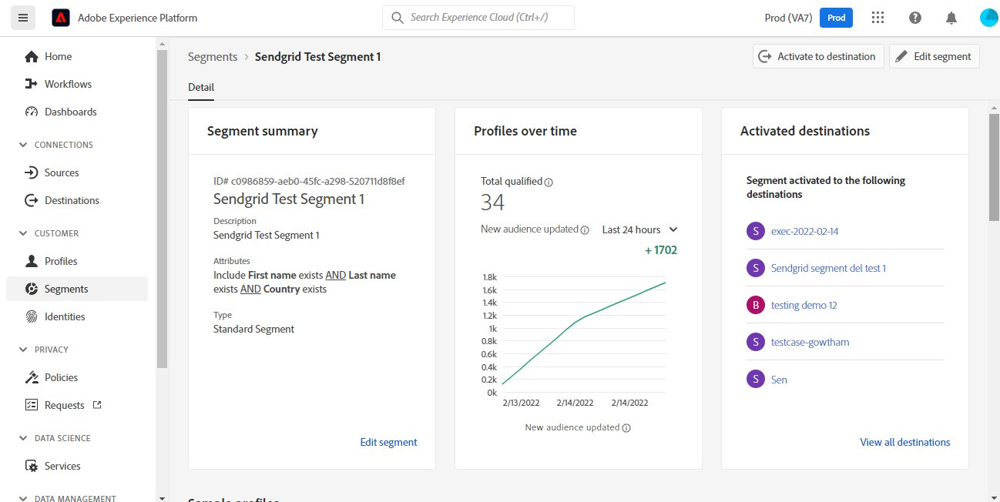
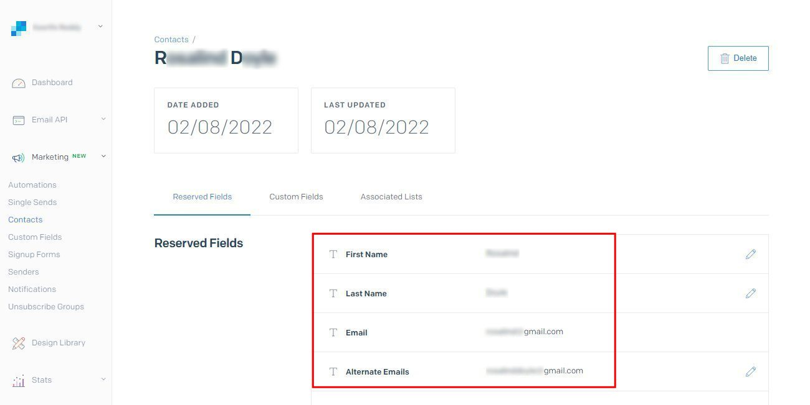

# [!DNL SendGrid]-verbinding

## Overzicht {#overview}

[&#x200B; SendGrid &#x200B;](https://www.sendgrid.com) is een populair platform van de klantenmededeling voor transactie en marketing e-mails.

Dit [!DNL Adobe Experience Platform] [&#x200B; bestemmings &#x200B;](/help/destinations/home.md) hefboomwerkingen [[!DNL SendGrid Marketing Contacts API] &#x200B;](https://api.sendgrid.com/v3/marketing/contacts), die u toestaat om uw eerste-partij e-mailprofielen uit te voeren en hen binnen een nieuw publiek te activeren SendGrid voor uw bedrijfsbehoeften.

SendGrid gebruikt API dragertokens als authentificatiemechanisme om met SendGrid API te communiceren.

## Vereisten {#prerequisites}

De volgende punten worden vereist alvorens u begint de bestemming te vormen.

1. U moet een SendGrid-account hebben.
   * Ga naar SendGrid [&#x200B; signaleren &#x200B;](https://signup.sendgrid.com/) pagina om een rekening te registreren SendGrid tot stand te brengen, als u niet reeds hebt.
1. Nadat u zich hebt aangemeld bij de portal SendGrid, moet u ook een API-token genereren.
1. Ga naar de SendGrid-website en open de pagina **[!DNL Settings]** > **[!DNL API Keys]** . Alternatief, verwijs naar de [&#x200B; documentatie SendGrid &#x200B;](https://app.sendgrid.com/settings/api_keys) om tot de aangewezen sectie in SendGrid toegang te hebben app.
1. Selecteer ten slotte de knop **[!DNL Create API Key]** .
   * Verwijs naar de [&#x200B; documentatie SendGrid &#x200B;](https://docs.sendgrid.com/ui/account-and-settings/api-keys#creating-an-api-key), als u begeleiding op nodig hebt welke acties uit te voeren.
   * Als u uw API Sleutel programmatically zou willen produceren, gelieve te verwijzen naar de [&#x200B; documentatie SendGrid &#x200B;](https://docs.sendgrid.com/api-reference/api-keys/create-api-keys).

Alvorens gegevens aan de bestemming te activeren SendGrid, moet u a [&#x200B; schema &#x200B;](https://experienceleague.adobe.com/docs/experience-platform/xdm/schema/composition.html?lang=nl-NL), a [&#x200B; dataset &#x200B;](https://experienceleague.adobe.com/docs/platform-learn/tutorials/data-ingestion/create-datasets-and-ingest-data.html?lang=nl-NL), en [&#x200B; segmenten &#x200B;](https://experienceleague.adobe.com/docs/platform-learn/tutorials/segments/create-segments.html?lang=nl-NL) hebben die in [!DNL Experience Platform] worden gecreeerd. Verwijs ook naar de [&#x200B; grenzen &#x200B;](#limits) sectie verder hieronder op deze pagina.

>[!IMPORTANT]
>
>* Voor de SendGrid-API die wordt gebruikt voor het maken van de mailinglijst vanuit e-mailprofielen, moeten binnen elk profiel unieke e-mailadressen worden opgegeven. Dit is ongeacht of het als waarde voor *e-mail* of *afwisselende e-mail* wordt gebruikt. Omdat de verbinding SendGrid afbeeldingen voor zowel e-mail als afwisselende e-mailwaarden steunt, gelieve ervoor te zorgen dat alle gebruikte e-mailadressen binnen elk profiel van de *Dataset* uniek zouden moeten zijn. Als de e-mailprofielen naar SendGrid worden verzonden, resulteert dit in een fout en is dat e-mailprofiel niet aanwezig in de gegevensexport.
>
>* Er is momenteel geen functionaliteit om profielen uit SendGrid te verwijderen wanneer ze uit het publiek in Experience Platform worden verwijderd.

## Ondersteunde identiteiten {#supported-identities}

SendGrid ondersteunt de activering van identiteiten die in de onderstaande tabel worden beschreven. Leer meer over [&#x200B; identiteiten &#x200B;](/help/identity-service/features/namespaces.md).

| Doelidentiteit | Beschrijving | Overwegingen |
|---|---|---|
| email | E-mailadres | Onbewerkte tekst en gehashte e-mailadressen van SHA256 worden ondersteund door [!DNL Adobe Experience Platform] . Als het bronveld van het Experience-platform hashed-kenmerken bevat, schakelt u de optie **[!UICONTROL Apply transformation]** in om [!DNL Experience Platform] de gegevens automatisch te laten hashen bij activering.   Merk op dat **SendGrid** geen gehakt e-mailadressen steunt, zodat slechts worden de gewone tekstgegevens zonder transformatie verzonden naar de bestemming. |

{style="table-layout:auto"}

## Type en frequentie exporteren {#export-type-frequency}

Raadpleeg de onderstaande tabel voor informatie over het exporttype en de exportfrequentie van de bestemming.

| Item | Type | Notities |
|---------|----------|---------|
| Exporttype | **[!UICONTROL Profile-based]** | U exporteert alle leden van een segment, samen met de gewenste schemavelden (bijvoorbeeld: e-mailadres, telefoonnummer, achternaam), zoals gekozen in het scherm van de uitgezochte profielkenmerken van het [&#x200B; werkschema van de bestemmingsactivering &#x200B;](/help/destinations/ui/activate-batch-profile-destinations.md#select-attributes). |
| Exportfrequentie | **[!UICONTROL Streaming]** | Streaming doelen zijn &quot;altijd aan&quot; API-verbindingen. Zodra een profiel in Experience Platform wordt bijgewerkt dat op publieksevaluatie wordt gebaseerd, verzendt de schakelaar de update stroomafwaarts naar het bestemmingsplatform. Lees meer over [&#x200B; het stromen bestemmingen &#x200B;](/help/destinations/destination-types.md#streaming-destinations). |

{style="table-layout:auto"}

## Gebruiksscenario’s {#use-cases}

Om u beter te helpen begrijpen hoe en wanneer u de bestemming zou moeten gebruiken SendGrid, zijn hier de gevallen van het steekproefgebruik die [!DNL Experience Platform] klanten kunnen oplossen door deze bestemming te gebruiken.

### Een marketinglijst maken voor meerdere marketingactiviteiten

Marketing teams die SendGrid gebruiken, kunnen een mailinglijst maken in SendGrid en deze vullen met e-mailadressen. De mailinglijst die nu in SendGrid wordt gemaakt, kan vervolgens voor meerdere marketingactiviteiten worden gebruikt.

## Verbinden met doel {#connect}

>[!IMPORTANT]
> 
>Om met de bestemming te verbinden, hebt u **[!UICONTROL View Destinations]** en **[!UICONTROL Manage Destinations]** [&#x200B; toegangsbeheertoestemmingen &#x200B;](/help/access-control/home.md#permissions) nodig. Lees het [&#x200B; overzicht van de toegangscontrole &#x200B;](/help/access-control/ui/overview.md) of contacteer uw productbeheerder om de vereiste toestemmingen te verkrijgen.

Om met deze bestemming te verbinden, volg de stappen die in het [&#x200B; leerprogramma van de bestemmingsconfiguratie &#x200B;](../../ui/connect-destination.md) worden beschreven. In vormen bestemmingswerkschema, vul de gebieden in die in de twee hieronder secties worden vermeld.

### Verifiëren voor bestemming {#authenticate}

1. Binnen de [!DNL Adobe Experience Platform] console, navigeer aan **Doelen**.

1. Selecteer het **lusje van de Catalogus** en onderzoek naar *SendGrid*. Dan selecteer **Opstelling**. Nadat u een verbinding aan de bestemming hebt gevestigd, verandert het etiket UI in **Activate Segmenten**.
   

1. U wordt getoond een tovenaar die u in het vormen van de bestemming SendGrid bijstaat. Creeer de nieuwe bestemming door **te selecteren vorm nieuwe bestemming**.
   

1. Selecteer de **Nieuwe optie van de Rekening** en vul de **Symbolische** waarde van de Token van de Drager in. Deze waarde is SendGrid *API Sleutel* eerder vermeld in de [&#x200B; eerste vereisten sectie &#x200B;](#prerequisites).
   

1. Selecteer **verbinden met bestemming**. Als SendGrid *API Sleutel* u verstrekt geldig is, toont UI a **Verbonden** status met een groen vinkje, kunt u aan de volgende stap dan te werk gaan om extra informatiegebieden in te vullen.

### Doelgegevens invullen {#destination-details}

Terwijl [&#x200B; vestiging &#x200B;](https://experienceleague.adobe.com/docs/experience-platform/destinations/ui/connect-destination.html?lang=nl-NL) deze bestemming, u de volgende informatie moet verstrekken:

* **[!UICONTROL Name]**: De naam waarmee u dit doel in de toekomst herkent.
* **[!UICONTROL Description]**: Een optionele beschrijving waarmee u deze bestemming in de toekomst kunt identificeren.

### Waarschuwingen inschakelen {#enable-alerts}

U kunt alarm toelaten om berichten over de status van dataflow aan uw bestemming te ontvangen. Selecteer een waarschuwing in de lijst om u te abonneren op meldingen over de status van uw gegevensstroom. Voor meer informatie over alarm, zie de gids bij [&#x200B; het intekenen aan bestemmingsalarm gebruikend UI &#x200B;](../../ui/alerts.md).

Wanneer u klaar bent met het opgeven van details voor uw doelverbinding, selecteert u **[!UICONTROL Next]** .

## Soorten publiek naar dit doel activeren {#activate}

>[!IMPORTANT]
> 
>* Om gegevens te activeren, hebt u **[!UICONTROL View Destinations]**, **[!UICONTROL Activate Destinations]**, **[!UICONTROL View Profiles]**, en **[!UICONTROL View Segments]** [&#x200B; toegangsbeheertoestemmingen &#x200B;](/help/access-control/home.md#permissions) nodig. Lees het [&#x200B; overzicht van de toegangscontrole &#x200B;](/help/access-control/ui/overview.md) of contacteer uw productbeheerder om de vereiste toestemmingen te verkrijgen.
>* Om *identiteiten* uit te voeren, hebt u de **[!UICONTROL View Identity Graph]** [&#x200B; toegangsbeheertoestemming &#x200B;](/help/access-control/home.md#permissions) nodig.   {width="100" zoomable="yes"}

Lees [&#x200B; activeer profielen en publiek aan het stromen publiek uitvoerbestemmingen &#x200B;](/help/destinations/ui/activate-segment-streaming-destinations.md) voor instructies bij het activeren van publiek aan deze bestemming.

Raadpleeg de onderstaande afbeeldingen voor meer informatie over deze bestemming.

1. Selecteer een of meer soorten publiek dat u wilt exporteren naar SendGrid.
   

1. In de stap **[!UICONTROL Mapping]** wordt na het selecteren van **[!UICONTROL Add new mapping]** de toewijzingspagina weergegeven om de XDM-bronvelden toe te wijzen aan de SendGrid API-doelvelden. In de onderstaande afbeeldingen ziet u hoe u naamruimten kunt toewijzen tussen Experience Platform en SendGrid. Gelieve te verzekeren **[!UICONTROL Source field]** *E-mail* aan **[!UICONTROL Target field]** *external_id* zoals hieronder getoond zou moeten worden in kaart gebracht.
   
   
   
   

1. Wijs op dezelfde manier de gewenste [!DNL Adobe Experience Platform] attributen toe die u naar de bestemming wilt uitvoeren SendGrid.
   
   

1. Nadat u de toewijzingen hebt voltooid, selecteert u **[!UICONTROL Next]** om naar het revisiescherm te gaan.
   

1. Selecteer **[!UICONTROL Finish]** om de installatie te voltooien.
   

De uitvoerige lijst van gesteunde attributenafbeeldingen die opstelling voor [&#x200B; SendGrid Marketing Contacten > toevoegen of Update Contact API &#x200B;](https://docs.sendgrid.com/api-reference/contacts/add-or-update-a-contact) kan zijn is hieronder.

| Source-veld | Doelveld | Type | Beschrijving | Limieten |
|---|---|---|---|---|
| xdm:  homeAddress.street1 | xdm:  address_line_1 | String | De eerste regel van het adres. | Max. lengte:  100 tekens |
| xdm:  homeAddress.street2 | xdm:  address_line_2 | String | Een optionele tweede regel voor het adres. | Max. lengte:  100 tekens |
| xdm:  _extcondev.alternate_e-mails | xdm:  alternate_emails | Array van tekenreeks | Extra e-mailberichten die aan de contactpersoon zijn gekoppeld. | <ul><li>Max. 5 items</li><li>Min.: 0 items</li></ul> |
| xdm:  homeAddress.city | xdm:  city | String | De stad van de contactpersoon. | Max. lengte:  60 tekens |
| xdm:  homeAddress.country | xdm:  land | String | Het land van de contactpersoon. Kan een volledige naam of een afkorting zijn. | Max. lengte:  50 tekens |
| identityMap:  Email | Identiteit:  external_id | String | Het primaire e-mailadres van de contactpersoon. Dit is een geldige e-mail. | Max. lengte:  254 tekens |
| xdm:  person.name.firstName | xdm:  first_name | String | De naam van de contactpersoon | Max. lengte:  50 tekens |
| xdm:  person.name.lastName | xdm:  last_name | String | De familienaam van de contactpersoon | Max. lengte:  50 tekens |
| xdm:  homeAddress.postalCode | xdm:  postal_code | String | De postcode of andere postcode van de contactpersoon. | |
| xdm:  homeAddress.stateProvince | xdm:  state_Province_region | String | De staat, provincie of regio van de contactpersoon. | Max. lengte:  50 tekens |

## De gegevensexport valideren in SendGrid {#validate}

Volg onderstaande stappen om te controleren of u de bestemming correct hebt ingesteld:

1. Selecteer **[!UICONTROL Destinations]** > **[!UICONTROL Browse]** om naar de lijst met doelen te navigeren.
   

1. Selecteer het doel en bevestig dat de status **[!UICONTROL enabled]** is.
   

1. Ga naar het tabblad **[!DNL Activation data]** en selecteer vervolgens een publieksnaam.
   

1. Controleer de publiekssamenvatting en controleer de telling van profielen aan de telling beantwoordt die binnen de dataset wordt gecreeerd.
   

1. De [&#x200B; SendGrid Marketing Lists > creëren Lijst API &#x200B;](https://docs.sendgrid.com/api-reference/lists/create-list) wordt gebruikt om unieke contactlijsten binnen SendGrid tot stand te brengen door tot de waarde van het *list_name* attribuut en timestamp van de gegevensuitvoer toe te treden. Navigeer naar de SendGrid-site en controleer of de nieuwe lijst met contactpersonen die overeenkomen met het naampatroon is gemaakt.
   
   

1. Selecteer de zojuist gemaakte lijst met contactpersonen en controleer of de nieuwe e-mailrecord in de gegevensset die u hebt gemaakt, wordt ingevuld in de nieuwe lijst met contactpersonen.

1. Controleer bovendien een aantal e-mailberichten om te controleren of de veldtoewijzing juist is.
   
   

## Gegevensgebruik en -beheer {#data-usage-governance}

Alle [!DNL Adobe Experience Platform] -doelen zijn compatibel met het beleid voor gegevensgebruik bij het verwerken van uw gegevens. Voor gedetailleerde informatie over hoe [!DNL Adobe Experience Platform] gegevensbeheer afdwingt, zie het [&#x200B; overzicht van het Beleid van Gegevens &#x200B;](/help/data-governance/home.md).

## Aanvullende bronnen {#additional-resources}

Deze SendGrid-bestemming gebruikt de onderstaande API&#39;s:

* [&#x200B; SendGrid Marketing Lists > Create Lijst API &#x200B;](https://docs.sendgrid.com/api-reference/lists/create-list)
* [&#x200B; SendGrid Marketing Contacten > voeg toe of werk Contact API &#x200B;](https://docs.sendgrid.com/api-reference/contacts/add-or-update-a-contact) bij

### Limieten {#limits}

* De [&#x200B; SendGrid Marketing Contacten > voegen toe of werken contact API &#x200B;](https://api.sendgrid.com/v3/marketing/contacts) kan 30.000 contacten, of 6MB van gegevens goedkeuren, welke lager is.
