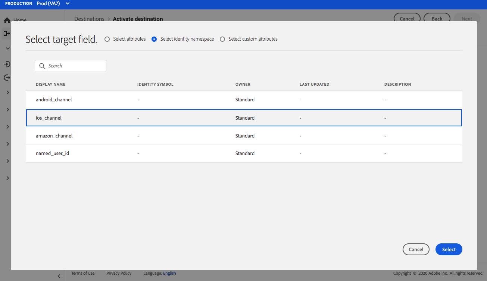
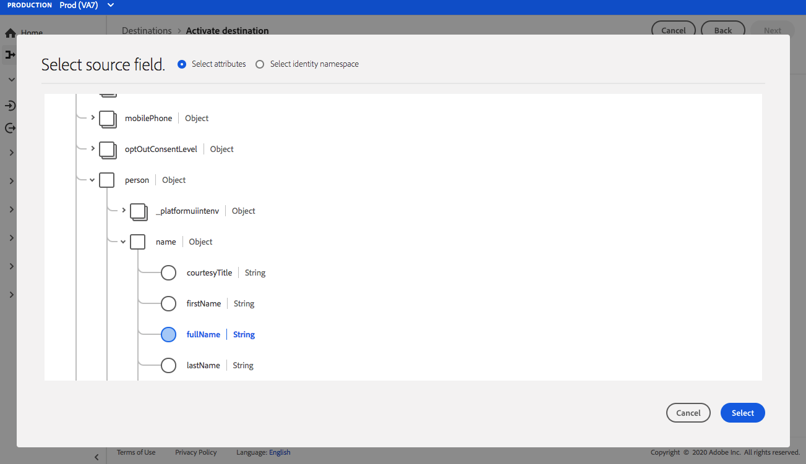

# (Bèta) [!DNL Airship Attributes] verbinding {#airship-attributes-destination}

>[!IMPORTANT]
>
>De bestemming [!DNL Airship Attributes] in Adobe Experience Platform is momenteel in bèta. De documentatie en de functionaliteit kunnen worden gewijzigd.

## Overzicht {#overview}

[!DNL Airship] is het toonaangevende Platform voor betrokkenheid van klanten, waarmee u in elke fase van de levenscyclus van de klant betekenisvolle, gepersonaliseerde omnichanale berichten aan uw gebruikers kunt leveren.

Deze integratie geeft Adobe-profielgegevens door in [!DNL Airship] als [Attributen](https://docs.airship.com/guides/audience/attributes/) voor activering of activering.

Zie [Airship Docs](https://docs.airship.com) voor meer informatie over [!DNL Airship].

>[!TIP]
>
>Deze documentatiepagina is gemaakt door het team van [!DNL Airship]. Voor vragen of verzoeken om updates kunt u rechtstreeks contact opnemen via [support.airship.com](https://support.airship.com/).

## Vereisten {#prerequisites}

Voordat u publiekssegmenten naar [!DNL Airship] kunt verzenden, moet u:

* Laat attributen in uw [!DNL Airship] project toe.
* Een token voor toonder genereren voor verificatie.

>[!TIP]
>
>Maak een [!DNL Airship]-account via [deze aanmeldlink](https://go.airship.eu/accounts/register/plan/starter/) als u dat nog niet hebt gedaan.

## Kenmerken {#enable-attributes} inschakelen

Adobe Experience Platform-profielkenmerken lijken op [!DNL Airship]-kenmerken en kunnen gemakkelijk aan elkaar worden toegewezen in het Platform met behulp van het toewijzingsgereedschap dat verderop op op deze pagina wordt getoond.

[!DNL Airship] de projecten hebben verscheidene vooraf bepaalde en standaardattributen. Als u een douanekenmerk hebt, moet u het in [!DNL Airship] eerst bepalen. Zie [Kenmerken instellen en beheren](https://docs.airship.com/tutorials/audience/attributes/) voor meer informatie.

## Dragertoken {#bearer-token} genereren

Ga naar **[!UICONTROL Settings]**&quot; **[!UICONTROL APIs & Integrations]** in [Luchtvaartdashboard](https://go.airship.com) en selecteer **[!UICONTROL Tokens]** in het linkermenu.

Klik op **[!UICONTROL Create Token]**.

Geef een gebruikersvriendelijke naam voor uw token op, bijvoorbeeld &quot;Doel Adobe-kenmerken&quot;, en selecteer &quot;Alle toegang&quot; voor de rol.

Klik op **[!UICONTROL Create Token]** en sla de details op als vertrouwelijk.

## Gebruiksscenario’s {#use-cases}

Om u beter te helpen begrijpen hoe en wanneer u [!DNL Airship Attributes] bestemming zou moeten gebruiken, zijn hier voorbeelden van gebruiksgevallen die de klanten van Adobe Experience Platform door deze bestemming kunnen oplossen.

### Hoofdletters gebruiken #1

Gebruik profielgegevens die in Adobe Experience Platform zijn verzameld voor personalisatie van het bericht en rijke inhoud binnen de kanalen van [!DNL Airship]. Gebruik bijvoorbeeld [!DNL Experience Platform]-profielgegevens om locatiekenmerken in te stellen binnen [!DNL Airship]. Hierdoor kan een hotelmerk voor elke gebruiker een afbeelding weergeven voor de dichtstbijzijnde hotellocatie.

### Hoofdletters gebruiken #2

Gebruik kenmerken van Adobe Experience Platform om [!DNL Airship]-profielen verder te verrijken en combineer deze met SDK of [!DNL Airship] voorspellende gegevens. Bijvoorbeeld, kan een detailhandelaar een segment met loyaliteitsstatus en plaatsgegevens (eigenschappen van Platform) tot stand brengen en [!DNL Airship] voorspeld om gegevens te koelen om hoogst gerichte berichten naar gebruikers in de gouden loyaliteitsstatus te verzenden die in Las Vegas, NV wonen, en een hoge waarschijnlijkheid van het kuren hebben.

## Verbinden met [!DNL Airship Attributes] {#connect-airship-attributes}

Blader in **[!UICONTROL Destinations]** > **[!UICONTROL Catalog]** naar de categorie **[!UICONTROL Mobile Engagement]**. Selecteer **[!DNL Airship Attributes]** en selecteer **[!UICONTROL Configure]**.

>[!NOTE]
>
>Als er al een verbinding met dit doel bestaat, kunt u een **[!UICONTROL Activate]** knop op de doelkaart zien. Raadpleeg voor meer informatie over het verschil tussen **[!UICONTROL Activate]** en **[!UICONTROL Configure]** de sectie [Catalog](../../ui/destinations-workspace.md#catalog) van de documentatie van de doelwerkruimte.

Als u in de stap **Account** eerder een verbinding met uw [!DNL Airship Attributes]-doel hebt ingesteld, selecteert u **[!UICONTROL Existing Account]** en selecteert u de bestaande verbinding. U kunt ook **[!UICONTROL New Account]** selecteren om een nieuwe verbinding in te stellen met [!DNL Airship Attributes]. Selecteer **[!UICONTROL Connect to destination]** om Adobe Experience Platform met uw [!DNL Airship] project te verbinden gebruikend het dragerteken dat u van het [!DNL Airship] dashboard produceerde.

>[!NOTE]
>
>Adobe Experience Platform ondersteunt validatie van referenties in het verificatieproces en geeft een foutbericht weer als u onjuiste gegevens hebt ingevoerd voor uw [!DNL Airship]-account. Dit zorgt ervoor dat u de werkstroom niet met onjuiste geloofsbrieven voltooit.

Nadat uw referenties zijn bevestigd en Adobe Experience Platform is verbonden met uw [!DNL Airship]-project, kunt u **[!UICONTROL Next]** selecteren om door te gaan naar de stap **[!UICONTROL Setup]**.

Voer in de stap **[!UICONTROL Authentication]** een **[!UICONTROL Name]** en een **[!UICONTROL Description]** in voor de activeringsstroom.

In deze stap kunt u ook Amerikaans of EU-datacenter selecteren, afhankelijk van welk [!DNL Airship] datacenter op dit doel van toepassing is. Tot slot selecteer één of meerdere **[!UICONTROL Marketing Actions]** waarvoor de gegevens naar de bestemming zullen worden uitgevoerd. U kunt kiezen uit door Adobe gedefinieerde marketingacties of u kunt uw eigen acties maken. Voor meer informatie over marketing acties, zie [Overzicht van het beleid van het gebruik van Gegevens](../../../data-governance/policies/overview.md).

Selecteer **[!UICONTROL Create Destination]** nadat u de bovenstaande velden hebt ingevuld.

Uw doel is nu gemaakt. U kunt **[!UICONTROL Save & Exit]** selecteren als u segmenten later wilt activeren of u kunt **[!UICONTROL Next]** selecteren om de workflow voort te zetten en segmenten te selecteren om te activeren. In beide gevallen raadpleegt u de volgende sectie [Segmenten activeren](#activate-segments) voor de rest van de workflow.

## Segmenten {#activate-segments} activeren

Volg onderstaande stappen om segmenten te activeren op [!DNL Airship Attributes]:

Selecteer in **[!UICONTROL Destinations > Browse]** de bestemming [!DNL Airship Attributes] waar u de segmenten wilt activeren.

Klik op de naam van het doel. Hiermee gaat u naar de flow Activeren.

Merk op dat als een activeringsstroom reeds voor een bestemming bestaat, u de segmenten kunt zien die momenteel naar de bestemming worden verzonden. Selecteer **[!UICONTROL Edit activation]** in het rechterspoor en volg de onderstaande stappen om de activeringsdetails te wijzigen.

Selecteer **[!UICONTROL Activate]**. Selecteer in de **[!UICONTROL Activate destination]**-workflow op de **[!UICONTROL Select Segments]**-pagina welke segmenten naar [!DNL Airship Attributes] moeten worden verzonden.

In de **[!UICONTROL Mapping]** stap, selecteer welke attributen en identiteiten van [XDM](../../../xdm/home.md) schema aan kaart aan het bestemmingsschema. Selecteer **[!UICONTROL Add new mapping]** om uw schema te doorbladeren en hen in kaart te brengen aan de overeenkomstige doelidentiteit.

[!DNL Airship] attributen kunnen op of een kanaal worden geplaatst, dat apparateninstantie, b.v., iPhone, of een genoemde gebruiker vertegenwoordigt, die alle apparaten van een gebruiker aan een gemeenschappelijk herkenningsteken zoals een klantenidentiteitskaart in kaart brengt. Als u gewone (niet-gehakte) e-mailadressen als primaire identiteit in uw schema hebt, selecteer het e-mailgebied in uw **[!UICONTROL Source Attributes]** en kaart aan [!DNL Airship] genoemde gebruiker in de juiste kolom onder **[!UICONTROL Target Identities]**, zoals hieronder getoond.

Voor herkenningstekens die aan een kanaal, d.w.z., een apparaat moeten worden in kaart gebracht, kaart aan het aangewezen kanaal dat op de bron wordt gebaseerd. De volgende afbeeldingen laten zien hoe twee toewijzingen worden gemaakt:

* IDFA iOS Advertising ID to an [!DNL Airship] iOS channel
* Adobe `fullName`-kenmerk naar [!DNL Airship]-kenmerk &quot;Volledige naam&quot;

>[!NOTE]
>
>Gebruik de gebruikersvriendelijke naam die op het dashboard [!DNL Airship] verschijnt wanneer het selecteren van het doelgebied voor uw attributenafbeelding.

**Identiteit kaart**

Bronveld selecteren:

Doelveld selecteren:

**Kenmerk Kaart**

Bronkenmerk selecteren:

Doelkenmerk selecteren:

Toewijzing verifiëren:

Op de pagina **[!UICONTROL Segment schedule]** is planning momenteel uitgeschakeld. Klik op **[!UICONTROL Next]** om door te gaan naar de revisiestap.

Op de **[!UICONTROL Review]** pagina, kunt u een samenvatting van uw selectie zien. Selecteer **[!UICONTROL Cancel]** om de stroom te verbreken, **[!UICONTROL Back]** om uw montages te wijzigen, of **[!UICONTROL Finish]** om uw selectie te bevestigen en te beginnen gegevens naar de bestemming te verzenden.

>[!IMPORTANT]
>
>In deze stap controleert Adobe Experience Platform op overtredingen van het gegevensgebruiksbeleid. Hieronder ziet u een voorbeeld waarin een beleid wordt overtreden. U kunt de workflow voor segmentactivering pas voltooien nadat u de schending hebt opgelost. Voor informatie over hoe te om beleidsschendingen op te lossen, zie [Beleidshandhaving](../../../data-governance/enforcement/auto-enforcement.md) in de sectie van de documentatie van het gegevensbeheer.

Als er geen beleidsovertredingen zijn vastgesteld, selecteert u **[!UICONTROL Finish]** om uw selectie te bevestigen en gegevens naar de bestemming te verzenden.

## Gegevensgebruik en -beheer {#data-usage-governance}

Alle [!DNL Adobe Experience Platform] bestemmingen zijn volgzaam met het beleid van het gegevensgebruik wanneer het behandelen van uw gegevens. Zie [Overzicht gegevensbeheer](../../../data-governance/home.md) voor gedetailleerde informatie over hoe [!DNL Adobe Experience Platform] gegevensbeheer afdwingt.
