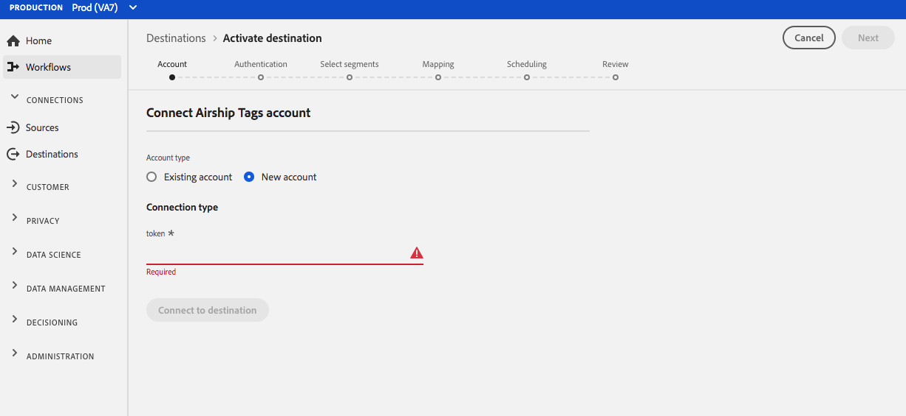
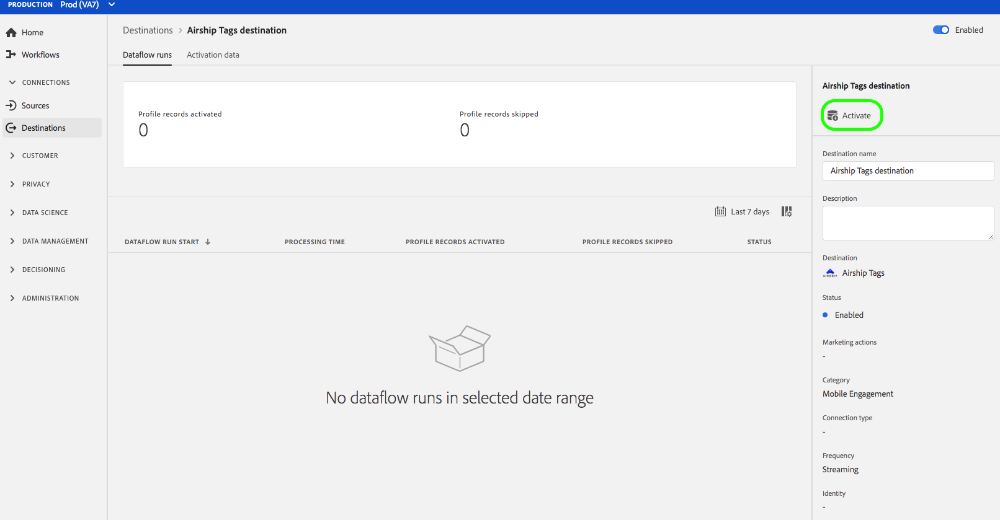

# (Bèta) [!DNL Airship Tags] verbinding {#airship-tags-destination}

>[!IMPORTANT]
>
>De bestemming [!DNL Airship Tags] in Adobe Experience Platform is momenteel in bèta. De documentatie en de functionaliteit kunnen worden gewijzigd.

## Overzicht

[!DNL Airship] is het toonaangevende Platform voor betrokkenheid van klanten, waarmee u in elke fase van de levenscyclus van de klant betekenisvolle, gepersonaliseerde omnichanale berichten aan uw gebruikers kunt leveren.

Deze integratie gaat Adobe Experience Platform segmentgegevens in [!DNL Airship] als [Codes](https://docs.airship.com/guides/audience/tags/) voor het richten of het teweegbrengen over.

Zie [Airship Docs](https://docs.airship.com) voor meer informatie over [!DNL Airship].

>[!TIP]
>
>Deze documentatiepagina is gemaakt door het team van [!DNL Airship]. Voor vragen of verzoeken om updates kunt u rechtstreeks contact opnemen via [support.airship.com](https://support.airship.com/).

## Vereisten

Voordat u uw Adobe Experience Platform-segmenten kunt verzenden naar [!DNL Airship], moet u:

* Creeer een markeringsgroep in uw [!DNL Airship] project.
* Een token voor toonder genereren voor verificatie.

>[!TIP]
> 
>Maak een [!DNL Airship]-account via [deze aanmeldlink](https://go.airship.eu/accounts/register/plan/starter/) als u dat nog niet hebt gedaan.

### Taggroepen

Het concept van segmenten in het platform van de Ervaring van Adobe is gelijkaardig aan [Markeringen](https://docs.airship.com/guides/audience/tags/) in Airship, met lichte verschillen in implementatie. Door deze integratie wordt de status van een [lidmaatschap van een gebruiker in een Experience Platform segment](https://experienceleague.adobe.com/docs/experience-platform/xdm/mixins/profile/segmentation.html?lang=en#mixins) toegewezen aan de aanwezigheid of niet-aanwezigheid van een [!DNL Airship]-tag. Bijvoorbeeld, in een segment van het Platform waar `xdm:status` in `realized` verandert, wordt de markering toegevoegd aan [!DNL Airship] kanaal of genoemde gebruiker wordt dit profiel in kaart gebracht aan. Als `xdm:status` in `exited` verandert, wordt de markering verwijderd.

Om deze integratie toe te laten, creeer een *markeringsgroep* in [!DNL Airship] genoemd `adobe-segments`.

>[!IMPORTANT]
>
>Wanneer het creëren van uw nieuwe markeringsgroep **controleer** niet het radioknoop dat &quot;[!DNL Allow these tags to be set only from your server]&quot;zegt. Als u dit doet, mislukt de integratie van de Adobe-tags.

Zie [Taggroepen beheren](https://docs.airship.com/tutorials/manage-project/messaging/tag-groups) voor instructies over het maken van de taggroep.

### Token aan toonder

Ga naar **[!UICONTROL Instellingen]**&quot; **[!UICONTROL API&#39;s &amp; integraties]** in het [Airship dashboard](https://go.airship.com) en selecteer **[!UICONTROL Tokens]** in het linkermenu.

Klik **[!UICONTROL Token maken]**.

Geef uw token een gebruikersvriendelijke naam, bijvoorbeeld &quot;Doel van Adobe-tags&quot;, en selecteer &quot;Alle toegang&quot; voor de rol.

Klik **[!UICONTROL Token maken]** en sla de details op als vertrouwelijk.

## Gebruiksscenario’s

Om u beter te helpen begrijpen hoe en wanneer u [!DNL Airship Tags] bestemming zou moeten gebruiken, zijn hier voorbeelden van gebruiksgevallen die de klanten van Adobe Experience Platform door deze bestemming kunnen oplossen.

### Hoofdletters gebruiken #1

Detailhandelaars of entertainmentplatforms kunnen gebruikersprofielen maken voor hun klanten die loyaal zijn en die segmenten doorgeven aan [!DNL Airship] voor berichten die bestemd zijn voor mobiele campagnes.

### Hoofdletters gebruiken #2

U kunt een-op-een berichten in real-time activeren wanneer gebruikers binnen of buiten specifieke segmenten in Adobe Experience Platform vallen.

Een detailhandelaar stelt bijvoorbeeld een merkspecifiek segment voor jeans in Platform in. Deze detailhandelaar kan nu een mobiel bericht activeren zodra iemand zijn jeans-voorkeur op een bepaald merk instelt.

## Verbinden met [!DNL Airship Tags] {#connect-airship-tags}

Blader in **[!UICONTROL Doelen]** > **[!UICONTROL Catalogus]** naar de categorie **[!UICONTROL Mobiele betrokkenheid]**. Selecteer **[!DNL Airship Tags]**, dan uitgezocht **[!UICONTROL vorm]**.

>[!NOTE]
>
>Als er al een verbinding met dit doel bestaat, kunt u een **[!UICONTROL knop Activeer]** op de doelkaart zien. Voor meer informatie over het verschil tussen **[!UICONTROL Activate]** en **[!UICONTROL Configure]**, verwijs naar [Catalog](../../ui/destinations-workspace.md#catalog) sectie van de documentatie van de bestemmingswerkruimte.

Als u in de stap **Account** eerder een verbinding met uw [!DNL Airship Tags]-doel hebt ingesteld, selecteert u **[!UICONTROL Bestaande account]** en selecteert u de bestaande verbinding. U kunt ook **[!UICONTROL Nieuwe account]** selecteren om een nieuwe verbinding in te stellen met [!DNL Airship Tags]. Selecteer **[!UICONTROL Verbinding maken met doel]** om Adobe Experience Platform te verbinden met uw [!DNL Airship]-project met behulp van het towertoken dat u hebt gegenereerd op het dashboard [!DNL Airship].

>[!NOTE]
>
>Adobe Experience Platform ondersteunt validatie van referenties in het verificatieproces en geeft een foutbericht weer als u onjuiste gegevens hebt ingevoerd voor uw [!DNL Airship]-account. Dit zorgt ervoor dat u de werkstroom niet met onjuiste geloofsbrieven voltooit.

Zodra uw geloofsbrieven worden bevestigd en Adobe Experience Platform wordt aangesloten aan uw [!DNL Airship] project, kunt u **[!UICONTROL Volgende]** selecteren om aan de **[!UICONTROL Opstelling]** stap te werk te gaan.

Voer in de stap **[!UICONTROL Verificatie]** een **[!UICONTROL Naam]** en een **[!UICONTROL Beschrijving]** voor uw activeringsstroom in.

In deze stap kunt u ook Amerikaans of EU-datacenter selecteren, afhankelijk van welk [!DNL Airship] datacenter op dit doel van toepassing is. Tot slot selecteer één of meerdere **[!UICONTROL Handelingen van de Marketing]** waarvoor de gegevens naar de bestemming zullen worden uitgevoerd. U kunt kiezen uit door Adobe gedefinieerde marketingacties of u kunt uw eigen acties maken. Voor meer informatie over marketing acties, zie [Overzicht van het beleid van het gebruik van Gegevens](../../../data-governance/policies/overview.md).

Selecteer **[!UICONTROL Doel maken]** nadat u de bovenstaande velden hebt ingevuld.

Uw doel is nu gemaakt. U kunt **[!UICONTROL Opslaan en afsluiten]** selecteren als u segmenten later wilt activeren of u kunt **[!UICONTROL Volgende]** selecteren om door te gaan met de workflow en segmenten te selecteren om te activeren. In beide gevallen raadpleegt u de volgende sectie [Segmenten activeren](#activate-segments) voor de rest van de workflow.

## Segmenten {#activate-segments} activeren

Volg onderstaande stappen om segmenten te activeren naar [!DNL Airship Tags]:

Selecteer in **[!UICONTROL Doelen > Bladeren]** de [!DNL Airship Tags] bestemming waar u de segmenten wilt activeren.

Klik op de naam van het doel. Hiermee gaat u naar de flow Activeren.

Merk op dat als een activeringsstroom reeds voor een bestemming bestaat, u de segmenten kunt zien die momenteel naar de bestemming worden verzonden. Selecteer **[!UICONTROL Activering bewerken]** in de rechtertrack en voer de onderstaande stappen uit om de activeringsdetails te wijzigen.

Selecteer **[!UICONTROL Activeren]**. In **[!UICONTROL Activeer bestemming]** werkschema, op **[!UICONTROL Selecteer Segmenten]** pagina, selecteer welke segmenten om naar [!DNL Airship Tags] te verzenden.

Selecteer in de stap **[!UICONTROL Toewijzing]** welke kenmerken en identiteiten in het schema [XDM](../../../xdm/home.md) om toe te wijzen aan het doelschema. Selecteer **[!UICONTROL Nieuwe toewijzing toevoegen]** om uw schema te doorbladeren en hen in kaart te brengen aan de overeenkomstige doelidentiteit.

[!DNL Airship] tags kunnen worden ingesteld op een kanaal dat apparaatinstantie vertegenwoordigt, bijvoorbeeld iPhone, of een benoemde gebruiker, die alle apparaten van een gebruiker toewijst aan een gemeenschappelijke id, zoals een klant-id. Als u gewone (unhashed) e-mailadressen als primaire identiteit in uw schema hebt, selecteer het e-mailgebied in uw **[!UICONTROL BronAttributen]** en kaart aan [!DNL Airship] genoemd gebruiker in de juiste kolom onder **[!UICONTROL Doelidentiteiten]**, zoals hieronder getoond.

Voor herkenningstekens die aan een kanaal, d.w.z., een apparaat moeten worden in kaart gebracht, kaart aan het aangewezen kanaal dat op de bron wordt gebaseerd. In de volgende afbeeldingen ziet u hoe u een Google Advertising-id toewijst aan een Android-kanaal [!DNL Airship].

Op **[!UICONTROL Segmentprogramma]** pagina, is het plannen momenteel gehandicapt. Klik **[!UICONTROL Volgende]** om door te gaan aan de overzichtsstap.

Op de **[!UICONTROL pagina van het Overzicht]**, kunt u een samenvatting van uw selectie zien. Selecteer **[!UICONTROL Annuleren]** om de stroom te verbreken, **[!UICONTROL Terug]** om uw instellingen te wijzigen of **[!UICONTROL Voltooien]** om uw selectie te bevestigen en gegevens naar de bestemming te verzenden.

>[!IMPORTANT]
>
>In deze stap controleert Adobe Experience Platform op overtredingen van het gegevensgebruiksbeleid. Hieronder ziet u een voorbeeld waarin een beleid wordt overtreden. U kunt de workflow voor segmentactivering pas voltooien nadat u de schending hebt opgelost. Voor informatie over hoe te om beleidsschendingen op te lossen, zie [Beleidshandhaving](../../../data-governance/enforcement/auto-enforcement.md) in de sectie van de documentatie van het gegevensbeheer.

Als er geen beleidsovertredingen zijn vastgesteld, selecteert u **[!UICONTROL Voltooien]** om uw selectie te bevestigen en gegevens naar de bestemming te verzenden.

## Gegevensgebruik en -beheer {#data-usage-governance}

Alle [!DNL Adobe Experience Platform] bestemmingen zijn volgzaam met het beleid van het gegevensgebruik wanneer het behandelen van uw gegevens. Zie [Overzicht gegevensbeheer](../../../data-governance/home.md) voor gedetailleerde informatie over hoe [!DNL Adobe Experience Platform] gegevensbeheer afdwingt.

