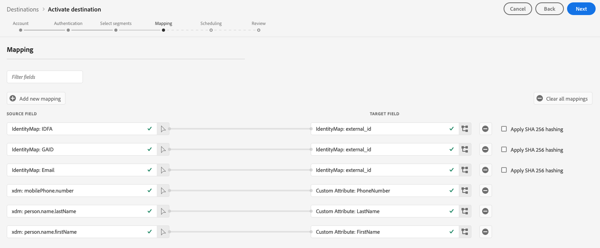

# [!DNL Braze] verbinding

## Overzicht {#overview}

De [!DNL Braze] doel helpt u profielgegevens te verzenden naar [!DNL Braze].

[!DNL Braze] is een uitgebreid platform voor klantenservice dat relevante en gedenkwaardige ervaringen tussen klanten en de merken die zij leuk vinden, mogelijk maakt.

Profielgegevens verzenden naar [!DNL Braze], moet u eerst verbinding maken met het doel.

## Doelspecificaties {#specifics}

Let op de volgende details die specifiek zijn voor de [!DNL Braze] bestemming:

* [!DNL Adobe Experience Platform] publiek wordt geëxporteerd naar [!DNL Braze] onder de `AdobeExperiencePlatformSegments` kenmerk.

>[!NOTE]
>
>Houd er rekening mee dat extra aangepaste kenmerken worden verzonden naar [!DNL Braze] kan leiden tot een toename van uw [!DNL Braze] verbruik van gegevenspunten. Raadpleeg uw [!DNL Braze] accountmanager voordat aanvullende aangepaste kenmerken worden verzonden.

## Gebruiksscenario’s {#use-cases}

Als markator wil ik gebruikers in een mobiele betrokkenheidsbestemming als doel instellen, met een ingebouwd publiek [!DNL Adobe Experience Platform]. Daarnaast wil ik hen persoonlijke ervaringen bieden op basis van hun kenmerken [!DNL Adobe Experience Platform] profielen, zodra het publiek en de profielen in [!DNL Adobe Experience Platform].

## Ondersteunde identiteiten {#supported-identities}

[!DNL Braze] ondersteunt de activering van identiteiten die in de onderstaande tabel worden beschreven.

| Doelidentiteit | Beschrijving | Overwegingen |
|---|---|---|
| external_id | Aangepast [!DNL Braze] id die het toewijzen van om het even welke identiteit steunt. | U kunt elke [identiteit](../../../identity-service/namespaces.md) aan de [!DNL Braze] doel, zolang u het aan de [!DNL Braze] [`external_id`](https://www.braze.com/docs/api/basics/#external-user-id-explanation). |

{style="table-layout:auto"}

## Ondersteunde doelgroepen {#supported-audiences}

In deze sectie wordt beschreven welke soorten publiek u naar dit doel kunt exporteren.

| Oorsprong publiek | Ondersteund | Beschrijving |
---------|----------|----------|
| [!DNL Segmentation Service] | ✓ | Door het Experience Platform gegenereerde soorten publiek [Segmenteringsservice](../../../segmentation/home.md). |
| Aangepaste uploads | ✓ | Soorten publiek [geïmporteerd](../../../segmentation/ui/overview.md#import-audience) in Experience Platform van CSV-bestanden. |

{style="table-layout:auto"}

## Type en frequentie exporteren {#export-type-frequency}

Raadpleeg de onderstaande tabel voor informatie over het exporttype en de exportfrequentie van de bestemming.

| Item | Type | Notities |
---------|----------|---------|
| Exporttype | **[!UICONTROL Profile-based]** | U exporteert alle leden van een segment samen met de gewenste schemavelden (bijvoorbeeld: e-mailadres, telefoonnummer, achternaam) en/of identiteiten volgens uw veldtoewijzing.[!DNL Adobe Experience Platform] publiek wordt geëxporteerd naar [!DNL Braze] onder de `AdobeExperiencePlatformSegments` kenmerk. |
| Exportfrequentie | **[!UICONTROL Streaming]** | Streaming doelen zijn &quot;altijd aan&quot; API-verbindingen. Zodra een profiel in Experience Platform wordt bijgewerkt dat op publieksevaluatie wordt gebaseerd, verzendt de schakelaar de update stroomafwaarts naar het bestemmingsplatform. Meer informatie over [streaming doelen](/help/destinations/destination-types.md#streaming-destinations). |

{style="table-layout:auto"}

## Verbinden met de bestemming {#connect}

>[!IMPORTANT]
> 
>Om met de bestemming te verbinden, hebt u nodig **[!UICONTROL View Destinations]** en **[!UICONTROL Manage Destinations]** [toegangsbeheermachtigingen](/help/access-control/home.md#permissions). Lees de [toegangsbeheeroverzicht](/help/access-control/ui/overview.md) of neem contact op met de productbeheerder om de vereiste machtigingen te verkrijgen.

Als u verbinding wilt maken met dit doel, voert u de stappen uit die in het dialoogvenster [zelfstudie over doelconfiguratie](../../ui/connect-destination.md). In vormen bestemmingswerkschema, vul de gebieden in die in de twee hieronder secties worden vermeld.

### Verifiëren voor bestemming {#authenticate}

Als u zich wilt verifiëren bij de bestemming, vult u de vereiste velden in en selecteert u **[!UICONTROL Connect to destination]**.

* **[!UICONTROL Braze account token]**: Dit is uw [!DNL Braze] [!DNL API] toets. U kunt gedetailleerde instructies vinden over hoe u uw [!DNL API] sleutel hier: [Overzicht van REST API-sleutel](https://www.braze.com/docs/api/api_key/).

### Doelgegevens invullen {#destination-details}

Als u details voor de bestemming wilt configureren, vult u de vereiste en optionele velden hieronder in. Een sterretje naast een veld in de gebruikersinterface geeft aan dat het veld verplicht is.

* **[!UICONTROL Name]**: voer een naam in waarmee u deze bestemming in de toekomst wilt herkennen.
* **[!UICONTROL Description]**: voer een beschrijving in die u zal helpen deze bestemming in de toekomst te identificeren.
* **[!UICONTROL Endpoint Instance]**: vraag uw [!DNL Braze] representatief welke eindpuntinstantie u zou moeten gebruiken.

### Waarschuwingen inschakelen {#enable-alerts}

U kunt alarm toelaten om berichten over de status van dataflow aan uw bestemming te ontvangen. Selecteer een waarschuwing in de lijst om u te abonneren op meldingen over de status van uw gegevensstroom. Zie de handleiding voor meer informatie over waarschuwingen [abonneren op bestemmingen die het alarm gebruiken UI](../../ui/alerts.md).

Wanneer u klaar bent met het opgeven van details voor uw doelverbinding, selecteert u **[!UICONTROL Next]**.

## Soorten publiek naar dit doel activeren {#activate}

>[!IMPORTANT]
> 
>* Als u gegevens wilt activeren, hebt u de opdracht **[!UICONTROL View Destinations]**, **[!UICONTROL Activate Destinations]**, **[!UICONTROL View Profiles]**, en **[!UICONTROL View Segments]** [toegangsbeheermachtigingen](/help/access-control/home.md#permissions). Lees de [toegangsbeheeroverzicht](/help/access-control/ui/overview.md) of neem contact op met de productbeheerder om de vereiste machtigingen te verkrijgen.
>* Om te exporteren *identiteiten*, hebt u de **[!UICONTROL View Identity Graph]** [toegangsbeheermachtiging](/help/access-control/home.md#permissions).   {width="100" zoomable="yes"}

Zie [De publieksgegevens van de activering aan het stromen publiek de uitvoerbestemmingen](../../ui/activate-segment-streaming-destinations.md) voor instructies voor het activeren van het publiek naar deze bestemming.

## Toewijzingsoverwegingen {#mapping-considerations}

Om uw publieksgegevens correct te verzenden van [!DNL Adobe Experience Platform] aan de [!DNL Braze] doel, moet u door de stap van de gebiedstoewijzing gaan.

Toewijzing bestaat uit het maken van een koppeling tussen uw [!DNL Experience Data Model] (XDM) schemavelden in uw [!DNL Platform] en de overeenkomstige equivalenten van de doelbestemming.

Uw XDM-velden op de juiste wijze toewijzen aan de [!DNL Braze] doelvelden, voer de volgende stappen uit:

In de [!UICONTROL Mapping] stap, klik op **[!UICONTROL Add new mapping]**.

In de [!UICONTROL Source Field] klikt u op de pijlknop naast het lege veld.

In de [!UICONTROL Select source field] kunt u kiezen uit twee categorieën XDM-velden:
* [!UICONTROL Select attributes]: gebruik deze optie om een specifiek veld van uw XDM-schema toe te wijzen aan een [!DNL Braze] kenmerk.

* [!UICONTROL Select identity namespace]: Gebruik deze optie om een [!DNL Platform] naamruimte identiteit [!DNL Braze] naamruimte.

Kies uw bronveld en klik op **[!UICONTROL Select]**.

In de [!UICONTROL Target Field] klikt u op het pictogram voor toewijzing rechts van het veld.

In de [!UICONTROL Select target field] kunt u kiezen uit twee categorieën doelvelden:
* [!UICONTROL Select identity namespace]: Gebruik deze optie om toe te wijzen [!DNL Platform] naamruimten naar [!DNL Braze] naamruimten.
* [!UICONTROL Select custom attributes]: Gebruik deze optie om XDM-kenmerken toe te wijzen aan aangepaste kenmerken [!DNL Braze] kenmerken die u in uw [!DNL Braze] account.   U kunt deze optie ook gebruiken om bestaande XDM-kenmerken te hernoemen in [!DNL Braze]. Bijvoorbeeld het toewijzen van een `lastName` XDM-kenmerk aan een aangepast element `Last_Name` kenmerk in [!DNL Braze], worden de `Last_Name` kenmerk in [!DNL Braze], als het nog niet bestaat, en kaart de `lastName` XDM-kenmerk eraan gekoppeld.

Kies uw doelveld en klik op **[!UICONTROL Select]**.

Nu wordt de veldtoewijzing weergegeven in de lijst.

Herhaal de vorige stappen om meer toewijzingen toe te voegen.

## Voorbeeld van toewijzing {#mapping-example}

Laat ons uw XDM profielschema en uw [!DNL Braze] -instantie bevat de volgende kenmerken en identiteiten:

|  | XDM-profielschema | [!DNL Braze] Instantie |
|---|---|---|
| Attributen | <ul><li><code>person.name.firstName</code></li><li><code>person.name.lastName</code></li><li><code>mobilePhone.number</code></li></ul> | <ul><li><code>FirstName</code></li><li><code>LastName</code></li><li><code>PhoneNumber</code></li></ul> |
| Identiteiten | <ul><li><code>E-mail</code></li><li><code>Google-advertentie-ID (GAID)</code></li><li><code>Apple-id voor adverteerders (IDFA)</code></li></ul> | <ul><li><code>external_id</code></li></ul> |

De juiste toewijzing zou er als volgt uitzien:

## Geëxporteerde gegevens {#exported-data}

Controleren of gegevens zijn geëxporteerd naar de [!DNL Braze] doel, controleer uw [!DNL Braze] account. [!DNL Adobe Experience Platform] publiek wordt geëxporteerd naar [!DNL Braze] onder de `AdobeExperiencePlatformSegments` kenmerk.

## Problemen oplossen {#troubleshooting}

**Ik heb een time-outfout ontvangen tijdens het activeren van mijn publiek naar deze bestemming. Wat moet ik doen?**

Soms kan activering van het publiek naar deze bestemming leiden tot een time-outfout. Deze fout geeft niet altijd een activeringsprobleem aan.

Als er een time-outfout optreedt, controleert u de publieksgrootte in het doelplatform. Als de publieksgrootte correct is, dan werkt de integratie zoals verwacht.

## Gegevensgebruik en -beheer {#data-usage-governance}

Alles [!DNL Adobe Experience Platform] de bestemmingen zijn volgzaam met het beleid van het gegevensgebruik wanneer het behandelen van uw gegevens. Voor gedetailleerde informatie over hoe [!DNL Adobe Experience Platform] handhaaft gegevensbeheer, zie [Overzicht van gegevensbeheer](../../../data-governance/home.md).
