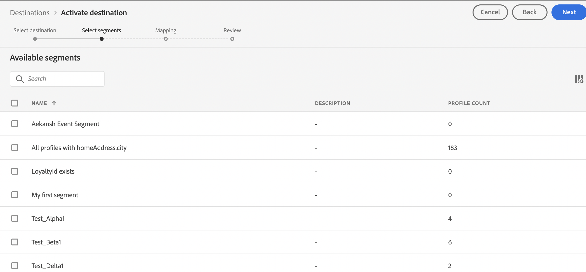

# [!DNL Moengage] verbinding

## Overzicht {#overview}

Gebruik de [!DNL Moengage] -bestemming om uw Adobe-gegevens (gebruikerskenmerken, segmenten en gebeurtenissen) in real-time te verbinden en toe te wijzen aan MoEngage. Klanten kunnen vervolgens op deze gegevens reageren en persoonlijke, doelgerichte ervaringen bieden.

Met Adobe is de integratie heel eenvoudig en intuïtief. Neem eenvoudig een Adobe-gebruikersprofiel en wijs dit toe aan een MoEngage-gebruikerskenmerk.

>[!IMPORTANT]
>
>Deze bestemmingsschakelaar en documentatiepagina worden gecreeerd en door het *verbind* team gehandhaafd. Voor vragen of verzoeken om updates kunt u rechtstreeks contact opnemen via *`https://help.moengage.com/hc/en-us`.*

## Gebruiksscenario’s {#use-cases}

Een markeerder wil een gebruikerssegment (ingebouwd in Adobe Experience Platform) als doel hebben via [!DNL Moengage] -campagnes. Bovendien willen ze de inhoud van de campagne aanpassen op basis van kenmerken uit Adobe Experience Platform-profielen. Met deze integratie worden gebruikers en kenmerken in MoEngage bijgewerkt zodra segmenten en profielen in Adobe Experience Platform worden bijgewerkt.

## Vereisten {#prerequisites}

Voordat u uw Adobe Experience Platform-gegevens naar [!DNL Moengage] kunt verzenden, moet u rekening houden met de volgende voorwaarden:

* Als u de MoEngage-bestemming met Adobe Experience Platform wilt gebruiken, moeten gebruikers eerst toegang hebben tot hun [!DNL Moengage] -account. Ga naar de volgende pagina om u aan te melden bij of aan te melden bij uw MoEngage-account: https://app.moengage.com

## Ondersteunde identiteiten {#supported-identities}

[!DNL Moengage] ondersteunt de activering van identiteiten die in de onderstaande tabel worden beschreven.

| Doelidentiteit | Beschrijving | Overwegingen |
|---|------------------------------------------------------------------------------------------|----------------------------------------------------------------------------------------|
| user_id | Unieke id die een gebruikersprofiel in het [!DNL Moengage] -systeem op unieke wijze identificeert. | Deze id ondersteunt het type tekenreeks. Een van de volgende waarden is vereist: user_id of anoniem_id |
| anoniem_id | Een andere id voor een onbekend gebruikersprofiel: een profiel dat niet in het systeem bestaat. | Deze id ondersteunt het type tekenreeks. Een van de volgende waarden is vereist: user_id of anoniem_id |

{style="table-layout:auto"}

## Type en frequentie exporteren {#export-type-frequency}

Raadpleeg de onderstaande tabel voor informatie over het exporttype en de exportfrequentie van de bestemming.

| Item | Type | Notities |
---------|----------|------------------------------------------------------------------------------------------------------------------------------------------------------------------------------------------------------------------------------------------------------------------------------------------------------------------------------------|
| Exporttype | **[!UICONTROL Profile-based]** | U exporteert alle leden van een segment (publiek) met de id&#39;s (user_id, anonieme_id) en de aangepaste kenmerken die u hebt geëxporteerd naar [!DNL Moengage] . |
| Exportfrequentie | **[!UICONTROL Streaming]** | Streaming doelen zijn &quot;altijd aan&quot; API-verbindingen. Zodra een profiel in Experience Platform wordt bijgewerkt dat op segmentevaluatie wordt gebaseerd, verzendt de schakelaar de update stroomafwaarts naar het bestemmingsplatform. Lees meer over [ het stromen bestemmingen ](/help/destinations/destination-types.md#streaming-destinations). |

{style="table-layout:auto"}

## Verbinden met de bestemming {#connect}

>[!IMPORTANT]
> 
>Om met de bestemming te verbinden, hebt u **[!UICONTROL View Destinations]** en **[!UICONTROL Manage Destinations]** [ toegangsbeheertoestemmingen ](/help/access-control/home.md#permissions) nodig. Lees het [ overzicht van de toegangscontrole ](/help/access-control/ui/overview.md) of contacteer uw productbeheerder om de vereiste toestemmingen te verkrijgen.

Om met deze bestemming te verbinden, volg de stappen die in het [ leerprogramma van de bestemmingsconfiguratie ](../../ui/connect-destination.md) worden beschreven. In vormen bestemmingswerkschema, vul de gebieden in die in de twee hieronder secties worden vermeld.

### Verifiëren voor bestemming {#authenticate}

Als u voor verificatie bij het doel wilt zorgen, vult u de vereiste velden in en selecteert u **[!UICONTROL Connect to destination]** .

### Doelgegevens invullen {#destination-details}

Als u details voor de bestemming wilt configureren, vult u de vereiste en optionele velden hieronder in. Een sterretje naast een veld in de gebruikersinterface geeft aan dat het veld verplicht is.

* **[!UICONTROL USERNAME]**: APP ID DATA van instellingenpagina van het [!DNL Moengage] -dashboard.
* **[!UICONTROL PASSWORD]**: DATA APP KEY van instellingenpagina van het [!DNL Moengage] -dashboard.

* **[!UICONTROL Name]**: Een naam waarmee u dit doel in de toekomst herkent.
* **[!UICONTROL Description]**: Een beschrijving die u zal helpen deze bestemming in de toekomst identificeren.
* **[!UICONTROL Region]**: Uw app *gegevenscentrum*.

### Waarschuwingen inschakelen {#enable-alerts}

U kunt alarm toelaten om berichten over de status van dataflow aan uw bestemming te ontvangen. Selecteer een waarschuwing in de lijst om u te abonneren op meldingen over de status van uw gegevensstroom. Voor meer informatie over alarm, zie de gids bij [ het intekenen aan bestemmingsalarm gebruikend UI ](../../ui/alerts.md).

Wanneer u klaar bent met het opgeven van details voor uw doelverbinding, selecteert u **[!UICONTROL Next]** .

## Segmenten naar dit doel activeren {#activate}

>[!IMPORTANT]
> 
>Om gegevens te activeren, hebt u **[!UICONTROL View Destinations]**, **[!UICONTROL Activate Destinations]**, **[!UICONTROL View Profiles]**, en **[!UICONTROL View Segments]** [ toegangsbeheertoestemmingen ](/help/access-control/home.md#permissions) nodig. Lees het [ overzicht van de toegangscontrole ](/help/access-control/ui/overview.md) of contacteer uw productbeheerder om de vereiste toestemmingen te verkrijgen.

Zie [ publieksgegevens aan het stromen segment uitvoerbestemmingen ](../../ui/activate-segment-streaming-destinations.md) voor instructies op het activeren van publiekssegmenten aan deze bestemming activeren.

### Kenmerken en identiteiten toewijzen {#map}

Als u de publieksgegevens correct vanuit [!DNL Adobe Experience Platform] naar het [!DNL Moengage] -doel wilt verzenden, moet u de stap voor veldtoewijzing doorlopen.

Toewijzing bestaat uit het maken van een koppeling tussen de schemavelden [!DNL Experience Data Model] (XDM) in uw [!DNL Experience Platform] -account en de bijbehorende equivalenten van de doelbestemming.

Voer de volgende stappen uit om uw XDM-velden correct toe te wijzen aan de [!DNL Moengage] -doelvelden:

Selecteer **[!UICONTROL Checkbox]** in de stap [!UICONTROL Mapping] .

 toe

Selecteer **[!UICONTROL Add new mapping]** in de stap [!UICONTROL Mapping] .

 toe

Selecteer in de sectie [!UICONTROL Source Field] de pijlknop naast het lege veld.

In het venster [!UICONTROL Select source field] kunt u kiezen uit twee categorieën XDM-velden:
* [!UICONTROL Select attributes]: gebruik deze optie om een specifiek veld van uw XDM-schema naar [!DNL Moengage] -kenmerk toe te wijzen.

Kies het bronveld en selecteer vervolgens **[!UICONTROL Select]** .

Selecteer in de sectie [!UICONTROL Target Field] het toewijzingspictogram rechts van het veld.

In het venster [!UICONTROL Select target field] kunt u kiezen uit twee categorieën doelvelden:
* [!UICONTROL Select identity namespace]: Gebruik deze optie om [!DNL Experience Platform] naamruimten toe te wijzen aan [!DNL Moengage] naamruimten.
* [!UICONTROL Select custom attributes]: Gebruik deze optie om XDM-kenmerken toe te wijzen aan aangepaste [!DNL Moengage] -kenmerken die u in uw [!DNL Moengage] -account hebt gedefinieerd.   U kunt deze optie ook gebruiken om de naam van bestaande XDM-kenmerken te wijzigen in [!DNL Moengage] . Als u bijvoorbeeld een `lastName` XDM-kenmerk toewijst aan een aangepast `Last_Name` -kenmerk in [!DNL Moengage] , wordt het `Last_Name` -kenmerk in [!DNL Moengage] gemaakt, als dat nog niet het geval is, en wordt het `lastName` XDM-kenmerk eraan toegewezen.

Kies het doelveld en selecteer vervolgens **[!UICONTROL Select]** .

Nu wordt de veldtoewijzing weergegeven in de lijst.

Herhaal de vorige stappen om meer toewijzingen toe te voegen.

## Geëxporteerde gegevens/Gegevens valideren bij exporteren {#exported-data}

Ga naar het gebruikersprofiel in uw [!DNL Moengage] -account om te controleren of gegevens zijn geëxporteerd naar de [!DNL Moengage] -bestemming. Hier vindt u een gebruikerskenmerk met de naam `AEPSegments` dat automatisch wordt gemaakt en de andere aangepaste kenmerken die in de eerdere stappen in Adobe Experience Platform zijn toegewezen.

`AEPSegments` is een kenmerk van het type array in [!DNL Moengage] . Hier worden alle Adobe-publieksnamen weergegeven waaraan de gebruiker is gekoppeld in Experience Platform.

## Gegevensgebruik en -beheer {#data-usage-governance}

Alle [!DNL Adobe Experience Platform] -doelen zijn compatibel met het beleid voor gegevensgebruik bij het verwerken van uw gegevens. Voor gedetailleerde informatie over hoe [!DNL Adobe Experience Platform] gegevensbeheer afdwingt, lees het [ overzicht van het Beleid van Gegevens ](/help/data-governance/home.md).
