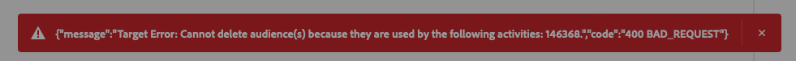

# [!DNL Adobe Target]-verbinding {#adobe-target-connection}

## Doelwijziging {#changelog}

| Releasedatum | Type bijwerken | Beschrijving |
|---|---|---|
| april 2024 | Bijwerken van functionaliteit en documentatie | Wanneer het verbinden met de bestemming van het Doel en het gebruiken van een gegevensstroom, hebt u nu *niet* nodig om noodzakelijk de gegevensstroom voor randsegmentatie toe te laten. Dit betekent dat de bestemming van het Doel met partij en het stromen publiek zal werken, hoewel de gebruiksgevallen die u kunt verwezenlijken verschillen. Bekijk de lijst in de [ sectie van verbindingsparameters ](#parameters) voor meer informatie. |
| januari 2024 | Bijwerken van functionaliteit en documentatie | U kunt nu soorten publiek- en profielkenmerken delen met de [!DNL Adobe Target] -verbinding voor de standaardproductiesandbox en andere niet-standaardsandboxen. |
| Juni 2023 | Bijwerken van functionaliteit en documentatie | Vanaf juni 2023 kunt u de [!DNL Adobe Target] -werkruimte selecteren waarnaar u het publiek wilt delen wanneer u een nieuwe [!DNL Adobe Target] -doelverbinding configureert. Zie de [ sectie van verbindingsparameters ](#parameters) voor meer informatie. Bovendien, zie het leerprogramma op [ vormend werkruimten ](https://experienceleague.adobe.com/docs/target-learn/tutorials/administration/set-up-workspaces.html) in [!DNL Adobe Target] voor meer informatie over werkruimten. |
| Mei 2023 | Bijwerken van functionaliteit en documentatie | Vanaf Mei 2023, steunt de **[!UICONTROL Adobe Target]** verbinding [ op attribuut-gebaseerde verpersoonlijking ](../../ui/activate-edge-personalization-destinations.md#map-attributes) en is over het algemeen beschikbaar aan alle klanten. |

{style="table-layout:auto"}

## Overzicht {#overview}

[!DNL Adobe Target] is een toepassing die real-time, door AI aangedreven personalisatie en experimenteermogelijkheden in alle inkomende klanteninteractie over websites, mobiele apps, en meer verstrekt.

[!DNL Adobe Target] is een aanpassingsverbinding in de catalogus met [!DNL Adobe Experience Platform] doelen.

## Video-overzicht {#video-overview}

Bekijk de onderstaande video voor een kort overzicht van het configureren van de [!DNL Adobe Target] -verbinding in Experience Platform.

>[!VIDEO](https://video.tv.adobe.com/v/3418799/?quality=12&learn=on)

## Ondersteunde gebruiksgevallen op basis van implementatietype {#supported-use-cases}

De lijst toont hieronder de gesteunde gebruiksgevallen voor de [!DNL Adobe Target] bestemming, die op uw implementatietype wordt gebaseerd, met of zonder het Web SDK en met of zonder [ toegelaten randsegmentatie ](/help/segmentation/home.md#edge).

| [!DNL Adobe Target] implementatie *zonder* Web SDK | [!DNL Adobe Target] implementatie *met* SDK van het Web | [!DNL Adobe Target] implementatie *met* SDK van het Web *en* randsegmentatie van |
|---|---|---|
| <ul><li>Een gegevensstroom is niet vereist. [!DNL Adobe Target] kan door [ at.js ](https://experienceleague.adobe.com/docs/target-dev/developer/client-side/at-js-implementation/overview.html), [ server-kant ](https://experienceleague.adobe.com/docs/target-dev/developer/overview.html#server-side-implementation), of [ hybride ](https://experienceleague.adobe.com/docs/target-dev/developer/overview.html#hybrid-implementation) implementatiemethodes worden opgesteld.</li><li>[ de segmentatie van Edge ](../../../segmentation/methods/edge-segmentation.md) wordt niet gesteund.</li><li>[ Zelfde-pagina en volgende-pagina verpersoonlijking ](../../ui/activate-edge-personalization-destinations.md) worden niet gesteund.</li><li>U kunt publiek en profielattributen aan de [!DNL Adobe Target] verbinding voor de *standaardproductiestandaard* en niet-standaardzandbakken delen.</li><li>Om volgende-zittingsverpersoonlijking te vormen zonder een gegevensstroom te gebruiken, gebruik [ at.js ](https://experienceleague.adobe.com/docs/target/using/implement-target/client-side/at-js-implementation/at-js/how-atjs-works.html).</li></ul> | <ul><li>Een gegevensstroom met [!DNL Adobe Target] en Experience Platform geconfigureerd als services is vereist.</li><li>Edge-segmentatie werkt zoals verwacht.</li><li>[ zelfde-pagina en volgende-pagina verpersoonlijking ](../../ui/activate-edge-personalization-destinations.md#use-cases) worden gesteund.</li><li>Het delen van publiek- en profielkenmerken van andere sandboxen wordt ondersteund.</li></ul> | <ul><li>Een gegevensstroom met [!DNL Adobe Target] en Experience Platform geconfigureerd als services is vereist.</li><li>Wanneer [ vormend de datastream ](/help/destinations/ui/activate-edge-personalization-destinations.md#configure-datastream), selecteer niet het **de segmentatie van Edge** checkbox.</li><li>[ volgende-zittingsverpersoonlijking ](../../ui/activate-edge-personalization-destinations.md#next-session) wordt gesteund.</li><li>Het delen van publiek- en profielkenmerken van andere sandboxen wordt ondersteund.</li></ul> |

## Vereisten {#prerequisites}

### DataStream {#datastream}

Wanneer het vormen van de [!DNL Adobe Target] verbinding aan [ gebruik een datastream ](#parameters), moet u [ uitgevoerde Inzameling van Gegevens van Adobe Experience Platform ](/help/collection/home.md) hebben.

Als u de [!DNL Adobe Target] -verbinding configureert zonder een gegevensstroom te gebruiken, hoeft u de Web SDK niet te implementeren.

>[!IMPORTANT]
>
>Alvorens een [!DNL Adobe Target] verbinding tot stand te brengen, leest de gids op hoe te [ verpersoonlijkingsbestemmingen voor zelfde-pagina en volgende-pagina verpersoonlijking ](../../ui/activate-edge-personalization-destinations.md) vormen. Deze handleiding begeleidt u door de vereiste configuratiestappen voor het gebruik van dezelfde pagina en volgende pagina&#39;s voor personalisatie, voor meerdere Experience Platform-componenten. Als u gebruikstoepassingen van dezelfde pagina en volgende pagina wilt maken, moet u een gegevensstroom gebruiken wanneer u de [!DNL Adobe Target] -verbinding configureert.

### Vereisten in [!DNL Adobe Target] {#prerequisites-in-adobe-target}

Controleer in [!DNL Adobe Target] of de gebruiker:

* Toegang tot de [ standaardwerkruimte ](https://experienceleague.adobe.com/docs/target/using/administer/manage-users/enterprise/property-channel.html#default-workspace);
* De **Approver** [ rol ](https://experienceleague.adobe.com/docs/target/using/administer/manage-users/enterprise/property-channel.html#roles-and-permissions).

Lees meer over het verlenen van toestemmingen voor [ Target Premium ](https://experienceleague.adobe.com/docs/target/using/administer/manage-users/enterprise/properties-overview.html#section_8C425E43E5DD4111BBFC734A2B7ABC80) en voor [ Target Standard ](https://experienceleague.adobe.com/docs/target/using/administer/manage-users/users/user-management.html#roles-permissions).

## Ondersteunde doelgroepen {#supported-audiences}

In deze sectie wordt beschreven welke soorten publiek u naar dit doel kunt exporteren.

>[!IMPORTANT]
>
>Wanneer het activeren van *randpubliek voor zelfde-pagina en volgende-pagina het gebruikscase van de verpersoonlijking*, moet het publiek ** een [ actief-op-rand fusiebeleid ](../../../segmentation/ui/segment-builder.md#merge-policies) gebruiken. Het [!DNL active-on-edge] fusiebeleid zorgt ervoor dat het publiek constant [ op de rand ](../../../segmentation/methods/edge-segmentation.md) wordt geëvalueerd en beschikbaar voor real time en volgende-pagina het gebruikscase van de verpersoonlijking is.  Lees over [ alle beschikbare gebruiksgevallen ](#parameter), die op implementatietype wordt gebaseerd.
>Als u randpubliek toewijst dat een verschillend fusiebeleid aan [!DNL Adobe Target] bestemmingen gebruikt, zullen dat publiek niet voor real time en volgende-paginagebeurtenissen worden geëvalueerd.
>Volg de instructies op [ creërend een fusiebeleid ](../../../profile/merge-policies/ui-guide.md#create-a-merge-policy), en zorg ervoor om **[!UICONTROL Active-On-Edge Merge Policy]** knevel toe te laten.

| Oorsprong publiek | Ondersteund | Beschrijving |
|---------|----------|----------|
| [!DNL Segmentation Service] | Ja | Het publiek produceerde door de Dienst van de Segmentatie van Experience Platform . |
| Alle andere doelgroepen | Ja | Deze categorie omvat alle oorsprong van het publiek buiten het publiek dat via [!DNL Segmentation Service] wordt gegenereerd. Lees over de [ diverse publieksoorsprong ](/help/segmentation/ui/audience-portal.md#customize). Voorbeelden zijn: <ul><li> de douane uploadt publiek [ ingevoerde ](../../../segmentation/ui/audience-portal.md#import-audience) in Experience Platform van Csv- dossiers,</li><li> gelijksoortige doelgroepen, </li><li> federaal publiek, </li><li> publiek dat wordt gegenereerd in andere Experience Platform-toepassingen, zoals [!DNL Adobe Journey Optimizer] , </li><li> en meer. </li></ul> |

{style="table-layout:auto"}

Ondersteund publiek per type publieksgegevens:

| Gegevenstype Publiek | Ondersteund | Beschrijving | Gebruiksscenario&#39;s |
|--------------------|-----------|-------------|-----------|
| [ het publiek van Mensen ](/help/segmentation/types/people-audiences.md) | Ja | Gebaseerd op klantenprofielen, die u toestaan om specifieke groepen mensen voor marketing campagnes te richten. | Frequente kopers, winkeliers |
| [ publiek van de Rekening ](/help/segmentation/types/account-audiences.md) | Nee | Doelpersonen binnen specifieke organisaties voor marketingstrategieën op basis van account. | B2B-marketing |
| [ Het publiek van het Vooruitzicht ](/help/segmentation/types/prospect-audiences.md) | Nee | De individuen van het doel die nog geen klanten zijn maar eigenschappen met uw doelpubliek delen. | Waarschuwing met gegevens van derden |
| [ de uitvoer van de Dataset ](/help/catalog/datasets/overview.md) | Nee | Verzamelingen gestructureerde gegevens die zijn opgeslagen in het [!DNL Adobe Experience Platform] Data Lake. | Rapportage, workflows voor gegevenswetenschap |

{style="table-layout:auto"}

## Type en frequentie exporteren {#export-type-frequency}

Raadpleeg de onderstaande tabel voor informatie over het exporttype en de exportfrequentie van de bestemming.

| Item | Type | Notities |
|---------|----------|---------|
| Exporttype | **[!DNL Profile request]** | U vraagt om alle soorten publiek die voor één profiel in de [!DNL Adobe Target] -bestemming zijn toegewezen. |
| Exportfrequentie | **[!UICONTROL Streaming]** | Streaming doelen zijn &quot;altijd aan&quot; API-verbindingen. Zodra een profiel in Experience Platform wordt bijgewerkt dat op publieksevaluatie wordt gebaseerd, verzendt de schakelaar de update stroomafwaarts naar het bestemmingsplatform. Lees meer over [ het stromen bestemmingen ](/help/destinations/destination-types.md#streaming-destinations). |

{style="table-layout:auto"}

## Verbinden met de bestemming {#connect}

>[!CONTEXTUALHELP]
>id="platform_destinations_target_datastream"
>title="Gegevensstromen"
>abstract="Met deze optie bepaalt u in welke gegevensstroom de doelgroep wordt opgenomen. Het drop-down menu toont slechts gegevensstromen die de toegelaten configuratie van het Doel hebben. Als u randsegmentatie wilt gebruiken, moet u een gegevensstroom selecteren. Als u Geen selecteert, worden alle gevallen uitgeschakeld waarin randsegmentatie wordt gebruikt."
>additional-url="https://experienceleague.adobe.com/docs/experience-platform/destinations/catalog/personalization/adobe-target-connection.html#parameters" text="Meer informatie over het selecteren van gegevensstromen"

>[!IMPORTANT]
>
>Om met de bestemming te verbinden, hebt u **[!UICONTROL View Destinations]** en **[!UICONTROL Manage Destinations]** [ toegangsbeheertoestemmingen ](/help/access-control/home.md#permissions) nodig. Lees het [ overzicht van de toegangscontrole ](/help/access-control/ui/overview.md) of contacteer uw productbeheerder om de vereiste toestemmingen te verkrijgen.

Om met deze bestemming te verbinden, volg de stappen die in het [ leerprogramma van de bestemmingsconfiguratie ](../../ui/connect-destination.md) worden beschreven.

[!DNL Adobe Experience Platform] maakt automatisch verbinding met de [!DNL Adobe Target] -instantie van uw bedrijf. Er is geen verificatie vereist.

### Verbindingsparameters {#parameters}

>[!CONTEXTUALHELP]
>id="platform_destinations_target_workspace"
>title="Info over [!DNL Adobe Target] Werkruimten"
>abstract="Selecteer de [!DNL Adobe Target] -werkruimte waarin het publiek wordt gedeeld. U kunt één werkruimte selecteren voor elke [!DNL Adobe Target] -verbinding. Na activering worden doelgroepen naar de geselecteerde werkruimte gerouteerd terwijl ze de toepasselijke Experience Platform-labels voor gegevensgebruik volgen."
>additional-url="https://experienceleague.adobe.com/docs/target-learn/tutorials/administration/set-up-workspaces.html" text="Meer informatie over  [!DNL Adobe Target]  werkruimten"

Terwijl [ vestiging ](../../ui/connect-destination.md) deze bestemming, u de volgende informatie moet verstrekken:

* **Naam**: Vul de aangewezen naam voor deze bestemming in.
* **Beschrijving**: Ga een beschrijving voor uw bestemming in. U kunt bijvoorbeeld opgeven voor welke campagne u deze bestemming wilt gebruiken. Dit veld is optioneel.
* **DataStream**: Dit bepaalt waarin de gegevensstroom van de Inzameling van Gegevens het publiek zal worden omvat. In het keuzemenu worden alleen gegevensstromen weergegeven waarvoor de services Doel en [!DNL Adobe Experience Platform] zijn ingeschakeld. Zie [ vormend een gegevensstroom ](../../../datastreams/configure.md#aep) voor gedetailleerde informatie over hoe te om een gegevensstroom voor [!DNL Adobe Experience Platform] en [!DNL Adobe Target] te vormen.

  >[!IMPORTANT]
  >
  >**DataStream uniqueness over organisatie**: De combinatie identiteitskaart van de gegevensstroom en zandbaknaam moet voor [!DNL Adobe Target] bestemmingsverbindingen binnen een Ms- Org uniek zijn. Dit betekent:
  >
  >* Dezelfde combinatie van de naam van de gegevensstroom-id + sandbox kan niet worden gebruikt voor meerdere [!DNL Adobe Target] doelverbindingen in de hele organisatie
  >* U kunt dezelfde gegevensstroom-id gebruiken voor verschillende doelverbindingen zolang de verbindingen zich op verschillende sandboxen bevinden
  >* Deze regel geldt voor alle gegevensstroomselecties, ook wanneer u **[!UICONTROL None]** selecteert

   * **[!UICONTROL None]**: selecteer deze optie als u [!DNL Adobe Target] personalisatie moet configureren, maar de [!DNL Adobe Experience Platform] Web SDK niet kunt implementeren. Als u deze optie gebruikt, bieden doelgroepen die van Experience Platform naar Target zijn geëxporteerd, alleen ondersteuning voor verpersoonlijking in de volgende sessie en wordt randsegmentatie uitgeschakeld. Verwijzing de lijst in de [ gesteunde gebruikscase ](#supported-use-cases) sectie voor een vergelijking van beschikbare gebruiksgevallen per implementatietype.

  | [!DNL Adobe Target] implementatie *zonder* Web SDK | [!DNL Adobe Target] implementatie *met* SDK van het Web | [!DNL Adobe Target] implementatie *met* SDK van het Web *en* randsegmentatie van |
  |---|---|---|
  | <ul><li>Een gegevensstroom is niet vereist. [!DNL Adobe Target] kan door [ at.js ](https://experienceleague.adobe.com/docs/target-dev/developer/client-side/at-js-implementation/overview.html), [ server-kant ](https://experienceleague.adobe.com/docs/target-dev/developer/overview.html#server-side-implementation), of [ hybride ](https://experienceleague.adobe.com/docs/target-dev/developer/overview.html#hybrid-implementation) implementatiemethodes worden opgesteld.</li><li>[ de segmentatie van Edge ](../../../segmentation/methods/edge-segmentation.md) wordt niet gesteund.</li><li>[ Zelfde-pagina en volgende-pagina verpersoonlijking ](../../ui/activate-edge-personalization-destinations.md) worden niet gesteund.</li><li>U kunt publiek en profielattributen aan de [!DNL Adobe Target] verbinding voor de *standaardproductiestandaard* en niet-standaardzandbakken delen.</li><li>Om volgende-zittingsverpersoonlijking te vormen zonder een gegevensstroom te gebruiken, gebruik [ at.js ](https://experienceleague.adobe.com/docs/target/using/implement-target/client-side/at-js-implementation/at-js/how-atjs-works.html).</li></ul> | <ul><li>Een gegevensstroom met [!DNL Adobe Target] en Experience Platform geconfigureerd als services is vereist.</li><li>Edge-segmentatie werkt zoals verwacht.</li><li>[ zelfde-pagina en volgende-pagina verpersoonlijking ](../../ui/activate-edge-personalization-destinations.md#use-cases) worden gesteund.</li><li>Het delen van publiek- en profielkenmerken van andere sandboxen wordt ondersteund.</li></ul> | <ul><li>Een gegevensstroom met [!DNL Adobe Target] en Experience Platform geconfigureerd als services is vereist.</li><li>Wanneer [ vormend de datastream ](/help/destinations/ui/activate-edge-personalization-destinations.md#configure-datastream), selecteer niet het **de segmentatie van Edge** checkbox.</li><li>[ volgende-zittingsverpersoonlijking ](../../ui/activate-edge-personalization-destinations.md#next-session) wordt gesteund.</li><li>Het delen van publiek- en profielkenmerken van andere sandboxen wordt ondersteund.</li></ul> |

* **Workspace**: Selecteer [!DNL Adobe Target] [ werkruimte ](https://experienceleague.adobe.com/docs/target-learn/tutorials/administration/set-up-workspaces.html) waaraan het publiek zal worden gedeeld. U kunt één werkruimte selecteren voor elke [!DNL Adobe Target] -verbinding. Op activering, worden het publiek verpletterd aan de geselecteerde werkruimte terwijl het volgen van de toepasselijke [ etiketten van het gegevensgebruik van Experience Platform ](../../../data-governance/labels/overview.md).

>[!NOTE]
>
>Wanneer het gebruiken van een werkruimte van het douaneDoel voor [ zelfde-pagina en volgende-pagina verpersoonlijking met attributen ](../../ui/activate-edge-personalization-destinations.md), slechts wordt het [ geselecteerde publiek ](../../ui/activate-edge-personalization-destinations.md#select-audiences) verzonden naar de geselecteerde werkruimte van het Doel. De [ in kaart gebrachte attributen ](../../ui/activate-edge-personalization-destinations.md#mapping) worden verzonden naar de standaardwerkruimte van het Doel.
> 
>Dit gedrag verandert in een toekomstige update.

### Waarschuwingen inschakelen {#enable-alerts}

U kunt alarm toelaten om berichten over de status van dataflow aan uw bestemming te ontvangen. Selecteer een waarschuwing in de lijst om u te abonneren op meldingen over de status van uw gegevensstroom. Voor meer informatie over alarm, zie de gids bij [ het intekenen aan bestemmingsalarm gebruikend UI ](../../ui/alerts.md).

Wanneer u klaar bent met het opgeven van details voor uw doelverbinding, selecteert u **[!UICONTROL Next]** .

## Soorten publiek naar dit doel activeren {#activate}

>[!IMPORTANT]
>
>Om gegevens te activeren, hebt u **[!UICONTROL View Destinations]**, **[!UICONTROL Activate Destinations]**, **[!UICONTROL View Profiles]**, en **[!UICONTROL View Segments]** [ toegangsbeheertoestemmingen ](/help/access-control/home.md#permissions) nodig. Lees het [ overzicht van de toegangscontrole ](/help/access-control/ui/overview.md) of contacteer uw productbeheerder om de vereiste toestemmingen te verkrijgen.

Lees [ activeer publiek aan de bestemmingen van de randverpersoonlijking ](../../ui/activate-edge-personalization-destinations.md) voor instructies bij het activeren van publiek aan deze bestemming.

## Soorten publiek verwijderen uit een doeldoel {#remove}

Er zijn extra stappen worden vereist om een publiek uit een bestaande [!DNL Adobe Target] verbinding te verwijderen wanneer dat publiek reeds in een [!DNL Adobe Target] [ activiteit ](https://experienceleague.adobe.com/en/docs/target/using/activities/activities) wordt gebruikt. Wanneer u een publiek probeert te verwijderen uit een [!DNL Adobe Target] -verbinding, treedt een fout op als het publiek wordt gebruikt door een [!DNL Adobe Target] -activiteit.

{het beeld van 0} Experience Platform UI die een fout toont die door te proberen wordt veroorzaakt om een publiek te verwijderen dat door een activiteit van het Doel wordt gebruikt.

Om een publiek uit een bestemming van het Doel te verwijderen wanneer het publiek in een activiteit wordt gebruikt, moet u of het publiek uit de activiteit van het Doel eerst verwijderen die het gebruikt, of de activiteit volledig schrappen. Vervolgens kunt u het publiek verwijderen uit de doelverbinding.

Als het publiek niet wordt gebruikt in een activiteit, gaat u naar **[!UICONTROL Destinations]** > **[!UICONTROL Browse]** > **[!UICONTROL Select destination dataflow]** > **[!UICONTROL Activation data]** , selecteert u het publiek dat u wilt verwijderen en selecteert u **[!UICONTROL Remove audiences]** .

## Geëxporteerde gegevens {#exported-data}

[!DNL Adobe Target] *leest* profielgegevens van [!DNL Adobe Experience Platform] Edge Network, zodat worden geen gegevens uitgevoerd.

## Gegevensgebruik en -beheer {#data-usage-governance}

Alle [!DNL Adobe Experience Platform] -doelen zijn compatibel met het beleid voor gegevensgebruik bij het verwerken van uw gegevens. Voor gedetailleerde informatie over hoe [!DNL Adobe Experience Platform] gegevensbeheer afdwingt, lees het [ overzicht van het Beleid van Gegevens ](https://experienceleague.adobe.com/docs/experience-platform/data-governance/home.html).
