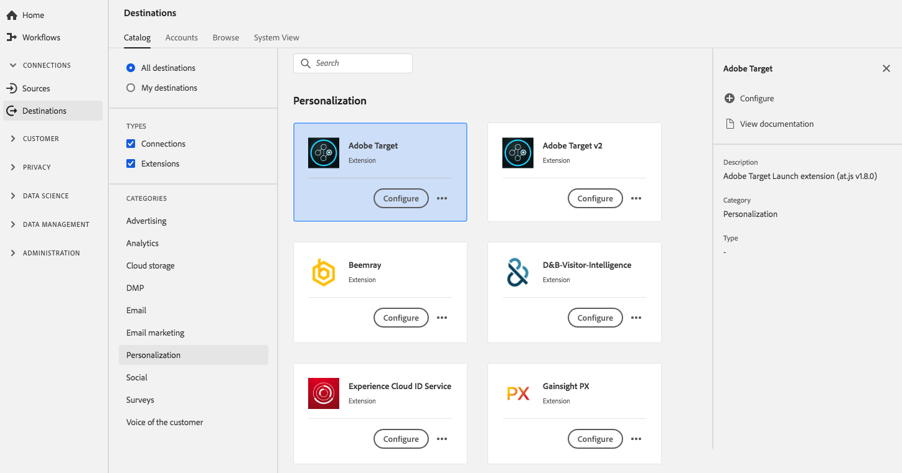

# Adobe Target-extensie

## Overzicht {#overview}

Adobe Target is de Adobe Experience Cloud-oplossing die alles biedt wat u nodig hebt om de ervaring van uw klanten op maat te maken en aan te passen en zo uw omzet te maximaliseren op uw websites en mobiele sites, apps, sociale media en andere digitale kanalen.

Adobe Target is een personalisatie-uitbreiding in Adobe Experience Platform. Zie de extensiepagina op voor meer informatie over de extensiefunctionaliteit [Adobe Exchange](https://exchange.adobe.com/experiencecloud.details.100162.html).

Dit doel is een tagextensie. Zie voor meer informatie over de werking van extensies voor tags in het Platform de [overzicht van tagextensies](../launch-extensions/overview.md).

## Vereisten {#prerequisites}

Deze extensie is beschikbaar in het dialoogvenster [!DNL Destinations] catalogus voor alle klanten die Platform hebben aangeschaft.

Als u deze extensie wilt gebruiken, hebt u toegang tot tags in Adobe Experience Platform nodig. Tags worden aan Adobe Experience Cloud-klanten aangeboden als een inbegrepen, waardetoevoegend element. Neem contact op met de systeembeheerder van uw organisatie om toegang te krijgen tot tags en vraag deze om u de **[!UICONTROL manage_properties]** toestemming zodat u extensies kunt installeren.

## Extensie installeren {#install-extension}

De Adobe Target-extensie installeren:

In de [Interface Platform](https://platform.adobe.com/), ga naar **[!UICONTROL Destinations]** > **[!UICONTROL Catalog]**.

Selecteer de extensie in de catalogus of gebruik de zoekbalk.

Klik op de bestemming om deze te markeren en selecteer vervolgens **[!UICONTROL Configure]** in het rechterspoor. Als de **[!UICONTROL Configure]** de controle is grijs uit, u mist **[!UICONTROL manage_properties]** toestemming. Zie [Vereisten](#prerequisites).

Selecteer de eigenschap tag waarin u de extensie wilt installeren. U kunt ook een nieuwe eigenschap maken. Een bezit is een inzameling van regels, gegevenselementen, gevormde uitbreidingen, milieu&#39;s, en bibliotheken. Meer informatie over eigenschappen in het dialoogvenster [codedocumentatie](../../../tags/ui/administration/companies-and-properties.md).

De werkstroom neemt u aan de UI van de Inzameling van Gegevens om de installatie te voltooien.

Voor informatie over de opties van de uitbreidingsconfiguratie, zie [Adobe Target-extensiepagina](../../../tags/extensions/client/target/overview.md) in de tagdocumentatie.

U kunt de extensie ook rechtstreeks installeren in het dialoogvenster [UI voor gegevensverzameling](https://experience.adobe.com/#/data-collection/). Zie de handleiding op [toevoegen, nieuwe extensie](../../../tags/ui/managing-resources/extensions/overview.md#add-a-new-extension) voor meer informatie .

## De extensie gebruiken {#how-to-use}

Nadat u de extensie hebt geïnstalleerd, kunt u regels instellen. In de UI van de Inzameling van Gegevens, kunt u opstellingsregels voor uw geïnstalleerde uitbreidingen om gebeurtenisgegevens naar de uitbreidingsbestemming slechts in bepaalde situaties te verzenden. Voor meer informatie over het instellen van regels voor uw extensies raadpleegt u het overzicht over [regels](../../../tags/ui/managing-resources/rules.md) in de tagdocumentatie.

## De extensie configureren, upgraden en verwijderen {#configure-upgrade-delete}

U kunt extensies configureren, upgraden en verwijderen in de gebruikersinterface voor gegevensverzameling.

>[!TIP]
>
>Als de extensie al op een van uw eigenschappen is geïnstalleerd, wordt de interface nog weergegeven **[!UICONTROL Install]** voor de extensie. Kies de installatieworkflow zoals beschreven in [Extensie installeren](#install-extension) om uw extensie te configureren of te verwijderen.

Als u uw extensie wilt upgraden, raadpleegt u de handleiding op het tabblad [upgradeproces voor extensie](../../../tags/ui/managing-resources/extensions/extension-upgrade.md) in de tagdocumentatie.
