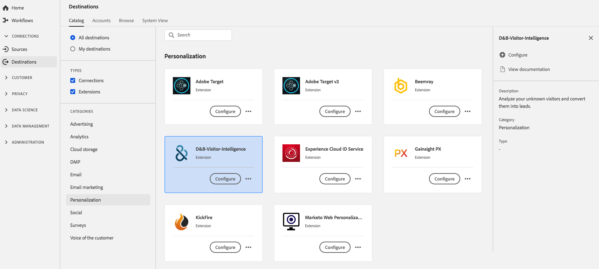

# [!DNL D&B Visitor Intelligence] extension {#dnb-extension}

## Overzicht {#overview}

Analyseer uw onbekende bezoekers en zet hen in lood om.

[!DNL D&B Visitor Intelligence] is een verpersoonlijkingsuitbreiding in het Platform van de Gegevens van de Klant in real time. Raadpleeg de [D&amp;B-website](https://www.dnb.com/)voor meer informatie over de extensiefunctionaliteit.

Dit doel is een Adobe Experience Platform Launch-extensie. Voor meer informatie over hoe de uitbreidingen van de Lancering van het Platform in Echt - tijd CDP werken, zie het de uitbreidingen van [Adobe Experience Platform Launch overzicht](../launch-extensions/overview.md).

## Vereisten {#prerequisites}

Deze extensie is beschikbaar in de [!DNL Destinations] catalogus voor alle klanten die CDP in realtime hebben aangeschaft.

Als u deze extensie wilt gebruiken, hebt u toegang tot Adobe Experience Platform Launch nodig. Platform starten wordt aangeboden aan Adobe Experience Cloud-klanten als een inbegrepen, waardetoevoegend onderdeel. Contacteer uw organisatiebeheerder om toegang tot de Lancering van het Platform te krijgen en hen te vragen om u de **[!UICONTROL manage_properties]** toestemming te verlenen zodat kunt u uitbreidingen installeren.

## Extensie installeren {#install-extension}

U installeert als volgt de extensie D&amp;B Visitor Intelligence:

Ga in de [Real-time CDP interface](http://platform.adobe.com/)naar **[!UICONTROL Doelen]** > **[!UICONTROL Catalogus]**.

Selecteer de extensie in de catalogus of gebruik de zoekbalk.

Klik op de bestemming om deze te markeren en selecteer vervolgens **[!UICONTROL Configureren]** in de rechterrail. Als de **[!UICONTROL Configure]** controle grayed is, mist u de toestemming **[!UICONTROL manage_properties]** . Zie [Voorwaarden](#prerequisites).

In het **[!UICONTROL Uitgezochte beschikbare de bezitsvenster]** van de Lancering van het Platform, selecteer het bezit van de Lancering van het Platform waarin u de uitbreiding wilt installeren. U kunt ook een nieuwe eigenschap maken bij het starten van het Platform. Een bezit is een inzameling van regels, gegevenselementen, gevormde uitbreidingen, milieu&#39;s, en bibliotheken. Meer informatie over eigenschappen vindt u in de sectie [Eigenschappen op de pagina](https://experienceleague.adobe.com/docs/launch/using/reference/admin/companies-and-properties.html#properties-page) Eigenschappen van de documentatie bij Starten van Platform.

Met de workflow gaat u naar Starten van Platform om de installatie te voltooien.

U kunt de extensie ook rechtstreeks in de [Adobe Experience Platform Launch-interface](https://launch.adobe.com/)installeren. Zie [Een nieuwe extensie](https://experienceleague.adobe.com/docs/launch/using/reference/manage-resources/extensions/overview.html?lang=en#add-a-new-extension) toevoegen in de documentatie bij het starten van het Platform.

## De extensie gebruiken {#how-to-use}

Nadat u de extensie hebt geïnstalleerd, kunt u rechtstreeks regels voor de extensie instellen in Platform starten.

In de Lancering van het Platform, kunt u opstellingsregels voor uw geïnstalleerde uitbreidingen om gebeurtenisgegevens naar de uitbreidingsbestemming slechts in bepaalde situaties te verzenden. Raadpleeg de documentatie bij [Regels voor meer informatie over het instellen van regels voor uw extensies](https://experienceleague.adobe.com/docs/launch/using/reference/manage-resources/rules.html).

## De extensie configureren, upgraden en verwijderen {#configure-upgrade-delete}

U kunt uitbreidingen in de interface van de Lancering van het Platform vormen, bevorderen en schrappen.

>[!TIP]
>
>Als de extensie al op een van uw eigenschappen is geïnstalleerd, wordt in real-time CDP-interface nog steeds **[!UICONTROL Install]** voor de extensie weergegeven. Kies de installatieworkflow zoals beschreven in de extensie  Installeren om Platform starten te starten en uw extensie te configureren of te verwijderen.

Raadpleeg de [extensie voor een upgrade](https://experienceleague.adobe.com/docs/launch/using/reference/manage-resources/extensions/extension-upgrade.html) van de extensie in de documentatie bij Starten van Platform.

