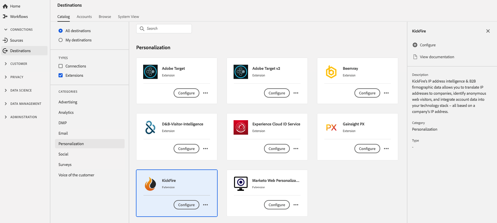

# [!DNL KickFire] extensie {#kickfire-extension}

## Overzicht {#overview}

[!DNL KickFire's] IP adresintelligentie &amp; B2B firmographic gegevens vertaalt IP adressen aan bedrijven, identificeert anonieme Webbezoekers, en integreert rekeningsgegevens in uw technologiestapel - allen die op het IP van een bedrijf adres worden gebaseerd.

[!DNL KickFire] is een personalisatie-uitbreiding in [!DNL Adobe Experience Platform] . Voor meer informatie over de uitbreidingsfunctionaliteit, zie [&#x200B; Website Kickfire &#x200B;](https://www.kickfire.com/).

Dit doel is een tagextensie. Voor meer informatie over hoe de markeringsuitbreidingen in Experience Platform werken, zie het [&#x200B; overzicht van markeringsuitbreidingen &#x200B;](../launch-extensions/overview.md).

## Vereisten {#prerequisites}

Deze extensie is beschikbaar in de catalogus [!DNL Destinations] voor alle klanten die Experience Platform hebben aangeschaft.

Als u deze extensie wilt gebruiken, hebt u toegang tot tags nodig in [!DNL Adobe Experience Platform] . Tags worden aan [!DNL Adobe Experience Cloud] klanten aangeboden als een opgenomen functie voor het toevoegen van waarden. Neem contact op met de systeembeheerder van uw organisatie om toegang tot tags te krijgen en vraag hen om u de **[!UICONTROL manage_properties]** -machtiging te verlenen zodat u extensies kunt installeren.

## Extensie installeren {#install-extension}

De extensie [!DNL KickFire] installeren:

In de [&#x200B; interface van Experience Platform &#x200B;](https://platform.adobe.com/), ga **[!UICONTROL Destinations]** > **[!UICONTROL Catalog]**.

Selecteer de extensie in de catalogus of gebruik de zoekbalk.

Selecteer het doel en selecteer vervolgens **[!UICONTROL Configure]** in de rechterrails. Als het besturingselement **[!UICONTROL Configure]** grijs wordt weergegeven, ontbreekt de machtiging **[!UICONTROL manage_properties]** . Zie [&#x200B; Eerste vereisten &#x200B;](#prerequisites).

Selecteer de eigenschap waarin u de extensie wilt installeren. U kunt ook een nieuwe eigenschap maken. Een bezit is een inzameling van regels, gegevenselementen, gevormde uitbreidingen, milieu&#39;s, en bibliotheken. Leer over eigenschappen in de [&#x200B; sectie van de pagina van Eigenschappen &#x200B;](../../../tags/ui/administration/companies-and-properties.md#properties-page) van in de markeringsdocumentatie.

Het werkschema begeleidt u door de stappen om de installatie te voltooien.

U kunt de uitbreiding direct in [&#x200B; de Inzameling UI van Gegevens &#x200B;](https://experience.adobe.com/#/data-collection/) ook installeren. Voor meer informatie, zie de sectie op [&#x200B; toevoegend een nieuwe uitbreiding &#x200B;](../../../tags/ui/managing-resources/extensions/overview.md#add-a-new-extension) in de markeringsdocumentatie.

## De extensie gebruiken {#how-to-use}

Nadat u de extensie hebt geïnstalleerd, kunt u regels instellen.

U kunt regels instellen voor geïnstalleerde extensies, zodat gebeurtenisgegevens alleen in bepaalde situaties naar de extensiebestemming worden verzonden. Voor meer informatie over vestiging regels voor uw uitbreidingen, zie de [&#x200B; tagdocumentatie &#x200B;](../../../tags/ui/managing-resources/rules.md).

## Uitbreiding configureren, bijwerken en verwijderen {#configure-upgrade-delete}

U kunt extensies configureren, upgraden en verwijderen in de gebruikersinterface voor gegevensverzameling.

>[!TIP]
>
>Als de extensie al op een van uw eigenschappen is geïnstalleerd, wordt de gebruikersinterface van Experience Platform nog steeds **[!UICONTROL Install]** voor de extensie weergegeven. Kik van het installatiewerkschema zoals die in [&#x200B; wordt beschreven installeer uitbreiding &#x200B;](#install-extension) om uw uitbreiding te vormen of te schrappen.

Om uw uitbreiding te bevorderen, zie de gids op het [&#x200B; proces van de uitbreidingsverbetering &#x200B;](../../../tags/ui/managing-resources/extensions/extension-upgrade.md) in de tagdocumentatie.
