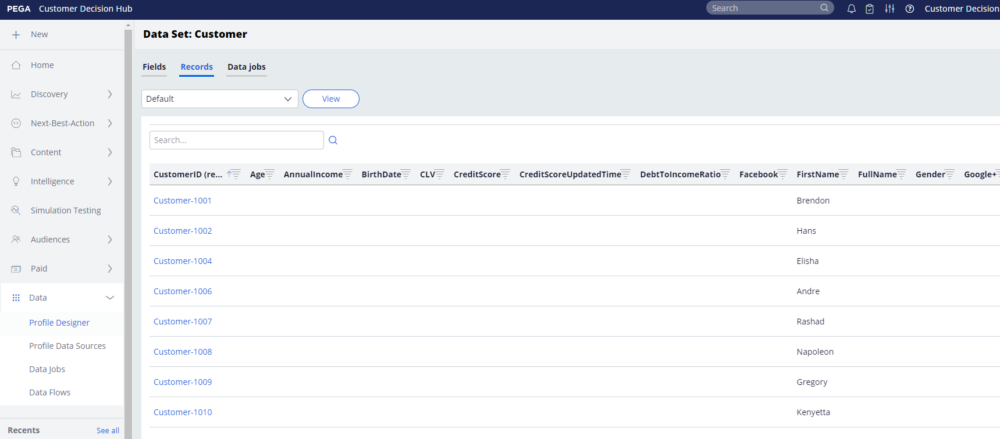

# Pega Profile Connector

## Overzicht {#overview}

Gebruik [!DNL Pega Profile Connector] in Adobe Experience Platform om een live uitgaande verbinding te maken met uw [!DNL Amazon Web Services] (AWS) S3-opslag om profielgegevens periodiek naar CSV-bestanden vanuit Adobe Experience Platform naar uw eigen S3-emmers te exporteren. In [!DNL Pega Customer Decision Hub] kunt u gegevenstaken plannen om deze profielgegevens te importeren uit S3-opslag om het [!DNL Pega Customer Decision Hub] -profiel bij te werken.

Deze aansluiting helpt bij het instellen van de eerste export van profielgegevens en helpt bij het periodiek synchroniseren van nieuwe profielen naar [!DNL Pega Customer Decision Hub] .  Het hebben van bijgewerkte gegevens in de Hub van het Besluit van de Klant verstrekt een betere en bijgewerkte mening van uw klantenbasis voor volgende-best-actie beslissing.

>[!IMPORTANT]
>
>Deze bestemmings schakelaar en documentatiepagina worden gecreeerd en door Pegasystems gehandhaafd. Voor om het even welke onderzoeken of updateverzoeken, gelieve te contacteren direct [ hier ](mailto:support@pega.com).

## Gebruiksscenario’s

Om u beter te helpen begrijpen hoe en wanneer u de [!DNL Pega Profile Connector] bestemming zou moeten gebruiken, zijn hier voorbeelden van gebruiksgevallen die de klanten van Adobe Experience Platform door deze bestemming kunnen oplossen.

### Hoofdlettergebruik 1

Een markeerteken wil [!DNL Pega Customer Decision Hub] aanvankelijk instellen met profielgegevens die vanuit Adobe Experience Platform zijn geladen. Dit is een eerste volledige lading, gevolgd door deltabelastingen op geplande basis.

### Hoofdlettergebruik 2

Een marketeter wil actuele profielgegevens van Adobe Experience Platform beschikbaar in [!DNL Pega Customer Decision Hub] waarmee de Pega-inzichten rond klantprofielen voortdurend worden verbeterd.

## Vereisten {#prerequisites}

Voordat u deze bestemming kunt gebruiken voor het exporteren van gegevens uit Adobe Experience Platform en het importeren van profielen naar [!DNL Pega Customer Decision Hub] , moet u aan de volgende voorwaarden voldoen:

* Configureer [!DNL Amazon S3] bucket en het mappad dat moet worden gebruikt voor het exporteren en importeren van gegevensbestanden.
* Configureer de sleutel [!DNL Amazon S3] access en [!DNL Amazon S3] geheime key: In [!DNL Amazon S3] genereert u een `access key - secret access key` -paar om Experience Platform toegang te verlenen tot uw [!DNL Amazon S3] -account.
* Als u gegevens wilt verbinden en exporteren naar uw [!DNL Amazon S3] -opslaglocatie, maakt u een gebruiker voor Identiteit en Toegangsbeheer (IAM) voor [!DNL Experience Platform] in [!DNL Amazon S3] en wijst u machtigingen toe zoals `s3:DeleteObject` , `s3:GetBucketLocation` , `s3:GetObject` , `s3:ListBucket` , `s3:PutObject` , `s3:ListMultipartUploadParts`
* Zorg ervoor dat de [!DNL Pega Customer Decision Hub] -instantie is bijgewerkt naar versie 8.8 of hoger.

## Ondersteunde identiteiten {#supported-identities}

[!DNL Pega Customer Decision Hub] ondersteunt de activering van aangepaste gebruikers-id&#39;s die in de onderstaande tabel worden beschreven. Voor meer details, zie [ identiteiten ](/help/identity-service/features/namespaces.md).

| Doelidentiteit | Beschrijving |
|---|---|
| *CustomerID* | Algemene gebruikersnaam die een profiel in [!DNL Pega Customer Decision Hub] en Adobe Experience Platform op unieke wijze identificeert |

{style="table-layout:auto"}

## Type en frequentie exporteren {#export-type-frequency}

Raadpleeg de onderstaande tabel voor informatie over het exporttype en de exportfrequentie van de bestemming.

| Item | Type | Notities |
|---------|----------|---------|
| Exporttype | **[!UICONTROL Profile-based]** | U exporteert alle leden van een segment, samen met de gewenste schemavelden (bijvoorbeeld: e-mailadres, telefoonnummer, achternaam), zoals gekozen in het scherm van de uitgezochte profielkenmerken van het [ werkschema van de bestemmingsactivering ](../../ui/activate-batch-profile-destinations.md#select-attributes). |
| Exportfrequentie | **[!UICONTROL Batch]** | De bestemmingen van de partij voeren dossiers naar stroomafwaartse platforms in toename van drie, zes, acht, twaalf, of 24 uren uit. Lees meer over [ partij op dossier-gebaseerde bestemmingen ](/help/destinations/destination-types.md#file-based). |

{style="table-layout:auto"}

## Verbinden met de bestemming {#connect}

>[!IMPORTANT]
> 
>Om met de bestemming te verbinden, hebt u **[!UICONTROL View Destinations]** en **[!UICONTROL Manage Destinations]** [ toegangsbeheertoestemmingen ](/help/access-control/home.md#permissions) nodig. Lees het [ overzicht van de toegangscontrole ](/help/access-control/ui/overview.md) of contacteer uw productbeheerder om de vereiste toestemmingen te verkrijgen.

Om met deze bestemming te verbinden, volg de stappen die in het [ leerprogramma van de bestemmingsconfiguratie ](../../ui/connect-destination.md) worden beschreven. Vul in de workflow voor doelconfiguratie de velden in die in de twee onderstaande secties worden vermeld.

### Verifiëren voor bestemming {#authenticate}

Als u voor verificatie bij het doel wilt zorgen, vult u de vereiste velden in en selecteert u **[!UICONTROL Connect to destination]** .

* **[!DNL Amazon S3]access key** en **[!DNL Amazon S3]geheime sleutel**: in [!DNL Amazon S3] genereert u een `access key - secret access key` paar om Adobe Experience Platform toegang te verlenen tot uw [!DNL Amazon S3] account. Leer meer in de [ documentatie van Amazon Web Services ](https://docs.aws.amazon.com/IAM/latest/UserGuide/id_credentials_access-keys.html).

### Doelgegevens invullen {#destination-details}

Nadat u de verificatieverbinding met [!DNL Amazon S3] tot stand hebt gebracht, geeft u de volgende informatie op voor het doel:

Als u details voor het doel wilt configureren, vult u de vereiste velden in en selecteert u **[!UICONTROL Next]** . Een sterretje naast een veld in de gebruikersinterface geeft aan dat het veld verplicht is.

* **[!UICONTROL Name]**: voer een naam in die u helpt bij het identificeren van dit doel.
* **[!UICONTROL Description]** : voer een beschrijving van dit doel in.
* **[!UICONTROL Bucket name]**: voer de naam in van de [!DNL Amazon S3] emmer die door dit doel moet worden gebruikt.
* **[!UICONTROL Folder path]** : voer het pad in naar de doelmap waarin de geëxporteerde bestanden worden opgeslagen.
* **[!UICONTROL Compression Type]**: selecteer het compressietype GZIP of NONE.

>[!TIP]
>
>In de Connect-doelworkflow kunt u per geëxporteerd publieksbestand een aangepaste map in uw Amazon S3-opslag maken. Lees [ de macro&#39;s van het Gebruik om een omslag in uw opslagplaats ](/help/destinations/catalog/cloud-storage/overview.md#use-macros) voor instructies tot stand te brengen.

### Waarschuwingen inschakelen {#enable-alerts}

U kunt alarm toelaten om berichten over de status van dataflow aan uw bestemming te ontvangen. Selecteer een waarschuwing in de lijst om u te abonneren op meldingen over de status van uw gegevensstroom. Voor meer informatie over alarm, zie de gids bij [ het intekenen aan bestemmingsalarm gebruikend UI ](../../ui/alerts.md).

Wanneer u klaar bent met het opgeven van details voor uw doelverbinding, selecteert u **[!UICONTROL Next]** .

## Soorten publiek naar dit doel activeren {#activate}

>[!IMPORTANT]
> 
>* Om gegevens te activeren, hebt u **[!UICONTROL View Destinations]**, **[!UICONTROL Activate Destinations]**, **[!UICONTROL View Profiles]**, en **[!UICONTROL View Segments]** [ toegangsbeheertoestemmingen ](/help/access-control/home.md#permissions) nodig. Lees het [ overzicht van de toegangscontrole ](/help/access-control/ui/overview.md) of contacteer uw productbeheerder om de vereiste toestemmingen te verkrijgen.
>* Om *identiteiten* uit te voeren, hebt u de **[!UICONTROL View Identity Graph]** [ toegangsbeheertoestemming ](/help/access-control/home.md#permissions) nodig.   {width="100" zoomable="yes"}

Zie [ publieksgegevens aan de uitvoerbestemmingen van het partijprofiel ](../../ui/activate-batch-profile-destinations.md) voor instructies op het activeren van publiek aan deze bestemming activeren.

### Kenmerken en identiteiten toewijzen {#map}

In de stap **[!UICONTROL Mapping]** kunt u selecteren welke kenmerk- en identiteitsvelden u wilt exporteren voor uw profielen. U kunt ook selecteren om de kopteksten in het geëxporteerde bestand te wijzigen in een gewenste vriendelijke naam. Voor meer informatie, bekijk de [ toewijzingsstap ](/help/destinations/ui/activate-batch-profile-destinations.md#mapping) in de activerende partijbestemmingen UI leerprogramma.

## Gegevens exporteren valideren {#exported-data}

Voor [!DNL Pega Profile Connector] -doelen maakt [!DNL Experience Platform] een `.csv` -bestand in de opslaglocatie van Amazon S3 die u hebt opgegeven. Voor meer informatie over de dossiers, zie [ publieksgegevens aan de uitvoerbestemmingen van het partijprofiel ](../../ui/activate-batch-profile-destinations.md) in het leerprogramma van de publiekactivering activeren.

Wanneer het importeren van profielgegevens uit S3 is gelukt, worden gegevens in de [!DNL Pega Customer] -profieldatastore ingevoegd. De geïmporteerde klantprofielgegevens kunnen worden gevalideerd in [!DNL Pega Customer Profile Designer] , zoals in de volgende afbeelding wordt getoond.

In [!DNL Pega Customer Decision Hub] kunnen gegevensbeheerders gegevenstaken configureren in [!DNL Customer Profile Designer] om profielgegevens periodiek te importeren vanuit S3, zoals in de volgende afbeelding wordt getoond. Zie de [ extra middelen ](#additional-resources) voor meer informatie over hoe te om gegevenstaken te vormen om profielgegevens van [!DNL Amazon S3] in te voeren.

## Aanvullende bronnen {#additional-resources}

Zie [ de banen van de Gegevens van de Invoer ](https://academy.pega.com/topic/import-data-jobs/v1) in [!DNL Pega Customer Decision Hub].

## Gegevensgebruik en -beheer {#data-usage-governance}

Alle [!DNL Adobe Experience Platform] -doelen zijn compatibel met het beleid voor gegevensgebruik bij het verwerken van uw gegevens. Voor gedetailleerde informatie over hoe [!DNL Adobe Experience Platform] gegevensbeheer afdwingt, zie het [ overzicht van het Beleid van Gegevens ](/help/data-governance/home.md).
