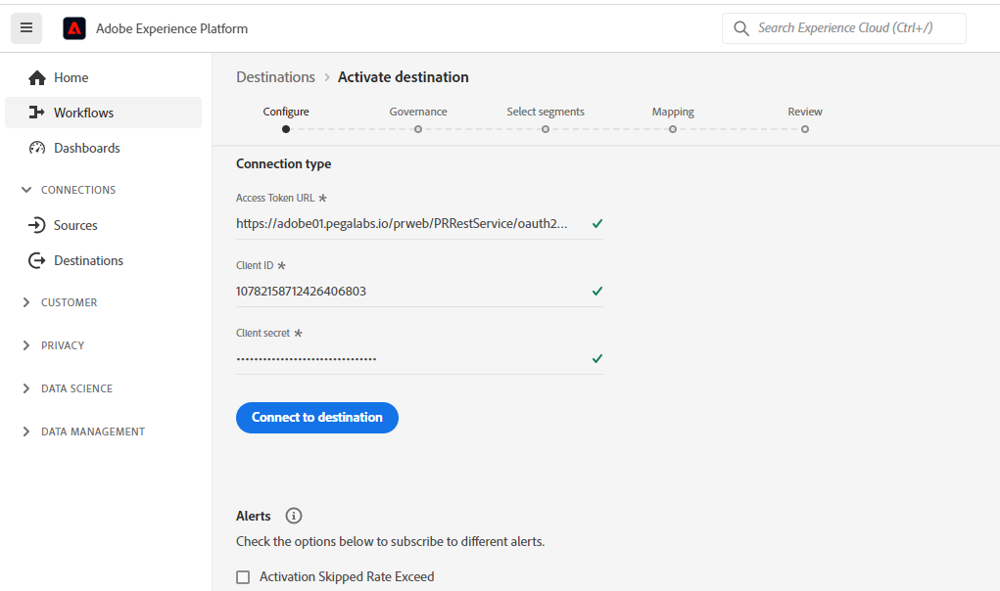
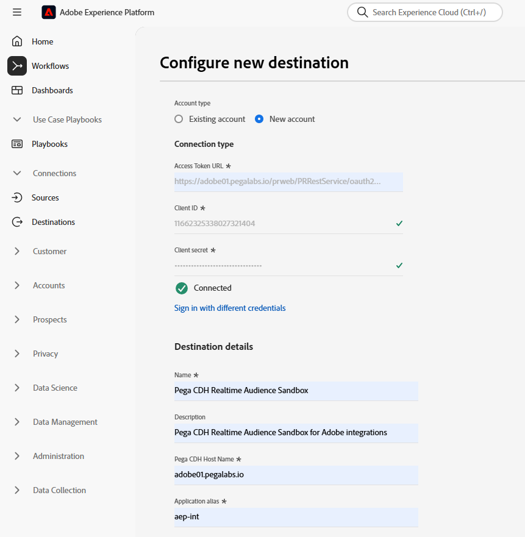
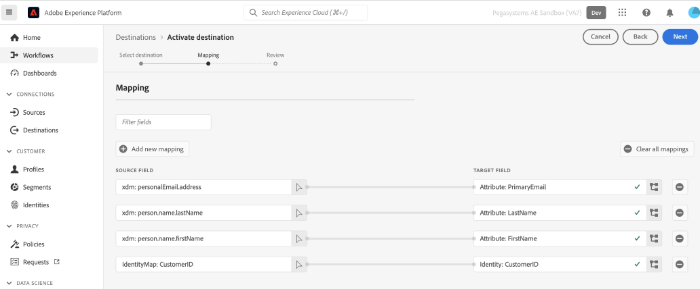
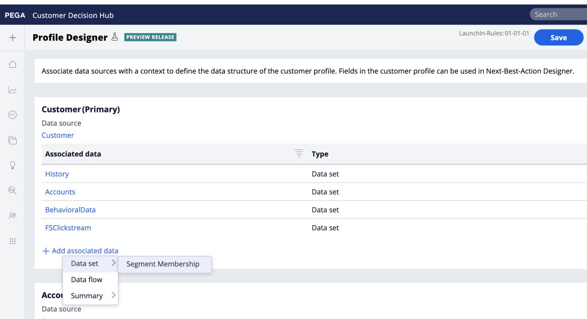
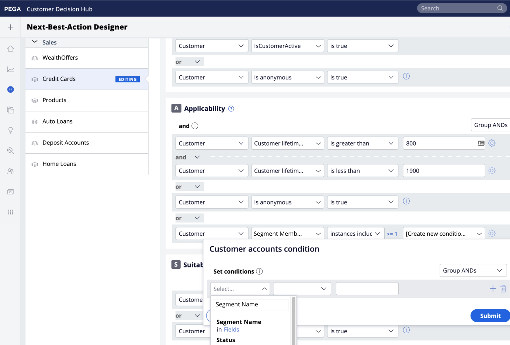
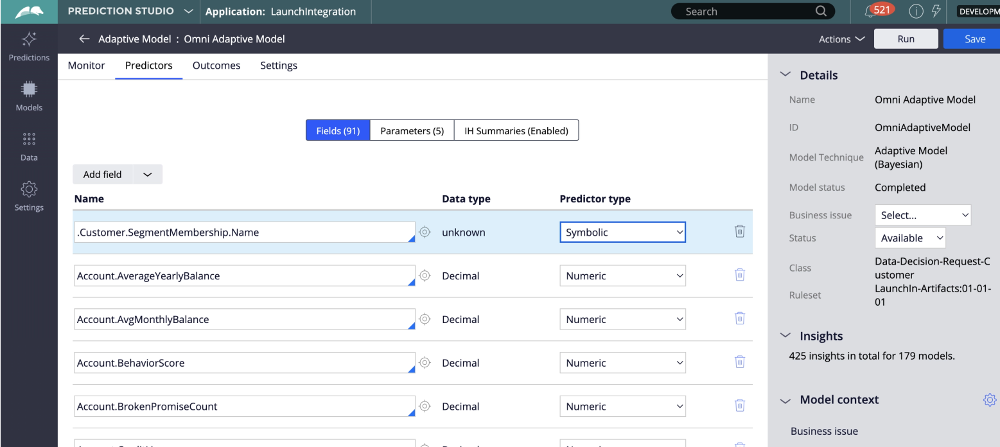

# (V2) Pega CDH Realtime Audience Connection

## Overzicht {#overview}

Gebruik de bestemming (V2) [!DNL Pega CDH Realtime Audience] in [!DNL Adobe Experience Platform] om profielkenmerken en lidmaatschapsgegevens voor het publiek naar [!DNL Pega Customer Decision Hub] te verzenden voor het bepalen van de volgende beste actie.

Wanneer u het lidmaatschap voor het publiek van [!DNL Adobe Experience Platform] in [!DNL Pega Customer Decision Hub] laadt, kunt u het gebruiken als voorspeller in adaptieve modellen en de juiste contextafhankelijke gegevens en gedragsgegevens leveren voor de volgende beste actie-beslissingsdoeleinden.

>[!IMPORTANT]
>
>Deze bestemmings schakelaar en documentatiepagina worden gecreeerd en door Pegasystems gehandhaafd. Voor om het even welke onderzoeken of updateverzoeken, direct contact Pega [&#x200B; &#x200B;](mailto:support@pega.com).

## Gebruiksscenario&#39;s {#use-cases}

Om u beter te helpen begrijpen hoe en wanneer u de [!DNL Customer Decision Hub] bestemming zou moeten gebruiken, zijn hier voorbeelden van gebruiksgevallen die [!DNL Adobe Experience Platform] klanten kunnen oplossen door deze bestemming te gebruiken.

### Telecommunicatie {#telecommunications}

Een markator wil inzichten van de op het gegevenswetenschapsmodel gebaseerde beste actie zoals geleverd door [!DNL Pega Customer Decision Hub] voor de betrokkenheid van de klant benutten. [!DNL Pega Customer Decision Hub] vertrouwt significant op klantenintent, zoals &quot;Interested_In_5G&quot;, &quot;Interested_in_Unlimited_Dataplan&quot; of &quot;Interest_in_iPhone_accessoires&quot; om de volgende-best-actie (NBA) beslissing in uitgaande kanalen te bepalen.

### Financiële diensten {#financial-services}

Een markator wil de aanbiedingen optimaliseren voor klanten die zich hebben geabonneerd op of zich niet hebben geabonneerd op nieuwsbrieven van het pensioenplan of het pensioenplan. Bedrijven met financiële services kunnen meerdere Customer ID&#39;s van hun eigen CRM&#39;s opnemen in [!DNL Adobe Experience Platform] , een publiek opbouwen op basis van hun eigen offline gegevens en profielen verzenden die het publiek binnenkomen en verlaten naar [!DNL Pega Customer Decision Hub] voor NBA-beslissingen (next-best-action) in uitgaande kanalen.

## Vereisten {#prerequisites}

Voordat u dit doel kunt gebruiken om gegevens uit [!DNL Adobe Experience Platform] te exporteren, moet u de volgende voorwaarden in [!DNL Pega Customer Decision Hub] uitvoeren:

* Vorm de [&#x200B; de integratiecomponent van het Profiel van Adobe Experience Platform en van het Volwassenlidmaatschap &#x200B;](https://docs.pega.com/bundle/components/page/customer-decision-hub/components/adobe-membership-component.html) in uw [!DNL Pega Customer Decision Hub] instantie.
* Vorm OAuth 2.0 [&#x200B; Registratie van de Cliënt gebruikend het 1&rbrace; giftetype van de Credentials van de Cliënt in uw &#x200B;](https://docs.pega.com/bundle/platform/page/platform/security/configure-oauth-2-client-registration.html) instantie.[!DNL Pega Customer Decision Hub]
* Vorm [&#x200B; in real time de gegevensstroom van looppas &#x200B;](https://docs.pega.com/bundle/platform/page/platform/decision-management/data-flow-run-real-time-create.html) voor de gegevensstroom van het Lidmaatschap van de Audience van Adobe in uw [!DNL Pega Customer Decision Hub] instantie.

## Ondersteunde identiteiten {#supported-identities}

[!DNL Pega Customer Decision Hub] ondersteunt de activering van aangepaste gebruikers-id&#39;s die in de onderstaande tabel worden beschreven. Voor meer details, zie [&#x200B; identiteiten &#x200B;](/help/identity-service/features/namespaces.md).

| Doelidentiteit | Beschrijving | Overwegingen |
|---|---|---|
| `CustomerID` | Klant-id | Gebruikersidentificatie die een profiel in [!DNL Pega Customer Decision Hub] en [!DNL Adobe Experience Platform] op unieke wijze identificeert. |

{style="table-layout:auto"}

## Ondersteunde doelgroepen {#supported-audiences}

In deze sectie wordt beschreven welke soorten publiek u naar dit doel kunt exporteren.

| Oorsprong publiek | Ondersteund | Beschrijving |
|---------|----------|----------|
| [!DNL Segmentation Service] | Ja | Het publiek produceerde door de Dienst van de Segmentatie van Experience Platform [&#x200B; &#x200B;](../../../segmentation/home.md). |
| Alle andere doelgroepen | Nee | Deze categorie omvat alle oorsprong van het publiek buiten het publiek dat via [!DNL Segmentation Service] wordt gegenereerd. Lees over de [&#x200B; diverse publieksoorsprong &#x200B;](/help/segmentation/ui/audience-portal.md#customize). Voorbeelden zijn: <ul><li> de douane uploadt publiek [&#x200B; ingevoerde &#x200B;](../../../segmentation/ui/audience-portal.md#import-audience) in Experience Platform van Csv- dossiers,</li><li> gelijksoortige doelgroepen, </li><li> federaal publiek, </li><li> publiek dat wordt gegenereerd in andere Experience Platform-toepassingen, zoals [!DNL Adobe Journey Optimizer] , </li><li> en meer. </li></ul> |

{style="table-layout:auto"}

Ondersteund publiek per type publieksgegevens:

| Gegevenstype Publiek | Ondersteund | Beschrijving | Gebruiksscenario&#39;s |
|--------------------|-----------|-------------|-----------|
| [&#x200B; het publiek van Mensen &#x200B;](/help/segmentation/types/people-audiences.md) | Ja | Gebaseerd op klantenprofielen, die u toestaan om specifieke groepen mensen voor marketing campagnes te richten. | Frequente kopers, winkeliers |
| [&#x200B; publiek van de Rekening &#x200B;](/help/segmentation/types/account-audiences.md) | Nee | Doelpersonen binnen specifieke organisaties voor marketingstrategieën op basis van account. | B2B-marketing |
| [&#x200B; Het publiek van het Vooruitzicht &#x200B;](/help/segmentation/types/prospect-audiences.md) | Nee | De individuen van het doel die nog geen klanten zijn maar eigenschappen met uw doelpubliek delen. | Waarschuwing met gegevens van derden |
| [&#x200B; de uitvoer van de Dataset &#x200B;](/help/catalog/datasets/overview.md) | Nee | Verzamelingen gestructureerde gegevens die zijn opgeslagen in het [!DNL Adobe Experience Platform] Data Lake. | Rapportage, workflows voor gegevenswetenschap |

{style="table-layout:auto"}

## Type en frequentie exporteren {#export-type-frequency}

Raadpleeg de onderstaande tabel voor informatie over het exporttype en de exportfrequentie van de bestemming.

| Item | Type | Notities |
|---------|----------|---------|
| Exporttype | **[!UICONTROL Profile-based]** | Exporteer alle leden van een publiek met herkenningsteken (*CustomerID*), attributen (achternaam, voornaam, plaats, enz.) en de gegevens van het Lidmaatschap van het Publiek. |
| Exportfrequentie | **[!UICONTROL Streaming]** | Streaming doelen zijn altijd op API gebaseerde verbindingen. Zodra een profiel in Experience Platform wordt bijgewerkt, dat op publieksevaluatie wordt gebaseerd, verzendt de schakelaar de update stroomafwaarts naar het bestemmingsplatform. Voor meer informatie, zie [&#x200B; het stromen bestemmingen &#x200B;](/help/destinations/destination-types.md#streaming-destinations). |

{style="table-layout:auto"}

## Verbinden met de bestemming {#connect}

Om met deze bestemming te verbinden, volg de stappen die in het [&#x200B; leerprogramma van de bestemmingsconfiguratie &#x200B;](../../ui/connect-destination.md) worden beschreven. In vormen bestemmingswerkschema, vul de gebieden in die in de twee hieronder secties worden vermeld.

### Verifiëren voor bestemming {#authenticate}

#### OAuth 2 Client Credentials-verificatie {#oauth-2-client-credentials-authentication}

Vul de onderstaande velden in en selecteer **[!UICONTROL Connect to destination]** :

* **[!UICONTROL Access Token URL]**: De URL van het toegangstoken OAuth 2 op uw [!DNL Pega Customer Decision Hub] -instantie.
* **[!UICONTROL Client ID]**: De OAuth 2 [!DNL client ID] die u in de [!DNL Pega Customer Decision Hub] -instantie hebt gegenereerd.
* **[!UICONTROL Client Secret]**: De OAuth 2 [!DNL client secret] die u in de [!DNL Pega Customer Decision Hub] -instantie hebt gegenereerd.

### Doelgegevens invullen {#destination-details}

Na het vestigen van de authentificatieverbinding aan [!DNL Pega Customer Decision Hub], verstrek de volgende informatie voor de bestemming:

Als u details voor het doel wilt configureren, vult u de vereiste velden in en selecteert u **[!UICONTROL Next]** .

* **[!UICONTROL Name]**: Een naam waarmee u dit doel in de toekomst herkent.
* **[!UICONTROL Description]**: Een beschrijving die u zal helpen deze bestemming in de toekomst identificeren.
* **[!UICONTROL Pega CDH Host Name]**: De hostnaam van de PEGA-client voor beslissingen van klanten waarnaar het profiel wordt geëxporteerd als JSON-gegevens.
* **[!UICONTROL Application alias]**: De toepassingsalias die u voor uw rekening van de Hub van het Besluit van de Klant vormde. Voor meer informatie, zie [&#x200B; Toevoegend een toepassingURL alias &#x200B;](https://docs.pega.com/bundle/platform/page/platform/user-experience/adding-application-url-alias.html) in uw [!DNL Pega Customer Decision Hub] instantie.

## Soorten publiek naar dit doel activeren {#activate}

>[!IMPORTANT]
>
>* Om gegevens te activeren, hebt u **[!UICONTROL View Destinations]**, **[!UICONTROL Activate Destinations]**, **[!UICONTROL View Profiles]**, en **[!UICONTROL View Segments]** [&#x200B; toegangsbeheertoestemmingen &#x200B;](/help/access-control/home.md#permissions) nodig. Lees het [&#x200B; overzicht van de toegangscontrole &#x200B;](/help/access-control/ui/overview.md) of contacteer uw productbeheerder om de vereiste toestemmingen te verkrijgen.
>* Om *identiteiten* uit te voeren, hebt u de **[!UICONTROL View Identity Graph]** [&#x200B; toegangsbeheertoestemming &#x200B;](/help/access-control/home.md#permissions) nodig.   {width="100" zoomable="yes"}

Zie [&#x200B; publieksgegevens aan het stromen van profieluitvoer bestemmingen &#x200B;](../../ui/activate-streaming-profile-destinations.md) voor instructies op het activeren van publiek aan deze bestemming activeren.

### Toewijzing {#mapping}

Selecteer in de stap [!UICONTROL Mapping] een unieke id in het schema van de samenvoeging en andere XDM-velden die u naar het doel wilt exporteren.

### Voorbeeld van toewijzing: profielupdates activeren in [!DNL Pega Customer Decision Hub] {#mapping-example}

Hieronder ziet u een voorbeeld van correcte identiteitstoewijzing bij het exporteren van profielen naar [!DNL Pega Customer Decision Hub] .

* Selecteer een bronidentiteit die een profiel in [!DNL Adobe Experience Platform] en [!DNL Pega Customer Decision Hub] uniek identificeert. Bijvoorbeeld: `CustomerID` .
* Selecteer de kenmerken van het doelprofiel waaraan u de geselecteerde kenmerken van het bronprofiel wilt toewijzen.

## Geëxporteerde gegevens/Gegevens valideren bij exporteren {#exported-data}

Een geslaagde update voor een profiel voor publiekslidmaatschap zou de publieksidentificatie, de naam en de status in de PEGA-datastore invoegen voor het publicatiepubliek. De lidmaatschapsgegevens zijn gekoppeld aan een klant die gebruikmaakt van Customer Profile Designer in [!DNL Pega Customer Decision Hub], zoals hieronder wordt weergegeven.

De gegevens van het publiekslidmaatschap worden gebruikt in het volgende-Beste-Actie Designer Betrokkenheidsbeleid van Pega voor volgende-best-actie besluit, zoals hieronder getoond.

 kunt toevoegen

De gegevensvelden voor het gebruikerslidmaatschap van de klant worden toegevoegd als voorspellers in Adaptieve modellen, zoals hieronder wordt weergegeven.

## Aanvullende bronnen {#additional-resources}

Raadpleeg de volgende [!DNL Pega] -documentatie voor meer informatie:

* [&#x200B; Vestiging een OAuth 2.0 cliëntregistratie &#x200B;](https://docs.pega.com/bundle/platform/page/platform/security/configure-oauth-2-client-registration.html)
* [&#x200B; Creërend een runtime in real time voor gegevensstromen &#x200B;](https://docs.pega.com/bundle/platform/page/platform/decision-management/data-flow-run-real-time-create.html)
* [&#x200B; beheer klantenverslagen in Designer van het Profiel van de Klant &#x200B;](https://docs.pega.com/bundle/customer-decision-hub/page/customer-decision-hub/implement/profile-designer-data-management.html)

## Gegevensgebruik en -beheer {#data-usage-governance}

Alle [!DNL Adobe Experience Platform] -doelen zijn compatibel met het beleid voor gegevensgebruik bij het verwerken van uw gegevens. Voor gedetailleerde informatie over hoe [!DNL Adobe Experience Platform] gegevensbeheer afdwingt, zie het [&#x200B; overzicht van het Beleid van Gegevens &#x200B;](/help/data-governance/home.md).
