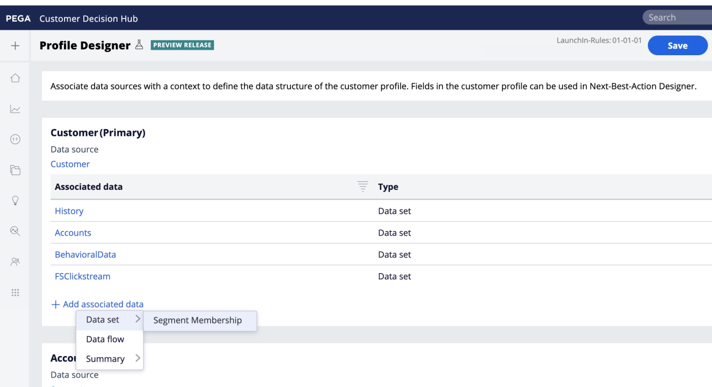

# Verbinding met PEGA-client

## Overzicht {#overview}

Gebruik de [!DNL Pega Customer Decision Hub] doel in Adobe Experience Platform om profielkenmerken en segmentlidmaatschapsgegevens naar te sturen [!DNL Pega Customer Decision Hub] voor de volgende beste-actiebeslissing.

Profielsegmentlidmaatschap van Adobe Experience Platform, indien geladen in [!DNL Pega Customer Decision Hub], kan worden gebruikt als voorspeller in adaptieve modellen en helpt de juiste contextuele en gedragsgegevens te leveren voor de volgende-best-actie beslissingsdoeleinden.

>[!IMPORTANT]
>
>Deze documentatiepagina is gemaakt door Pegasystems. Voor vragen of verzoeken om updates kunt u rechtstreeks contact opnemen met Pega [hier](mailto:support@pega.com).

## Gebruiksscenario’s

Om u te helpen beter begrijpen hoe en wanneer u het [!DNL Customer Decision Hub] doel, hier zijn de gevallen van het steekproefgebruik die de klanten van Adobe Experience Platform kunnen oplossen door deze bestemming te gebruiken.

### Telecommunicatie

Een markator wil inzichten van de op het model gebaseerde best action van de gegevenswetenschap zoals geleverd door [!DNL Pega Customer Decision Hub] voor de betrokkenheid van de klant. [!DNL Pega Customer Decision Hub] is sterk afhankelijk van de intentie van de klant, bijvoorbeeld &quot;Interested_In_5G&quot;, &quot;Interested_in_Unlimited_Dataplan&quot; of &quot;Interest_in_iPhone_accessoires&quot;.

### Financiële diensten

Een markator wil de aanbiedingen optimaliseren voor klanten die zich hebben geabonneerd op of zich niet hebben geabonneerd op nieuwsbrieven van het pensioenplan of het pensioenplan. De bedrijven van de financiële diensten kunnen veelvoudige identiteitskaart van de Klant van hun eigen CRMs in Adobe Experience Platform opnemen, segmenten van hun eigen off-line gegevens bouwen, en profielen verzenden die de segmenten ingaan en verlaten aan [!DNL Pega Customer Decision Hub] voor volgende-best-actie (NBA) besluit in uitgaande kanalen.

## Vereisten {#prerequisites}

Voordat u deze bestemming kunt gebruiken om gegevens uit Adobe Experience Platform te exporteren, moet u de volgende voorwaarden uitvoeren in [!DNL Pega Customer Decision Hub]:

* Configureer de [Adobe Experience Platform Profile and Segment Membership Integration Component](https://docs.pega.com/component/customer-decision-hub/adobe-experience-platform-profile-and-segment-membership-integration-component) in uw [!DNL Pega Customer Decision Hub] -instantie.
* OAuth 2.0 configureren [Clientregistratie met clientreferenties](https://docs.pega.com/security/87/creating-and-configuring-oauth-20-client-registration) subsidietype in uw [!DNL Pega Customer Decision Hub] -instantie.
* Configureren [realtime gegevensstroom](https://docs.pega.com/decision-management/87/creating-real-time-run-data-flows) voor de gegevensstroom van het Lidmaatschap van het Adobe Segment in uw [!DNL Pega Customer Decision Hub] -instantie.

## Ondersteunde identiteiten {#supported-identities}

[!DNL Pega Customer Decision Hub] biedt ondersteuning voor de activering van aangepaste gebruikers-id&#39;s die in de onderstaande tabel worden beschreven. Zie voor meer informatie [identiteiten](/help/identity-service/namespaces.md).

| Doelidentiteit | Beschrijving |
|---|---|
| *CustomerID* | Algemene gebruikersnaam die een profiel op unieke wijze identificeert in [!DNL Pega Customer Decision Hub] en Adobe Experience Platform |

{style=&quot;table-layout:auto&quot;}

## Type en frequentie exporteren {#export-type-frequency}

Raadpleeg de onderstaande tabel voor informatie over het exporttype en de exportfrequentie van de bestemming.

| Item | Type | Notities |
---------|----------|---------|
| Exporttype | **[!UICONTROL Profile-based]** | Alle leden van een segment met id exporteren (*CustomerID*), kenmerken (achternaam, voornaam, locatie, enz.) en Segmentlidmaatschapsgegevens. |
| Uitvoerfrequentie | **[!UICONTROL Streaming]** | Streaming doelen zijn altijd op API gebaseerde verbindingen. Zodra een profiel in Experience Platform wordt bijgewerkt, dat op segmentevaluatie wordt gebaseerd, verzendt de schakelaar de update stroomafwaarts naar het bestemmingsplatform. Zie voor meer informatie [streaming doelen](/help/destinations/destination-types.md#streaming-destinations). |

{style=&quot;table-layout:auto&quot;}

## Verbinden met de bestemming {#connect}

Als u verbinding wilt maken met dit doel, voert u de stappen uit die worden beschreven in het dialoogvenster [zelfstudie over doelconfiguratie](../../ui/connect-destination.md). In vormen bestemmingswerkschema, vul de gebieden in die in de twee hieronder secties worden vermeld.

### Verifiëren voor bestemming {#authenticate}

#### OAuth 2 Client Credentials authentication {#oauth-2-client-credentials-authentication}

Vul de onderstaande velden in en selecteer **[!UICONTROL Connect to destination]**:

* **[!UICONTROL Access Token URL]**: De URL van het toegangstoken OAuth 2 op uw [!DNL Pega Customer Decision Hub] -instantie.
* **[!UICONTROL Client ID]**: De OAuth 2 [!DNL client ID] die u in uw [!DNL Pega Customer Decision Hub] -instantie.
* **[!UICONTROL Client Secret]**: De OAuth 2 [!DNL client secret] die u in uw [!DNL Pega Customer Decision Hub] -instantie.

### Doelgegevens invullen {#destination-details}

Na het vestigen van de authentificatieverbinding aan [!DNL Pega Customer Decision Hub], verstrekt de volgende informatie voor de bestemming:

Om details voor de bestemming te vormen, vul de vereiste gebieden in en selecteer **[!UICONTROL Next]**.

* **[!UICONTROL Name]**: Een naam waarmee u deze bestemming in de toekomst zult erkennen.
* **[!UICONTROL Description]**: Een beschrijving die u zal helpen deze bestemming in de toekomst identificeren.
* **[!UICONTROL Host Name]**: De de gastheernaam van de Hub van de de Beslissingen van de Hub van de Klant waaraan het profiel als json- gegevens wordt uitgevoerd.

## Segmenten naar dit doel activeren {#activate}

>[!IMPORTANT]
> 
>Als u gegevens wilt activeren, hebt u de opdracht **[!UICONTROL Manage Destinations]**, **[!UICONTROL Activate Destinations]**, **[!UICONTROL View Profiles]**, en **[!UICONTROL View Segments]** [toegangsbeheermachtigingen](/help/access-control/home.md#permissions). Lees de [toegangsbeheeroverzicht](/help/access-control/ui/overview.md) of neem contact op met de productbeheerder om de vereiste machtigingen te verkrijgen.

Zie [De publieksgegevens van de activering aan het stromen profiel de uitvoerbestemmingen](../../ui/activate-streaming-profile-destinations.md) voor instructies bij het activeren van publiekssegmenten aan deze bestemming.

### Doelkenmerken {#attributes}

In de [[!UICONTROL Select attributes]](../../ui/activate-streaming-profile-destinations.md#select-attributes) stap, raadt Adobe u aan een unieke id te selecteren in uw [samenvoegingsschema](../../../profile/home.md#profile-fragments-and-union-schemas). Selecteer de unieke id en andere XDM-velden die u naar het doel wilt exporteren.

### Voorbeeld van toewijzing: profielupdates activeren in [!DNL Pega Customer Decision Hub] {#mapping-example}

Hieronder ziet u een voorbeeld van correcte identiteitstoewijzing bij het exporteren van profielen naar [!DNL Pega Customer Decision Hub].

Bronvelden selecteren:

* Selecteer een id (bijvoorbeeld: (KlantID) als bronidentiteit die een profiel in Adobe Experience Platform en [!DNL Pega Customer Decision Hub].
* Selecteer wijzigingen in XDM-bronprofielkenmerken die moeten worden geëxporteerd en bijgewerkt in [!DNL Pega Customer Decision Hub].

Doelvelden selecteren:

* Selecteer `CustomerID` naamruimte als doelidentiteit.
* Selecteer namen van bestemmingsprofielkenmerken die moeten worden toegewezen aan de overeenkomende XDM-bronprofielkenmerken.

## Geëxporteerde gegevens/Gegevens valideren bij exporteren {#exported-data}

Een succesvolle update van het segmentlidmaatschap voor een profiel zou segmentherkenningsteken, naam en status in de PEGA marketing segmentlidmaatschapsdatastore opnemen. De lidmaatschapsgegevens zijn gekoppeld aan een klant die gebruikmaakt van Customer Profile Designer in [!DNL Pega Customer Decision Hub], zoals hieronder weergegeven.

De gegevens van het segmentlidmaatschap worden gebruikt in het volgende-Beste beleid van de Betrokkenheid van de Ontwerper van Pega voor volgende-best-actie besluit, zoals hieronder getoond.

De gegevensvelden voor klantsegmentlidmaatschap worden toegevoegd als voorspellers in adaptieve modellen, zoals hieronder wordt weergegeven.

## Aanvullende bronnen {#additional-resources}

Zie [Een OAuth 2.0-clientregistratie instellen](https://docs.pega.com/security/87/creating-and-configuring-oauth-20-client-registration) in [!DNL Pega Customer Decision Hub].

Zie [Een real-time runtime maken voor gegevensstromen](https://docs.pega.com/decision-management/87/creating-real-time-run-data-flows) in [!DNL Pega Customer Decision Hub].

Zie [De klantgegevens beheren in de Designer van het Klantprofiel](https://docs.pega.com/whats-new-pega-platform/manage-customer-records-customer-profile-designer-86).

## Gegevensgebruik en -beheer {#data-usage-governance}

Alles [!DNL Adobe Experience Platform] de bestemmingen zijn volgzaam met het beleid van het gegevensgebruik wanneer het behandelen van uw gegevens. Voor gedetailleerde informatie over hoe [!DNL Adobe Experience Platform] handhaaft gegevensbeheer, zie [Overzicht van gegevensbeheer](/help/data-governance/home.md).
