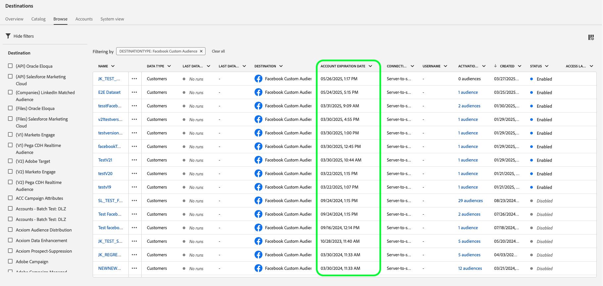

# [!DNL Facebook]-verbinding

## Overzicht {#overview}

Activeer profielen voor uw [!DNL Facebook] -campagnes voor doelgroepen, personalisatie en onderdrukking op basis van gehakte e-mails.

U kunt deze bestemming gebruiken voor doelgroepen in [!DNL Facebook's] -apps die worden ondersteund door [!DNL Custom Audiences] , inclusief [!DNL Facebook] , [!DNL Instagram] , [!DNL Audience Network] en [!DNL Messenger] . De selectie van de app waarop u de campagne wilt uitvoeren, wordt aangegeven op het plaatsingsniveau in [!DNL Facebook Ads Manager] .

## Gebruiksscenario’s

Om u beter te helpen begrijpen hoe en wanneer om de [!DNL Facebook] bestemming te gebruiken, zijn er twee voorbeelden van gebruiksgevallen die klanten van Adobe Experience Platform door deze eigenschap kunnen oplossen.

### Hoofdletters gebruiken #1

Een online retailer wil bestaande klanten bereiken via sociale platforms en hun persoonlijke aanbiedingen laten zien op basis van hun eerdere bestellingen. De online retailer kan e-mailadressen ophalen van haar eigen CRM-adres naar Adobe Experience Platform, publiek maken van hun eigen offline gegevens en deze soorten publiek naar het [!DNL Facebook] sociale platform sturen, zodat hun advertentie-uitgaven worden geoptimaliseerd.

### Hoofdletters gebruiken #2

Een luchtvaartmaatschappij heeft verschillende klantniveaus (Bronze, Silver en Gold) en wil elk niveau via sociale platforms voorzien van persoonlijke aanbiedingen. Niet alle klanten gebruiken echter de mobiele app van de luchtvaartmaatschappij en sommige van hen hebben zich niet aangemeld bij de website van het bedrijf. De enige id&#39;s die het bedrijf over deze klanten heeft, zijn id&#39;s voor lidmaatschap en e-mailadressen.

Om hen over sociale media te richten, kunnen zij de klantengegevens van hun CRM aan boord nemen in Adobe Experience Platform, gebruikend de e-mailadressen als herkenningstekens.

Vervolgens kunnen ze hun offlinegegevens gebruiken, inclusief de bijbehorende id&#39;s voor het lidmaatschap en de niveaus van de klant, om nieuwe doelgroepen te maken die ze via de [!DNL Facebook] -bestemming kunnen gebruiken.

## Ondersteunde identiteiten {#supported-identities}

[!DNL Facebook Custom Audiences] ondersteunt de activering van identiteiten die in de onderstaande tabel worden beschreven. Leer meer over [ identiteiten ](/help/identity-service/features/namespaces.md).

| Doelidentiteit | Beschrijving | Overwegingen |
|---|---|---|
| `GAID` | GOOGLE ADVERTISING ID | Selecteer de GAID doelidentiteit wanneer uw bronidentiteit een GAID-naamruimte is. |
| `IDFA` | Apple-id voor adverteerders | Selecteer de IDFA doelidentiteit wanneer uw bronidentiteit een IDFA namespace is. |
| `phone_sha256` | Telefoonnummers die zijn hashed met het SHA256-algoritme | Adobe Experience Platform biedt ondersteuning voor zowel platte tekst- als SHA256-telefoonnummers. Volg de instructies in de [ passende vereisten van identiteitskaart ](#id-matching-requirements-id-matching-requirements) sectie en gebruik aangewezen namespaces voor gewone teksten en gehakt telefoonaantallen, respectievelijk. Wanneer het bronveld hashingkenmerken bevat, schakelt u de optie **[!UICONTROL Apply transformation]** in om de gegevens automatisch te laten hashen bij activering door [!DNL Experience Platform] . |
| `email_lc_sha256` | E-mailadressen die met het algoritme SHA256 worden gehasht | Adobe Experience Platform biedt ondersteuning voor zowel platte tekst- als SHA256-e-mailadressen met hashing. Volg de instructies in de [ passende vereisten van identiteitskaart ](#id-matching-requirements-id-matching-requirements) sectie en gebruik aangewezen namespaces voor gewone teksten en gehakt e-mailadressen, respectievelijk. Wanneer het bronveld hashingkenmerken bevat, schakelt u de optie **[!UICONTROL Apply transformation]** in om de gegevens automatisch te laten hashen bij activering door [!DNL Experience Platform] . |
| `extern_id` | Aangepaste gebruikers-id&#39;s | Selecteer deze doelidentiteit wanneer uw bronidentiteit een aangepaste naamruimte is. |
| `gender` | Geslacht | Geaccepteerde waarden: <ul><li>`m` voor man</li><li>`f` voor vrouwelijk</li></ul> Experience Platform **hakt** automatisch deze waarde alvorens het naar Facebook te verzenden. Deze automatische hashing is vereist om te voldoen aan de beveiligings- en privacyvereisten van Facebook. Verstrek **&#x200B;**&#x200B;geen pre-gehakte waarden voor dit gebied, aangezien dit het passende proces om zal veroorzaken te ontbreken. |
| `date_of_birth` | Geboortedatum | Geaccepteerde indeling: `yyyy-MM-DD`.   Experience Platform **hakt** automatisch deze waarde alvorens het naar Facebook te verzenden. Deze automatische hashing is vereist om te voldoen aan de beveiligings- en privacyvereisten van Facebook. Verstrek **&#x200B;**&#x200B;geen pre-gehakte waarden voor dit gebied, aangezien dit het passende proces om zal veroorzaken te ontbreken. |
| `last_name` | Achternaam | Geaccepteerde indeling: Alleen kleine letters, `a-z` tekens en geen leestekens. Gebruik UTF-8-codering voor speciale tekens.    Experience Platform **hakt** automatisch deze waarde alvorens het naar Facebook te verzenden. Deze automatische hashing is vereist om te voldoen aan de beveiligings- en privacyvereisten van Facebook. Verstrek **&#x200B;**&#x200B;geen pre-gehakte waarden voor dit gebied, aangezien dit het passende proces om zal veroorzaken te ontbreken. |
| `first_name` | Voornaam | Geaccepteerde indeling: Alleen kleine letters, `a-z` tekens, geen leestekens, geen spaties. Gebruik UTF-8-codering voor speciale tekens.    Experience Platform **hakt** automatisch deze waarde alvorens het naar Facebook te verzenden. Deze automatische hashing is vereist om te voldoen aan de beveiligings- en privacyvereisten van Facebook. Verstrek **&#x200B;**&#x200B;geen pre-gehakte waarden voor dit gebied, aangezien dit het passende proces om zal veroorzaken te ontbreken. |
| `first_name_initial` | Voornaam oorspronkelijk | Geaccepteerde indeling: alleen kleine letters, `a-z` tekens. Gebruik UTF-8-codering voor speciale tekens.    Experience Platform **hakt** automatisch deze waarde alvorens het naar Facebook te verzenden. Deze automatische hashing is vereist om te voldoen aan de beveiligings- en privacyvereisten van Facebook. Verstrek **&#x200B;**&#x200B;geen pre-gehakte waarden voor dit gebied, aangezien dit het passende proces om zal veroorzaken te ontbreken. |
| `state` | Staat | Gebruik [ 2 karakter ANSI afkortingen code ](https://en.wikipedia.org/wiki/Federal_Information_Processing_Standard_state_code) in kleine letters. Voor staten buiten de VS gebruikt u kleine letters, geen leestekens, geen speciale karakters, en geen ruimten.    Experience Platform **hakt** automatisch deze waarde alvorens het naar Facebook te verzenden. Deze automatische hashing is vereist om te voldoen aan de beveiligings- en privacyvereisten van Facebook. Verstrek **&#x200B;**&#x200B;geen pre-gehakte waarden voor dit gebied, aangezien dit het passende proces om zal veroorzaken te ontbreken. |
| `city` | Plaats | Geaccepteerde indeling: Alleen kleine letters, `a-z` tekens, geen leestekens, geen speciale tekens, geen spaties.    Experience Platform **hakt** automatisch deze waarde alvorens het naar Facebook te verzenden. Deze automatische hashing is vereist om te voldoen aan de beveiligings- en privacyvereisten van Facebook. Verstrek **&#x200B;**&#x200B;geen pre-gehakte waarden voor dit gebied, aangezien dit het passende proces om zal veroorzaken te ontbreken. |
| `zip` | Postcode | Geaccepteerde indeling: Kleine letters, geen spaties. Gebruik voor Amerikaanse postcodes alleen de eerste 5 cijfers. Voor het Verenigd Koninkrijk gebruikt u de `Area/District/Sector` -indeling.    Experience Platform **hakt** automatisch deze waarde alvorens het naar Facebook te verzenden. Deze automatische hashing is vereist om te voldoen aan de beveiligings- en privacyvereisten van Facebook. Verstrek **&#x200B;**&#x200B;geen pre-gehakte waarden voor dit gebied, aangezien dit het passende proces om zal veroorzaken te ontbreken. |
| `country` | Land | Geaccepteerd formaat: Kleine letters, 2-brief landcodes in [ ISO 3166-1 alpha-2 ](https://en.wikipedia.org/wiki/ISO_3166-1_alpha-2) formaat.    Experience Platform **hakt** automatisch deze waarde alvorens het naar Facebook te verzenden. Deze automatische hashing is vereist om te voldoen aan de beveiligings- en privacyvereisten van Facebook. Verstrek **&#x200B;**&#x200B;geen pre-gehakte waarden voor dit gebied, aangezien dit het passende proces om zal veroorzaken te ontbreken. |

## Ondersteunde doelgroepen {#supported-audiences}

In deze sectie wordt beschreven welke soorten publiek u naar dit doel kunt exporteren.

| Oorsprong publiek | Ondersteund | Beschrijving |
|---------|----------|----------|
| [!DNL Segmentation Service] | ✓ | Het publiek produceerde door de Dienst van de Segmentatie van Experience Platform [&#128279;](../../../segmentation/home.md). |
| Aangepaste uploads | ✓ | Het publiek [ ingevoerde ](../../../segmentation/ui/audience-portal.md#import-audience) in Experience Platform van Csv- dossiers. |

{style="table-layout:auto"}

## Type en frequentie exporteren {#export-type-frequency}

Raadpleeg de onderstaande tabel voor informatie over het exporttype en de exportfrequentie van de bestemming.

| Item | Type | Notities |
---------|----------|---------|
| Exporttype | **[!UICONTROL Audience export]** | U exporteert alle leden van een publiek met de id&#39;s (naam, telefoonnummer of andere) die in de Facebook-bestemming worden gebruikt. |
| Exportfrequentie | **[!UICONTROL Streaming]** | Streaming doelen zijn &quot;altijd aan&quot; API-verbindingen. Zodra een profiel in Experience Platform wordt bijgewerkt dat op publieksevaluatie wordt gebaseerd, verzendt de schakelaar de update stroomafwaarts naar het bestemmingsplatform. Lees meer over [ het stromen bestemmingen ](/help/destinations/destination-types.md#streaming-destinations). |

{style="table-layout:auto"}

## Voorwaarden voor Facebook-accounts {#facebook-account-prerequisites}

Voordat u uw publiek naar [!DNL Facebook] kunt sturen, moet u controleren of aan de volgende vereisten is voldaan:

* Uw [!DNL Facebook] -gebruikersaccount moet volledige toegang hebben tot [!DNL Facebook Business Account] , dat eigenaar is van het Advertentieverkeer dat u gebruikt.
* Voor uw [!DNL Facebook] -gebruikersaccount moet de **[!DNL Manage campaigns]** -machtiging zijn ingeschakeld voor de advertentieaccount die u wilt gebruiken.
* De **Adobe Experience Cloud** bedrijfsrekening moet als advertentiepartner in uw [!DNL Facebook Ad Account] worden toegevoegd. Gebruik `business ID=206617933627973` . Zie [ Partners aan Uw BedrijfsManager ](https://www.facebook.com/business/help/1717412048538897) in de documentatie Facebook voor details toevoegen.

  >[!IMPORTANT]
  >
  > Wanneer het vormen van de toestemmingen voor Adobe Experience Cloud, moet u **toelaten leidt campagnes** toestemming. De machtiging is vereist voor de [!DNL Adobe Experience Platform] -integratie.

* Lees en onderteken de [!DNL Facebook Custom Audiences] Servicevoorwaarden. Ga hiertoe naar `https://business.facebook.com/ads/manage/customaudiences/tos/?act=[accountID]&business_id=206617933627973` , waar `accountID` uw [!DNL Facebook Ad Account ID] is. Zorg ervoor dat de sectie `business_id=206617933627973` aanwezig is in de URL wanneer u de Servicevoorwaarden ondertekent.

  >[!IMPORTANT]
  >
  >Wanneer u de Servicevoorwaarden van [!DNL Facebook Custom Audiences] ondertekent, moet u dezelfde gebruikersaccount gebruiken als waarmee u zich in de Facebook-API hebt geverifieerd.

## Vereisten voor id-afstemming {#id-matching-requirements}

[!DNL Facebook] vereist dat er geen PII&#39;s (Personal Identified Information) worden verzonden. Daarom kan het publiek dat aan [!DNL Facebook] wordt geactiveerd van *gehakt* herkenningstekens, zoals e-mailadressen of telefoonaantallen worden afgevinkt.

Afhankelijk van het type id&#39;s dat u in Adobe Experience Platform invoert, moet u aan de desbetreffende vereisten voldoen.

## Pakketten voor publiek maximaliseren {#match-rates}

Als u de hoogste overeenkomende doelgroep in [!DNL Facebook] wilt bereiken, raden we u aan de doelidentiteiten `phone_sha256` en `email_lc_sha256` te gebruiken.

Deze id&#39;s zijn de primaire id&#39;s die door [!DNL Facebook] worden gebruikt voor het afstemmen van soorten publiek op hun platforms. Zorg ervoor dat de brongegevens correct zijn toegewezen aan deze doelidentiteiten en voldoet aan de hashingvereisten van [!DNL Facebook's] .

## Vereisten voor hashing voor telefoonnummers {#phone-number-hashing-requirements}

Er zijn twee methoden om telefoonnummers te activeren in [!DNL Facebook] :

* **Ingesting ruwe telefoonaantallen**: u kunt ruwe telefoonaantallen in het [!DNL E.164] formaat in [!DNL Experience Platform] opnemen. Deze werden automatisch gehasht bij activering. Als u deze optie kiest, moet u uw onbewerkte telefoonnummers altijd in de naamruimte `Phone_E.164` invoeren.
* **het Ingeesten hashed telefoonaantallen**: u kunt uw telefoonaantallen vóór opname in [!DNL Experience Platform] pre-hash. Als u deze optie kiest, moet u uw hashed-telefoonnummers altijd invoeren in de naamruimte `Phone_SHA256` .

>[!NOTE]
>
>Telefoonnummers die in de naamruimte `Phone` worden ingevoerd, kunnen niet worden geactiveerd in [!DNL Facebook] .

## E-mailhashingvereisten {#email-hashing-requirements}

U kunt e-mailadressen hashen alvorens hen in Adobe Experience Platform op te nemen, of e-mailadressen gebruiken duidelijk in Experience Platform, en [!DNL Experience Platform] hen hebben geknoeid op activering.

Om over het opnemen van e-mailadressen in Experience Platform te leren, zie het [ overzicht van de partijopname ](/help/ingestion/batch-ingestion/overview.md) en [ het stromen ingestitieoverzicht ](/help/ingestion/streaming-ingestion/overview.md).

Als u ervoor kiest om de e-mailadressen zelf te hashen, moet u aan de volgende vereisten voldoen:

* Alle spaties aan het begin en aan het einde van de e-mailtekenreeks bijsnijden, bijvoorbeeld: `johndoe@example.com` , niet `<space>johndoe@example.com<space>` ;
* Wanneer u de e-mailtekenreeksen hasht, moet u ervoor zorgen dat de kleine-lettertekenreeks wordt gehaseerd.
   * Voorbeeld: `example@email.com` , not `EXAMPLE@EMAIL.COM` ;
* Zorg ervoor dat de hashtekenreeks alleen in kleine letters wordt weergegeven
   * Voorbeeld: `55e79200c1635b37ad31a378c39feb12f120f116625093a19bc32fff15041149` , not `55E79200C1635B37AD31A378C39FEB12F120F116625093A19bC32FFF15041149` ;
* Zilp de tekenreeks niet.

>[!NOTE]
>
>Gegevens uit naamruimten zonder hashing worden automatisch gehasht door [!DNL Experience Platform] bij activering.
>&#x200B;> Kenmerkbrongegevens worden niet automatisch gehasht. Wanneer het bronveld hashingkenmerken bevat, schakelt u de optie **[!UICONTROL Apply transformation]** in om de gegevens automatisch te laten hashen bij activering door [!DNL Experience Platform] .
>&#x200B;> De optie **[!UICONTROL Apply transformation]** wordt alleen weergegeven wanneer u kenmerken als bronvelden selecteert. Deze wordt niet weergegeven wanneer u naamruimten kiest.

## Aangepaste naamruimten gebruiken {#custom-namespaces}

Voordat u de naamruimte `Extern_ID` kunt gebruiken om gegevens naar [!DNL Facebook] te verzenden, moet u eerst uw eigen id&#39;s synchroniseren met [!DNL Facebook Pixel] . Zie de [ officiële documentatie van Facebook ](https://developers.facebook.com/docs/marketing-api/audiences/guides/custom-audiences/#external_identifiers) voor gedetailleerde informatie.

## Verbinden met de bestemming {#connect}

>[!IMPORTANT]
> 
>Om met de bestemming te verbinden, hebt u **[!UICONTROL View Destinations]** en **[!UICONTROL Manage Destinations]** [ toegangsbeheertoestemmingen ](/help/access-control/home.md#permissions) nodig. Lees het [ overzicht van de toegangscontrole ](/help/access-control/ui/overview.md) of contacteer uw productbeheerder om de vereiste toestemmingen te verkrijgen.

Om met deze bestemming te verbinden, volg de stappen die in het [ leerprogramma van de bestemmingsconfiguratie ](../../ui/connect-destination.md) worden beschreven. In vormen bestemmingswerkschema, vul de gebieden in die in de twee hieronder secties worden vermeld.

In de onderstaande video ziet u ook de stappen voor het configureren van een [!DNL Facebook] -bestemming en het activeren van het publiek.

>[!VIDEO](https://video.tv.adobe.com/v/3475119/?quality=12&learn=on&captions=dut)

>[!NOTE]
>
>De Experience Platform-gebruikersinterface wordt vaak bijgewerkt en kan zijn gewijzigd sinds de opname van deze video. Voor de meest bijgewerkte informatie, verwijs naar het [ leerprogramma van de bestemmingsconfiguratie ](../../ui/connect-destination.md).

### Verifiëren voor bestemming {#authenticate}

1. Zoek het Facebook-doel in de doelcatalogus en selecteer **[!UICONTROL Set Up]** .
2. Selecteer **[!UICONTROL Connect to destination]**.
   
3. Ga uw geloofsbrieven van Facebook in en selecteer **Login**.

### Verificatiegegevens vernieuwen {#refresh-authentication-credentials}

Facebook-verificatietokens verlopen elke 60 dagen. Zodra het teken is verlopen, de gegevensuitvoer naar de bestemming houdt op werkend.

U kunt de vervaldatums van uw token vanaf de kolom **[!UICONTROL Account expiration date]** controleren op de tabbladen **[[!UICONTROL Accounts]](../../ui/destinations-workspace.md#accounts)** of **[[!UICONTROL Browse]](../../ui/destinations-workspace.md#browse)** .

Als u wilt voorkomen dat het verlopen van een token onderbrekingen veroorzaakt in de activeringsgegevensstroom, verifieert u dit opnieuw door de volgende stappen uit te voeren:

1. Ga naar **[!UICONTROL Destinations]** > **[!UICONTROL Accounts]**
2. (Optioneel) Gebruik de beschikbare filters op de pagina om alleen Facebook-accounts weer te geven.
   
3. Selecteer de account die u wilt vernieuwen, selecteer de ellips en selecteer **[!UICONTROL Edit details]** .
    uit
4. Selecteer **[!UICONTROL Reconnect OAuth]** in het modaal venster en verifieer het opnieuw met uw Facebook-referenties.
   

>[!SUCCESS]
> 
>Uw verificatiereferenties worden vernieuwd en de vervaltijd wordt ingesteld op 60 dagen.

### Doelgegevens invullen {#destination-details}

>[!CONTEXTUALHELP]
>id="platform_destinations_connect_facebook_accountid"
>title="Account-id"
>abstract="Je Facebook advertentie-account-id. U kunt deze id vinden in uw Facebook Ads Manager-account. Geef bij het invoeren van deze id altijd een voorvoegsel `act_` op."

Als u details voor de bestemming wilt configureren, vult u de vereiste en optionele velden hieronder in. Een sterretje naast een veld in de gebruikersinterface geeft aan dat het veld verplicht is.

* **[!UICONTROL Name]**: Een naam waarmee u dit doel in de toekomst herkent.
* **[!UICONTROL Description]**: Een beschrijving die u zal helpen deze bestemming in de toekomst identificeren.
* **[!UICONTROL Account ID]**: Uw [!DNL Facebook Ad Account ID] . U kunt deze id vinden in uw [!DNL Facebook Ads Manager] -account. Geef bij het invoeren van deze id altijd een voorvoegsel `act_` op.

### Waarschuwingen inschakelen {#enable-alerts}

U kunt alarm toelaten om berichten over de status van dataflow aan uw bestemming te ontvangen. Selecteer een waarschuwing in de lijst om u te abonneren op meldingen over de status van uw gegevensstroom. Voor meer informatie over alarm, zie de gids bij [ het intekenen aan bestemmingsalarm gebruikend UI ](../../ui/alerts.md).

Wanneer u klaar bent met het opgeven van details voor uw doelverbinding, selecteert u **[!UICONTROL Next]** .

## Soorten publiek naar dit doel activeren {#activate}

>[!CONTEXTUALHELP]
>id="platform_destinations_activate_facebook_originofaudience"
>title="Oorsprong van het publiek"
>abstract="Kies hoe de klantgegevens in het publiek oorspronkelijk zijn verzameld. De gegevens worden op Facebook weergegeven wanneer een gebruiker op het segment valt"

>[!CONTEXTUALHELP]
>id="platform_destinations_activate_facebook_originofaudience_customers"
>title="Oorsprong van het publiek"
>abstract="Adverteerders verzamelden gegevens rechtstreeks bij klanten."

>[!CONTEXTUALHELP]
>id="platform_destinations_activate_facebook_originofaudience_partners"
>title="Oorsprong van het publiek"
>abstract="Adverteerders verzamelden gegevens rechtstreeks bij hun partners."

>[!CONTEXTUALHELP]
>id="platform_destinations_activate_facebook_originofaudience_customersandpartners"
>title="Oorsprong van het publiek"
>abstract="Adverteerders verzamelden gegevens rechtstreeks bij hun klanten en partners."

>[!IMPORTANT]
> 
>* Om gegevens te activeren, hebt u **[!UICONTROL View Destinations]**, **[!UICONTROL Activate Destinations]**, **[!UICONTROL View Profiles]**, en **[!UICONTROL View Segments]** [ toegangsbeheertoestemmingen ](/help/access-control/home.md#permissions) nodig. Lees het [ overzicht van de toegangscontrole ](/help/access-control/ui/overview.md) of contacteer uw productbeheerder om de vereiste toestemmingen te verkrijgen.
>* Om *identiteiten* uit te voeren, hebt u de **[!UICONTROL View Identity Graph]** [ toegangsbeheertoestemming ](/help/access-control/home.md#permissions) nodig.   {width="100" zoomable="yes"}

Zie [ publieksgegevens aan het stromen publiek de uitvoerbestemmingen ](../../ui/activate-segment-streaming-destinations.md) voor instructies op het activeren van publiek aan deze bestemming activeren.

In de stap **[!UICONTROL Segment schedule]** moet u de instructie [!UICONTROL Origin of audience] opgeven wanneer u een publiek verzendt naar [!DNL Facebook Custom Audiences] .

### Voorbeeld van toewijzing: publieksgegevens activeren in [!DNL Facebook Custom Audience] {#example-facebook}

Hieronder ziet u een voorbeeld van correcte identiteitstoewijzing bij het activeren van publieksgegevens in [!DNL Facebook Custom Audience] .

Bronvelden selecteren:

* Selecteer de naamruimte `Email` als bronidentiteit als de e-mailadressen die u gebruikt geen hashing zijn.
* Selecteer `Email_LC_SHA256` namespace als bronidentiteit als u klant e-mailadressen op gegevensinvoer in [!DNL Experience Platform], volgens [!DNL Facebook] [ e-mailhashing vereisten ](#email-hashing-requirements) hashing.
* Selecteer de naamruimte `PHONE_E.164` als bronidentiteit als uw gegevens uit niet-gehashte telefoonnummers bestaan. [!DNL Experience Platform] hasht de telefoonnummers om te voldoen aan [!DNL Facebook] -vereisten.
* Selecteer `Phone_SHA256` namespace als bronidentiteit als u telefoonaantallen op gegevensinvoer in [!DNL Experience Platform] hashing, volgens [!DNL Facebook] [ de hashing vereisten van het telefoonaantal ](#phone-number-hashing-requirements).
* Selecteer de naamruimte `IDFA` als bronidentiteit als uw gegevens uit [!DNL Apple] apparaat-id&#39;s bestaan.
* Selecteer de naamruimte `GAID` als bronidentiteit als uw gegevens uit [!DNL Android] apparaat-id&#39;s bestaan.
* Selecteer de naamruimte `Custom` als bronidentiteit als uw gegevens uit andere id&#39;s bestaan.

Doelvelden selecteren:

* Selecteer de naamruimte `Email_LC_SHA256` als doelidentiteit wanneer de bronnaamruimten `Email` of `Email_LC_SHA256` zijn.
* Selecteer de naamruimte `Phone_SHA256` als doelidentiteit wanneer de bronnaamruimten `PHONE_E.164` of `Phone_SHA256` zijn.
* Selecteer `IDFA` of `GAID` naamruimten als doelidentiteit wanneer uw bronnaamruimten `IDFA` of `GAID` zijn.
* Selecteer de naamruimte `Extern_ID` als doelidentiteit wanneer de bronnaamruimte een aangepaste naamruimte is.

>[!IMPORTANT]
>
>Gegevens uit naamruimten zonder hashing worden automatisch gehasht door [!DNL Experience Platform] bij activering.
> 
>Kenmerkbrongegevens worden niet automatisch gehasht. Wanneer het bronveld hashingkenmerken bevat, schakelt u de optie **[!UICONTROL Apply transformation]** in om de gegevens automatisch te laten hashen bij activering door [!DNL Experience Platform] .

## Geëxporteerde gegevens {#exported-data}

Voor [!DNL Facebook], betekent een succesvolle activering dat een [!DNL Facebook] douanepubliek programmatically in [[!DNL Facebook Ads Manager] ](https://www.facebook.com/adsmanager/manage/) zou worden gecreeerd. Het lidmaatschap van het publiek wordt toegevoegd en verwijderd omdat gebruikers gekwalificeerd zijn voor of gediskwalificeerd zijn voor het actieve publiek.

>[!TIP]
>
>De integratie tussen Adobe Experience Platform en [!DNL Facebook] ondersteunt historische publieksbackfills. Alle historische publiekskwalificaties worden naar [!DNL Facebook] verzonden wanneer u het publiek activeert naar het doel.

## Problemen oplossen {#troubleshooting}

### 400 Onjuist aanvraagfoutbericht {#bad-request}

Wanneer het vormen van deze bestemming, kunt u de volgende fout ontvangen:

`{"message":"Facebook Error: Permission error","code":"400 BAD_REQUEST"}`

Deze fout treedt op wanneer klanten nieuwe accounts gebruiken en de machtigingen [!DNL Facebook] nog niet actief zijn.

>[!IMPORTANT]
>
>Zorg ervoor u [!DNL Facebook Custom Audience Terms of Service] onder `business ID 206617933627973` goedkeurt, zoals aangetoond in het malplaatje URL in de [ sectie van de rekeningseerste vereisten ](#facebook-account-prerequisites).

Als u het `400 Bad Request` foutenbericht na het volgen van de stappen in [ de rekeningseerste vereisten van Facebook ](#facebook-account-prerequisites) ontvangt, sta een paar dagen voor de [!DNL Facebook] toestemmingen toe om van kracht te worden.

