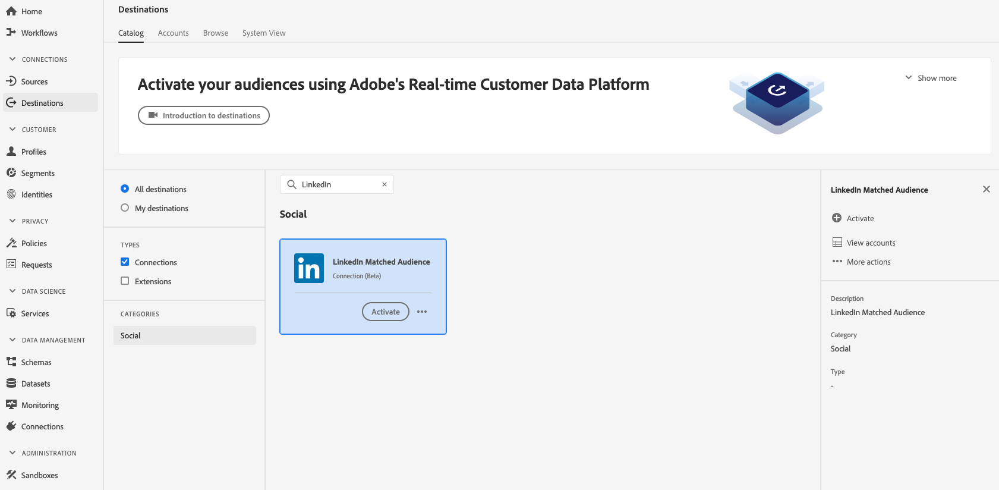

# [!DNL LinkedIn Matched Audiences] verbinding

Activeer profielen voor uw [!DNL LinkedIn] campagnes voor doelgroepen, personalisatie, en onderdrukking, die op gehakte e-mail en mobiele IDs worden gebaseerd.

## Gevallen gebruiken

Om u beter te helpen begrijpen hoe en wanneer u [!DNL LinkedIn Matched Audiences] bestemming zou moeten gebruiken, is hier een gebruiksgeval dat de klanten van Adobe Experience Platform door deze eigenschap kunnen oplossen.

Een softwarebedrijf organiseert een conferentie en wil contact houden met deelnemers, en hen gepersonaliseerde aanbiedingen tonen die op hun status van de conferentieaanwezigheid worden gebaseerd. Het bedrijf kan e-mailadressen of mobiele apparaat-id&#39;s van eigen [!DNL CRM] in Adobe Experience Platform opnemen, segmenten van eigen offline gegevens maken en deze segmenten naar het sociale platform [!DNL LinkedIn] sturen, zodat de advertentie-uitgaven worden geoptimaliseerd.

## Doelspecificaties {#destination-specs}

[!DNL LinkedIn Matched Audiences] ondersteunt de activering van de volgende identiteiten: e-mails met hashing  [!DNL GAID], en  [!DNL IDFA].

### Exporttype {#export-type}

**Segmentexport** : u exporteert alle leden van een segment (publiek) met de id&#39;s (naam, telefoonnummer, enzovoort) gebruikt in de bestemming [!DNL LinkedIn Matched Audiences].

### Voorwaarden voor LinkedIn-account {#LinkedIn-account-prerequisites}

Voordat u het doel [!UICONTROL LinkedIn Matched Audience] kunt gebruiken, moet u ervoor zorgen dat uw [!DNL LinkedIn Campaign Manager]-account het machtigingsniveau [!DNL Creative Manager] of hoger heeft.

Om te leren hoe te om uw [!DNL LinkedIn Campaign Manager] gebruikerstoestemmingen uit te geven, zie [Gebruikerstoestemmingen op Advertising Accounts toevoegen, uitgeven en verwijderen ](https://www.linkedin.com/help/lms/answer/5753) in de documentatie LinkedIn.

### Overeenkomende vereisten {#id-matching-requirements}

[!DNL LinkedIn Matched Audiences] vereist dat er geen duidelijk identificeerbare informatie (PII) wordt verstrekt. Daarom kan het publiek dat aan [!DNL LinkedIn Matched Audiences] wordt geactiveerd *hashed* herkenningstekens, zoals e-mailadressen of mobiele apparaat IDs worden afgevinkt.

Afhankelijk van het type id&#39;s dat u in Adobe Experience Platform invoert, moet u aan de desbetreffende vereisten voldoen.

#### Vereisten voor e-mailhashing {#email-hashing-requirements}

U kunt ervoor kiezen e-mailadressen te hashen alvorens hen in Adobe Experience Platform op te nemen, of u kunt verkiezen om met e-mailadressen in duidelijk Experience Platform te werken en onze algoritme te hebben hen op activering hakt.

Als u meer wilt weten over het invoeren van e-mailadressen in Experience Platform, raadpleegt u het [batchoverzicht](/help/ingestion/batch-ingestion/overview.md) en het [streamingoverzicht](/help/ingestion/streaming-ingestion/overview.md).

Als u ervoor kiest om de e-mailadressen zelf te hashen, moet u aan de volgende vereisten voldoen:

- Snijd alle spaties aan het begin en aan het einde van de e-mailtekenreeks bij. Bijvoorbeeld: `johndoe@example.com`, niet `<space>johndoe@example.com<space>`;
- Wanneer u de e-mailtekenreeksen hasht, moet u de kleine-lettertekenreeks hashen.
   - Voorbeeld: `example@email.com`, niet `EXAMPLE@EMAIL.COM`;
- Controleer of de hashtekenreeks in kleine letters staat
   - Voorbeeld: `55e79200c1635b37ad31a378c39feb12f120f116625093a19bc32fff15041149`, niet `55E79200C1635B37AD31A378C39FEB12F120F116625093A19bC32FFF15041149`;
- Zilp de tekenreeks niet.

>[!NOTE]
>
>Gegevens uit naamruimten zonder hashing worden na activering automatisch gehasht door [!DNL Platform].
> Kenmerkbrongegevens worden niet automatisch gehasht.
> 
> Tijdens de stap [Identiteitstoewijzing](../../ui/activate-destinations.md#identity-mapping), wanneer uw brongebied ongehakte attributen bevat, controleer **[!UICONTROL Transformatie]** toepassen, om [!DNL Platform] automatisch te hebben de gegevens bij activering hakt.
> 
> De optie **[!UICONTROL Transformatie toepassen]** wordt alleen weergegeven wanneer u kenmerken selecteert als bronvelden. Deze wordt niet weergegeven wanneer u naamruimten kiest.

## Verbinden met doel {#connect-destination}

Als u verbinding wilt maken met de [!DNL LinkedIn Matched Audiences]-bestemming, raadpleegt u [Workflow voor verificatie van sociale netwerkdoelen](./workflow.md).

## Segmenten activeren naar [!DNL LinkedIn Matched Audiences] {#activate-segments}

Zie [Gegevens naar doelen activeren](../../ui/activate-destinations.md) voor instructies over het activeren van segmenten naar [!DNL LinkedIn Matched Audiences].

## Geëxporteerde gegevens {#exported-data}

Een succesvolle activering betekent dat een [!DNL LinkedIn] douanepubliek programmatically in [[!DNL LinkedIn Campaign Manager]](https://www.linkedin.com/campaignmanager/login) zou worden gecreeerd. Het lidmaatschap van een segment in het publiek zou worden toegevoegd en verwijderd aangezien de gebruikers voor de geactiveerde segmenten worden gekwalificeerd of worden uitgesloten.

>[!TIP]
>
>De integratie tussen Adobe Experience Platform en [!DNL LinkedIn Matched Audiences] steunt historische publieksbackfills. Alle historische segmentkwalificaties worden naar [!DNL LinkedIn] verzonden wanneer u de segmenten naar de bestemming activeert.