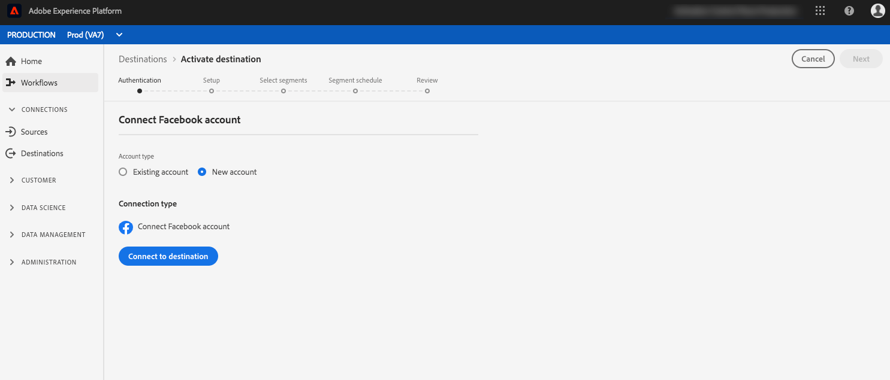

# Een sociale netwerkbestemming maken {#social-network-destinations-workflow}

## Overzicht {#overview}

Deze zelfstudie gebruikt [!DNL Facebook] als voorbeeld, maar de Adobe Experience Platform-workflow is hetzelfde voor alle sociale netwerkdoelen.

Blader in **[!UICONTROL Destinations]** > **[!UICONTROL Catalog]** naar de categorie **[!UICONTROL Social]**. Selecteer de gewenste sociale netwerkbestemming en selecteer **[!UICONTROL Configure]**.

>[!NOTE]
>
>Als er al een verbinding met dit doel bestaat, kunt u een **[!UICONTROL Activate]** knop op de doelkaart zien. Raadpleeg voor meer informatie over het verschil tussen **[!UICONTROL Activate]** en **[!UICONTROL Configure]** de sectie [Catalog](../../ui/destinations-workspace.md#catalog) van de documentatie van de doelwerkruimte.

## Verificatiestap {#authentication}

Als u in de stap **Verificatie** eerder een verbinding met uw sociale netwerkbestemming had ingesteld, selecteert u **[!UICONTROL Existing Account]** en selecteert u de bestaande verbinding. U kunt ook **[!UICONTROL New Account]** selecteren om een nieuwe verbinding met uw sociale netwerkbestemming in te stellen. Selecteer **[!UICONTROL Connect to destination]** en hiermee gaat u naar de geselecteerde sociale netwerkbestemming om u aan te melden en Adobe Experience Cloud te verbinden met uw sociale netwerk Ad-account.

>[!NOTE]
>
>Platform ondersteunt validatie van gebruikersgegevens in het verificatieproces en geeft een foutbericht weer als u onjuiste gegevens hebt ingevoerd voor uw sociale-netwerkaccount-id. Dit zorgt ervoor dat u de werkstroom niet met onjuiste geloofsbrieven voltooit.

Nadat uw aanmeldingsgegevens zijn bevestigd en Adobe Experience Cloud is aangesloten op uw sociale netwerk, kunt u **[!UICONTROL Next]** selecteren om door te gaan naar de stap **[!UICONTROL Setup]**.

## Stap {#setup} instellen

Voer in de stap **[!UICONTROL Setup]** een [!UICONTROL Name] en een [!UICONTROL Description] in voor uw activeringsstroom en vul [!UICONTROL Account ID] van uw sociale netwerk en account in.

>[!IMPORTANT]
>
> Voor [!DNL Facebook] bestemmingen, **[!UICONTROL Account ID]** is uw [!DNL Facebook Ad Account ID]. U kunt deze id vinden in [!DNL Facebook Ads Manager]. Plaats de id vooraf in `act_`, zoals hieronder wordt weergegeven:

>[!IMPORTANT]
>
> Voor [!DNL LinkedIn] bestemmingen, **[!UICONTROL Account ID]** is uw [!DNL LinkedIn Campaign Manager Account ID]. U kunt deze id vinden in [!DNL LinkedIn Campaign Manager].

Ook in deze stap kunt u elke **[!UICONTROL Marketing action]** selecteren die op deze bestemming moet worden toegepast. Marketingsacties geven de intentie aan waarvoor gegevens naar de bestemming worden geëxporteerd. U kunt kiezen uit door Adobe gedefinieerde marketingacties of u kunt uw eigen marketingactie maken. Voor meer informatie over marketing acties, zie [Overzicht van het beleid van het gebruik van Gegevens](../../../data-governance/policies/overview.md).

Selecteer **[!UICONTROL Create Destination]** nadat u de bovenstaande velden hebt ingevuld.

Uw doel is nu gemaakt. U kunt **[!UICONTROL Save & Exit]** selecteren als u segmenten later wilt activeren of u kunt **[!UICONTROL Next]** selecteren om de workflow voort te zetten en segmenten te selecteren om te activeren. In beide gevallen, zie de volgende sectie, [Activate segmenten aan sociale netwerken](#activate-segments), voor de rest van het werkschema.

## Segmenten activeren op sociale netwerken {#activate-segments}

Voor instructies op hoe te om segmenten aan sociale netwerken te activeren, zie [Gegevens aan Doelen activeren](../../ui/activate-destinations.md).