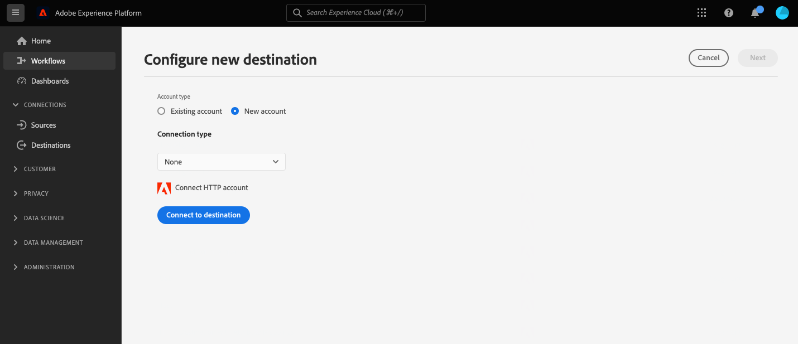
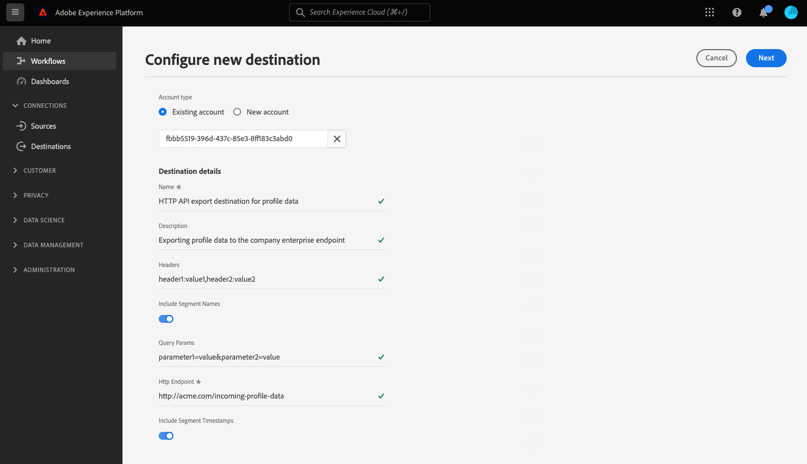

# HTTP API-verbinding

## Overzicht {#overview}

>[!IMPORTANT]
>
> Deze bestemming is beschikbaar slechts aan [ Adobe Real-Time Customer Data Platform Ultimate ](https://helpx.adobe.com/legal/product-descriptions/real-time-customer-data-platform.html) klanten.

De HTTP API-bestemming is een [!DNL Adobe Experience Platform] streamingbestemming die u helpt profielgegevens naar HTTP-eindpunten van derden te verzenden.

Om profielgegevens naar eindpunten van HTTP te verzenden, moet u eerst [ met de bestemming ](#connect-destination) in [!DNL Adobe Experience Platform] verbinden.

## Gebruiksscenario’s {#use-cases}

Met de HTTP API-bestemming kunt u XDM-profielgegevens en -publiek exporteren naar algemene HTTP-eindpunten. Daar kunt u uw eigen analyses uitvoeren of andere bewerkingen uitvoeren die u nodig hebt voor profielgegevens die uit Experience Platform zijn geëxporteerd.

De eindpunten van HTTP kunnen of de systemen van klanten of derdeoplossingen zijn.

## Ondersteunde doelgroepen {#supported-audiences}

In deze sectie wordt beschreven welke soorten publiek u naar dit doel kunt exporteren.

| Oorsprong publiek | Ondersteund | Beschrijving |
|---------|----------|----------|
| [!DNL Segmentation Service] | ✓ | Het publiek produceerde door de Dienst van de Segmentatie van Experience Platform [ ](../../../segmentation/home.md). |
| Aangepaste uploads | ✓ | Het publiek [ ingevoerde ](../../../segmentation/ui/audience-portal.md#import-audience) in Experience Platform van Csv- dossiers. |

{style="table-layout:auto"}

## Type en frequentie exporteren {#export-type-frequency}

Raadpleeg de onderstaande tabel voor informatie over het exporttype en de exportfrequentie van de bestemming.

| Item | Type | Notities |
| ---------|----------|---------|
| Exporttype | **[!UICONTROL Profile-based]** | U exporteert alle leden van een segment, samen met de gewenste schemagebieden (bijvoorbeeld: e-mailadres, telefoonaantal, achternaam), zoals gekozen in het kaartscherm van het [ werkschema van de bestemmingsactivering ](../../ui/activate-segment-streaming-destinations.md#mapping). |
| Exportfrequentie | **[!UICONTROL Streaming]** | Streaming doelen zijn &quot;altijd aan&quot; API-verbindingen. Zodra een profiel in Experience Platform wordt bijgewerkt dat op publieksevaluatie wordt gebaseerd, verzendt de schakelaar de update stroomafwaarts naar het bestemmingsplatform. Lees meer over [ het stromen bestemmingen ](/help/destinations/destination-types.md#streaming-destinations). |

{style="table-layout:auto"}

## Vereisten {#prerequisites}

Als u de HTTP API-bestemming wilt gebruiken om gegevens uit Experience Platform te exporteren, moet u aan de volgende voorwaarden voldoen:

* U moet een eindpunt van HTTP hebben dat REST API steunt.
* Het HTTP-eindpunt moet het Experience Platform-profielschema ondersteunen. Transformatie naar een extern payload-schema wordt niet ondersteund in de HTTP API-bestemming. Verwijs naar de [ uitgevoerde gegevens ](#exported-data) sectie voor een voorbeeld van het de outputschema van Experience Platform.
* Uw eindpunt van HTTP moet kopballen steunen.
* Uw eindpunt van HTTP moet binnen 2 seconden antwoorden om juiste gegevensverwerking te verzekeren en onderbrekingsfouten te vermijden.

>[!TIP]
>
> U kunt [ Adobe Experience Platform Destination SDK ](/help/destinations/destination-sdk/overview.md) aan opstelling ook gebruiken en Experience Platform profielgegevens verzenden naar een eindpunt van HTTP.

## mTLS-protocolondersteuning en -certificaat {#mtls-protocol-support}

U kunt [!DNL Mutual Transport Layer Security] ([!DNL mTLS]) gebruiken om verbeterde veiligheid in uitgaande verbindingen aan uw HTTP API bestemmingsverbindingen te verzekeren.

[!DNL mTLS] is een end-to-end veiligheidsmethode voor wederzijdse authentificatie die ervoor zorgt dat beide partijen die informatie delen wie zij beweren te zijn alvorens de gegevens worden gedeeld. [!DNL mTLS] bevat een extra stap in vergelijking met [!DNL TLS] , waarin de server ook om het certificaat van de client vraagt en dit aan het einde verifieert.

Als u [!DNL mTLS] met [!DNL HTTP API] bestemmingen wilt gebruiken, moet het serveradres u in de [ bestemmingsdetails ](#destination-details) pagina zetten [!DNL TLS] gehandicapte protocollen hebben en slechts [!DNL mTLS] toegelaten. Als het [!DNL TLS] 1.2 protocol nog op het eindpunt wordt toegelaten, wordt geen certificaat verzonden voor de cliëntauthentificatie. Dit betekent dat om [!DNL mTLS] met uw [!DNL HTTP API] bestemming te gebruiken, uw &quot;ontvangende&quot;servereindpunt een [!DNL mTLS] - slechts toegelaten verbindingspunt moet zijn.

### Certificaatdetails ophalen en inspecteren {#certificate}

Als u certificaatdetails zoals [!DNL Common Name] (CN) en [!DNL Subject Alternative Names] (SAN) voor extra derdebevestiging wilt inspecteren, gebruik API om het certificaat terug te winnen en die gebieden uit de reactie te halen.

Zie de [ openbare documentatie van het certificaateindpunt ](../../../data-governance/mtls-api/public-certificate-endpoint.md) voor meer informatie.

## IP adres lijst van gewenste personen {#ip-address-allowlist}

Experience Platform biedt een lijst met statische IP&#39;s die u voor de HTTP API-bestemming kunt lijsten van gewenste personen om aan de beveiligings- en compatibiliteitseisen van klanten te voldoen. Verwijs naar [ IP adreslijst van gewenste personen voor het stromen bestemmingen ](/help/destinations/catalog/streaming/ip-address-allow-list.md) voor de volledige lijst van IPs aan lijst van gewenste personen.

## Ondersteunde verificatietypen {#supported-authentication-types}

De HTTP API bestemming steunt verscheidene authentificatietypen aan uw eindpunt van HTTP:

* HTTP-eindpunt zonder verificatie;
* Toekenning aan toonder;
* [ OAuth 2.0 cliëntgeloofsbrieven ](https://www.oauth.com/oauth2-servers/access-tokens/client-credentials/) authentificatie met de lichaamvorm, met [!DNL client ID], [!DNL client secret], en [!DNL grant type] in het lichaam van het HTTP- verzoek, zoals aangetoond in het voorbeeld hieronder.

```shell
curl --location --request POST '<YOUR_API_ENDPOINT>' \
--header 'Content-Type: application/x-www-form-urlencoded' \
--data-urlencode 'grant_type=client_credentials' \
--data-urlencode 'client_id=<CLIENT_ID>' \
--data-urlencode 'client_secret=<CLIENT_SECRET>'
```

* [ OAuth 2.0 cliëntgeloofsbrieven ](https://www.oauth.com/oauth2-servers/access-tokens/client-credentials/) met basisvergunning, met een vergunningskopbal die URL-Gecodeerde [!DNL client ID] en [!DNL client secret] bevat.

```shell
curl --location --request POST 'https://some-api.com/token' \
--header 'Authorization: Basic base64(clientId:clientSecret)' \
--header 'Content-type: application/x-www-form-urlencoded; charset=UTF-8' \
--data-urlencode 'grant_type=client_credentials'
```

* [ OAuth 2.0 wachtwoordsubsidie ](https://www.oauth.com/oauth2-servers/access-tokens/password-grant/).

## Verbinden met de bestemming {#connect-destination}

>[!IMPORTANT]
> 
>Om met de bestemming te verbinden, hebt u **[!UICONTROL View Destinations]** en **[!UICONTROL Manage Destinations]** [ toegangsbeheertoestemmingen ](/help/access-control/home.md#permissions) nodig. Lees het [ overzicht van de toegangscontrole ](/help/access-control/ui/overview.md) of contacteer uw productbeheerder om de vereiste toestemmingen te verkrijgen.

Om met deze bestemming te verbinden, volg de stappen die in het [ leerprogramma van de bestemmingsconfiguratie ](../../ui/connect-destination.md) worden beschreven. Wanneer u verbinding maakt met dit doel, moet u de volgende informatie opgeven:

### Verificatiegegevens {#authentication-information}

>[!CONTEXTUALHELP]
>id="platform_destinations_connect_http_clientcredentialstype"
>title="Type clientgegevens"
>abstract="Selecteer **Gecodeerde Vorm van het Lichaam** om cliëntidentiteitskaart en cliëntgeheim in het lichaam van het verzoek te omvatten of **Basisvergunning** om cliëntidentiteitskaart en cliëntgeheim in een vergunningskopbal te omvatten. Voorbeelden weergeven in de documentatie."

#### Toekennerverificatie {#bearer-token-authentication}

Als u het verificatietype **[!UICONTROL Bearer token]** selecteert om verbinding te maken met het HTTP-eindpunt, voert u de onderstaande velden in en selecteert u **[!UICONTROL Connect to destination]** :


* **[!UICONTROL Bearer token]**: voeg het token voor toonder in om te verifiëren bij uw HTTP-locatie.

#### Geen verificatie {#no-authentication}

Als u het verificatietype **[!UICONTROL None]** selecteert om verbinding te maken met het HTTP-eindpunt:



Wanneer u deze verificatie opent, hoeft u alleen **[!UICONTROL Connect to destination]** te selecteren en de verbinding met het eindpunt tot stand te brengen.

#### OAuth 2 Password authentication {#oauth-2-password-authentication}

Als u het verificatietype **[!UICONTROL OAuth 2 Password]** selecteert om verbinding te maken met het HTTP-eindpunt, voert u de onderstaande velden in en selecteert u **[!UICONTROL Connect to destination]** :


* **[!UICONTROL Access Token URL]**: De URL aan uw zijde die toegangstokens uitgeeft en, naar keuze, tokens vernieuwt.
* **[!UICONTROL Client ID]**: De [!DNL client ID] die uw systeem toewijst aan Adobe Experience Platform.
* **[!UICONTROL Client Secret]**: De [!DNL client secret] die uw systeem toewijst aan Adobe Experience Platform.
* **[!UICONTROL Username]**: De gebruikersnaam die toegang geeft tot het HTTP-eindpunt.
* **[!UICONTROL Password]**: Het wachtwoord om tot uw eindpunt van HTTP toegang te hebben.

#### OAuth 2 Client Credentials-verificatie {#oauth-2-client-credentials-authentication}

Als u het verificatietype **[!UICONTROL OAuth 2 Client Credentials]** selecteert om verbinding te maken met het HTTP-eindpunt, voert u de onderstaande velden in en selecteert u **[!UICONTROL Connect to destination]** :


>[!WARNING]
> 
>Als u [!UICONTROL OAuth 2 Client Credentials] -verificatie gebruikt, kan [!UICONTROL Access Token URL] maximaal één queryparameter hebben. Het toevoegen van een [!UICONTROL Access Token URL] met meer vraagparameters kan tot problemen leiden wanneer het verbinden met uw eindpunt.

* **[!UICONTROL Access Token URL]**: De URL aan uw zijde die toegangstokens uitgeeft en, naar keuze, tokens vernieuwt.
* **[!UICONTROL Client ID]**: De [!DNL client ID] die uw systeem toewijst aan Adobe Experience Platform.
* **[!UICONTROL Client Secret]**: De [!DNL client secret] die uw systeem toewijst aan Adobe Experience Platform.
* **[!UICONTROL Client Credentials Type]**: Selecteer het type OAuth2 Client Credentials gift die door uw eindpunt wordt gesteund:
   * **[!UICONTROL Body Form Encoded]**: In dit geval, zijn [!DNL client ID] en [!DNL client secret] inbegrepen *in het lichaam van het verzoek* dat naar uw bestemming wordt verzonden. Bij een voorbeeld, zie de [ Ondersteunde authentificatietypen ](#supported-authentication-types) sectie.
   * **[!UICONTROL Basic Authorization]**: In dit geval, zijn [!DNL client ID] en [!DNL client secret] inbegrepen *in een `Authorization` kopbal* na het worden base64 gecodeerd en verzonden naar uw bestemming. Bij een voorbeeld, zie de [ Ondersteunde authentificatietypen ](#supported-authentication-types) sectie.

### Doelgegevens invullen {#destination-details}

>[!CONTEXTUALHELP]
>id="platform_destinations_connect_http_headers"
>title="Kopteksten"
>abstract="Voer aangepaste kopteksten in die u in de doelaanroepen wilt opnemen, in de volgende notatie: `header1:value1,header2:value2,...headerN:valueN`"

>[!CONTEXTUALHELP]
>id="platform_destinations_connect_http_endpoint"
>title="HTTP-eindpunt"
>abstract="De URL van het HTTP-eindpunt waarnaar u de profielgegevens wilt verzenden."

>[!CONTEXTUALHELP]
>id="platform_destinations_connect_http_includesegmentnames"
>title="Segmentnamen opnemen"
>abstract="Schakel deze optie in als u wilt dat bij het exporteren van de gegevens de namen worden opgenomen van het publiek dat u exporteert. Bekijk de documentatie voor een voorbeeld van de gegevensuitvoer met deze optie geselecteerd."

>[!CONTEXTUALHELP]
>id="platform_destinations_connect_http_includesegmenttimestamps"
>title="Tijdstempels segment opnemen"
>abstract="Schakel deze optie in als u wilt dat bij het exporteren van de gegevens de UNIX-tijdstempel wordt opgenomen wanneer het publiek is gemaakt en bijgewerkt, en ook de UNIX-tijdstempel wanneer het publiek voor activering aan de bestemming is toegewezen. Bekijk de documentatie voor een voorbeeld van de gegevensuitvoer met deze optie geselecteerd."

>[!CONTEXTUALHELP]
>id="platform_destinations_connect_http_queryparameters"
>title="Zoekparameters"
>abstract="Naar keuze, kunt u vraagparameters aan het eindpunt URL van HTTP toevoegen. Maak de queryparameters die u op deze manier gebruikt op: `parameter1=value&parameter2=value` ."

Als u details voor de bestemming wilt configureren, vult u de vereiste en optionele velden hieronder in. Een sterretje naast een veld in de gebruikersinterface geeft aan dat het veld verplicht is.



* **[!UICONTROL Name]**: voer een naam in waarmee u dit doel in de toekomst wilt herkennen.
* **[!UICONTROL Description]**: voer een beschrijving in die u helpt deze bestemming in de toekomst te identificeren.
* **[!UICONTROL Headers]**: ga om het even welke douanekopballen in die u in de bestemmingsvraag wilt worden omvat, die dit formaat volgen: `header1:value1,header2:value2,...headerN:valueN`.
* **[!UICONTROL HTTP Endpoint]**: De URL van het HTTP-eindpunt waarnaar u de profielgegevens wilt verzenden.
* **[!UICONTROL Query parameters]**: U kunt optioneel queryparameters toevoegen aan de URL van het HTTP-eindpunt. Maak de queryparameters die u op deze manier gebruikt op: `parameter1=value&parameter2=value` .
* **[!UICONTROL Include Segment Names]**: in-/uitschakelen als u wilt dat bij het exporteren van de gegevens de namen worden opgenomen van het publiek dat u exporteert. **Nota**: De namen van het segment zijn slechts inbegrepen voor segmenten die aan de bestemming in kaart worden gebracht. Niet-toegewezen segmenten die in het exportbestand worden weergegeven, bevatten niet het veld `name` . Voor een voorbeeld van een gegevens die met deze geselecteerde optie uitvoeren, verwijs naar de [ Uitgevoerde gegevens ](#exported-data) sectie verder hieronder.
* **[!UICONTROL Include Segment Timestamps]**: Schakel deze optie in als u wilt dat bij het exporteren van de gegevens de UNIX-tijdstempel wordt gebruikt wanneer het publiek is gemaakt en bijgewerkt, en ook de UNIX-tijdstempel wanneer het publiek voor activering is toegewezen aan het doel. Voor een voorbeeld van een gegevens die met deze geselecteerde optie uitvoeren, verwijs naar de [ Uitgevoerde gegevens ](#exported-data) sectie verder hieronder.

### Waarschuwingen inschakelen {#enable-alerts}

U kunt alarm toelaten om berichten over de status van dataflow aan uw bestemming te ontvangen. Selecteer een waarschuwing in de lijst om u te abonneren op meldingen over de status van uw gegevensstroom. Voor meer informatie over alarm, zie de gids bij [ het intekenen aan bestemmingsalarm gebruikend UI ](../../ui/alerts.md).

Wanneer u klaar bent met het opgeven van details voor uw doelverbinding, selecteert u **[!UICONTROL Next]** .

## Soorten publiek naar dit doel activeren {#activate}

>[!IMPORTANT]
> 
>* Om gegevens te activeren, hebt u **[!UICONTROL View Destinations]**, **[!UICONTROL Activate Destinations]**, **[!UICONTROL View Profiles]**, en **[!UICONTROL View Segments]** [ toegangsbeheertoestemmingen ](/help/access-control/home.md#permissions) nodig. Lees het [ overzicht van de toegangscontrole ](/help/access-control/ui/overview.md) of contacteer uw productbeheerder om de vereiste toestemmingen te verkrijgen.
>* [ de beleidsevaluatie van de Goedkeuring ](/help/data-governance/enforcement/auto-enforcement.md#consent-policy-evaluation) wordt momenteel niet gesteund in de uitvoer naar de bestemming van HTTP API. [Meer informatie](/help/destinations/ui/activate-streaming-profile-destinations.md#consent-policy-evaluation).

Zie [ publieksgegevens aan het stromen van profieluitvoer bestemmingen ](../../ui/activate-streaming-profile-destinations.md) voor instructies op het activeren van publiek aan deze bestemming activeren.

### Doelkenmerken {#attributes}

In de [[!UICONTROL Select attributes]](../../ui/activate-streaming-profile-destinations.md#select-attributes) stap, adviseert Adobe dat u een uniek herkenningsteken van uw [ verenigingsschema ](../../../profile/home.md#profile-fragments-and-union-schemas) selecteert. Selecteer de unieke id en andere XDM-velden die u naar het doel wilt exporteren.

## Exportgedrag profiel {#profile-export-behavior}

Experience Platform optimaliseert het gedrag voor het exporteren van profielen naar uw HTTP API-bestemming, zodat alleen gegevens naar uw API-eindpunt worden geëxporteerd wanneer relevante updates naar een profiel zijn opgetreden na de kwalificatie van het publiek of andere belangrijke gebeurtenissen. In de volgende situaties worden profielen naar uw doel geëxporteerd:

* De profielupdate werd bepaald door een wijziging in het publiekslidmaatschap voor ten minste een van de doelgroepen. Het profiel is bijvoorbeeld gekwalificeerd voor een van de soorten publiek die aan de bestemming zijn toegewezen of heeft een van de soorten publiek afgesloten die aan de bestemming zijn toegewezen.
* De profielupdate werd bepaald door een verandering in de [ identiteitskaart ](/help/xdm/field-groups/profile/identitymap.md). Een profiel dat bijvoorbeeld al was gekwalificeerd voor een van de soorten publiek dat aan de bestemming is toegewezen, is toegevoegd aan een nieuwe identiteit in het kenmerk Naamplaatje.
* De profielupdate is bepaald door een wijziging in kenmerken voor ten minste een van de kenmerken die aan de bestemming zijn toegewezen. Een van de kenmerken die in de toewijzingsstap aan het doel is toegewezen, wordt bijvoorbeeld aan een profiel toegevoegd.

In alle hierboven beschreven gevallen worden alleen de profielen waarin relevante updates zijn opgetreden, naar uw bestemming geëxporteerd. Bijvoorbeeld, als een publiek dat aan de bestemmingsstroom in kaart wordt gebracht honderd leden heeft, en vijf nieuwe profielen voor het segment kwalificeren, is de uitvoer naar uw bestemming incrementeel en omvat slechts de vijf nieuwe profielen.

Alle toegewezen kenmerken worden geëxporteerd voor een profiel, ongeacht de locatie van de wijzigingen. In het voorbeeld hierboven worden alle toegewezen kenmerken voor deze vijf nieuwe profielen geëxporteerd, zelfs als de kenmerken zelf niet zijn gewijzigd.

### Wat bepaalt een gegevensexport en wat wordt opgenomen in de export? {#what-determines-export-what-is-included}

Met betrekking tot het gegeven dat voor een bepaald profiel wordt uitgevoerd, is het belangrijk om de twee verschillende concepten *te begrijpen wat een gegevensuitvoer aan uw bestemming van HTTP API* en *bepaalt welke gegevens in de uitvoer* inbegrepen zijn.

| Wat bepaalt de doelexport | Wat is inbegrepen in de doelexport |
|---------|----------|
| <ul><li>Toegewezen kenmerken en segmenten fungeren als actiepunt voor het exporteren van een bestemming. Dit betekent dat als de `segmentMembership` -status van een profiel verandert in `realized` of `exiting` of als toegewezen kenmerken worden bijgewerkt, een doelexport wordt uitgeschakeld.</li><li>Omdat identiteiten momenteel niet aan de bestemmingen van HTTP kunnen worden in kaart gebracht API, bepalen de veranderingen in om het even welke identiteit op een bepaald profiel ook bestemmingsuitvoer.</li><li>Een wijziging voor een kenmerk wordt gedefinieerd als een update voor het kenmerk, ongeacht of het dezelfde waarde heeft of niet. Dit houdt in dat een overschrijven van een kenmerk als een wijziging wordt beschouwd, zelfs als de waarde zelf niet is gewijzigd.</li></ul> | <ul><li>Het `segmentMembership` -object bevat het segment dat is toegewezen in de activeringsgegevensstroom, waarvoor de status van het profiel is gewijzigd na een kwalificatie- of segmentafsluitgebeurtenis. Merk op dat andere unmapped segmenten waarvoor het profiel dat voor wordt gekwalificeerd deel van de bestemmingsuitvoer kan uitmaken, als deze segmenten tot het zelfde [ fusiebeleid ](/help/profile/merge-policies/overview.md) behoren zoals het segment in kaart gebracht in activeringsdataflow. <br> **Belangrijk**: Wanneer de **[!UICONTROL Include Segment Names]** optie wordt toegelaten, zijn de segmentnamen slechts inbegrepen voor segmenten die aan de bestemming in kaart worden gebracht. Niet-toegewezen segmenten die in het exportbestand worden weergegeven, bevatten het veld `name` niet, zelfs niet als de optie is ingeschakeld. </li><li>Alle identiteiten in het `identityMap` -object worden ook opgenomen (Experience Platform ondersteunt momenteel geen identiteitstoewijzing in de HTTP API-bestemming).</li><li>Alleen de toegewezen kenmerken worden opgenomen in de doelexport.</li></ul> |

{style="table-layout:fixed"}

Bijvoorbeeld, overweeg dit dataflow aan een bestemming van HTTP waar drie publiek in dataflow wordt geselecteerd, en vier attributen worden in kaart gebracht aan de bestemming.


Een profieluitvoer naar de bestemming kan door een profiel worden bepaald dat voor of het weggaan van één van *drie in kaart gebrachte segmenten* in aanmerking komt. Nochtans, in de gegevensuitvoer, in het `segmentMembership` voorwerp (zie [ Uitgevoerde Gegevens ](#exported-data) sectie hieronder), zouden andere niet in kaart gebrachte toehoorders kunnen verschijnen, als dat bepaalde profiel een lid van hen is en als deze het zelfde fusiebeleid zoals het publiek delen dat de uitvoer teweegbracht. Als een profiel voor de **Klant met DeLorean Cars** segment maar ook een lid van het **Gecontroleerde &quot;Terug naar de Toekomstige&quot;** film en **de de fictiefondsen van de Wetenschap** segmenten kwalificeert, dan zullen deze andere twee publiek ook in het `segmentMembership` voorwerp van de gegevensuitvoer aanwezig zijn, alhoewel deze niet in dataflow worden in kaart gebracht, als deze zelfde samenvoegingsbeleid delen met de **Klant met het segment van de AutoAuto&#39;s van DeLorean**.

Vanuit het oogpunt van profielkenmerken bepalen wijzigingen in de vier bovenstaande kenmerken de doelexport en zijn alle vier toegewezen kenmerken in het profiel aanwezig in de gegevensexport.

## Back-up van historische gegevens {#historical-data-backfill}

Wanneer u een nieuw publiek aan een bestaande bestemming toevoegt, of wanneer u een nieuw doel creeert en een publiek in kaart brengt aan het, exporteert Experience Platform historische publiekskwalificatiegegevens naar de bestemming. Profielen die voor het publiek *kwalificeerden alvorens* het publiek aan de bestemming werd toegevoegd worden uitgevoerd naar de bestemming binnen ongeveer één uur.

## Geëxporteerde gegevens {#exported-data}

De geëxporteerde [!DNL Experience Platform] gegevens worden in JSON-indeling in uw [!DNL HTTP] -doel geplaatst. Bijvoorbeeld, bevat de hieronder uitvoer een profiel dat voor een bepaald segment heeft gekwalificeerd, een lid van andere twee segmenten is, en een ander segment verliet. Het exporteren bevat ook de voornaam, achternaam, geboortedatum en het persoonlijke e-mailadres van het profielkenmerk. De identiteiten voor dit profiel zijn ECID en e-mail.

```json
{
  "person": {
    "birthDate": "YYYY-MM-DD",
    "name": {
      "firstName": "John",
      "lastName": "Doe"
    }
  },
  "personalEmail": {
    "address": "john.doe@acme.com"
  },
  "segmentMembership": {
   "ups":{
      "7841ba61-23c1-4bb3-a495-00d3g5fe1e93":{
         "lastQualificationTime":"2022-01-11T21:24:39Z",
         "status":"exited"
      },
      "59bd2fkd-3c48-4b18-bf56-4f5c5e6967ae":{
         "lastQualificationTime":"2022-01-02T23:37:33Z",
         "status":"realized"
      },
      "947c1c46-008d-40b0-92ec-3af86eaf41c1":{
         "lastQualificationTime":"2021-08-25T23:37:33Z",
         "status":"realized"
      },
      "5114d758-ce71-43ba-b53e-e2a91d67b67f":{
         "lastQualificationTime":"2022-01-11T23:37:33Z",
         "status":"realized"
      }
   }
},
  "identityMap": {
    "ecid": [
      {
        "id": "14575006536349286404619648085736425115"
      },
      {
        "id": "66478888669296734530114754794777368480"
      }
    ],
    "email_lc_sha256": [
      {
        "id": "655332b5fa2aea4498bf7a290cff017cb4"
      },
      {
        "id": "66baf76ef9de8b42df8903f00e0e3dc0b7"
      }
    ]
  }
}
```

Hieronder vindt u meer voorbeelden van geëxporteerde gegevens, afhankelijk van de UI-instellingen die u hebt geselecteerd in de doelstroom voor verbinden voor de opties **[!UICONTROL Include Segment Names]** en **[!UICONTROL Include Segment Timestamps]** :

+++ In het onderstaande voorbeeld voor het exporteren van gegevens worden publieksnamen opgenomen in de sectie `segmentMembership`

```json
"segmentMembership": {
        "ups": {
          "5b998cb9-9488-4ec3-8d95-fa8338ced490": {
            "lastQualificationTime": "2019-04-15T02:41:50+0000",
            "status": "realized",
            "createdAt": 1648553325000,
            "updatedAt": 1648553330000,
            "mappingCreatedAt": 1649856570000,
            "mappingUpdatedAt": 1649856570000,
            "name": "First name equals John"
          },
          "354e086f-2e11-49a2-9e39-e5d9a76be683": {
            "lastQualificationTime": "2020-04-15T02:41:50+0000",
            "status": "realized"
          }
        }
      }
```

**Nota**: In dit voorbeeld, wordt het eerste segment (`5b998cb9-9488-4ec3-8d95-fa8338ced490`) in kaart gebracht aan de bestemming en omvat het `name` gebied. Het tweede segment (`354e086f-2e11-49a2-9e39-e5d9a76be683`) wordt niet toegewezen aan het doel en bevat niet het veld `name` , ook al is de optie **[!UICONTROL Include Segment Names]** wel ingeschakeld.

+++

+++ Het onderstaande voorbeeld voor het exporteren van gegevens bevat tijdstempels voor het publiek in de sectie `segmentMembership`

```json
"segmentMembership": {
        "ups": {
          "5b998cb9-9488-4ec3-8d95-fa8338ced490": {
            "lastQualificationTime": "2019-04-15T02:41:50+0000",
            "status": "realized",
            "createdAt": 1648553325000,
            "updatedAt": 1648553330000,
            "mappingCreatedAt": 1649856570000,
            "mappingUpdatedAt": 1649856570000,
          }
        }
      }
```

+++

## Beperkingen en beleid opnieuw proberen {#limits-retry-policy}

In 95 percent van de tijd, probeert Experience Platform om een productietolerantie van minder dan 10 minuten voor met succes verzonden berichten met een tarief van minder dan 10.000 verzoeken per seconde voor elke dataflow aan een bestemming van HTTP aan te bieden.

In het geval van mislukte verzoeken aan uw bestemming van HTTP API, slaat Experience Platform de ontbroken verzoeken op en probeert tweemaal om de verzoeken naar uw eindpunt te verzenden.

## Problemen oplossen {#troubleshooting}

Om betrouwbare gegevenslevering te verzekeren en onderbrekingskwesties te vermijden zorg ervoor dat uw eindpunt van HTTP binnen 2 seconden aan Experience Platform verzoeken antwoordt, zoals die in de [ eerste vereisten ](#prerequisites) sectie worden gespecificeerd. Reacties die langer duren, resulteren in time-outfouten.
