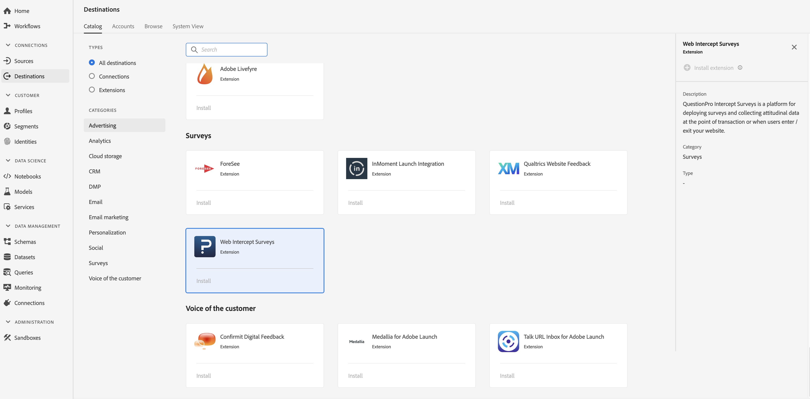

# [!DNL QuestionPro Intercept Surveys] extension  {#questionpro-extension}

## Overzicht {#overview}

[!DNL QuestionPro Intercept Surveys] is een platform voor het opstellen van enquêtes en het verzamelen van attitudegegevens op het punt van transactie of wanneer de gebruikers uw website betreden/verlaten.

[!DNL QuestionPro Intercept Surveys] is een enquêteextensie in Adobe Experience Platform. Voor meer informatie over de uitbreidingsfunctionaliteit, zie de uitbreidingspagina op [Adobe Uitwisseling](https://exchange.adobe.com/experiencecloud.details.90096.questionpro-surveys.html).

Dit doel is een Adobe Experience Platform Launch-extensie. Voor meer informatie over hoe de uitbreidingen van de Platform launch in Platform werken, zie [overzicht van de uitbreidingen van Adobe Experience Platform Launch](../launch-extensions/overview.md).

## Vereisten {#prerequisites}

Deze extensie is beschikbaar in de catalogus [!DNL Destinations] voor alle klanten die Platform hebben aangeschaft.

Als u deze extensie wilt gebruiken, hebt u toegang tot Adobe Experience Platform Launch nodig. platform launch wordt aan Adobe Experience Cloud-klanten aangeboden als een inbegrepen, waardetoevoegend element. Neem contact op met de systeembeheerder van uw organisatie om toegang tot de Platform launch te krijgen en vraag hen om u de **[!UICONTROL manage_properties]** toestemming te verlenen zodat u extensies kunt installeren.

## Extensie {#install-extension} installeren

De extensie [!DNL QuestionPro Intercept Surveys] installeren:

Ga in [Platform interface](http://platform.adobe.com/) naar **[!UICONTROL Destinations]** > **[!UICONTROL Catalog]**.

Selecteer de extensie in de catalogus of gebruik de zoekbalk.

Klik op de bestemming om deze te markeren en selecteer **[!UICONTROL Configure]** in de rechtertrack. Als het **[!UICONTROL Configure]** besturingselement grijs is, ontbreekt u de **[!UICONTROL manage_properties]** toestemming. Zie [Eerste vereisten](#prerequisites).

Selecteer in het venster **[!UICONTROL Select available Platform Launch property]** de eigenschap Platform launch waarin u de extensie wilt installeren. U kunt ook een nieuwe eigenschap maken in de Platform launch. Een bezit is een inzameling van regels, gegevenselementen, gevormde uitbreidingen, milieu&#39;s, en bibliotheken. Meer informatie over eigenschappen vindt u in de sectie [Eigenschappen op de pagina](https://experienceleague.adobe.com/docs/launch/using/reference/admin/companies-and-properties.html#properties-page) van de documentatie bij Platform launches.

De werkstroom neemt u aan Platform launch om de installatie te voltooien.

Voor informatie over de opties van de uitbreidingsconfiguratie en installatiesteun, zie de [pagina van Enquêtes van het Intercept van Vraag ](https://exchange.adobe.com/experiencecloud.details.90096.questionpro-surveys.html) op de Uitwisseling van Adobe.

U kunt de extensie ook rechtstreeks installeren in de [Adobe Experience Platform Launch-interface](https://launch.adobe.com/). Zie [Een nieuwe extensie toevoegen](https://experienceleague.adobe.com/docs/launch/using/reference/manage-resources/extensions/overview.html?lang=en#add-a-new-extension) in de documentatie van de Platform launch.

## De extensie {#how-to-use} gebruiken

Nadat u de extensie hebt geïnstalleerd, kunt u rechtstreeks in Platform launch regels voor de extensie instellen.

In Platform launch, kunt u opstellingsregels voor uw geïnstalleerde uitbreidingen om gebeurtenisgegevens naar de uitbreidingsbestemming slechts in bepaalde situaties te verzenden. Zie [Documentatie van regels](https://experienceleague.adobe.com/docs/launch/using/reference/manage-resources/rules.html) voor meer informatie over instellingsregels voor uw extensies.

## De uitbreiding {#configure-upgrade-delete} vormen, bevorderen en schrappen

U kunt extensies configureren, upgraden en verwijderen in de interface van de Platform launch.

>[!TIP]
>
>Als de extensie al op een van uw eigenschappen is geïnstalleerd, wordt **[!UICONTROL Install]** voor de extensie nog steeds weergegeven in de interface van het Platform. Kies de installatieworkflow zoals beschreven in [Extensie installeren](#install-extension) om de Platform launch te starten en uw extensie te configureren of te verwijderen.

Om uw uitbreiding te bevorderen, zie [Uitbreiding verbetering](https://experienceleague.adobe.com/docs/launch/using/reference/manage-resources/extensions/extension-upgrade.html) in de documentatie van de Platform launch.