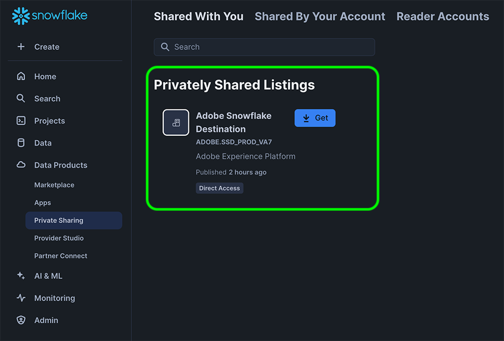
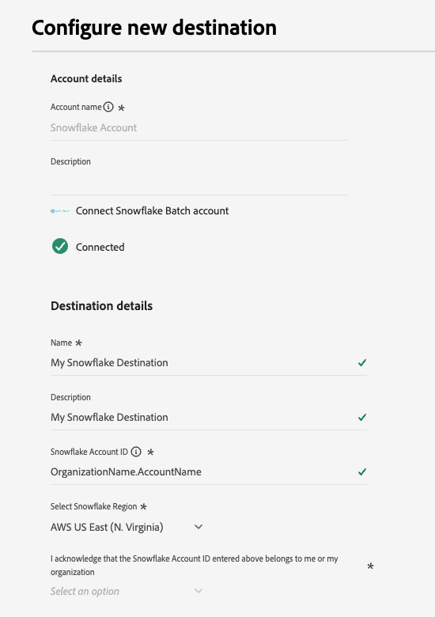
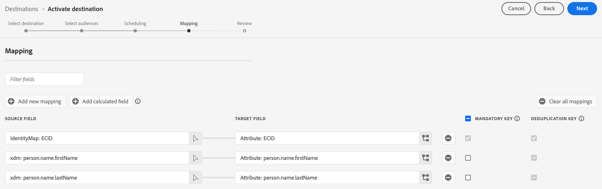
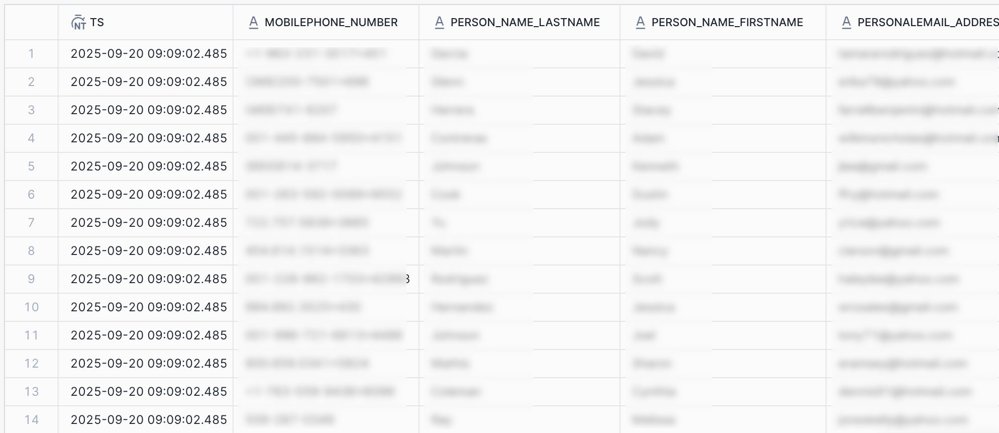

# Snowflake Batch-verbinding {#snowflake-destination}

>[!AVAILABILITY]
>
> Deze bestemming is beschikbaar slechts aan [&#x200B; Adobe Real-Time Customer Data Platform Ultimate &#x200B;](https://helpx.adobe.com/legal/product-descriptions/real-time-customer-data-platform.html) klanten.

## Overzicht {#overview}

Gebruik deze bestemming om publieksgegevens naar dynamische tabellen in uw Snowflake-account te verzenden. Dynamische tabellen bieden toegang tot uw gegevens zonder dat fysieke gegevenskopieën nodig zijn.

Lees de volgende secties om te begrijpen hoe de bestemming van Snowflake werkt en hoe de gegevens tussen Adobe en Snowflake worden overgebracht.

### Hoe Snowflake data sharing werkt {#data-sharing}

Dit doel gebruikt een [!DNL Snowflake] gegevensuitwisseling, wat betekent dat er geen gegevens fysiek worden geëxporteerd of overgebracht naar uw eigen Snowflake-instantie. In plaats daarvan biedt Adobe u alleen-lezentoegang tot een live tabel die wordt gehost in de Snowflake-omgeving van Adobe. U kunt deze gedeelde tabel rechtstreeks vanaf uw Snowflake-account opvragen, maar u hebt geen eigenaar van de tabel en kunt de tabel niet wijzigen of behouden na de opgegeven bewaarperiode. Adobe beheert de levenscyclus en structuur van de gedeelde tabel volledig.

De eerste keer nadat u een gegevensstroom hebt ingesteld van Adobe naar uw Snowflake-account, wordt u gevraagd om de persoonlijke aanbieding van Adobe te accepteren.

### Bewaren van gegevens en Tijd-aan-Levende (TTL) {#ttl}

Alle gegevens die via deze integratie worden gedeeld, hebben een vaste tijd-aan-Levende (TTL) van zeven dagen. Zeven dagen na de laatste uitvoer, verloopt de dynamische lijst automatisch en wordt ontoegankelijk, ongeacht of dataflow nog actief is. Als u de gegevens langer dan zeven dagen moet bewaren, moet u de inhoud in een lijst kopiëren die u in uw eigen instantie van Snowflake bezit alvorens TTL verloopt.

>[!IMPORTANT]
>
>Als u een gegevensstroom verwijdert in Experience Platform, verdwijnt de dynamische tabel van uw Snowflake-account.

### Updategedrag van publiek {#audience-update-behavior}

Als uw publiek op [&#x200B; partijwijze &#x200B;](../../../segmentation/methods/batch-segmentation.md) wordt geëvalueerd, worden de gegevens in de gedeelde lijst verfrist om de 24 uur. Dit betekent dat er een vertraging van maximaal 24 uur kan optreden tussen wijzigingen in het lidmaatschap van het publiek en wanneer deze wijzigingen worden weerspiegeld in de gedeelde tabel.

### Batchgegevensdelingslogica {#batch-data-sharing}

Wanneer een dataflow voor het eerst voor een publiek loopt, voert het backfill uit en deelt het alle momenteel gekwalificeerde profielen. Na deze aanvankelijke backfill, verstrekt de bestemming periodieke momentopnamen van het volledige publiekslidmaatschap. Elke momentopname vervangt de vorige gegevens in de gedeelde lijst, die ervoor zorgt dat u altijd de recentste volledige mening van het publiek zonder historische gegevens ziet.

## Streaming en delen van batchgegevens {#batch-vs-streaming}

Experience Platform verstrekt twee soorten bestemmingen van Snowflake: [&#x200B; Snowflake die &#x200B;](snowflake.md) en [&#x200B; de Partij van Snowflake stromen &#x200B;](snowflake-batch.md) stroomt.

Hoewel beide doelen u toegang geven tot uw gegevens in Snowflake zonder deze fysiek naar uw account te kopiëren, zijn er enkele aanbevolen procedures voor het gebruik van elke connector.

De lijst hieronder zal u helpen beslissen welke schakelaar aan gebruik door de scenario&#39;s te schetsen waar elke gegevens het delen methode het meest aangewezen is.

|  | Kies [&#x200B; Batch van Snowflake &#x200B;](snowflake-batch.md) wanneer u nodig hebt | Kies [&#x200B; Streaming Snowflake &#x200B;](snowflake.md) wanneer u nodig hebt |
|--------|-------------------|----------------------|
| **de frequentie van de Update** | Periodieke momentopnamen | Continue updates in realtime |
| **de presentatie van Gegevens** | Volledige publieksopname die vorige gegevens vervangt | Incrementele updates op basis van profielwijzigingen |
| **het geval van het Gebruik nadruk** | Analytische/ML-werklasten waarbij latentie niet essentieel is | Directe handelingsscenario&#39;s die updates in real time vereisen |
| **het beheer van Gegevens** | Altijd laatste volledige opname bekijken | Incrementele updates op basis van wijzigingen in het publiekslidmaatschap |
| **de scenario&#39;s van het Voorbeeld** | Bedrijfsrapportage, gegevensanalyse, modeltraining in ML | Onderdrukking van marketingcampagnes, realtime personalisatie |

Voor meer informatie over het stromen gegevens die delen, zie de [&#x200B; Snowflake Streaming verbinding &#x200B;](snowflake.md) documentatie.

## Gebruiksscenario&#39;s {#use-cases}

Het delen van batchgegevens is ideaal voor scenario&#39;s waarbij u een volledige momentopname van uw publiek nodig hebt en realtime updates niet vereist zijn, zoals:

* **Analytische werklasten**: Wanneer het uitvoeren van gegevensanalyse, het melden, of bedrijfsintelligentietaken die een volledige mening van publieksenlidmaatschap vereisen
* **machine die werkschema&#39;s** leert: Voor de modellen van opleidingsXML of lopende voorspellende analyse die van volledige publieksmomentopnamen profiteren
* **het entrepot van Gegevens**: Wanneer u een huidig exemplaar van publieksgegevens in uw eigen instantie van Snowflake moet handhaven
* **Periodieke rapportering**: Voor regelmatige zaken die waar u de recentste publieksstaat zonder historische verandering het volgen nodig hebt
* **ETL processen**: Wanneer u publieksgegevens in partijen moet omzetten of verwerken

Het delen van batchgegevens vereenvoudigt gegevensbeheer door volledige momentopnamen te bieden, zodat incrementele updates niet handmatig hoeven te worden beheerd of wijzigingen handmatig moeten worden samengevoegd.

## Vereisten {#prerequisites}

Voordat u uw Snowflake-verbinding configureert, moet u aan de volgende voorwaarden voldoen:

* U hebt toegang tot een [!DNL Snowflake] -account.
* Je Snowflake-account is geabonneerd op privé-aanbiedingen. U of iemand in uw bedrijf die beheerdersrechten voor accounts heeft op Snowflake, kan dit configureren.
* U kent de cloud provider en regio van uw Snowflake-account. U zult allebei moeten ingaan wanneer u met de bestemming verbindt.

Lees de [[!DNL Snowflake]  documentatie &#x200B;](https://docs.snowflake.com/en/collaboration/consumer-listings-access#access-a-private-listing) voor meer informatie over de noodzakelijke toestemmingen.

>[!IMPORTANT]
>
>Deze bestemming steunt geen rekeningen van Snowflake die achter een firewall zijn of die [[!DNL Azure Private Link] &#x200B;](https://docs.snowflake.com/en/user-guide/privatelink-azure) gebruiken.

## Ondersteunde doelgroepen {#supported-audiences}

In deze sectie wordt beschreven welke soorten publiek u naar dit doel kunt exporteren. De twee lijsten hieronder wijzen op welk publiek deze schakelaar steunt, door _kijkoorsprong_ en _profieltypes inbegrepen in het publiek_:

| Oorsprong publiek | Ondersteund | Beschrijving |
|---------|----------|----------|
| [!DNL Segmentation Service] | Ja | Het publiek produceerde door de Dienst van de Segmentatie van Experience Platform [&#x200B; &#x200B;](../../../segmentation/home.md). |
| Alle andere doelgroepen | Ja | Deze categorie omvat alle oorsprong van het publiek buiten het publiek dat via [!DNL Segmentation Service] wordt gegenereerd. Lees over de [&#x200B; diverse publieksoorsprong &#x200B;](/help/segmentation/ui/audience-portal.md#customize). Voorbeelden zijn: <ul><li> de douane uploadt publiek [&#x200B; ingevoerde &#x200B;](../../../segmentation/ui/audience-portal.md#import-audience) in Experience Platform van Csv- dossiers,</li><li> gelijksoortige doelgroepen, </li><li> federaal publiek, </li><li> publiek dat wordt gegenereerd in andere Experience Platform-toepassingen, zoals [!DNL Adobe Journey Optimizer] , </li><li> en meer. </li></ul> |

{style="table-layout:auto"}

Ondersteund publiek per type publieksgegevens:

| Gegevenstype Publiek | Ondersteund | Beschrijving | Gebruiksscenario&#39;s |
|--------------------|-----------|-------------|-----------|
| [&#x200B; het publiek van Mensen &#x200B;](/help/segmentation/types/people-audiences.md) | Ja | Gebaseerd op klantenprofielen, die u toestaan om specifieke groepen mensen voor marketing campagnes te richten. | Frequente kopers, winkeliers |
| [&#x200B; publiek van de Rekening &#x200B;](/help/segmentation/types/account-audiences.md) | Nee | Doelpersonen binnen specifieke organisaties voor marketingstrategieën op basis van account. | B2B-marketing |
| [&#x200B; Het publiek van het Vooruitzicht &#x200B;](/help/segmentation/types/prospect-audiences.md) | Nee | De individuen van het doel die nog geen klanten zijn maar eigenschappen met uw doelpubliek delen. | Waarschuwing met gegevens van derden |
| [&#x200B; de uitvoer van de Dataset &#x200B;](/help/catalog/datasets/overview.md) | Nee | Verzamelingen gestructureerde gegevens die zijn opgeslagen in het [!DNL Adobe Experience Platform] Data Lake. | Rapportage, workflows voor gegevenswetenschap |

{style="table-layout:auto"}

## Type en frequentie exporteren {#export-type-frequency}

Raadpleeg de onderstaande tabel voor informatie over het exporttype en de exportfrequentie van de bestemming.

| Item | Type | Notities |
|---------|----------|---------|
| Exporttype | **[!UICONTROL Audience export]** | U exporteert alle leden van een publiek met de id&#39;s (naam, telefoonnummer of andere) die in de [!DNL Snowflake] -bestemming worden gebruikt. |
| Exportfrequentie | **[!UICONTROL Batch]** | Deze bestemming verstrekt periodieke momentopnamen van volledig publiekslidmaatschap door de gegevens van Snowflake te delen. Elke momentopname vervangt de vorige gegevens, die ervoor zorgen u altijd de recentste volledige mening van uw publiek hebt. |

{style="table-layout:auto"}

## Verbinden met de bestemming {#connect}

>[!IMPORTANT]
>
>Om met de bestemming te verbinden, hebt u **[!UICONTROL View Destinations]** en **[!UICONTROL Manage Destinations]** [&#x200B; toegangsbeheertoestemmingen &#x200B;](/help/access-control/home.md#permissions) nodig. Lees het [&#x200B; overzicht van de toegangscontrole &#x200B;](/help/access-control/ui/overview.md) of contacteer uw productbeheerder om de vereiste toestemmingen te verkrijgen.

Om met deze bestemming te verbinden, volg de stappen die in het [&#x200B; leerprogramma van de bestemmingsconfiguratie &#x200B;](../../ui/connect-destination.md) worden beschreven. In vormen bestemmingswerkschema, vul de gebieden in die in de twee hieronder secties worden vermeld.

### Verifiëren voor bestemming {#authenticate}

Selecteer **[!UICONTROL Connect to destination]** en geef een accountnaam en (optioneel) een accountbeschrijving op om de account bij de bestemming te verifiëren.

 voor authentiek te verklaren tonen

### Doelgegevens invullen {#destination-details}

>[!CONTEXTUALHELP]
>id="platform_destinations_snowflake_batch_accountid"
>title="Voer uw Snowflake Data Sharing Account Identifier in"
>abstract="Als uw account aan een organisatie is gekoppeld, gebruikt u deze indeling: `OrganizationName.AccountName`   Als uw account niet aan een organisatie is gekoppeld, gebruikt u deze indeling: `AccountName`"

Als u details voor de bestemming wilt configureren, vult u de vereiste en optionele velden hieronder in. Een sterretje naast een veld in de gebruikersinterface geeft aan dat het veld verplicht is.

 tonen

* **[!UICONTROL Name]**: Een naam waarmee u dit doel in de toekomst herkent.
* **[!UICONTROL Description]**: Een beschrijving die u zal helpen deze bestemming in de toekomst identificeren.
* **[!UICONTROL Snowflake Account ID]**: Uw [&#x200B; Gegevens delend het Herkenningsteken van de Rekening van Snowflake &#x200B;](https://docs.snowflake.com/en/user-guide/admin-account-identifier#label-account-name-data-sharing). Gebruik de volgende indeling, afhankelijk van of uw account is gekoppeld aan een organisatie:
   * Als uw rekening met een organisatie verbonden is: ga de organisatienaam en de rekeningsnaam in die door a **wordt gescheiden periode** (`.`). Als uw organisatienaam bijvoorbeeld ACME is en uw accountnaam AsiaRegion is, voert u `ACME.AsiaRegion` in.
   * Als uw account niet aan een organisatie is gekoppeld: `AccountName`.
* **[!UICONTROL Snowflake Region]**: selecteer het gebied waar uw Snowflake-instantie is ingericht. Zie de documentatie van Snowflake [&#x200B; &#x200B;](https://docs.snowflake.com/en/user-guide/intro-regions) voor gedetailleerde informatie over gesteunde wolkengebieden.
* **[!UICONTROL Account acknowledgment]**: Nadat u **[!UICONTROL Snowflake Account ID]** hebt ingevoerd, selecteert u **[!UICONTROL Yes]** in dit vervolgkeuzemenu om te bevestigen dat de **[!UICONTROL Snowflake Account ID]** correct is en dat deze van u is.

>[!NOTE]
>
> **[!UICONTROL Snowflake Account ID]** en **[!UICONTROL Snowflake Region]** kunnen niet door [&#x200B; worden uitgegeven bestemmings &#x200B;](../../ui/edit-destination.md) werkschema nadat u de bestemming creeert. Om verschillende rekening of gebiedswaarden te gebruiken, [&#x200B; creeer een nieuwe bestemmingsverbinding &#x200B;](../../ui/connect-destination.md).

>[!IMPORTANT]
>
> Speciale tekens die worden gebruikt in de doelnaam en de naam van de Experience Platform-sandbox worden automatisch omgezet in onderstrepingstekens (`_`) in Snowflake. Gebruik geen speciale tekens in de naam van het doel en de sandbox om verwarring te voorkomen.

### Waarschuwingen inschakelen {#enable-alerts}

U kunt alarm toelaten om berichten over de status van dataflow aan uw bestemming te ontvangen. Selecteer een waarschuwing in de lijst om u te abonneren op meldingen over de status van uw gegevensstroom. Voor meer informatie over alarm, lees de gids over [&#x200B; het intekenen aan bestemmingsalarm gebruikend UI &#x200B;](../../ui/alerts.md).

Wanneer u klaar bent met het opgeven van details voor uw doelverbinding, selecteert u **[!UICONTROL Next]** .

## Soorten publiek naar dit doel activeren {#activate}

>[!IMPORTANT]
>
>* Om gegevens te activeren, hebt u **[!UICONTROL View Destinations]**, **[!UICONTROL Activate Destinations]**, **[!UICONTROL View Profiles]**, en **[!UICONTROL View Segments]** [&#x200B; toegangsbeheertoestemmingen &#x200B;](/help/access-control/home.md#permissions) nodig. Lees het [&#x200B; overzicht van de toegangscontrole &#x200B;](/help/access-control/ui/overview.md) of contacteer uw productbeheerder om de vereiste toestemmingen te verkrijgen.
>* Om *identiteiten* uit te voeren, hebt u de **[!UICONTROL View Identity Graph]** [&#x200B; toegangsbeheertoestemming &#x200B;](/help/access-control/home.md#permissions) nodig.   {width="100" zoomable="yes"}

Lees [&#x200B; activeer publieksgegevens aan de uitvoerbestemmingen van het partijprofiel &#x200B;](/help/destinations/ui/activate-batch-profile-destinations.md) voor instructies bij het activeren van publiek aan deze bestemming.

### Kenmerken Kaart {#map}

U kunt identiteiten en profielkenmerken naar dit doel exporteren.

U kunt de [&#x200B; berekende gebiedscontrole &#x200B;](../../ui/data-transformations-calculated-fields.md) gebruiken om verrichtingen op series uit te voeren en uit te voeren.

De doelkenmerken worden automatisch in Snowflake gemaakt met de kenmerknaam die u in het veld **[!UICONTROL Attribute name]** opgeeft.

## Geëxporteerde gegevens/Gegevens valideren bij exporteren {#exported-data}

De gegevens worden via een dynamische tabel gefaseerd opgeslagen in uw Snowflake-account. Controleer uw Snowflake-account om te controleren of de gegevens correct zijn geëxporteerd.

### Gegevensstructuur {#data-structure}

De dynamische tabel bevat de volgende kolommen:

* **TS**: Tijdstempel die erop wijst wanneer elke rij het laatst werd bijgewerkt
* **MERGE_POLICY_ID**: Identiteitskaart van het [&#x200B; fusiebeleid &#x200B;](../../../profile/merge-policies/overview.md) dat het geactiveerde publiek tot behoort
* **AUDIENCE_ID**: Identiteitskaart van het publiek
* **AUDIENCE_NAME**: De naam van het publiek zoals die in Experience Platform wordt gevormd
* **AUDIENCE_ORIGIN**: De [&#x200B; oorsprong &#x200B;](../../../segmentation/ui/audience-portal.md) van het publiek (bijvoorbeeld, `Segmentation Service` of `Custom upload`)
* **AUDIENCE_STATUS**: De lidmaatschapsstatus van het profiel in het publiek (bijvoorbeeld, `active` of `realized`)
* **de attributen van de Toewijzing**: Elke die toewijzingsattribuut tijdens het activeringswerkschema wordt geselecteerd wordt vertegenwoordigd als kolom

 {align="center" zoomable="yes"}

>[!NOTE]
>
>De hierboven beschreven tabelstructuur is van toepassing op bestemmingsverbindingen die na de Experience Platform-release van maart 2026 zijn gemaakt. Tijdens de overgangsperiode gebruiken nieuwe connectors beide tabelstructuren, waarbij de nieuwe structuur wordt voorafgegaan door `V2` (bijvoorbeeld `V2_<table-name>` ). Bestaande verbindingen gebruiken nog steeds de vorige structuur, waarbij elk publiek wordt weergegeven als een afzonderlijke kolom (bijvoorbeeld `ups_<audience-id>` = `active` ). De vorige structuur zal eind juni 2026 verouderd zijn.

## Gegevensgebruik en -beheer {#data-usage-governance}

Alle [!DNL Adobe Experience Platform] -doelen zijn compatibel met het beleid voor gegevensgebruik bij het verwerken van uw gegevens. Voor gedetailleerde informatie over hoe [!DNL Adobe Experience Platform] gegevensbeheer afdwingt, lees het [&#x200B; overzicht van het Beleid van Gegevens &#x200B;](/help/data-governance/home.md).
