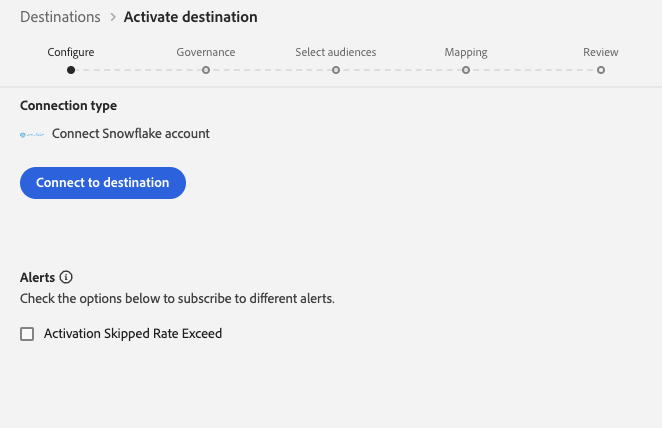
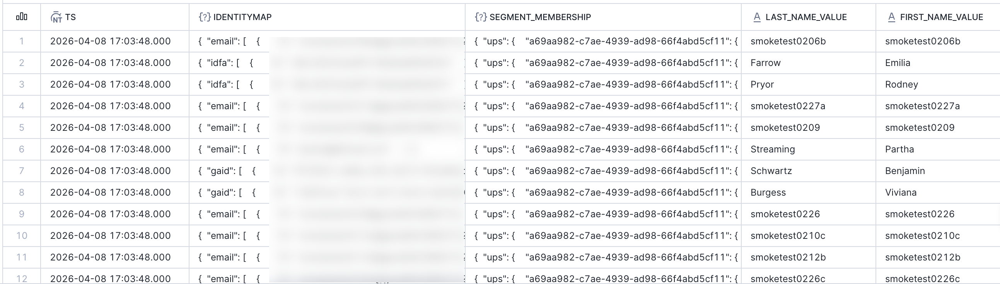

# Snowflake Streaming-verbinding {#snowflake-destination}

>[!AVAILABILITY]
>
>Deze bestemmingsschakelaar is in beperkte beschikbaarheid en slechts beschikbaar aan [!DNL Real-Time CDP] klanten van Ultimate die in het [ worden provisioned VA7 gebied ](/help/landing/multi-cloud.md#azure-regions).

## Overzicht {#overview}

Gebruik de bestemmingsschakelaar van Snowflake om gegevens naar de instantie van Snowflake van Adobe uit te voeren, die Adobe dan met uw instantie door [ privé lijsten ](https://other-docs.snowflake.com/en/collaboration/collaboration-listings-about) deelt.

Lees de volgende secties om te begrijpen hoe de bestemming van Snowflake werkt en hoe de gegevens tussen Adobe en Snowflake worden overgebracht.

### Hoe Snowflake data sharing werkt {#data-sharing}

Dit doel gebruikt een [!DNL Snowflake] gegevensuitwisseling, wat betekent dat er geen gegevens fysiek worden geëxporteerd of overgebracht naar uw eigen Snowflake-instantie. In plaats daarvan biedt Adobe u alleen-lezentoegang tot een live tabel die wordt gehost in de Snowflake-omgeving van Adobe. U kunt deze gedeelde tabel rechtstreeks vanaf uw Snowflake-account opvragen, maar u hebt geen eigenaar van de tabel en kunt de tabel niet wijzigen of behouden na de opgegeven bewaarperiode. Adobe beheert de levenscyclus en structuur van de gedeelde tabel volledig.

De eerste keer dat je gegevens van een Adobe Snowflake-exemplaar naar jou deelt, wordt je gevraagd om de privé-aanbieding van Adobe te accepteren.

### Bewaren van gegevens en Tijd-aan-Levende (TTL) {#ttl}

Alle gegevens die via deze integratie worden gedeeld, hebben een vaste tijd-aan-Levende (TTL) van zeven dagen. Zeven dagen na de laatste uitvoer, verloopt de gedeelde lijst automatisch en wordt ontoegankelijk, ongeacht of dataflow nog actief is. Als u de gegevens langer dan zeven dagen moet bewaren, moet u de inhoud in een lijst kopiëren die u in uw eigen instantie van Snowflake bezit alvorens TTL verloopt.

### Updategedrag van publiek {#audience-update-behavior}

Als uw publiek op [ partijwijze ](../../../segmentation/methods/batch-segmentation.md) wordt geëvalueerd, worden de gegevens in de gedeelde lijst verfrist om de 24 uur. Dit betekent dat er een vertraging van maximaal 24 uur kan optreden tussen wijzigingen in het lidmaatschap van het publiek en wanneer deze wijzigingen worden weerspiegeld in de gedeelde tabel.

### Incrementele exportlogica {#incremental-export}

Wanneer een dataflow voor het eerst voor een publiek loopt, voert het backfill uit en deelt het alle momenteel gekwalificeerde profielen. Na deze eerste backfill worden alleen incrementele updates weergegeven in de gedeelde tabel. Dit betekent profielen die worden toegevoegd aan of verwijderd uit het publiek. Deze aanpak zorgt voor efficiënte updates en zorgt ervoor dat de gedeelde tabel up-to-date blijft.

## Streaming en delen van batchgegevens {#batch-vs-streaming}

[!DNL Adobe Experience Platform] verstrekt twee types van [!DNL Snowflake] bestemmingen: [ Snowflake die ](snowflake.md) en [ Partij van Snowflake ](snowflake-batch.md) stromen.

De lijst hieronder zal u helpen beslissen welke bestemming te gebruiken door de scenario&#39;s te schetsen waar elke gegevens het delen methode het meest aangewezen is.

|  | Kies [ Batch van Snowflake ](snowflake-batch.md) wanneer u nodig hebt | Kies [ Streaming Snowflake ](snowflake.md) wanneer u nodig hebt |
|--------|-------------------|----------------------|
| **de frequentie van de Update** | Periodieke momentopnamen | Continue updates in realtime |
| **de presentatie van Gegevens** | Volledige publieksopname die vorige gegevens vervangt | Incrementele updates op basis van profielwijzigingen |
| **het geval van het Gebruik nadruk** | Analytische/ML-werklasten waarbij latentie niet essentieel is | Directe handelingsscenario&#39;s die updates in real time vereisen |
| **het beheer van Gegevens** | Altijd laatste volledige opname bekijken | Incrementele updates op basis van wijzigingen in het publiekslidmaatschap |
| **de scenario&#39;s van het Voorbeeld** | Bedrijfsrapportage, gegevensanalyse, modeltraining in ML | Onderdrukking van marketingcampagnes, realtime personalisatie |

Voor meer informatie over partijgegevens die delen, zie de [ de verbinding van de Partij van Snowflake ](snowflake-batch.md) documentatie.

## Gebruiksscenario&#39;s {#use-cases}

Het delen van streaming gegevens is ideaal voor scenario&#39;s waarin u directe updates nodig hebt wanneer een profiel zijn lidmaatschap of andere kenmerken wijzigt. Dit is essentieel voor gebruiksgevallen die realtime responsiviteit vereisen, zoals:

* **de campagneonderdrukking van de Marketing**: onderdruk onmiddellijk marketing campagnes voor gebruikers die specifieke acties, zoals het ondertekenen omhoog voor de dienst of het maken van een aankoop hebben ondernomen
* **Realtime verpersoonlijking**: De ervaringen van de gebruiker van de update onmiddellijk wanneer de profielattributen veranderen, zoals wanneer een gebruiker een website bezoekt, een productpagina bekijkt, of punten aan een het winkelwagentje toevoegt
* **Onmiddellijke actiescenario&#39;s**: Voer snelle onderdrukking en het retargeting uit die op gegevens in real time wordt gebaseerd om vertragingen te verminderen en marketing campagnes te verzekeren zijn relevanter en tijdiger
* **Efficiëntie en nuance**: Laat grotere efficiency en nuance in marketing inspanningen toe door snelle reactie op veranderingen van het gebruikersgedrag toe te staan
* **Real-time optimalisering van de klantenreis**: De ervaringen van de klant van de update onmiddellijk wanneer het segmentlidmaatschap of de profielattributen veranderen

Het stromen gegevens het delen verstrekt ononderbroken updates die op segmentveranderingen, veranderingen van de identiteitskaart, of attributenveranderingen worden gebaseerd, die het geschikt maken wanneer de lage latentie van belang is.

## Vereisten {#prerequisites}

Voordat u uw Snowflake-verbinding configureert, moet u aan de volgende voorwaarden voldoen:

* U hebt toegang tot een [!DNL Snowflake] -account.
* Je [!DNL Snowflake] -account is geabonneerd op privé-aanbiedingen. U of iemand in uw bedrijf die beheerdersrechten voor account heeft op [!DNL Snowflake] , kan dit configureren.
* U kent het accountgebied [!DNL Snowflake] , dat u in een vervolgkeuzelijst selecteert wanneer u verbinding maakt met het doel.

Lees de [[!DNL Snowflake]  documentatie ](https://docs.snowflake.com/en/collaboration/consumer-listings-access#access-a-private-listing) voor meer informatie over de noodzakelijke toestemmingen.

## Ondersteunde doelgroepen {#supported-audiences}

In deze sectie wordt beschreven welke soorten publiek u naar dit doel kunt exporteren. De twee lijsten hieronder wijzen op welk publiek deze schakelaar steunt, door _kijkoorsprong_ en _profieltypes inbegrepen in het publiek_:

| Oorsprong publiek | Ondersteund | Beschrijving |
|---------|----------|----------|
| [!DNL Segmentation Service] | Ja | Het publiek produceerde door de [!DNL Adobe Experience Platform] [ Dienst van de Segmentatie ](../../../segmentation/home.md). |
| Alle andere doelgroepen | Ja | Deze categorie omvat alle oorsprong van het publiek buiten het publiek dat via [!DNL Segmentation Service] wordt gegenereerd. Lees over de [ diverse publieksoorsprong ](/help/segmentation/ui/audience-portal.md#customize). Voorbeelden zijn: <ul><li> de douane uploadt publiek [ ingevoerde ](../../../segmentation/ui/audience-portal.md#import-audience) in [!DNL Adobe Experience Platform] van Csv- dossiers,</li><li> gelijksoortige doelgroepen, </li><li> federaal publiek, </li><li> publiek dat wordt gegenereerd in andere [!DNL Adobe Experience Platform] -toepassingen, zoals [!DNL Adobe Journey Optimizer] , </li><li> en meer. </li></ul> |

{style="table-layout:auto"}

Ondersteund publiek per type publieksgegevens:

| Gegevenstype Publiek | Ondersteund | Beschrijving | Gebruiksscenario&#39;s |
|--------------------|-----------|-------------|-----------|
| [ het publiek van Mensen ](/help/segmentation/types/people-audiences.md) | Ja | Gebaseerd op klantenprofielen, die u toestaan om specifieke groepen mensen voor marketing campagnes te richten. | Frequente kopers, winkeliers |
| [ publiek van de Rekening ](/help/segmentation/types/account-audiences.md) | Nee | Doelpersonen binnen specifieke organisaties voor marketingstrategieën op basis van account. | B2B-marketing |
| [ Het publiek van het Vooruitzicht ](/help/segmentation/types/prospect-audiences.md) | Nee | De individuen van het doel die nog geen klanten zijn maar eigenschappen met uw doelpubliek delen. | Waarschuwing met gegevens van derden |
| [ de uitvoer van de Dataset ](/help/catalog/datasets/overview.md) | Nee | Verzamelingen gestructureerde gegevens die zijn opgeslagen in het [!DNL Adobe Experience Platform] Data Lake. | Rapportage, workflows voor gegevenswetenschap |

{style="table-layout:auto"}

## Type en frequentie exporteren {#export-type-frequency}

Raadpleeg de onderstaande tabel voor informatie over het exporttype en de exportfrequentie van de bestemming.

| Item | Type | Notities |
|---------|----------|---------|
| Exporttype | **[!UICONTROL Audience export]** | U exporteert alle leden van een publiek met de id&#39;s (naam, telefoonnummer of andere) die in de [!DNL Snowflake] -bestemming worden gebruikt. |
| Exportfrequentie | **[!UICONTROL Streaming]** | Streaming doelen zijn &quot;altijd aan&quot; API-verbindingen. Zodra een profiel in [!DNL Adobe Experience Platform] wordt bijgewerkt dat op publieksevaluatie wordt gebaseerd, verzendt de schakelaar de update stroomafwaarts naar het bestemmingsplatform. Lees meer over [ het stromen bestemmingen ](/help/destinations/destination-types.md#streaming-destinations). |

{style="table-layout:auto"}

## Verbinden met de bestemming {#connect}

>[!IMPORTANT]
>
>Om met de bestemming te verbinden, hebt u **[!UICONTROL View Destinations]** en **[!UICONTROL Manage Destinations]** [ toegangsbeheertoestemmingen ](/help/access-control/home.md#permissions) nodig. Lees het [ overzicht van de toegangscontrole ](/help/access-control/ui/overview.md) of contacteer uw productbeheerder om de vereiste toestemmingen te verkrijgen.

Om met deze bestemming te verbinden, volg de stappen die in het [ leerprogramma van de bestemmingsconfiguratie ](../../ui/connect-destination.md) worden beschreven. In vormen bestemmingswerkschema, vul de gebieden in die in de twee hieronder secties worden vermeld.

### Verifiëren voor bestemming {#authenticate}

Selecteer **[!UICONTROL Connect to destination]** als u wilt verifiëren bij het doel.

 voor authentiek te verklaren tonen

### Doelgegevens invullen {#destination-details}

>[!CONTEXTUALHELP]
>id="platform_destinations_snowflake_accountID"
>title="Voer je Snowflake-account-id in"
>abstract="Als uw account is gekoppeld aan een organisatie, gebruikt u deze indeling: `OrganizationName.AccountName`   Als uw account niet is gekoppeld aan een organisatie, gebruikt u de volgende indeling: `AccountName`"

Als u details voor de bestemming wilt configureren, vult u de vereiste en optionele velden hieronder in. Een sterretje naast een veld in de gebruikersinterface geeft aan dat het veld verplicht is.

 tonen

* **[!UICONTROL Name]**: Een naam waarmee u dit doel in de toekomst herkent.
* **[!UICONTROL Description]**: Een beschrijving die u zal helpen deze bestemming in de toekomst identificeren.
* **[!UICONTROL Snowflake Account ID]**: je Snowflake-account-id. Gebruik de volgende indeling voor account-id, afhankelijk van of uw account is gekoppeld aan een organisatie:
   * Als uw rekening met een organisatie verbonden is:`OrganizationName.AccountName`.
   * Als uw rekening niet met een organisatie is verbonden:`AccountName`.
* **[!UICONTROL Account acknowledgment]**: Schakel de optie voor het bevestigen van de Snowflake-account-id in om te bevestigen dat uw account-id correct is en van u afkomstig is.

>[!NOTE]
>
> **[!UICONTROL Snowflake Account ID]** kan niet door [ worden uitgegeven bestemmings ](../../ui/edit-destination.md) werkschema nadat u de bestemming creeert. Om een verschillende rekening te gebruiken, [ creeer een nieuwe bestemmingsverbinding ](../../ui/connect-destination.md).

>[!IMPORTANT]
>
> Speciale tekens die worden gebruikt in de doelnaam en de naam van de [!DNL Adobe Experience Platform] -sandbox worden automatisch omgezet in onderstrepingstekens (`_`) in [!DNL Snowflake] . Gebruik geen speciale tekens in de naam van het doel en de sandbox om verwarring te voorkomen.

### Waarschuwingen inschakelen {#enable-alerts}

U kunt alarm toelaten om berichten over de status van dataflow aan uw bestemming te ontvangen. Selecteer een waarschuwing in de lijst om u te abonneren op meldingen over de status van uw gegevensstroom. Voor meer informatie over alarm, lees de gids over [ het intekenen aan bestemmingsalarm gebruikend UI ](../../ui/alerts.md).

Wanneer u klaar bent met het opgeven van details voor uw doelverbinding, selecteert u **[!UICONTROL Next]** .

## Soorten publiek naar dit doel activeren {#activate}

>[!IMPORTANT]
>
>* Om gegevens te activeren, hebt u **[!UICONTROL View Destinations]**, **[!UICONTROL Activate Destinations]**, **[!UICONTROL View Profiles]**, en **[!UICONTROL View Segments]** [ toegangsbeheertoestemmingen ](/help/access-control/home.md#permissions) nodig. Lees het [ overzicht van de toegangscontrole ](/help/access-control/ui/overview.md) of contacteer uw productbeheerder om de vereiste toestemmingen te verkrijgen.
>* Om *identiteiten* uit te voeren, hebt u de **[!UICONTROL View Identity Graph]** [ toegangsbeheertoestemming ](/help/access-control/home.md#permissions) nodig.   {width="100" zoomable="yes"}

Lees [ activeer profielen en publiek aan het stromen publiek uitvoerbestemmingen ](/help/destinations/ui/activate-segment-streaming-destinations.md) voor instructies bij het activeren van publiek aan deze bestemming.

### Kenmerken Kaart {#map}

De Snowflake-bestemming ondersteunt het toewijzen van profielkenmerken aan aangepaste kenmerken.

De doelkenmerken worden automatisch in Snowflake gemaakt met de kenmerknaam die u in het veld **[!UICONTROL Attribute name]** opgeeft.

## Geëxporteerde gegevens/Gegevens valideren bij exporteren {#exported-data}

De gegevens worden via een gedeelde tabel naar uw Snowflake-account gedeeld. Controleer uw Snowflake-account om te controleren of de gegevens correct zijn geëxporteerd.

In het volgende voorbeeld worden voorbeeldrijen uit een gedeelde tabel getoond: in sommige kolommen worden identiteiten en segmentlidmaatschap opgeslagen als JSON; toegewezen profielkenmerken worden weergegeven als afzonderlijke tekenreekskolommen.

 {align="center" zoomable="yes"}

### Gegevensstructuur {#data-structure}

In de bovenstaande schermafbeelding ziet u de volgende kolommen:

* **IDENTITYMAP**: JSON voorwerp voor elke kaart van de profielidentiteit.
* **SEGMENT_MEMBERSHIP**: JSON voorwerp voor elk publiek dat op dataflow wordt geactiveerd. De waarde omvat `lastQualificationTime` en `status` (bijvoorbeeld `realized` wanneer het profiel voor het segment kwalificeert).
* **de attributen van de Toewijzing**: Elk toewijzingsattribuut dat u tijdens het activeringswerkschema selecteert wordt vertegenwoordigd als kolomkopbal in [!DNL Snowflake].

## Gegevensgebruik en -beheer {#data-usage-governance}

Alle [!DNL Adobe Experience Platform] -doelen zijn compatibel met het beleid voor gegevensgebruik bij het verwerken van uw gegevens. Voor gedetailleerde informatie over hoe [!DNL Adobe Experience Platform] gegevensbeheer afdwingt, lees het [ overzicht van het Beleid van Gegevens ](/help/data-governance/home.md).
