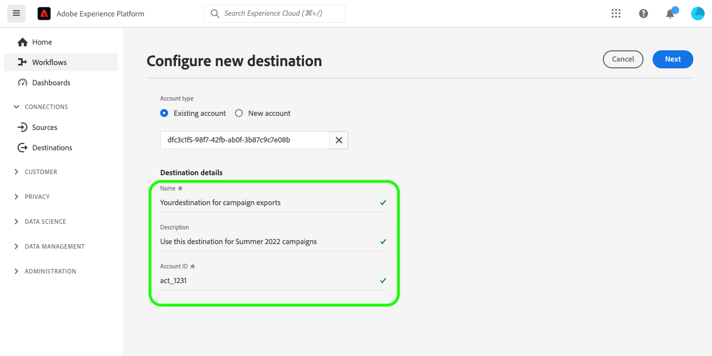

# Uw doelverbinding {#your-destination}

*aangezien u door dit malplaatje gaat, vervang of schrap alle paragrafen in cursief (beginnend met dit).*

*Begin door de meta-gegevens (titel en beschrijving) bij te werken bij de bovenkant van de pagina. Negeer alle exemplaren van UICONTROL op deze pagina. Dit is een label waarmee de pagina in de verschillende talen die wij ondersteunen correct wordt vertaald in onze computervertaalprocessen. Wij zullen markeringen aan uw documentatie toevoegen nadat u het voorlegt.*

>[!IMPORTANT]
>
>* Vul alle secties in deze sjabloon in in de volgorde waarin ze in de sjabloon worden beschreven.
>* Deze sjabloon wordt niet regelmatig bijgewerkt, op basis van feedback van partners. Alvorens u met het ontwerpen van documentatie voor uw bestemming begint, zorg ervoor dat u de [ recentste versie van het malplaatje ](../assets/docs-framework/yourdestination-template.zip) hebt gedownload.

## Overzicht {#overview}

*verstrek een kort overzicht van uw bedrijf, met inbegrip van de waarde het aan klanten verstrekt. Neem een koppeling op naar de startpagina van de productdocumentatie voor meer informatie.*

>[!IMPORTANT]
>
>Deze bestemmingsschakelaar en documentatiepagina worden gecreeerd en door het *UwDoel* team gehandhaafd. Voor om het even welke vragen of updateverzoeken, gelieve hen direct bij *verbinding of e-mailadres van het Tussenvoegsel waar u voor updates, bijvoorbeeld `support@YourDestination.com` kunt worden bereikt.*

## Gebruiksscenario’s {#use-cases}

Om u beter te helpen begrijpen hoe en wanneer u de ** bestemming zou moeten gebruiken YourDestination, zijn hier de gevallen van het steekproefgebruik die de klanten van Adobe Experience Platform kunnen oplossen door deze bestemming te gebruiken.

### Hoofdletters gebruiken #1 {#use-case-1}

*voor mobiele overseinenplatforms:*

*het huishuur en verkoopplatform van A wil mobiele berichten aan de apparaten van Android en van iOS van klanten duwen om hen te laten weten dat er 100 bijgewerkte lijsten in het gebied zijn waar zij eerder naar een huur zoekden.*

### Hoofdletters gebruiken #2 {#use-case-2}

*voor sociale netwerkplatforms:*

*een atletisch merk van het kleding wil bestaande klanten door hun sociale media rekeningen bereiken. Het merk apparel kan e-mailadressen van hun eigen CRM aan Adobe Experience Platform opnemen, publiek van hun eigen off-line gegevens bouwen, en deze publiek naar YourDestination verzenden, om advertenties in de sociale media van hun klanten te tonen feeds.*

## Vereisten {#prerequisites}

*voegt informatie in deze sectie over om het even wat toe dat de klanten zich van vóór aanvang bewust moeten zijn aan opstelling de bestemming in het gebruikersinterface van Adobe Experience Platform. Dit kan over zijn:*

* *moet aan een lijst van gewenste personen worden toegevoegd*
* *vereisten voor e-mailhashing*
* *om het even welke rekeningsspecificaties op uw kant*
* *hoe te om een API sleutel te verkrijgen om met uw platform te verbinden*

*u kunt uit aan uw relevante documentatie verbinden als dat aan klanten nuttig zou zijn.*

## Ondersteunde identiteiten {#supported-identities}

*voegt informatie in deze sectie over de identiteiten toe die door uw bestemming worden gesteund. We hebben de tabel vooraf gevuld met enkele standaardwaarden. Schrap de waarden die niet op uw bestemming van toepassing zijn en/of voeg om het even welke waarden toe die niet vooraf worden gevuld.*

*YourDestination* steunt de activering van identiteiten die in de hieronder lijst worden beschreven. Leer meer over [ identiteiten ](/help/identity-service/features/namespaces.md).

| Doelidentiteit | Beschrijving | Overwegingen |
|---|---|---|
| GAID | GOOGLE ADVERTISING ID | Selecteer de GAID doelidentiteit wanneer uw bronidentiteit een GAID-naamruimte is. |
| IDFA | Apple-id voor adverteerders | Selecteer de IDFA doelidentiteit wanneer uw bronidentiteit een IDFA namespace is. |
| ECID | Experience Cloud-id | Een naamruimte die ECID vertegenwoordigt. Deze naamruimte kan ook worden aangeduid met de volgende aliassen: &quot;Adobe Marketing Cloud ID&quot;, &quot;Adobe Experience Cloud ID&quot;, &quot;Adobe Experience Platform ID&quot;. Lees het volgende document op [ ECID ](/help/identity-service/features/ecid.md) voor meer informatie. |
| phone_sha256 | Telefoonnummers die zijn hashed met het SHA256-algoritme | Adobe Experience Platform biedt ondersteuning voor zowel platte tekst- als SHA256-telefoonnummers. Wanneer het bronveld hashingkenmerken bevat, schakelt u de optie **[!UICONTROL Apply transformation]** in om de gegevens automatisch te laten hashen bij activering door [!DNL Platform] . |
| email_lc_sha256 | E-mailadressen die met het algoritme SHA256 worden gehasht | Adobe Experience Platform biedt ondersteuning voor zowel platte tekst- als SHA256-e-mailadressen met hashing. Wanneer het bronveld hashingkenmerken bevat, schakelt u de optie **[!UICONTROL Apply transformation]** in om de gegevens automatisch te laten hashen bij activering door [!DNL Platform] . |
| extern_id | Aangepaste gebruikers-id&#39;s | Selecteer deze doelidentiteit wanneer uw bronidentiteit een aangepaste naamruimte is. |

{style="table-layout:auto"}

## Ondersteunde doelgroepen {#supported-audiences}

*voegt informatie in deze sectie over het publiek toe dat door uw bestemming wordt gesteund. We hebben de tabel vooraf gevuld met enkele standaardwaarden. Gebruik de `✓` en `X` karakters om te merken of uw publiekstype door deze bestemming wordt gesteund.*

In deze sectie wordt beschreven welke soorten publiek u naar dit doel kunt exporteren.

| Oorsprong publiek | Ondersteund | Beschrijving |
|---------|----------|----------|
| [!DNL Segmentation Service] | ✓ | Het publiek produceerde door de Dienst van de Segmentatie van het Experience Platform [ ](../../../segmentation/home.md). |
| Aangepaste uploads | X | Het publiek [ ingevoerde ](../../../segmentation/ui/audience-portal.md#import-audience) in Experience Platform van Csv- dossiers. |

{style="table-layout:auto"}

## Type en frequentie exporteren {#export-type-frequency}

*in de lijst, houd slechts de lijnen die aan uw bestemming beantwoorden. U moet één regel voor het type Exporteren en één regel voor de frequentie Exporteren hebben. Schrap de waarden die niet op uw bestemming van toepassing zijn.*

Raadpleeg de onderstaande tabel voor informatie over het exporttype en de exportfrequentie van de bestemming.

| Item | Type | Notities |
---------|----------|---------|
| Exporttype | **[!UICONTROL Audience export]** | U exporteert alle leden van een publiek met de id&#39;s (naam, telefoonnummer of andere) die in de ** bestemming YourDestination worden gebruikt. |
| Exporttype | **[!UICONTROL Profile-based]** | U exporteert alle leden van een publiek, samen met de gewenste schemagebieden (bijvoorbeeld: e-mailadres, telefoonaantal, achternaam), zoals gekozen in het uitgezochte scherm van profielkenmerken van het [ werkschema van de bestemmingsactivering ](/help/destinations/ui/activate-batch-profile-destinations.md#select-attributes). |
| Exporttype | **[!UICONTROL Dataset export]** | U exporteert onbewerkte gegevenssets, die niet zijn gegroepeerd of gestructureerd op basis van belangen of kwalificaties van het publiek. |
| Exportfrequentie | **[!UICONTROL Streaming]** | Streaming doelen zijn &quot;altijd aan&quot; API-verbindingen. Zodra een profiel in Experience Platform wordt bijgewerkt dat op publieksevaluatie wordt gebaseerd, verzendt de schakelaar de update stroomafwaarts naar het bestemmingsplatform. Lees meer over [ het stromen bestemmingen ](/help/destinations/destination-types.md#streaming-destinations). |
| Exportfrequentie | **[!UICONTROL Batch]** | De bestemmingen van de partij voeren dossiers naar stroomafwaartse platforms in toename van drie, zes, acht, twaalf, of 24 uren uit. Lees meer over [ partij op dossier-gebaseerde bestemmingen ](/help/destinations/destination-types.md#file-based). |

{style="table-layout:auto"}

## Verbinden met de bestemming {#connect}

>[!IMPORTANT]
> 
>Om met de bestemming te verbinden, hebt u **[!UICONTROL View Destinations]** en **[!UICONTROL Manage Destinations]** [ toegangsbeheertoestemmingen ](/help/access-control/home.md#permissions) nodig. Lees het [ overzicht van de toegangscontrole ](/help/access-control/ui/overview.md) of contacteer uw productbeheerder om de vereiste toestemmingen te verkrijgen.

Om met deze bestemming te verbinden, volg de stappen die in het [ leerprogramma van de bestemmingsconfiguratie ](../../ui/connect-destination.md) worden beschreven. In vormen bestemmingswerkschema, vul de gebieden in die in de twee hieronder secties worden vermeld.

### Verifiëren voor bestemming {#authenticate}

*voeg de gebieden toe die de klanten moeten invullen wanneer het voor authentiek verklaren aan uw bestemming. Deze gebieden zijn bestemming-specifiek en hangen van uw configuratie in Destination SDK af. De velden van uw bestemming zijn mogelijk niet gelijk aan de onderstaande velden. Gelieve te omvatten ook een screenshot gelijkend op de hieronder getoonde steekproefscreenshot.*

Als u voor verificatie bij het doel wilt zorgen, vult u de vereiste velden in en selecteert u **[!UICONTROL Connect to destination]** .

 voor authentiek te verklaren tonen

* **[!UICONTROL Bearer token]**: vul de token aan voor de toonder om te verifiëren bij het doel.

### Doelgegevens invullen {#destination-details}

*voeg de gebieden toe die de klanten moeten invullen wanneer het vormen van een nieuwe bestemming. Deze gebieden zijn bestemming-specifiek en hangen van uw configuratie in Destination SDK af. De velden van uw bestemming zijn mogelijk niet gelijk aan de onderstaande velden. Gelieve te omvatten ook een screenshot gelijkend op de hieronder getoonde steekproefscreenshot.*

Als u details voor de bestemming wilt configureren, vult u de vereiste en optionele velden hieronder in. Een sterretje naast een veld in de gebruikersinterface geeft aan dat het veld verplicht is.

 tonen

* **[!UICONTROL Name]**: Een naam waarmee u dit doel in de toekomst herkent.
* **[!UICONTROL Description]**: Een beschrijving die u zal helpen deze bestemming in de toekomst identificeren.
* **[!UICONTROL Account ID]**: Uw *YourDestination* rekeningsidentiteitskaart

### Waarschuwingen inschakelen {#enable-alerts}

U kunt alarm toelaten om berichten over de status van dataflow aan uw bestemming te ontvangen. Selecteer een waarschuwing in de lijst om u te abonneren op meldingen over de status van uw gegevensstroom. Voor meer informatie over alarm, lees de gids over [ het intekenen aan bestemmingsalarm gebruikend UI ](../../ui/alerts.md).

Wanneer u klaar bent met het opgeven van details voor uw doelverbinding, selecteert u **[!UICONTROL Next]** .

## Soorten publiek naar dit doel activeren {#activate}

>[!IMPORTANT]
> 
>* Om gegevens te activeren, hebt u **[!UICONTROL View Destinations]**, **[!UICONTROL Activate Destinations]**, **[!UICONTROL View Profiles]**, en **[!UICONTROL View Segments]** [ toegangsbeheertoestemmingen ](/help/access-control/home.md#permissions) nodig. Lees het [ overzicht van de toegangscontrole ](/help/access-control/ui/overview.md) of contacteer uw productbeheerder om de vereiste toestemmingen te verkrijgen.
>* Om *identiteiten* uit te voeren, hebt u de **[!UICONTROL View Identity Graph]** [ toegangsbeheertoestemming ](/help/access-control/home.md#permissions) nodig. <br> {width="100" zoomable="yes"}

*Schrap zoals aangewezen - als u een nieuwe het stromen bestemming documenteert, houd de eerste hieronder paragraaf. Als u een nieuw op een bestand gebaseerd doel documenteert, houd de tweede paragraaf. Als u een bestemming documenteert die datasets uitvoert, houd de derde paragraaf.*

Lees [ activeer profielen en publiek aan het stromen publiek uitvoerbestemmingen ](/help/destinations/ui/activate-segment-streaming-destinations.md) voor instructies bij het activeren van publiek aan deze bestemming.

Lees [ activeer publieksgegevens aan de uitvoerbestemmingen van het partijprofiel ](/help/destinations/ui/activate-batch-profile-destinations.md) voor instructies bij het activeren van publiek aan deze bestemming.

Lees [ (Beta) datasets van de Uitvoer ](/help/destinations/ui/export-datasets.md) voor uitgebreide instructies bij het uitvoeren van datasets aan deze bestemming.

### Kenmerken en identiteiten toewijzen {#map}

*voegt informatie over gesteunde afbeeldingen tussen bron en doelgebieden in de stap van de Afbeelding van het activeringswerkschema toe. Uw doel biedt mogelijk ondersteuning voor het exporteren van profielkenmerken, naamruimten of beide. Sommige velden zijn mogelijk verplicht. Doelkenmerken kunnen vooraf gedefinieerd of aangepast zijn. Roep de belangrijke waarschuwingen uit en gebruik voorbeelden, bij voorkeur met screenshots. Twee voorbeelden van bestemmingspagina&#39;s die u als verwijzing kunt gebruiken zijn:*

* *[Pega](/help/destinations/catalog/personalization/pega.md#mapping-example)*
* *[Medallia](/help/destinations/catalog/voice/medallia-connector.md#map)*

## Geëxporteerde gegevens/Gegevens valideren bij exporteren {#exported-data}

*voeg een paragraaf over toe hoe het gegeven aan uw bestemming wordt uitgevoerd. Dit zou de klant helpen ervoor zorgen dat zij correct met uw bestemming geïntegreerd hebben. U kunt bijvoorbeeld een voorbeeld-JSON opgeven, zoals hieronder. Of, kon u screenshots en informatie van de interface van uw bestemming verstrekken die tonen hoe de klanten zouden moeten verwachten dat het publiek in het bestemmingsplatform bevolkt is.*

```
{
  "person": {
    "email": "yourstruly@adobe.com"
  },
  "segmentMembership": {
    "ups": {
      "7841ba61-23c1-4bb3-a495-00d3g5fe1e93": {
        "lastQualificationTime": "2020-05-25T21:24:39Z",
        "status": "exited"
      },
      "59bd2fkd-3c48-4b18-bf56-4f5c5e6967ae": {
        "lastQualificationTime": "2020-05-25T23:37:33Z",
        "status": "realized"
      }
    }
  },
  "identityMap": {
    "ecid": [
      {
        "id": "14575006536349286404619648085736425115"
      },
      {
        "id": "66478888669296734530114754794777368480"
      }
    ],
    "email_lc_sha256": [
      {
        "id": "655332b5fa2aea4498bf7a290cff017cb4"
      },
      {
        "id": "66baf76ef9de8b42df8903f00e0e3dc0b7"
      }
    ]
  }
}
```

## Gegevensgebruik en -beheer {#data-usage-governance}

Alle [!DNL Adobe Experience Platform] -doelen zijn compatibel met het beleid voor gegevensgebruik bij het verwerken van uw gegevens. Voor gedetailleerde informatie over hoe [!DNL Adobe Experience Platform] gegevensbeheer afdwingt, lees het [ overzicht van het Beleid van Gegevens ](/help/data-governance/home.md).

## Aanvullende bronnen {#additional-resources}

*u kunt verdere verbindingen aan uw productdocumentatie of om het even welke andere middelen verstrekken die u voor de klant belangrijk om acht succesvol te zijn.*
