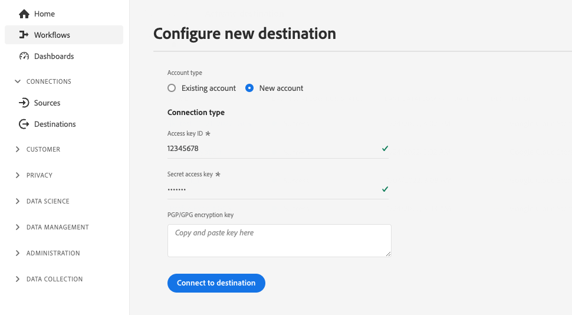

# Configuratie van klantverificatie

Experience Platform verstrekt grote flexibiliteit in de authentificatieprotocollen beschikbaar aan partners en klanten. U kunt uw bestemming vormen om het even welke industrie-standaardauthentificatiemethodes zoals te steunen [!DNL OAuth2], togertokenverificatie, wachtwoordverificatie en nog veel meer.

Deze pagina verklaart hoe te opstelling uw bestemming gebruikend uw aangewezen authentificatiemethode. Gebaseerd op de authentificatieconfiguratie die u gebruikt wanneer u uw bestemming creeert, zullen de klanten verschillende soorten authentificatiepagina&#39;s zien wanneer het verbinden met de bestemming in Experience Platform UI.

Om te begrijpen waar deze component in een integratie past die met Destination SDK wordt gecreeerd, zie het diagram in [configuratieopties](../configuration-options.md) documentatie of zie de volgende pagina&#39;s van het overzicht van bestemmingsconfiguratie:

* [Gebruik Destination SDK om een streamingbestemming te configureren](../../guides/configure-destination-instructions.md#create-destination-configuration)
* [Gebruik Destination SDK om een op een bestand gebaseerde bestemming te configureren](../../guides/configure-file-based-destination-instructions.md#create-destination-configuration)

Voordat klanten gegevens kunnen exporteren van Platform naar uw bestemming, moeten ze een nieuwe verbinding maken tussen Experience Platform en uw bestemming door de stappen uit te voeren die in het dialoogvenster [doelverbinding](../../../ui/connect-destination.md) zelfstudie.

Wanneer [een doel maken](../../authoring-api/destination-configuration/create-destination-configuration.md) door Destination SDK, de `customerAuthenticationConfigurations` sectie bepaalt wat de klanten in [verificatiescherm](../../../ui/connect-destination.md#authenticate). Afhankelijk van het type van bestemmingsauthentificatie, moeten de klanten diverse authentificatiedetails, zoals verstrekken:

* Voor bestemmingen die [basisverificatie](#basic), moeten de gebruikers een gebruikersbenaming en een wachtwoord in de de authentificatiepagina van het Experience Platform UI direct verstrekken.
* Voor bestemmingen die [waarmerking](#bearer), moeten gebruikers een token aan toonder leveren.
* Voor bestemmingen die [OAuth2-verificatie](#oauth2), worden de gebruikers opnieuw gericht aan de login van uw bestemming pagina waar zij login met hun geloofsbrieven kunnen.
* Voor [Amazon S3](#s3) doelen, gebruikers moeten hun [!DNL Amazon S3] toegangssleutel en geheime sleutel.
* Voor [Azure Blob](#blob) doelen, gebruikers moeten hun [!DNL Azure Blob] verbindingsreeks.

U kunt de details van de klantenauthentificatie via `/authoring/destinations` eindpunt. Zie de volgende API verwijzingspagina&#39;s voor gedetailleerde API vraagvoorbeelden waar u de componenten kunt vormen die in deze pagina worden getoond.

* [Een doelconfiguratie maken](../../authoring-api/destination-configuration/create-destination-configuration.md)
* [Een doelconfiguratie bijwerken](../../authoring-api/destination-configuration/update-destination-configuration.md)

Dit artikel beschrijft alle gesteunde configuraties van de klantenauthentificatie die u voor uw bestemming kunt gebruiken, en toont welke klanten in het Experience Platform UI zullen zien die op de authentificatiemethode wordt gebaseerd die u opstelling voor uw bestemming.

>[!IMPORTANT]
>
>De configuratie van de klantenauthentificatie vereist u niet om het even welke parameters te vormen. U kunt de fragmenten die op deze pagina worden getoond in uw API-aanroepen kopiëren en plakken wanneer [maken](../../authoring-api/destination-configuration/create-destination-configuration.md) of [bijwerken](../../authoring-api/destination-configuration/update-destination-configuration.md) een bestemmingsconfiguratie, en uw gebruikers zullen het overeenkomstige authentificatiescherm in het Platform UI zien.

>[!IMPORTANT]
>
>Alle parameternamen en -waarden die door Destination SDK worden ondersteund, zijn **hoofdlettergevoelig**. Om fouten in hoofdlettergevoeligheid te voorkomen, gebruikt u de namen en waarden van parameters exact zoals in de documentatie wordt getoond.

## Ondersteunde integratietypen {#supported-integration-types}

Raadpleeg de onderstaande tabel voor meer informatie over de integratietypen die de op deze pagina beschreven functionaliteit ondersteunen.

| Type integratie | Ondersteunt functionaliteit |
|---|---|
| Integraties in realtime (streaming) | Ja |
| Op bestanden gebaseerde (batch) integratie | Ja |

## Configuratie van verificatieregel {#authentication-rule}

Wanneer het gebruiken van om het even welke configuraties van de klantenauthentificatie die in deze pagina worden beschreven, altijd plaatsen `authenticationRule` parameter in [bestemmingslevering](destination-delivery.md) tot `"CUSTOMER_AUTHENTICATION"`, zoals hieronder weergegeven.

```json {line-numbers="true" highlight="4"
{
   "destinationDelivery":[
      {
         "authenticationRule":"CUSTOMER_AUTHENTICATION",
         "destinationServerId":"{{destinationServerId}}"
      }
   ]
}
```

## Basisverificatie {#basic}

Basisverificatie wordt ondersteund voor realtime (streaming) integratie in Experience Platform.

Wanneer u het basisidentificatietype vormt, moeten de gebruikers een gebruikersbenaming en een wachtwoord invoeren om met uw bestemming te verbinden.


Aan opstellings basisauthentificatie voor uw bestemming, vorm `customerAuthenticationConfigurations` via de `/destinations` eindpunt zoals hieronder getoond:

```json
"customerAuthenticationConfigurations":[
   {
      "authType":"BASIC"
   }
]
```

## Waardere verificatie {#bearer}

Wanneer u het dragerauthentificatietype vormt, worden de gebruikers vereist om het dragerteken in te voeren dat zij uit uw bestemming verkrijgen.


Aan opstellingstradientypeauthentificatie voor uw bestemming, vorm `customerAuthenticationConfigurations` via de `/destinations` eindpunt zoals hieronder getoond:

```json
"customerAuthenticationConfigurations":[
   {
      "authType":"BEARER"
   }
]
```

## OAuth 2-verificatie {#oauth2}

Gebruikers selecteren **[!UICONTROL Connect to destination]** om OAuth 2 authentificatiestroom aan uw bestemming, zoals aangetoond in het voorbeeld hieronder voor de bestemming van het publiek van de Twitter van de Douane teweeg te brengen. Voor gedetailleerde informatie bij het vormen van OAuth 2 authentificatie aan uw bestemmingshindpunt, lees specifiek [Destination SDK OAuth 2-verificatiepagina](oauth2-authentication.md).


Aan opstelling [!DNL OAuth2] de authentificatie voor uw bestemming, vormt `customerAuthenticationConfigurations` via de `/destinations` eindpunt zoals hieronder getoond:

```json
"customerAuthenticationConfigurations":[
   {
      "authType":"OAUTH2"
   }
]
```

## Amazon S3-verificatie {#s3}

[!DNL Amazon S3] de authentificatie wordt gesteund voor op dossier-gebaseerde bestemmingen in Experience Platform.

Wanneer u het Amazon S3 authentificatietype vormt, worden de gebruikers vereist om hun S3 geloofsbrieven in te voeren.


Aan opstelling [!DNL Amazon S3] de authentificatie voor uw bestemming, vormt `customerAuthenticationConfigurations` via de `/destinations` eindpunt zoals hieronder getoond:

```json
"customerAuthenticationConfigurations":[
   {
      "authType":"S3"
   }
]
```

## Azure Blob-verificatie  {#blob}

[!DNL Azure Blob Storage] de authentificatie wordt gesteund voor op dossier-gebaseerde bestemmingen in Experience Platform.

Wanneer u het verificatietype Azure Blob configureert, moeten gebruikers de verbindingstekenreeks invoeren.


Aan opstelling [!DNL Azure Blob] de authentificatie voor uw bestemming, vormt `customerAuthenticationConfigurations` in de `/destinations` eindpunt zoals hieronder getoond:

```json
"customerAuthenticationConfigurations":[
   {
      "authType":"AZURE_CONNECTION_STRING"
   }
]
```

## [!DNL Azure Data Lake Storage] verificatie {#adls}

[!DNL Azure Data Lake Storage] de authentificatie wordt gesteund voor op dossier-gebaseerde bestemmingen in Experience Platform.

Wanneer u vormt [!DNL Azure Data Lake Storage] het authentificatietype, worden de gebruikers vereist om de Azure Belangrijkste geloofsbrieven van de Dienst en hun huurdersinformatie in te voeren.

![UI-renderen met [!DNL Azure Data Lake Storage] verificatie](../../assets/functionality/destination-configuration/adls-authentication-ui.png)

Aan opstelling [!DNL Azure Data Lake Storage] (ADLS) authentificatie voor uw bestemming, vorm `customerAuthenticationConfigurations` in de `/destinations` eindpunt zoals hieronder getoond:

```json
"customerAuthenticationConfigurations":[
   {
      "authType":"AZURE_SERVICE_PRINCIPAL"
   }
]
```

## SFTP met wachtwoordverificatie

[!DNL SFTP] verificatie met wachtwoord wordt ondersteund voor op bestanden gebaseerde doelen in Experience Platform.

Wanneer u SFTP met het type van wachtwoordauthentificatie vormt, worden de gebruikers vereist om de gebruikersbenaming en het wachtwoord van SFTP, evenals het domein en de haven van SFTP in te voeren (de standaardhaven is 22).


Als u SFTP-verificatie wilt instellen met een wachtwoord voor uw doel, configureert u de `customerAuthenticationConfigurations` in de `/destinations` eindpunt zoals hieronder getoond:

```json
"customerAuthenticationConfigurations":[
   {
      "authType":"SFTP_WITH_PASSWORD"
   }
]
```

## SFTP met SSH-sleutelverificatie

[!DNL SFTP] verificatie met [!DNL SSH] key wordt ondersteund voor op bestanden gebaseerde doelen in Experience Platform.

Wanneer u SFTP met SSH zeer belangrijke authentificatietype vormt, worden de gebruikers vereist om de gebruikersbenaming van SFTP en de sleutel van SSH, evenals het domein en de haven van SFTP in te voeren (de standaardhaven is 22).


Om de authentificatie van SFTP met de sleutel van SSH voor uw bestemming te plaatsen, vorm `customerAuthenticationConfigurations` in de `/destinations` eindpunt zoals hieronder getoond:

```json
"customerAuthenticationConfigurations":[
   {
      "authType":"SFTP_WITH_SSH_KEY"
   }
]
```

## [!DNL Google Cloud Storage] verificatie {#gcs}

[!DNL Google Cloud Storage] de authentificatie wordt gesteund voor op dossier-gebaseerde bestemmingen in Experience Platform.

Wanneer u vormt [!DNL Google Cloud Storage] verificatietype, gebruikers moeten hun gegevens invoeren [!DNL Google Cloud Storage] [!UICONTROL access key ID] en [!UICONTROL secret access key].



Aan opstelling [!DNL Google Cloud Storage] de authentificatie voor uw bestemming, vormt `customerAuthenticationConfigurations` in de `/destinations` eindpunt zoals hieronder getoond:

```json
"customerAuthenticationConfigurations":[
   {
      "authType":"GOOGLE_CLOUD_STORAGE"
   }
]
```

## Volgende stappen {#next-steps}

Na het lezen van dit artikel, zou u een beter inzicht in moeten hebben hoe u gebruikersauthentificatie aan uw bestemmingsplatform kunt vormen.

Raadpleeg de volgende artikelen voor meer informatie over de andere doelcomponenten:

* [OAuth2-verificatie](oauth2-authentication.md)
* [Gegevensvelden van de klant](customer-data-fields.md)
* [UI-kenmerken](ui-attributes.md)
* [Schema-configuratie](schema-configuration.md)
* [Configuratie naamruimte voor identiteit](identity-namespace-configuration.md)
* [Ondersteunde toewijzingsconfiguraties](supported-mapping-configurations.md)
* [Levering bestemming](destination-delivery.md)
* [Configuratie van metagegevens voor publiek](audience-metadata-configuration.md)
* [Samenvoegingsbeleid](aggregation-policy.md)
* [Batchconfiguratie](batch-configuration.md)
* [Historische profielkwalificaties](historical-profile-qualifications.md)
