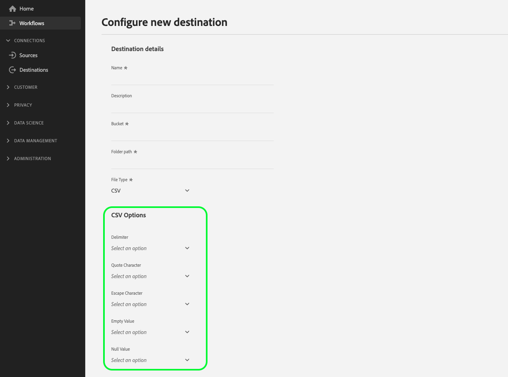

# Gebruikersinvoer configureren via gegevensvelden van klanten

Wanneer het verbinden met uw bestemming in de UI van het Experience Platform, zou u uw gebruikers kunnen nodig hebben om specifieke configuratiedetails te verstrekken of specifieke opties te selecteren die u ter beschikking stelt aan hen. In Destination SDK worden deze opties gegevensvelden voor klanten genoemd.

Om te begrijpen waar deze component in een integratie past die met Destination SDK wordt gecreeerd, zie het diagram in [configuratieopties](../configuration-options.md) documentatie of zie de volgende pagina&#39;s van het overzicht van bestemmingsconfiguratie:

* [Gebruik Destination SDK om een streamingbestemming te configureren](../../guides/configure-destination-instructions.md#create-destination-configuration)
* [Gebruik Destination SDK om een op een bestand gebaseerde bestemming te configureren](../../guides/configure-file-based-destination-instructions.md#create-destination-configuration)

## Gebruik gevallen voor gegevensvelden van klanten {#use-cases}

De gebieden van de klantengegevens van het gebruik voor een verscheidenheid van gebruiksgevallen waar u gebruikers nodig hebt om gegevens in de UI van het Experience Platform in te voeren. Gebruik bijvoorbeeld gegevensvelden van klanten wanneer gebruikers het volgende moeten opgeven:

* Namen en paden van cloudopslagemmertjes voor op bestanden gebaseerde doelen.
* De indeling die wordt geaccepteerd door de gegevensvelden van de klant.
* Beschikbare bestandcompressietypen waaruit gebruikers kunnen kiezen.
* Een lijst met beschikbare eindpunten voor integratie in real time (streaming).

U kunt gegevensvelden voor klanten configureren via de `/authoring/destinations` eindpunt. Zie de volgende API verwijzingspagina&#39;s voor gedetailleerde API vraagvoorbeelden waar u de componenten kunt vormen die in deze pagina worden getoond.

* [Een doelconfiguratie maken](../../authoring-api/destination-configuration/create-destination-configuration.md)
* [Een doelconfiguratie bijwerken](../../authoring-api/destination-configuration/update-destination-configuration.md)

In dit artikel worden alle ondersteunde configuratietypen voor klantgegevensvelden beschreven die u voor uw doel kunt gebruiken, en wordt aangegeven welke klanten in de gebruikersinterface van het Experience Platform zullen zien.

>[!IMPORTANT]
>
>Alle parameternamen en -waarden die door Destination SDK worden ondersteund, zijn **hoofdlettergevoelig**. Om fouten in hoofdlettergevoeligheid te voorkomen, gebruikt u de namen en waarden van parameters exact zoals in de documentatie wordt getoond.

## Ondersteunde integratietypen {#supported-integration-types}

Raadpleeg de onderstaande tabel voor meer informatie over de integratietypen die de op deze pagina beschreven functionaliteit ondersteunen.

| Type integratie | Ondersteunt functionaliteit |
|---|---|
| Integraties in realtime (streaming) | Ja |
| Op bestanden gebaseerde (batch) integratie | Ja |

## Ondersteunde parameters {#supported-parameters}

Wanneer u uw eigen gegevensvelden voor klanten maakt, kunt u de parameters in de onderstaande tabel gebruiken om hun gedrag te configureren.

| Parameter | Type | Vereist/optioneel | Beschrijving |
|---------|----------|------|---|
| `name` | String | Vereist | Geef een naam op voor het aangepaste veld dat u introduceert. Deze naam is niet zichtbaar in de interface van het Platform, tenzij `title` veld is leeg of ontbreekt. |
| `type` | String | Vereist | Hiermee geeft u het type van het aangepaste veld aan dat u wilt gebruiken. Geaccepteerde waarden: <ul><li>`string`</li><li>`object`</li><li>`integer`</li></ul> |
| `title` | String | Optioneel | Hiermee wordt de naam van het veld aangegeven, zoals deze wordt weergegeven door klanten in de gebruikersinterface van het platform. Als dit veld leeg is of ontbreekt, neemt de gebruikersinterface de veldnaam over van de `name` waarde. |
| `description` | String | Optioneel | Geef een beschrijving op voor het aangepaste veld. Deze beschrijving is niet zichtbaar in de interface van het Platform. |
| `isRequired` | Boolean | Optioneel | Geeft aan of gebruikers een waarde voor dit veld moeten opgeven in de workflow voor de doelconfiguratie. |
| `pattern` | String | Optioneel | Hiermee wordt, indien nodig, een patroon voor het aangepaste veld afgedwongen. Gebruik reguliere expressies om een patroon af te dwingen. Als uw klant-id&#39;s bijvoorbeeld geen cijfers of onderstrepingstekens bevatten, voert u `^[A-Za-z]+$` op dit gebied. |
| `enum` | String | Optioneel | Hiermee geeft u het aangepaste veld weer als een vervolgkeuzemenu en geeft u de opties weer die beschikbaar zijn voor de gebruiker. |
| `default` | String | Optioneel | Hiermee wordt de standaardwaarde van een `enum` lijst. |
| `hidden` | Boolean | Optioneel | Geeft aan of het gegevensveld van de klant al dan niet in de gebruikersinterface wordt weergegeven. |
| `unique` | Boolean | Optioneel | Gebruik deze parameter wanneer u een gebied van klantengegevens moet creëren de waarvan waarde over alle bestemmingsdataflows opstelling door de organisatie van een gebruiker uniek moet zijn. Bijvoorbeeld de **[!UICONTROL Integration alias]** in het veld [Aangepaste personalisatie](../../../catalog/personalization/custom-personalization.md) doel moet uniek zijn, wat betekent dat twee afzonderlijke dataflows aan deze bestemming niet de zelfde waarde voor dit gebied kunnen hebben. |
| `readOnly` | Boolean | Optioneel | Geeft aan of de klant de waarde van het veld kan wijzigen of niet. |

{style="table-layout:auto"}

In het onderstaande voorbeeld wordt `customerDataFields` In deze sectie worden twee velden gedefinieerd die gebruikers moeten invoeren in de interface van het platform wanneer ze verbinding maken met het doel:

* `Account ID`: Een gebruikersnaam voor het doelplatform.
* `Endpoint region`: Het regionale eindpunt van de API waarmee ze verbinding maken. De `enum` maakt een vervolgkeuzemenu met de waarden die zijn gedefinieerd binnen de beschikbare waarden voor de gebruikers.

```json
"customerDataFields":[
   {
      "name":"accountID",
      "title":"User account ID",
      "description":"User account ID for the destination platform.",
      "type":"string",
      "isRequired":true
   },
   {
      "name":"region",
      "title":"API endpoint region",
      "description":"The API endpoint region that the user should connect to.",
      "type":"string",
      "isRequired":true,
      "enum":[
         "EU"
         "US",
      ],
      "readOnly":false,
      "hidden":false
   }
]
```

De resulterende ervaring met de gebruikersinterface wordt weergegeven in de onderstaande afbeelding.


## Namen en beschrijvingen van doelverbindingen {#names-description}

Bij het maken van een nieuwe bestemming voegt Destination SDK automatisch toe **[!UICONTROL Name]** en **[!UICONTROL Description]** velden naar het scherm voor de doelverbinding in de gebruikersinterface van het platform. Zoals u in het bovenstaande voorbeeld kunt zien, worden de **[!UICONTROL Name]** en **[!UICONTROL Description]** de gebieden worden teruggegeven in UI zonder inbegrepen in de configuratie van de gebieden van klantengegevens.

>[!IMPORTANT]
>
>Als u **[!UICONTROL Name]** en **[!UICONTROL Description]** de gebieden in de configuratie van de gebieden van klantengegevens, zullen de gebruikers hen zien gedupliceerd in UI.

## Gegevensvelden van klanten bestellen {#ordering}

De orde waarin u de gebieden van klantengegevens in de bestemmingsconfiguratie toevoegt wordt weerspiegeld in Platform UI.

De onderstaande configuratie wordt bijvoorbeeld dienovereenkomstig weerspiegeld in de gebruikersinterface, waarbij de opties in de volgorde worden weergegeven **[!UICONTROL Name]**, **[!UICONTROL Description]**, **[!UICONTROL Bucket name]**, **[!UICONTROL Folder path]**, **[!UICONTROL File Type]**, **[!UICONTROL Compression format]**.

```json
"customerDataFields":[
{
   "name":"bucketName",
   "title":"Bucket name",
   "description":"Amazon S3 bucket name",
   "type":"string",
   "isRequired":true,
   "pattern":"(?=^.{3,63}$)(?!^(\\d+\\.)+\\d+$)(^(([a-z0-9]|[a-z0-9][a-z0-9\\-]*[a-z0-9])\\.)*([a-z0-9]|[a-z0-9][a-z0-9\\-]*[a-z0-9])$)",
   "readOnly":false,
   "hidden":false
},
{
   "name":"path",
   "title":"Folder path",
   "description":"Enter the path to your S3 bucket folder",
   "type":"string",
   "isRequired":true,
   "pattern":"^[0-9a-zA-Z\\/\\!\\-_\\.\\*\\''\\(\\)]*((\\%SEGMENT_(NAME|ID)\\%)?\\/?)+$",
   "readOnly":false,
   "hidden":false
},
{
   "name":"fileType",
   "title":"File Type",
   "description":"Select the exported file type.",
   "type":"string",
   "isRequired":true,
   "readOnly":false,
   "hidden":false,
   "enum":[
      "csv",
      "json",
      "parquet"
   ],
   "default":"csv"
},
{
   "name":"compression",
   "title":"Compression format",
   "description":"Select the desired file compression format.",
   "type":"string",
   "isRequired":true,
   "readOnly":false,
   "enum":[
      "SNAPPY",
      "GZIP",
      "DEFLATE",
      "NONE"
   ]
}
]
```


## Gegevensvelden van klanten groeperen {#grouping}

U kunt meerdere gegevensvelden van klanten groeperen binnen één sectie. Wanneer het plaatsen van de verbinding aan de bestemming in UI, kunnen de gebruikers van een visuele groepering van gelijkaardige gebieden zien en profiteren.

Om dit te doen, gebruik `"type": "object"` om de groep te maken en de gewenste gegevensvelden van de klant te verzamelen binnen een `properties` -object, zoals weergegeven in de onderstaande afbeelding, waarbij de groepering **[!UICONTROL CSV Options]** wordt gemarkeerd.

```json {line-numbers="true" highlight="6-28"}
"customerDataFields":[
   {
      "name":"csvOptions",
      "title":"CSV Options",
      "description":"Select your CSV options",
      "type":"object",
      "properties":[
         {
            "name":"delimiter",
            "title":"Delimiter",
            "description":"Select your Delimiter",
            "type":"string",
            "isRequired":false,
            "default":",",
            "namedEnum":[
               {
                  "name":"Comma (,)",
                  "value":","
               },
               {
                  "name":"Tab (\\t)",
                  "value":"\t"
               }
            ],
            "readOnly":false,
            "hidden":false
         }
      ]
   }
]
```



## Drupdown-kiezers maken voor gegevensvelden van klanten {#dropdown-selectors}

In situaties waarin u gebruikers de keuze wilt laten tussen verschillende opties, bijvoorbeeld met welk teken de velden in CSV-bestanden worden afgebakend, kunt u vervolgkeuzelijsten toevoegen aan de gebruikersinterface.

Om dit te doen, gebruik `namedEnum` object als hieronder weergegeven en een `default` waarde voor de opties die de gebruiker kan selecteren.

```json {line-numbers="true" highlight="15-24"}
"customerDataFields":[
   {
      "name":"csvOptions",
      "title":"CSV Options",
      "description":"Select your CSV options",
      "type":"object",
      "properties":[
         {
            "name":"delimiter",
            "title":"Delimiter",
            "description":"Select your Delimiter",
            "type":"string",
            "isRequired":false,
            "default":",",
            "namedEnum":[
               {
                  "name":"Comma (,)",
                  "value":","
               },
               {
                  "name":"Tab (\\t)",
                  "value":"\t"
               }
            ],
            "readOnly":false,
            "hidden":false
         }
      ]
   }
]
```


## Dynamische vervolgkeuzekiezers maken voor gegevensvelden van klanten {#dynamic-dropdown-selectors}

In situaties waarin u een API dynamisch wilt aanroepen en de reactie wilt gebruiken om de opties in een vervolgkeuzemenu dynamisch te vullen, kunt u een dynamische vervolgkeuzekiezer gebruiken.

De dynamische dropdown selecteurs kijken identiek aan [gewone vervolgkeuzekiezers](#dropdown-selectors) in de gebruikersinterface. Het enige verschil is dat de waarden dynamisch worden opgehaald van een API.

Als u een dynamische vervolgkeuzekiezer wilt maken, moet u twee componenten configureren:

**Stap 1.** [Een doelserver maken](../../authoring-api/destination-server/create-destination-server.md#dynamic-dropdown-servers) met een `responseFields` sjabloon voor de dynamische API-aanroep, zoals hieronder wordt weergegeven.

```json
{
   "name":"Server for dynamic dropdown",
   "destinationServerType":"URL_BASED",
   "urlBasedDestination":{
      "url":{
         "templatingStrategy":"PEBBLE_V1",
         "value":" <--YOUR-API-ENDPOINT-PATH--> "
      }
   },
   "httpTemplate":{
      "httpMethod":"GET",
      "headers":[
         {
            "header":"Authorization",
            "value":{
               "templatingStrategy":"PEBBLE_V1",
               "value":"My Bearer Token"
            }
         },
         {
            "header":"x-integration",
            "value":{
               "templatingStrategy":"PEBBLE_V1",
               "value":"{{customerData.integrationId}}"
            }
         },
         {
            "header":"Accept",
            "value":{
               "templatingStrategy":"NONE",
               "value":"application/json"
            }
         }
      ]
   },
   "responseFields":[
      {
         "templatingStrategy":"PEBBLE_V1",
         "value":"   {{ {'list': list} | toJson | raw }}",
         "name":"list"
      }
   ]
}
```

**Stap 2.** Gebruik de `dynamicEnum` object zoals hieronder weergegeven. In het onderstaande voorbeeld wordt `User` dropdown wordt teruggewonnen gebruikend de dynamische server.


```json {line-numbers="true" highlight="13-21"}
"customerDataFields": [
  {
    "name": "integrationId",
    "title": "Integration ID",
    "type": "string",
    "isRequired": true
  },
  {
    "name": "userId",
    "title": "User",
    "type": "string",
    "isRequired": true,
    "dynamicEnum": {
      "queryParams": [
        "integrationId"
      ],
      "destinationServerId": "<~dynamic-field-server-id~>",
      "authenticationRule": "CUSTOMER_AUTHENTICATION",
      "value": "$.list",
      "responseFormat": "NAME_VALUE"
    }
  }
]
```

Stel de `destinationServerId` parameter aan identiteitskaart van de bestemmingsserver die u bij stap 1 creeerde. U kunt de bestemmingsidentiteitskaart in de reactie van zien [een doelserverconfiguratie ophalen](../../authoring-api/destination-server/retrieve-destination-server.md) API-aanroep.

## Geneste gegevensvelden voor klanten maken {#nested-fields}

U kunt geneste gegevensvelden voor klanten maken voor complexe integratiepatronen. Hierdoor kunt u een reeks selecties voor de klant koppelen.

U kunt bijvoorbeeld geneste gegevensvelden voor klanten toevoegen, zodat klanten een integratietype met uw bestemming moeten selecteren, gevolgd door onmiddellijk een andere selectie. De tweede selectie is een genest veld binnen het integratietype.

Als u een genest veld wilt toevoegen, gebruikt u de opdracht `properties` parameter zoals hieronder getoond. In het onderstaande configuratievoorbeeld ziet u drie afzonderlijke geneste velden in het dialoogvenster **Uw doel - Integratie-specifieke instellingen** gegevensveld van klant.

>[!TIP]
>
>Vanaf de release van april 2024 kunt u een `isRequired` parameter op geneste velden. In het onderstaande configuratiefragment worden bijvoorbeeld de eerste twee geneste velden gemarkeerd als verplicht (gemarkeerde regel xxx) en kunnen klanten alleen verdergaan als ze een waarde voor het veld selecteren. Meer informatie over de vereiste velden in het dialoogvenster [ondersteunde parameters](#supported-parameters) sectie.

```json {line-numbers="true" highlight="10,19"}
    {
      "name": "yourdestination",
      "title": "Yourdestination - Integration Specific Settings",
      "type": "object",
      "properties": [
        {
          "name": "agreement",
          "title": "Advertiser data destination terms agreement. Enter I AGREE.",
          "type": "string",
          "isRequired": true,
          "pattern": "I AGREE",
          "readOnly": false,
          "hidden": false
        },
        {
          "name": "account-name",
          "title": "Account name",
          "type": "string",
          "isRequired": true,
          "readOnly": false,
          "hidden": false
        },
        {
          "name": "email",
          "title": "Email address",
          "type": "string",
          "isRequired": false,
          "pattern": "^[\\w-\\.]+@([\\w-]+\\.)+[\\w-]{2,4}$",
          "readOnly": false,
          "hidden": false
        }
      ],
      "isRequired": false,
      "readOnly": false,
      "hidden": false,
```

## Voorwaardelijke gegevensvelden voor klanten maken {#conditional-options}

U kunt voorwaardelijke gegevensvelden voor klanten maken die alleen in de activeringsworkflow worden weergegeven wanneer gebruikers een bepaalde optie selecteren.

U kunt bijvoorbeeld opties voor voorwaardelijke bestandsindeling maken die alleen worden weergegeven wanneer gebruikers een specifiek exporttype voor bestanden selecteren.

In de onderstaande configuratie wordt een voorwaardelijke groepering gemaakt voor opmaakopties voor CSV-bestanden. De CSV-bestandsopties worden alleen weergegeven wanneer de gebruiker CSV selecteert als het gewenste bestandstype voor exporteren.

Als u een veld als voorwaardelijk wilt instellen, gebruikt u de optie `conditional` parameter zoals hieronder getoond:

```json
"conditional": {
   "field": "fileType",
   "operator": "EQUALS",
   "value": "CSV"
}
```

In een bredere context kunt u de `conditional` veld dat wordt gebruikt in de onderstaande doelconfiguratie, naast de `fileType` en de `csvOptions` object waarin het is gedefinieerd. De voorwaardelijke velden worden gedefinieerd in het dialoogvenster `properties` parameter.

```json {line-numbers="true" highlight="3-15, 21-25"}
"customerDataFields":[
   {
      "name":"fileType",
      "title":"File Type",
      "description":"Select your file type",
      "type":"string",
      "isRequired":true,
      "enum":[
         "PARQUET",
         "CSV",
         "JSON"
      ],
      "readOnly":false,
      "hidden":false
   },
   {
      "name":"csvOptions",
      "title":"CSV Options",
      "description":"Select your CSV options",
      "type":"object",
      "conditional":{
         "field":"fileType",
         "operator":"EQUALS",
         "value":"CSV"
      },
      "properties":[
         {
            "name":"delimiter",
            "title":"Delimiter",
            "description":"Select your Delimiter",
            "type":"string",
            "isRequired":false,
            "default":",",
            "namedEnum":[
               {
                  "name":"Comma (,)",
                  "value":","
               },
               {
                  "name":"Tab (\\t)",
                  "value":"\t"
               }
            ],
            "readOnly":false,
            "hidden":false
         },
         {
            "name":"quote",
            "title":"Quote Character",
            "description":"Select your Quote character",
            "type":"string",
            "isRequired":false,
            "default":"",
            "namedEnum":[
               {
                  "name":"Double Quotes (\")",
                  "value":"\""
               },
               {
                  "name":"Null Character (\u0000)",
                  "value":"\u0000"
               }
            ],
            "readOnly":false,
            "hidden":false
         },
         {
            "name":"escape",
            "title":"Escape Character",
            "description":"Select your Escape character",
            "type":"string",
            "isRequired":false,
            "default":"\\",
            "namedEnum":[
               {
                  "name":"Back Slash (\\)",
                  "value":"\\"
               },
               {
                  "name":"Single Quote (')",
                  "value":"'"
               }
            ],
            "readOnly":false,
            "hidden":false
         },
         {
            "name":"emptyValue",
            "title":"Empty Value",
            "description":"Select the output value of blank fields",
            "type":"string",
            "isRequired":false,
            "default":"",
            "namedEnum":[
               {
                  "name":"Empty String",
                  "value":""
               },
               {
                  "name":"\"\"",
                  "value":"\"\""
               },
               {
                  "name":"null",
                  "value":"null"
               }
            ],
            "readOnly":false,
            "hidden":false
         },
         {
            "name":"nullValue",
            "title":"Null Value",
            "description":"Select the output value of 'null' fields",
            "type":"string",
            "isRequired":false,
            "default":"null",
            "namedEnum":[
               {
                  "name":"Empty String",
                  "value":""
               },
               {
                  "name":"\"\"",
                  "value":"\"\""
               },
               {
                  "name":"null",
                  "value":"null"
               }
            ],
            "readOnly":false,
            "hidden":false
         }
      ],
      "isRequired":false,
      "readOnly":false,
      "hidden":false
   }
]
```

Hieronder ziet u het resulterende UI-scherm op basis van de bovenstaande configuratie. Wanneer de gebruiker het bestandstype CSV selecteert, worden aanvullende opties voor bestandsindeling die verwijzen naar het CSV-bestandstype weergegeven in de gebruikersinterface.


## Toegang tot getemplatificeerde gegevensvelden van klanten {#accessing-templatized-fields}

Wanneer uw bestemming gebruikersinvoer vereist, moet u een selectie van gebieden van klantengegevens aan uw gebruikers verstrekken, die zij door de UI van het Platform kunnen invullen. Dan, moet u uw bestemmingsserver vormen om de gebruikersinput van de gebieden van de klantengegevens correct te lezen. Dit wordt gedaan door templatized gebieden.

Sjabloonvelden gebruiken de indeling `{{customerData.fieldName}}`, waarbij `fieldName` is de naam van het gebied van klantengegevens dat u informatie van leest. Alle sjabloongegevensvelden van klanten worden voorafgegaan door `customerData.` en tussen dubbele accolades `{{ }}`.

Bijvoorbeeld, denken wij de volgende Amazon S3 bestemmingsconfiguratie:

```json
"customerDataFields":[
   {
      "name":"bucketName",
      "title":"Enter the name of your Amazon S3 bucket",
      "description":"Amazon S3 bucket name",
      "type":"string",
      "isRequired":true,
      "pattern":"(?=^.{3,63}$)(?!^(\\d+\\.)+\\d+$)(^(([a-z0-9]|[a-z0-9][a-z0-9\\-]*[a-z0-9])\\.)*([a-z0-9]|[a-z0-9][a-z0-9\\-]*[a-z0-9])$)",
      "readOnly":false,
      "hidden":false
   },
   {
      "name":"path",
      "title":"Enter the path to your S3 bucket folder",
      "description":"Enter the path to your S3 bucket folder",
      "type":"string",
      "isRequired":true,
      "pattern":"^[0-9a-zA-Z\\/\\!\\-_\\.\\*\\''\\(\\)]*((\\%SEGMENT_(NAME|ID)\\%)?\\/?)+$",
      "readOnly":false,
      "hidden":false
   }
]
```

Deze configuratie zet uw gebruikers ertoe aan om hun in te gaan [!DNL Amazon S3] bucketnaam en mappad naar de desbetreffende gegevensvelden van de klant.

Voor Experience Platform om correct te verbinden met [!DNL Amazon S3], moet uw bestemmingsserver worden gevormd om de waarden van deze twee gebieden van klantengegevens te lezen, zoals hieronder getoond:

```json
 "fileBasedS3Destination":{
      "bucketName":{
         "templatingStrategy":"PEBBLE_V1",
         "value":"{{customerData.bucketName}}"
      },
      "path":{
         "templatingStrategy":"PEBBLE_V1",
         "value":"{{customerData.path}}"
      }
   }
```

De getemplatificeerde waarden `{{customerData.bucketName}}` en `{{customerData.path}}` Lees de door de gebruiker opgegeven waarden zodat het Experience Platform verbinding kan maken met het doelplatform.

Voor meer informatie over hoe te om uw bestemmingsserver te vormen om getemplatificeerde gebieden te lezen, zie de documentatie op [hard-gecodeerde versus templatized gebieden](../destination-server/server-specs.md#templatized-fields).

## Volgende stappen {#next-steps}

Nadat u dit artikel hebt gelezen, hebt u beter inzicht in hoe u uw gebruikers kunt toestaan om informatie in de gebruikersinterface van het Experience Platform in te voeren via de gegevensvelden van de klant. U weet nu ook hoe te om het juiste gebied van klantengegevens voor uw gebruiksgeval te selecteren, en, klantengegevensgebieden te vormen, te ordenen en te groeperen in de UI van het Platform.

Raadpleeg de volgende artikelen voor meer informatie over de andere doelcomponenten:

* [Verificatie door klant](customer-authentication.md)
* [OAuth2-vergunning](oauth2-authorization.md)
* [UI-kenmerken](ui-attributes.md)
* [Schema-configuratie](schema-configuration.md)
* [Configuratie naamruimte voor identiteit](identity-namespace-configuration.md)
* [Ondersteunde toewijzingsconfiguraties](supported-mapping-configurations.md)
* [Levering bestemming](destination-delivery.md)
* [Configuratie van metagegevens voor publiek](audience-metadata-configuration.md)
* [Samenvoegingsbeleid](aggregation-policy.md)
* [Batchconfiguratie](batch-configuration.md)
* [Historische profielkwalificaties](historical-profile-qualifications.md)
